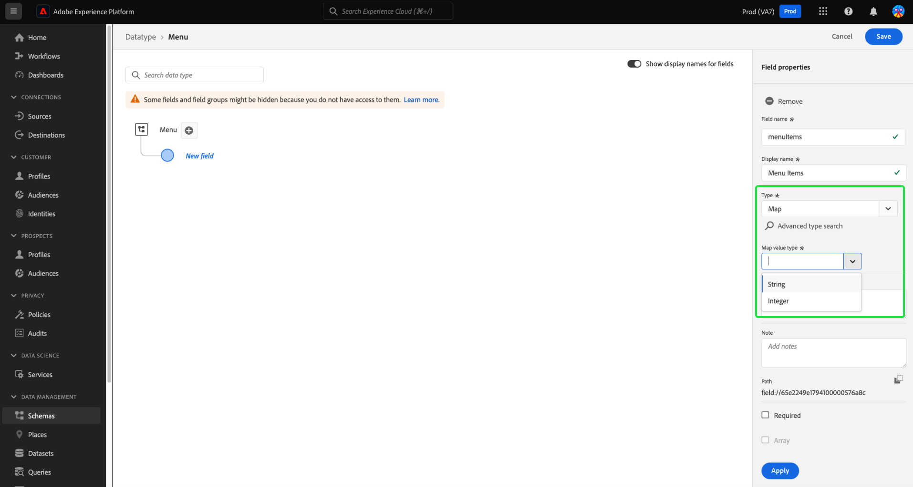

# Adobe Experience Platform 發行說明

**發行日期： 2024年3月19日**

>[!TIP]
>
>使用 [Adobe Experience Platform字彙表](/help/landing/glossary.md) 以熟悉Real-time Customer Data Platform和Adobe Experience Platform中使用的術語。 如果您找不到想要的特定辭彙，請使用頁面上的意見回饋選項，請求將新辭彙加入辭彙中。

Experience Platform現有功能的更新：

- [目錄服務](#catalog-service)
- [資料準備](#data-prep)
- [目的地](#destinations)
- [體驗資料模式 (XDM)](#xdm)
- [Segmentation Service](#segmentation)
- [來源](#sources)

## 目錄服務 {#catalog-service}

目錄服務是在 Adobe Experience Platform 內針對資料位置和連結的記錄系統。雖然所有內嵌至Experience Platform的資料都會以檔案和目錄的形式儲存在Data Lake中，但Catalog仍保有這些檔案和目錄的中繼資料和說明，以供查閱和監控之用。

| 功能 | 說明 |
| --- | --- |
| 更多動作 | 若要讓作業更靈活，並協助您管理資料，您現在可以使用詳細資料檢視中的「更多動作」功能，對資料集執行其他工作。 您可以從所選資料集的詳細資訊頁面中刪除資料集或啟用該資料集，以與即時客戶個人檔案搭配使用。 **注意：** 如果您啟用資料集以進行設定檔擷取，資料集的結構描述必須與即時客戶設定檔相容。 ![具有的資料集工作區 [!UICONTROL ...更多] 下拉式功能表強調顯示。](../2024/assets/march/more-actions.png "「資料集」工作區中反白顯示「更多」下拉式功能表。"){width="100" zoomable="yes"}。 閱讀 [資料集使用手冊](../../catalog/datasets/user-guide.md) 檔案以取得額外資訊。 |

{style="table-layout:auto"}

如需有關目錄服務的詳細資訊，請參考[目錄服務概觀](../../catalog/home.md)。

## 資料準備 {#data-prep}

「資料準備」讓資料工程師可在體驗資料模式 (XDM) 之間對應、轉換和驗證資料。

**新功能或更新功能**

| 功能 | 說明 |
| --- | --- |
| Adobe Analytics的新對應工具函式 | 您現在可以使用以下函式從Adobe Analytics擷取事件資料： <ul><li>`aa_get_event_id`</li><li>`aa_get_event_value`</li><li>`aa_get_product_categories`</li><li>`aa_get_product_names`</li><li>`aa_get_product_quantities`</li><li>`aa_get_product_prices`</li><li>`aa_get_product_event_values`</li><li>`aa_get_product_evars`</li></ul> 如需這些函式的詳細資訊，請閱讀 [資料準備函式指南](../../data-prep/functions.md#analytics-functions) |

{style="table-layout:auto"}

如需「資料準備」的詳細資訊，請閱讀 [資料準備總覽](../../data-prep/home.md).

## 目的地 {#destinations}

[!DNL Destinations] 是預先建立的和目標平台的整合，可讓來自 Adobe Experience Platform 的資料順暢啟動。您可使用目的地啟用已知和未知的資料，以進行跨通路行銷活動、電子郵件行銷活動、設定目標的廣告活動和其他諸多使用案例。

**新的和更新的目的地** {#new-updated-destinations}

| 目的地 | 類型 | 說明 |
| ----------- | --------- | ----------- |
| [(Beta) Acxiom資料增強功能連線](../../destinations/catalog/data-partner/acxiom-data-enhancement.md) | 新增 | 使用此聯結器可啟用從Real-Time CDP到Acxiom的第一方設定檔，以擴充資料並跨行銷管道使用。 然後，您可以使用Acxiom來源匯入具有增強型資料的設定檔，並在Real-Time CDP中處理這些設定檔。 |
| [(Beta) Acxiom潛在客戶抑制連線](../../destinations/catalog/data-partner/acxiom-prospect-suppression.md) | 新增 | 將您的第一方對象匯出至Acxiom目的地，以允許Acxiom抑制已知或轉換的客戶。 然後，使用 [Acxiom潛在客戶資料匯入](../../sources/connectors/data-partners/acxiom-prospecting-data-import.md) 來源聯結器可從Acxiom擷取及啟用潛在客戶清單，並移除您已知或轉換的客戶。 |
| [Amazon Ads連線](../../destinations/catalog/advertising/amazon-ads.md) | 更新 | 將資料匯出至Amazon Ads目的地時，您現在可以將資料路由至Amazon DSP或AmazonMarketing Cloud（新增）。 |

{style="table-layout:auto"}

<!--

**New or updated functionality** {#destinations-new-updated-functionality}

-->

如需有關目的地的詳細一般資訊，請參閱[目的地概觀](../../destinations/home.md)。

## 體驗資料模式 (XDM) {#xdm}

XDM 是一種開放原始碼的規格，可為帶到 Adobe Experience Platform 中的資料提供通用結構和定義 (結構描述)。若遵守 XDM 標準，即可將所有客戶體驗資料合併到一個常用表述中，以更快速、更整合的方式傳遞分析。您可以從客戶行為中獲得有價值的分析，透過區段定義客戶對象，並使用客戶屬性實現個人化的目的。

**新功能**

| 功能 | 說明 |
| --- | --- |
| Experience PlatformUI對應資料型別支援 | 在Platform UI中定義對應欄位，進一步自訂Experience Data Model (XDM)資料結構。 您現在可以在結構描述編輯器中建立對應欄位，以模型化彈性資料結構或有效儲存索引鍵/值組。 定義新欄位時，從「型別」下拉式清單中選取「對應」，以設定子欄位並將其指派給欄位群組。 支援的對應值型別為字串和整數。 {width="100" zoomable="yes"}  若要瞭解如何 [在使用者介面中定義對應欄位](../../xdm/ui/fields/map.md)，請參閱UI指南。 |

{style="table-layout:auto"}

如需有關 Platform 中 XDM 的詳細資訊，請參閱 [XDM 系統概觀](../../xdm/home.md)。

## Segmentation Service {#segmentation}

[!DNL Segmentation Service] 可讓您將儲存在和個人 (例如客戶、潛在客戶、使用者或組織) 相關的 [!DNL Experience Platform] 中的資料分段為不同的對象。您可以透過區段定義或來自 [!DNL Real-Time Customer Profile] 資料的其他來源建立對象。這些對象會在 [!DNL Platform] 上集中設定及維護，並可透過任何 Adobe 解決方案輕鬆存取。

**新功能**

| 功能 | 說明 |
| ------- | ----------- |
| 大量動作 | 對象詳細目錄現在支援大量動作。 使用大量動作，您可以快速選取多個對象以將其移至資料夾、套用標籤、套用存取權標籤或刪除。   {width="100" zoomable="yes"}  如需有關此功能的詳細資訊，請參閱 [Segmentation Service UI指南](../../segmentation/ui/overview.md#bulk-actions). |

{style="table-layout:auto"}

若要深入瞭解分段服務，請閱讀 [Segmentation Service概述](../../segmentation/home.md).

## 來源 {#sources}

Experience Platform 可提供 RESTful API 和互動式 UI，可讓您輕鬆為各種資料提供者設定來源連線。這些來源連線可讓您進行驗證並連線到外部儲存系統和 CRM 服務、設定擷取執行的時間並管理資料擷取輸送量。

**新的和更新的來源**

| 功能 | 類型 | 說明 |
| --- | --- | --- |
| [!BADGE 測試版]{type=Informative} [!DNL Acxiom Data Ingestion] | 新增 | 使用 [[!DNL Acxiom Data Ingestion] 來源](../../sources/tutorials/ui/create/data-partners/acxiom-data-ingestion.md) 擷取 [!DNL Acxiom] 將資料匯入Real-time Customer Data Platform並豐富第一方設定檔。 然後，您可以使用您的 [!DNL Acxiom] — 擴充第一方設定檔，以改善對象並跨行銷管道啟用。   {width="100" zoomable="yes"}   閱讀 [[!DNL Acxiom Data Ingestion] 概述](../../sources/connectors/data-partners/acxiom-data-ingestion.md) 以取得如何開始使用的資訊。 |
| [!BADGE 測試版]{type=Informative} [!DNL Stripe] | 新增 | 使用 [[!DNL Stripe] 來源](../../sources/connectors/payments/stripe.md) 將客戶在購買流程中擷取的資料擷取到Experience Platform。 內嵌後，您就可以使用此資料建立個人化優惠，並解鎖更豐富的商業深入分析。   {width="100" zoomable="yes"}   閱讀 [[!DNL Stripe] 概述](../../sources/connectors/payments/stripe.md) 以取得如何開始使用的資訊。 |
| UI支援 [!DNL Snowflake Streaming] | 新增 | 您現在可以使用 [[!DNL Snowflake Streaming] 來源](../../sources/tutorials/ui/create/databases/snowflake-streaming.md) 在Experience Platform UI中，將資料從您的 [!DNL Snowflake] 資料庫。   {width="100" zoomable="yes"}   閱讀 [[!DNL Snowflake Streaming] 概述](../../sources/connectors/databases/snowflake-streaming.md) 以取得如何開始使用的資訊。 |

{style="table-layout:auto"}

如需有關來源的詳細資訊，請閱讀 [來源概觀](../../sources/home.md).

