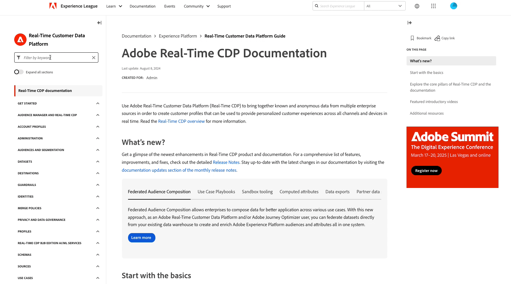

# Adobe Experience Platform 發行說明

>[!TIP]
>
>新的[AI助理產品檔案登陸頁面](../../ai-assistant/landing.md)現已可用。 使用此頁面作為所有AI助理相關資源的中心。

**發行日期： 2024年11月26日**

Adobe Experience Platform 現有功能及文件的更新：

- [AI 助理](#ai-assistant)
- [目標](#destinations)
- [查詢服務](#query-service)
- [沙箱](#sandboxes)
- [文件更新](#documentation-updates)
   - [互動式 Experience Platform API 文件](#interactive-experience-platform-api-documentation)
   - [Experience League上的新目錄](#new-table-of-contents-on-experience-league)
   - [全新AI助理登陸頁面](#new-ai-assistant-landing-page)

## AI 助理 {#ai-assistant}

Adobe Experience Platform 的 AI 助理是一種對話式體驗，可用來加速 Adobe 應用程式中的工作流程。您可以使用 AI 助理增進產品知識、疑難排解問題，或搜尋資訊和尋找營運深入解析。AI 助理支援 Experience Platform、Real-Time Customer Data Platform、Adobe Journey Optimizer 和 Customer Journey Analytics。

**新功能**

| 功能 | 說明 |
| --- | --- |
| [!BADGE Alpha]{type=Informative}監視重大變更和預測對象成長 | 使用AI Assistant來監控重大變更，並為您的對象和資料集大小提供成長預測。 然後，您可以使用此資訊來確保受眾資料的完整性，並提供前瞻性預測以支援以資料為主的決策。 如需詳細資訊，請閱讀[監控重大變更和預測對象成長](../../ai-assistant/new-features/audience-forecasting.md)的指南。 |
| [!BADGE Alpha]{type=Informative}自然語言估計 | 使用AI Assistant的自然語言估計功能，根據簡單的對話問題來估計受眾人數和預測受眾傾向。 如需詳細資訊，請閱讀[搭配AI助理使用自然語言估計](../../ai-assistant/new-features/natural-language.md)的指南。 |

{style="table-layout:auto"}

## 目標 {#destinations}

[!DNL Destinations] 是預先建立的和目標平台的整合，可讓來自 Adobe Experience Platform 的資料順暢啟動。您可使用目標啟用已知和未知的資料，以進行跨通路行銷活動、電子郵件行銷活動、設定目標的廣告活動和其他諸多使用案例。

**新目標或更新的目標** {#new-updated-destinations}

| 目標 | 說明 |
| --- | --- |
| [Magnite串流即時](/help/destinations/catalog/advertising/magnite-streaming.md) | 匯出對象，以在Magnite串流平台中啟動、鎖定目標或隱藏。 請注意，為了讓對象正確匯出至Magnite，您必須同時使用即時和批次目的地。 |
| [菱形資料流批次](/help/destinations/catalog/advertising/magnite-batch.md) | 匯出對象，以在Magnite串流平台中啟動、鎖定目標或隱藏。 請注意，為了讓對象正確匯出至Magnite，您必須同時使用即時和批次目的地。 |

{style="table-layout:auto"}

**新功能或更新的功能** {#destinations-new-updated-functionality}

| 功能 | 說明 |
| --- | --- |
| [在邊緣即時查詢設定檔屬性](/help/destinations/ui/activate-edge-profile-lookup.md) | 瞭解如何使用自訂Personalization目的地和Edge NetworkAPI，即時查詢邊緣設定檔屬性以傳遞個人化體驗，或透過下游應用程式通知決策規則。 |

{style="table-layout:auto"}

如需詳細資訊，請閱讀[目標概觀](../../destinations/home.md)。

## 查詢服務 {#query-service}

使用標準SQL搭配查詢服務在Adobe Experience Platform Data Lake中查詢資料。 緊密結合資料集並從查詢結果產生新資料集，以支援報告、啟用資料科學工作流程，或促進將資料擷取到即時客戶個人檔案中。 例如，您可以將客戶交易資料與行為資料合併，以找出目標行銷活動的高值對象。

**更新的功能**

| 功能 | 說明 |
| --- | --- |
| Dater Distiller Authorization API | 管理並強制執行Query Service沙箱的IP型存取限制，以增強資料安全性並確保遵循組織原則。 請參閱[Data Distiller Authorization API指南](../../query-service/auth-api/overview.md)，以取得其主要功能的詳細資訊，或參閱[OpenAPI檔案](https://developer.adobe.com/experience-platform-apis/references/data-distiller-auth/)，以取得包括端點詳細資料、引數清單、要求/回應範例和測試功能的完整資訊。 |

如需[!DNL Query Service]的詳細資訊，請參閱[[!DNL Query Service] 總覽](../../query-service/home.md)。

## 沙箱 {#sandboxes}

Adobe Experience Platform 是為了在全球規模上使數位體驗應用程式更加豐富而打造。公司經常要並行執行多個數位體驗應用程式，且在顧及這些應用程式的開發、測試和部署等需求的同時，也必須確保營運合規性。為了滿足這種需求，Experience Platform 提供的沙箱可將單一 Platform 執行個體分割成個別的虛擬環境，以協助開發並改進數位體驗應用程式。

**新功能或更新功能**

| 功能 | 說明 |
| --- | --- |
| 使用沙箱工具API共用套件 | 使用兩個新API端點[`/handshake`](../../sandboxes/sandbox-tooling-api/packages.md#org-linking)和[`/transfers`](../../sandboxes/sandbox-tooling-api/packages.md#transfer-packages)，以使用沙箱工具API處理組織間的套件共用，例如要求核准、套件可見度以及匯入套件。 |

如需有關沙箱的詳細資訊，請閱讀[沙箱概觀](../../sandboxes/home.md)。

## 文件更新 {#documentation-updates}

### 互動式 Experience Platform API 文件 {#interactive-api-documentation}

[Experience Platform API檔案](https://developer.adobe.com/experience-platform-apis/)現在完全互動式，可讓您直接在API參考檔案頁面上驗證及探索API。 您現在可以前往想要的API參考檔案頁面，建立或取得API驗證認證，將它們貼到&#x200B;**[!UICONTROL 嘗試]**&#x200B;區塊，然後執行呼叫。 全部在一個頁面上。 [深入瞭解](/help/landing/api-authentication.md#get-credentials-functionality)功能。

### Experience League上的新目錄 {#new-table-of-contents-on-experience-league}

Experience League檔案頁面上的目錄已經過改良，為讀者提供更好的體驗，包括關鍵字篩選以探索您需要的確切頁面、展開所有頁面的能力等。  {width="250" align="center" zoomable="yes"}

### 全新AI助理登陸頁面 {#new-ai-assistant-landing-page}

使用新的[AI助理產品檔案](../../ai-assistant/landing.md)頁面做為AI助理所有專案的中樞。 請參閱產品檔案，以取得有關AI助理的影片教學課程、技術檔案、使用案例和部落格連結。