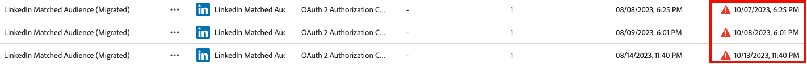

# Adobe Experience Platform 發行說明

>[!TIP]
>
>如需其他 Adobe Experience Platform 應用程式的發行說明，請參閱以下文件：
>
>- [Adobe Journey Optimizer](https://experienceleague.adobe.com/zh-hant/docs/journey-optimizer/using/whats-new/release-notes)
>- [Adobe Journey Optimizer B2B](https://experienceleague.adobe.com/zh-hant/docs/journey-optimizer-b2b/user/release-notes)
>- [Customer Journey Analytics](https://experienceleague.adobe.com/zh-hant/docs/analytics-platform/using/releases/pre-release-notes)
>- [聯合客群構成](https://experienceleague.adobe.com/zh-hant/docs/federated-audience-composition/using/e-release-notes)
>- [Real-Time CDP Collaboration](https://experienceleague.adobe.com/zh-hant/docs/real-time-cdp-collaboration/using/latest)

**發行日期：2025 年 9 月 23 日**

Adobe Experience Platform 的新功能及現有功能更新：

- [Agent Orchestrator](#agent-orchestrator)
- [警報](#alerts)
- [目標](#destinations)
- [體驗資料模式 (XDM)](#xdm)
- [即時客戶設定檔](#profile)
- [Segmentation Service](#segmentation-service)
- [來源](#sources)

## Agent Orchestrator {#agent-orchestrator}

Adobe Experience Platform Agent Orchestrator 是 Adobe Experience Platform 全新的代理層。

**新功能**

| 功能 | 說明 |
| --- | --- |
| Agent Orchestrator | Adobe Experience Platform Agent Orchestrator 是 Adobe Experience Platform 全新的代理層。Experience Platform Agent Orchestrator 是為了善用平台豐富的資料和客戶知識而設計，其支援專門打造的專家 Adobe Experience Platform Agents 背後運作的智慧和推理能力，使其能夠快速且大規模地執行複雜的決策和解決問題的任務，且全程皆有人工監督。當您透過像 AI 助理這樣的對話式介面，用自然語言提出問題或要求協助時，Agent Orchestrator 會自動調用專門的代理，為您取得正確的答案。Agent Orchestrator 會記住您的對話記錄，讓您可以不必複述相關背景資訊，即可自然地在先前問題的基礎上繼續提問，並且結合來自多個代理的洞察，為您提供清楚且統一的回答。如需詳細資訊，請參閱 [Agent Orchestrator 文件](https://experienceleague.adobe.com/zh-hant/docs/experience-cloud-ai/experience-cloud-ai/agents/agent-orchestrator)。 |
| Audience 代理 | 透過 Audience 代理，您可以檢視關於客群的洞察，包括偵測客群人數的重大變更、偵測重複的客群、探索您的客群清單，以及取得客群人數。如需詳細資訊，請參閱 [Audience 代理文件](https://experienceleague.adobe.com/zh-hant/docs/experience-cloud-ai/experience-cloud-ai/agents/audience)。 |

如需詳細資訊，請參閱 [Agent Orchestrator 文件](https://experienceleague.adobe.com/zh-hant/docs/experience-cloud-ai/experience-cloud-ai/home)。

## 警報 {#alerts}

Experience Platform 可讓您訂閱各種 Experience Platform 活動的事件型警報。您可以透過Experience Platform使用者介面中的[!UICONTROL Alerts]標籤訂閱不同的警示規則，也可以選擇在UI本身或透過電子郵件通知接收警示訊息。

**新功能**

| 功能 | 說明 |
| --- | --- |
| 串流輪廓攝取警報 | 您現在可以針對在資料流層級的串流攝取，訂閱兩種新警報： <ul><li>超出串流攝取失敗率</li><li>超出串流攝取略過率</li></ul> 在臨界值超過預設臨界值或您定義的自訂臨界值時，會發出平台內或電子郵件警報通知您。如需詳細資訊，請閱讀[輪廓警報](../../observability/alerts/rules.md#profile)指南。 |

{style="table-layout:auto"}

如需有關警報的詳細資訊，請閱讀[[!DNL Observability Insights] 概觀](../../observability/home.md)。

## 目標 {#destinations}

[!DNL Destinations] 是預先建立的目標平台整合功能，能夠順暢啟用來自 Experience Platform 的資料。您可以使用目標來啟用已知和未知的資料，以供跨通道行銷活動、電子郵件行銷活動、定向廣告及其他許多使用案例使用。

**全新或已更新的目標**

| 目標 | 說明 |
| --- | --- |
| [!BADGE Beta]{type=Informative} [[!DNL Snowflake Batch]](../../destinations/catalog/warehouses/snowflake-batch.md)連接器 | 新的 [!DNL Snowflake Batch] 連接器現已可用，在特定使用案例中可用作串流連接器的替代選擇。 |
| [[!DNL Data Landing Zone]](../../destinations/catalog/cloud-storage/data-landing-zone.md) 加密支援 | 您現在可以附加 RSA 格式的公開金鑰，將所匯出的檔案加密，讓您的敏感資訊獲得與其他雲端儲存目標相同等級的安全性。 |
| [[!DNL Pinterest]](../../destinations/catalog/advertising/pinterest.md) 目標的驗證過期詳細資料 | [!DNL Pinterest] 目標的驗證過期資訊現在可直接在 Experience Platform 介面中查看，因此您可以查看驗證的過期時間，並在其對資料流造成任何中斷之前進行續訂。您可以從&#x200B;**[!UICONTROL Account expiration date]**&#x200B;或&#x200B;**[[!UICONTROL Accounts]](../../destinations/ui/destinations-workspace.md#accounts)**&#x200B;索引標籤中的&#x200B;**[[!UICONTROL Browse]](../../destinations/ui/destinations-workspace.md#browse)**&#x200B;欄監視權杖到期日。 |

**全新或更新版功能**

| 功能 | 說明 |
| --- | --- |
| 增強 Experience Platform UI 中的目標管理功能 | 透過[[!UICONTROL Browse]](../../destinations/ui/destinations-workspace.md#browse)和[[!UICONTROL Accounts]](../../destinations/ui/destinations-workspace.md#accounts)標籤的新排序功能改善您的目的地管理工作流程。 現在，當帳戶驗證即將到期時，您也會看到視覺指示器。  {width="100" zoomable="yes"} |
| 永久性欄寬設定 | 現在，當您導覽離開某個頁面然後再返回時，欄寬設定維持不變。例如，如果您調整[[!UICONTROL Browse]](../../destinations/ui/destinations-workspace.md#browse)索引標籤中的欄寬，當您導覽離開並返回該索引標籤時，自訂欄寬將保持不變。 |

如需詳細資訊，請閱讀[目標概觀](../../destinations/home.md)。

## 體驗資料模型 (XDM) {#xdm}

XDM 是一種開放原始碼的規格，可為帶入 Experience Platform 的資料提供通用結構和定義 (結構描述)。若遵守 XDM 標準，即可將所有客戶體驗資料合併為單一常用表述，以更快速、更整合的方式提供分析洞察。您可以從客戶行為中獲得有價值的分析洞察、透過區段定義客戶客群，並基於個人化目的使用客戶屬性。

**新功能**

| 功能 | 說明 |
| ------- | ----------- |
| 關聯式結構描述 | 使用關聯式結構描述（先前稱為模型型結構描述）簡化資料模型。 您現在可以利用全方位的操作範例和指南，更輕鬆地建立結構描述。目前，行銷活動協調的授權持有者可以使用這項功能，且將在正式發佈時擴大開放予資料蒸餾器客戶使用，降低使用資料建模功能的門檻並提高效率。此功能也支援時間序列資料以及變更資料擷取功能。 |

如需詳細資訊，請詳讀 [XDM 概觀](../../xdm/home.md)。

<!--

| Data Mirror | Ingest row-level changes from cloud data warehouses (e.g., Snowflake, Databricks, BigQuery) into Adobe Experience Platform using relational schemas. Data Mirror eliminates upstream ETL and preserves relationships, versioning, and deletions by mirroring existing database structures directly into the data lake. Time-series and record event schema behavior with change data capture capabilities are all supported. This feature is currently available for Campaign Orchestration license holders and will expand through this limited release, also including Customer Journey Analytics customers. See the [Data Mirror documentation](../../xdm/data-mirror/overview.md) for more details. Contact your Adobe representative for access. |
-->

## 即時客戶輪廓 {#profile}

Adobe Experience Platform 可讓您為客戶提供協調一致且相關的體驗，無論他們何時何地與您的品牌互動。即時客戶輪廓會合併來自多個管道的資料 (包括線上、離線、CRM 和協力廠商資料)，讓您可以掌握每位個別客戶的全貌。設定檔可讓您將客戶資料合併成統一的檢視畫面，針對每個客戶互動提供可採取行動且附有時間戳記的說明。

**更新的功能**

| 功能 | 說明 |
| ------- | ----------- |
| [!BADGE Alpha]{type=Informative}此功能目前在Alpha中。 輪廓檢視器增強功能 | 2025 年 9 月版本包含以下輪廓檢視器增強功能。 <ul><li>**合併檢視**：屬性、事件和洞察已經合併至單一視圖。</li><li>**AI 生成的洞察**：現在，輪廓詳細資訊頁面會顯示 AI 生成的洞察，讓您了解利用輪廓產生的詳細資料。這些洞察可能包括傾向分數和趨勢分析等資訊。</li><li>**樣式更新**：輪廓詳細資料頁面已經更新其視覺外觀。</li><li>**瀏覽**：您現在可以利用互動式卡片輪播，透過搜尋和自訂功能來探索各個輪廓。</li></ul> |

**重要更新**

| 更新 | 說明 |
| ------ | ----------- |
| 設定檔刪除API淘汰 | [設定檔刪除API](/help/profile/api/entities.md#delete-entity)將於2025年10月底前被取代。 若要執行記錄刪除作業，您可以改用[資料生命週期記錄刪除API工作流程](/help/hygiene/api/workorder.md)或[資料生命週期記錄刪除UI工作流程](/help/hygiene/ui/record-delete.md)。 資料生命週期工作流程提供端對端生命週期追蹤，以及您可檢視及管理的每月配額。   在端點被取代之後，目前使用此端點的任何使用者都可以繼續存取此端點。 我們將另行宣佈終止服務。 如有任何問題，請聯絡Adobe客戶服務。 |

如需詳細資訊，請閱讀[即時客戶輪廓概觀](../../profile/home.md)。

## 細分服務 {#segmentation-service}

[!DNL Segmentation Service] 會說明區分客戶群中可行銷人員群組的標準，進而定義設定檔的特定子集。客群的根據可以是記錄資料 (例如人口統計資訊) 或是代表客戶與您的品牌互動情形的時間序列事件。

**新功能或更新功能**

| 功能 | 說明 |
| ------- | ----------- |
| 棄用具有體驗事件的帳戶客群 | 在 B2B 架構升級後，不再支援具有體驗事件的帳戶客群。相反的，要採用新方法「區段中的區段」：建立具有體驗事件的人員客群，然後在建立帳戶客群時參照該人員客群。這個建立 B2B 客群的方法更有彈性而且更容易維護。 |

**重要更新**

| 更新 | 說明 |
| ------- | ----------- |
| 取消自動重新整理客群預估的功能 | 客群預估的自動重新整理增強功能已取消。將繼續在「客戶細分工具」中產生客群預估，但已移除自動重新整理的功能。 |
| 外部客群 | 自 9 月 30 日起，將透過「客戶細分工具」的「整合式搜尋」擷取外部客群。如果您使用「區段比對」，則可以在「客戶細分工具」中啟用舊版體驗。 |

如需詳細資訊，請閱讀[[!DNL Segmentation Service] 概觀](../../segmentation/home.md)。

## 來源 {#sources}

Experience Platform 提供 RESTful API 和互動式 UI，可讓您輕鬆為各種資料提供者設定來源連線。這些來源連線可讓您進行驗證並連線到外部儲存系統和 CRM 服務、設定攝取執行的時間並管理資料攝取輸送量。

**新功能或更新功能**

| 功能 | 說明 |
| --- | --- |
| 正式發行的新來源 | 以下來源現已正式發行：有數個來源連接器已從 Beta 更新為正式發行： <ul><li>[Acxiom Data Ingestion](../../sources/connectors/data-partners/acxiom-data-ingestion.md)</li><li>[Acxiom Prospect Data Ingestion](../../sources/connectors/data-partners/acxiom-prospecting-data-import.md)</li><li>[Merkury Enterprise](../../sources/connectors/data-partners/merkury.md)</li><li>[SAP Commerce](../../sources/connectors/ecommerce/sap-commerce.md)</li></ul>. 現在已全面支援這些來源而且隨時可供生產使用。 |
| [!DNL Snowflake]金鑰對驗證支援 | 支援金鑰對驗證，增強 Snowflake 連線的安全性。基本驗證 (使用者名稱/密碼) 將於 2025 年 11 月前棄用，因此建議客戶改為使用金鑰對驗證以提高安全性。如需詳細資訊，請閱讀 [[!DNL Snowflake]  文件](../../sources/connectors/databases/snowflake.md)。 |
| [!BADGE Beta]{type=Informative} [!DNL Capillary Streaming Events] | 使用 [[!DNL Capillary Streaming Events]  來源](../../sources/connectors/loyalty/capillary.md)將忠誠度資料從您的 [!DNL Capillary] 帳戶串流至 Experience Platform。 |
| [!BADGE Beta]{type=Informative} [!DNL Relay Connector] | 使用[[!DNL Relay Connector]](../../sources/tutorials/ui/create/marketing-automation/relay-connector.md)將[!DNL Relay Network]整合中的事件資料串流至Experience Platform。 |
| 正式發行在來源中支援私人連結的功能 | 您現在可以針對特定一組來源使用&#x200B;**私人連結**。使用此功能來建立您的來源可以連接的私人端點。您可以利用私人端點來設定繞過公共網際網路的連線和資料流，為敏感資料提供強化的安全性和網路隔離。對於以下來源均支援使用私人連結： <ul><li>[[!DNL Azure Blob Storage]](../../sources/connectors/cloud-storage/blob.md)</li><li>[[!DNL ADLS Gen2]](../../sources/connectors/cloud-storage/adls-gen2.md)</li><li>[[!DNL Azure File Storage]](../../sources/connectors/cloud-storage/azure-file-storage.md)</li></ul>. 如需詳細資訊，請參閱在 [API](../../sources/tutorials/api/private-link.md) 和 [&#x200B; UI](../../sources/tutorials/ui/private-link.md) 中建立私人連結的指南。 |

如需詳細資訊，請閱讀[來源概觀](../../sources/home.md)。