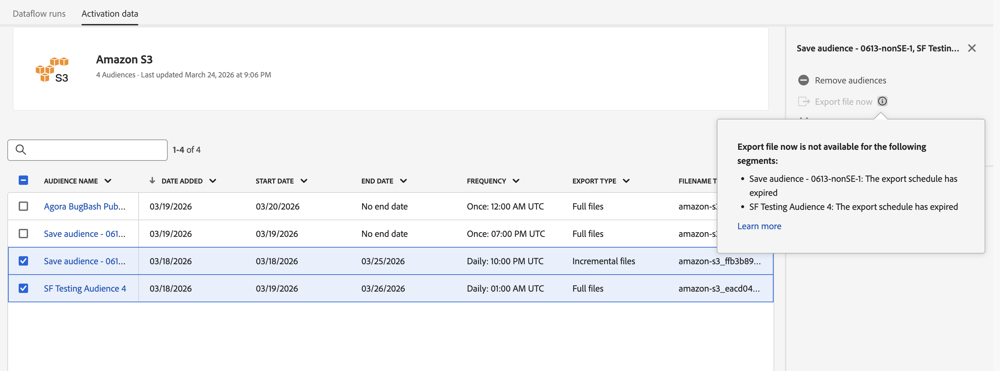

# Adobe Experience Platform 發行說明

>[!TIP]
>
>如需其他 Adobe Experience Platform 應用程式的發行說明，請參閱以下文件：
>
>- [Adobe Journey Optimizer](https://experienceleague.adobe.com/zh-hant/docs/journey-optimizer/using/whats-new/release-notes)
>- [Adobe Journey Optimizer B2B](https://experienceleague.adobe.com/zh-hant/docs/journey-optimizer-b2b/user/release-notes)
>- [Customer Journey Analytics](https://experienceleague.adobe.com/zh-hant/docs/analytics-platform/using/releases/latest)
>- [聯合客群構成](https://experienceleague.adobe.com/zh-hant/docs/federated-audience-composition/using/release-notes)
>- [Real-Time CDP Collaboration](https://experienceleague.adobe.com/zh-hant/docs/real-time-cdp-collaboration/using/latest)

**發行日期： 2026年4月28日**

Adobe Experience Platform 的新功能及現有功能更新：

- [資料彙集](#data-collection)
- [目的地](#destinations)
- [體驗資料模式 (XDM)](#xdm)
- [查詢服務](#query-service)
- [Real-Time CDP](#rtcdp)
- [沙箱](#sandboxes)
- [來源](#sources)

## 資料彙集 {#data-collection}

Adobe Experience Platform 提供了一套技術，可讓您收集用戶端的客戶體驗資料，並將其傳送到 Adobe Experience Platform Edge Network，然後在其中擴充及轉換資料，再分送至 Adobe 或非 Adobe 目標。

**新功能或更新功能**

| 功能 | 說明 |
| --- | --- |
| 檢視建置詳細資料 | 您現在可以從程式庫或環境存取組建和組建詳細資訊，以檢視目前即時組建並檢查內容（擴充功能、資料元素和規則）。 如需詳細資訊，請參閱[組建總覽](../../tags/ui/publishing/builds.md#build-details)。 |

{style="table-layout:auto"}

如需詳細資訊，請閱讀[資料彙集概觀](../../tags/home.md)。

## 目的地 {#destinations}

[!DNL Destinations]是預先建立的與目的地平台的整合。 使用目的地可針對跨管道行銷活動、電子郵件行銷活動、目標定位廣告和許多其他使用案例啟用已知和未知的資料。

**全新或已更新的目標**

| 目標 | 說明 |
| --- | --- |
| [!BADGE Beta]{type=Informative} [Microsoft Ads客戶符合](../../destinations/catalog/advertising/microsoft-ads-customer-match.md) | 依電子郵件地址比對客戶，並在[!DNL Microsoft Advertising Network]中與客戶重新互動，包括搜尋和對象廣告。 將您的[!DNL Microsoft Advertising]帳戶連結至Real-Time CDP，以直接從Experience Platform自動建立和管理客戶比對清單。 若要取得存取權，請聯絡您的Adobe客戶經理。 |
| [!BADGE Beta]{type=Informative} [Reddit自訂對象](../../destinations/catalog/advertising/reddit-custom-audience.md) | 將對象從Experience Platform傳送至[!DNL Reddit Ads]。 連線您的[!DNL Reddit]帳戶、對應身分並啟用對象，以聯絡在[!DNL Reddit]上積極探索其興趣的人。 |
| [Amazon Ads v2](../../destinations/catalog/advertising/amazon-ads-v2.md) | 對所有新[!DNL Amazon Ads]連線使用[!DNL Amazon Ads v2]卡。 [!DNL Amazon Ads v2]會連線至[!DNL Ads Data Manager]，以支援[!DNL Amazon Ads]產品的擴充身分型別、位址相關欄位和資料共用，進而改善鎖定目標和對象符合率。 目錄中的現有[!DNL Amazon Ads]聯結器已重新命名為[（舊版） [!DNL Amazon Ads]](../../destinations/catalog/advertising/amazon-ads.md)。 如果您有現有的舊式連線，則它將繼續運作，而不會進行任何必要的變更。 |
| [[!DNL Rokt]](../../destinations/catalog/advertising/rokt.md) | 使用[!DNL Rokt]將Experience Platform對象連結到AI驅動的即時決策，透過更精確的目標定位、隱藏和個人化來改善行銷活動績效。 |
| [Acxiom對象連線](../../destinations/catalog/advertising/acxiom-audience-connection.md) | [!DNL Acxiom Audience Connection]目的地現在已可供一般使用。 使用它來增強具有[!DNL Acxiom's Real ID]技術的對象，並將它們啟用至[!DNL Altice]、[!DNL Ampersand]、[!DNL Comcast]、[!DNL Cox]、[!DNL Facebook]、[!DNL Amazon]、[!DNL Pinterest]、[!DNL Vizio]、[!DNL LG Ads]、[!DNL Spectrum]和[!DNL Viant]。 |
| [Acxiom真實ID對象連線](../../destinations/catalog/advertising/acxiom-real-id-audience-connection.md) | [!DNL Acxiom Real ID Audience Connection]目的地現在已可供一般使用。 使用它來啟用對象，將[!DNL Acxiom's Real ID]當作[!DNL Altice]、[!DNL Ampersand]、[!DNL Comcast]、[!DNL Cox]、[!DNL Facebook]、[!DNL Amazon]、[!DNL Pinterest]、[!DNL Vizio]、[!DNL LG Ads]、[!DNL Spectrum]和[!DNL Viant]的相符索引鍵。 |

{style="table-layout:auto"}

**修正和改良**

| 修正 | 說明 |
| --- | --- |
| [Snowflake串流](../../destinations/catalog/warehouses/snowflake.md)目的地的新`TS`欄 | [Snowflake串流](../../destinations/catalog/warehouses/snowflake.md)目的地現在包含共用表格中的`TS`時間戳記欄，顯示每個資料列的上次更新時間。 此更新將於4月底推出。 |
| [自訂Personalization](../../destinations/catalog/personalization/custom-personalization.md)目的地的監視支援 | [資料流執行頁面](../../dataflows/ui/monitor-destinations.md#dataflow-runs-for-streaming-destinations)現在會顯示[自訂Personalization](../../destinations/catalog/personalization/custom-personalization.md)目的地的量度。 以前，這些量度不適用於此目的地型別。 使用它們來驗證對象是否如預期般啟用並診斷問題。  {zoomable="yes"} |
| 啟動工作流程稽核步驟中的設定檔計數 | 啟動工作流程的稽核步驟現在會顯示已啟動對象的設定檔計數。 也會顯示[串流目的地](../../destinations/ui/activate-segment-streaming-destinations.md)的設定檔計數，而不只是[批次目的地](../../destinations/ui/activate-batch-profile-destinations.md)。  {zoomable="yes"} |
| [!DNL Pinterest]權杖到期可見性 | [[!DNL Pinterest]](../../destinations/catalog/advertising/pinterest.md)目的地現在會顯示權杖到期日，以便您檢視何時需要重新驗證。 [!DNL Pinterest]個Token每30天過期一次。 代號過期時，資料匯出功能會停止運作。 為避免中斷，請在Token過期之前[重新整理您的驗證認證](../../destinations/catalog/advertising/pinterest.md#refresh-authentication-credentials)。 |
| 匯出檔案現在已針對過期的排程停用 | 當您的對象排程過期時，**[!UICONTROL Export file now]**&#x200B;現在會在您嘗試使用之前停用，工具提示會說明原因。 以前，選取動作會導致錯誤。  {zoomable="yes"} |
| 啟動工作流程中的欄可見性修正 | 修正變更一個表格中的可見欄位，錯誤地影響啟動工作流程中其他表格的問題。 |

{style="table-layout:auto"}

如需詳細資訊，請閱讀[目標概觀](../../destinations/home.md)。

## 體驗資料模型 (XDM) {#xdm}

XDM 是一種開放原始碼的規格，可為帶入 Experience Platform 的資料提供通用結構和定義 (結構描述)。 若遵守 XDM 標準，即可將所有客戶體驗資料合併到一個常用表述中，以更快速、更整合的方式傳遞洞察。 您可以從客戶行為中獲得有價值的洞察，透過區段定義客戶客群，並使用客戶屬性實現個人化的目的。

| 功能 | 說明 |
| --- | --- |
| 欄位群組使用情況和探索增強功能 | 檢視使用欄位群組的結構描述，並直接在UI中存取中繼資料，例如相容類別、必要屬性和治理標籤。 您也可以依類別相容性和產業標籤來篩選欄位群組，以在變更前更有效率地發現相關資源並評估影響。 如需詳細資訊，請參閱[探索欄位群組指南](../../xdm/ui/explore.md#explore-field-groups.md)。 |

如需詳細資訊，請詳讀 [XDM 概觀](../../xdm/home.md)。

## 查詢服務 {#query-service}

使用查詢服務以查詢具有標準SQL的Adobe Experience Platform [!DNL Data Lake]中的資料。 從[!DNL Data Lake]加入任何資料集，並將查詢結果擷取為新資料集，以用於報表、Data Science Workspace，或內嵌至Real-Time Customer Profile。

**新功能或更新功能**

| 功能 | 說明 |
| --- | --- |
| 查詢服務工作階段管理 | 從[!UICONTROL Admin]索引標籤檢視並結束使用中的查詢服務工作階段，以監視使用狀況並釋放閒置工作階段容量。 這可協助管理員從非作用中工作階段回收容量，進而維護可靠的Data Distiller工作流程。 如需詳細資訊，請參閱[管理查詢服務工作階段指南](../../query-service/ui/session-management.md)。 |

{style="table-layout:auto"}

如需詳細資訊，請閱讀[查詢服務總覽](../../query-service/home.md)。

## Real-Time CDP {#rtcdp}

Real-Time CDP可以跨多個管道即時擷取、處理和啟用資料，提供統一且可操作的客戶設定檔。 透過Real-Time CDP，組織可以連線現有的資料來源、建置和啟用豐富受眾，並確保從Experience Platform跨目的地啟用符合隱私權的啟用作業。 透過順暢的跨管道行銷活動，行銷人員、分析師和IT團隊得以為其客戶提供高度個人化、即時的體驗。

**新功能或更新功能**

| 功能 | 說明 |
| --- | --- |
| Real-Time CDP MCP (Beta) | 使用[Real-Time CDP MCP](../../rtcdp/rtcdp-mcp.md)將Real-Time CDP帶入AI代理程式和與MCP相容的使用者端，讓您直接透過原生LLM體驗與Real-Time CDP工具互動。 將MCP相容的使用者端（例如Claude、ChatGPT、Claude Code、Codex、Cursor或VS Code）連線至Adobe代表提供的端點，您可以使用自然語言來檢查對象、目的地設定和啟用執行歷史記錄，而不需要撰寫Experience Platform REST API呼叫或導覽多個UI工作流程。 完成瀏覽器式Adobe登入後，您將擁有工具的唯讀存取權，包括： <ul><li>搜尋現有對象</li><li>預覽對象會籍</li><li>列出目的地型別</li><li>列出已設定的帳戶</li><li>列出已設定的目的地</li><li>列出Source連線</li><li>列出目標連線</li><li>檢查啟動執行</li></ul>. 每個請求都需要`imsOrgId`和`sandboxName`引數，以確保動作範圍限定在您的組織和沙箱中。 **注意**：此Beta版本不支援寫入作業。 |

{style="table-layout:auto"}

如需詳細資訊，請閱讀[Real-Time CDP概觀](../../rtcdp/home.md)。

## 沙箱 {#sandboxes}

Adobe Experience Platform 旨在協助您在全球各地打造更豐富的數位體驗應用程式。 公司通常會同時執行多個數位體驗應用程式，而且需要滿足這些應用程式的開發、測試和部署需求，同時確保營運合規性。

**新功能或更新功能**

| 功能 | 說明 |
| --- | --- |
| 快速複製 | 使用Express Copy從[沙箱工具UI](/help/sandboxes/ui/sandbox-tooling.md#express-copy)以單一動作將物件複製到目標沙箱。 系統會自動偵測相依物件，並在目標沙箱中建立，或當相依物件已存在時重複使用。 |

{style="table-layout:auto"}

如需詳細資訊，請閱讀[沙箱總覽](../../sandboxes/home.md)。

## 來源 {#sources}

Experience Platform 提供 RESTful API 和互動式 UI，可讓您輕鬆為各種資料提供者設定來源連線。 這些來源連線可讓您進行驗證並連線到外部儲存系統和 CRM 服務、設定擷取執行的時間並管理資料擷取輸送量。

**新的或更新來源**

| 來源 | 說明 |
| --- | --- |
| [!BADGE Beta]{type=Informative} [!DNL Talon.One] | 適用於Experience Platform的[[!DNL Talon.One] 來源](../../sources/connectors/loyalty/talon-one.md)現在可同時用於批次和串流模式。 使用[[!DNL Talon.One Batch Source Connector]](../../sources/tutorials/ui/create/loyalty/talon-one-batch.md)定期擷取已關閉的工作階段和歷史忠誠度交易，並使用[[!DNL Talon.One Streaming Events]](../../sources/tutorials/ui/create/loyalty/talon-one-streaming.md)來源近乎即時地將[!DNL Talon.One]個事件匯入Experience Platform。 這些功能搭配使用，可讓您更輕鬆地在Real-Time CDP、Adobe Journey Optimizer和Offer Decisioning中載入及啟用[!DNL Talon.One]忠誠度資料。 |
| 使用SOQL的[!DNL Salesforce]的資料列層級篩選支援 | 您現在可以在[!DNL Salesforce]來源連線中直接套用[!DNL Salesforce]物件查詢語言(SOQL)篩選器，讓您在資料列層級資料擷取到Experience Platform之前先加以限制。 使用功能可以： <ul><li>在Salesforce物件上定義SOQL where-clause樣式條件（例如，僅具有電子郵件!=空值的潛在客戶或特定階段的商機）</li><li>將內嵌限製為符合條件的列，減少不必要的資料移動、儲存和下游處理</li><li>透過控制從來源將哪些記錄帶入Experience Platform，使Experience Platform擷取作業更符合CRM資料存取和合規性規則</li></ul>. 如需詳細資訊，請閱讀來源[&#128279;](../../sources/tutorials/api/filter.md)的資料列層級篩選指南。 |

{style="table-layout:auto"}

如需詳細資訊，請閱讀[來源概觀](../../sources/home.md)。

<!--

| Data Distiller Accelerators | Run and schedule Adobe-managed, parameterized SQL templates in the Query Service UI to perform common analyses without writing SQL. This helps you standardize analytics workflows and reuse trusted query logic across your organization. See the [Data Distiller accelerators guide](../../query-service/ui/accelerators.md) for more details. |

| [!DNL Delta Sharing] | You can use the [!DNL Delta Sharing] source to bring Delta tables into Experience Platform through a secure, open data‑sharing protocol. After you configure a [!DNL Delta Sharing] connection and select the shares and tables you want to ingest, Platform automatically brings that data into your datasets so you can use it for analysis, segmentation, and activation. |
| [!DNL Meta Ads] (Beta) | You can use the [!DNL Meta Ads] source connector (Beta) in the Sources workspace to authenticate to [!DNL Meta], select your ad accounts, and schedule ingestion of [!DNL Meta Ads] campaign and performance data into Experience Platform datasets. |

| Automatic dataflow disabling | Sources ingestion dataflows that fail continuously for 30 days are automatically disabled, helping to surface unhealthy dataflows and reduce repeated failed runs. |

-->
