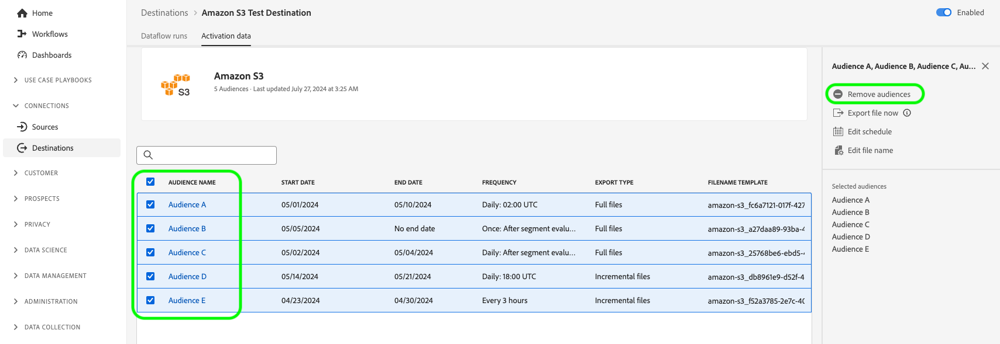

# Adobe Experience Platform 發行說明

**發行日期： 2024年8月20日**

>[!TIP]
>
>檢視範例使用案例檔案](https://experienceleague.adobe.com/en/docs/experience-platform/rtcdp/use-cases/overview)的[概觀，以瞭解各種使用案例，例如潛在客戶、贏取等，以及貴組織透過Real-Time CDP可以達成的目標。

Experience Platform現有功能和檔案的更新：

- [屬性型存取控制](#abac)
- [資料擷取](#data-ingestion)
- [目的地](#destinations)
- [體驗資料模式 (XDM)](#xdm)
- [身分識別服務](#identity-service)
- [Segmentation Service](#segmentation)
- [來源](#sources)

## 屬性型存取控制 {#abac}

以屬性為基礎的存取控制是Adobe Experience Platform的一項功能，可讓注重隱私權的品牌在管理使用者存取許可權時擁有更大的彈性。 可以將結構描述欄位和分段等個別對象指派給使用者角色。此功能允許您授予或撤銷組織中特定平台使用者對個別物件的存取權限。

透過以屬性為基礎的存取控制，您組織的管理員可以控制使用者對所有Platform工作流程和資源的敏感個人資料(SPD)、個人識別資訊(PII)及其他自訂資料型別的存取權。 管理員可以定義只能存取特定欄位以及這些欄位對應資料的使用者角色。

**新功能**

| 功能更新 | 說明 |
| --- | --- |
| 新的許可權管理員功能 | 您現在可以利用[許可權管理員](../../access-control/abac/permission-manager/overview.md)，使用簡單的查詢來產生報告，這有助於您瞭解存取管理，並節省驗證多個工作流程和詳細程度層級的存取許可權的時間。 如需建立使用者和角色報告的詳細資訊，請參閱[許可權管理員使用手冊](../../access-control/abac/permission-manager/permissions.md)。 {width="250" align="center" zoomable="yes"} |

{style="table-layout:auto"}

若要了解更多關於屬性型存取控制，請參閱[屬性型存取控制概觀](../../access-control/abac/overview.md)。關於屬性型存取控制工作流程的綜合指南，請閱讀[屬性型存取控制端對端指南](../../access-control/abac/end-to-end-guide.md)。

## 資料擷取（8月23日更新） {#data-ingestion}

Adobe Experience Platform 會提供一組豐富的功能，用於擷取任何類型和任何延遲的資料。您可以使用批次或串流 API (使用 Adobe 建置的來源、資料整合合作夥伴或 Adobe Experience Platform UI) 進行擷取。

**更新批次資料擷取中的日期格式處理**

此版本解決批次資料擷取中&#x200B;*日期格式處理*&#x200B;的問題。 以前，系統會將使用者端插入的日期欄位轉換成`DateTime`格式。 `Date`這表示時區會自動新增到欄位，並且對偏好或需要`Date`格式的使用者造成困難。 此後，時區將不會自動新增到`Date`型別的欄位。 此更新可確保匯出的資料格式與客戶請求的該欄位設定檔上表示的格式相符。

發行前`Date`個欄位： `"birthDate": "2018-01-12T00:00:00Z"`
發行後的`Date`欄位： `"birthDate": "2018-01-12"`

深入瞭解[批次擷取](/help/ingestion/batch-ingestion/overview.md)。

## 目的地 {#destinations}

[!DNL Destinations] 是預先建立的和目標平台的整合，可讓來自 Adobe Experience Platform 的資料順暢啟動。您可使用目的地啟用已知和未知的資料，以進行跨通路行銷活動、電子郵件行銷活動、設定目標的廣告活動和其他諸多使用案例。

**新目的地或更新的目的地** {#new-updated-destinations}

| 目的地 | 說明 |
| ----------- | ----------- |
| [硬碟](/help/destinations/catalog/mobile-engagement/braze.md) | [!UICONTROL Braze]會管理其儀表板和REST端點的許多不同執行個體。 [!UICONTROL Braze]客戶應根據您布建到的執行個體，使用正確的REST端點。 此版本新增了一個新的US-07端點，您可以在連線至[!UICONTROL 硬碟]時選取該端點。 |

{style="table-layout:auto"}

**新功能或更新的功能** {#destinations-new-updated-functionality}

| 功能 | 說明 |
| ----------- | ----------- |
| 現在一般都能將檔案隨選匯出至批次目的地。 | 所有客戶現在都可以選擇隨選將檔案匯出至批次目的地。 如需詳細資訊，請參閱[專屬檔案](../../destinations/ui/export-file-now.md)。 |
| 在[排程步驟](../../destinations/ui/activate-batch-profile-destinations.md#scheduling)中編輯多個匯出對象的匯出排程。 | 現在，所有客戶都可以使用選項，直接從對象啟用工作流程的排程步驟，編輯多個匯出對象的匯出排程。 {width="250" align="center" zoomable="yes"} |
| 在[排程步驟](../../destinations/ui/activate-batch-profile-destinations.md#scheduling)中編輯多個匯出對象的檔案名稱。 | 現在，所有客戶都可以使用選項，直接從對象啟用工作流程的排程步驟編輯多個匯出檔案的名稱。 {width="250" align="center" zoomable="yes"} |
| 從[目的地詳細資料](../../destinations/ui/destination-details-page.md#bulk-remove)頁面移除資料流中的多個對象。 | 從&#x200B;**[!UICONTROL 目的地詳細資料]**&#x200B;頁面移除現有資料流中多個對象的選項現在可供所有客戶使用。 {width="250" align="center" zoomable="yes"} |
| 從[目的地詳細資料](../../destinations/ui/destination-details-page.md#bulk-export)頁面，隨選將多個檔案匯出至批次目的地。 | 所有客戶現在都可以選擇從&#x200B;**[!UICONTROL 目的地詳細資料]**&#x200B;頁面，隨選將多個檔案匯出至批次目的地。 {width="250" align="center" zoomable="yes"} |
| 從[目的地詳細資料](../../destinations/ui/destination-details-page.md#bulk-edit-file-names)頁面編輯多個匯出對象的檔案名稱。 | 您現在可以直接從&#x200B;**[!UICONTROL 目的地詳細資料]**&#x200B;頁面編輯多個匯出檔案的名稱。 {width="250" align="center" zoomable="yes"} |
| 從[目的地詳細資料](../../destinations/ui/export-datasets.md#remove-dataset)頁面移除資料流中的多個資料集。 | 所有客戶現在都可以使用從資料流移除多個資料集的選項。 {width="250" align="center" zoomable="yes"} |

{style="table-layout:auto"}

如需詳細資訊，請閱讀[目的地概觀](../../destinations/home.md)。

## 體驗資料模式 (XDM) {#xdm}

XDM 是一種開放原始碼的規格，可為帶到 Adobe Experience Platform 中的資料提供通用結構和定義 (結構描述)。若遵守 XDM 標準，即可將所有客戶體驗資料合併到一個常用表述中，以更快速、更整合的方式傳遞分析。您可以從客戶行為中獲得有價值的分析，透過區段定義客戶對象，並使用客戶屬性實現個人化的目的。

**新功能**

| 功能 | 說明 |
| --- | --- |
| ML輔助的結構描述建立流程 | 使用進階機器學習演演算法來分析範例資料檔案，並使用標準和自訂欄位自動建立最佳化的結構描述。 主要功能： <ul><li>更快建立方案：使用ML建議和產生的XDM欄位，直接從範例資料檔產生方案。</li><li>靈活的結構描述演化：輕鬆新增或更新產生之結構描述中的欄位。</li><li>緊密整合：與Schema Ul的核心架構建立流程完全整合，確保提供順暢團結的使用者體驗。</li><li>有效率的檢閱和編輯：使用平面檢視編輯器快速檢視和更新您的架構，讓建立過程更有效率且更方便使用。</li></ul> 若要深入瞭解，請閱讀[ML輔助結構描述建立工作流程手冊](../../xdm/ui/ml-assisted-schema-creation.md)。 |

{style="table-layout:auto"}

如需有關 Platform 中 XDM 的詳細資訊，請參閱 [XDM 系統概觀](../../xdm/home.md)。

## 身分識別服務 {#identity-service}

使用Adobe Experience Platform Identity Service，透過跨裝置和系統橋接身分，讓您即時提供具影響力的個人數位體驗，進而建立客戶及其行為的全面檢視。

**已更新檔案**

| 功能 | 說明 |
| --- | --- |
| 圖表設定指南 | 請閱讀[圖表組態指南](../../identity-service/identity-graph-linking-rules/example-configurations.md)，以瞭解在使用身分圖表連結規則和身分資料時可能會遇到的常見圖表情境相關資訊。 圖表設定指南提供的範例涵蓋從簡單的單一人員圖表情境到複雜且階層式的多人圖表情境。 您也可以使用指南來取得可在[圖表模擬UI](../../identity-service/identity-graph-linking-rules/graph-simulation.md)中輸入的事件和演演算法設定範例，以及特定圖表情境下如何選取主要身分的劃分。 |

{style="table-layout:auto"}

如需有關Identity服務的詳細資訊，請閱讀[Identity服務概觀](../../identity-service/home.md)。

## Segmentation Service {#segmentation}

[!DNL Segmentation Service] 可讓您將儲存在和個人 (例如客戶、潛在客戶、使用者或組織) 相關的 [!DNL Experience Platform] 中的資料分段為不同的對象。您可以透過區段定義或來自 [!DNL Real-Time Customer Profile] 資料的其他來源建立對象。這些對象會在 [!DNL Platform] 上集中設定及維護，並可透過任何 Adobe 解決方案輕鬆存取。

**更新的功能**

| 功能 | 說明 |
| ------- | ----------- |
| 內嵌詳細資料 | 對於具有自訂上傳來源的對象，您可以在對象詳細資訊頁面中，更全面地檢視對象擷取的詳細資訊。 此外，您可以選取結構並選取要加上標籤的所需屬性，將標籤套用至裝載屬性。 您可以在[對象入口網站指南](../../segmentation/ui/audience-portal.md#ingestion-details)中找到有關內嵌詳細資訊區段的詳細資訊。 |

{style="table-layout:auto"}

如需有關 [!DNL Segmentation Service] 的詳細資訊，請參閱[分段概觀](../../segmentation/home.md)。

## 來源

Experience Platform 可提供 RESTful API 和互動式 UI，可讓您輕鬆為各種資料提供者設定來源連線。這些來源連線可讓您進行驗證並連線到外部儲存系統和 CRM 服務、設定擷取執行的時間並管理資料擷取輸送量。

在Experience Platform中使用來源，從Adobe應用程式或第三方資料來源擷取資料。

**已更新檔案**

| 更新檔案 | 說明 |
| --- | --- |
| 擴充有關更新資料流的檔案 | 已更新UI](../../sources/tutorials/ui/update-dataflows.md)中[更新現有來源資料流程的指南，以提供您可以對現有資料流程進行各種設定的詳細資訊。 指南也經過更新，以釐清已停用資料流重新啟用的預期行為。 |

{style="table-layout:auto"}

如需詳細資訊，請閱讀[來源概觀](../../sources/home.md)。
