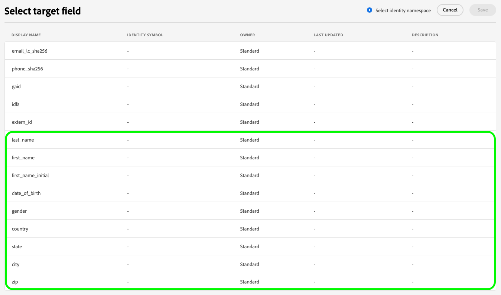

# Adobe Experience Platform 發行說明

>[!TIP]
>
>如需其他 Adobe Experience Platform 應用程式的發行說明，請參閱以下文件：
>
>- [Adobe Journey Optimizer](https://experienceleague.adobe.com/zh-hant/docs/journey-optimizer/using/whats-new/release-notes)
>- [Adobe Journey Optimizer B2B](https://experienceleague.adobe.com/zh-hant/docs/journey-optimizer-b2b/user/release-notes)
>- [Customer Journey Analytics](https://experienceleague.adobe.com/zh-hant/docs/analytics-platform/using/releases/pre-release-notes)
>- [聯合客群構成](https://experienceleague.adobe.com/zh-hant/docs/federated-audience-composition/using/e-release-notes)
>- [Real-Time CDP Collaboration](https://experienceleague.adobe.com/zh-hant/docs/real-time-cdp-collaboration/using/latest)

**發行日期：2025 年 6 月 18 日**

Adobe Experience Platform 全新功能及現有功能更新：

- [存取控制](#access-control)
- [進階資料生命週期管理](#advanced-data-lifecycle-management)
- [目錄服務](#catalog-service)
- [儀表板](#dashboards)
- [資料控管](#data-governance)
- [目標](#destinations)
- [聯合客群構成](#fac)
- [隱私權服務](#privacy-service)
- [沙箱](#sandboxes)
- [分段](#segmentation-service)
- [來源](#sources)

## 存取控制 {#access-control}

Experience Platform 運用 [Adobe Admin Console](https://adminconsole.adobe.com) 產品輪廓將使用者與權限和沙箱連結。透過權限來控制對各項 Experience Platform 功能的存取權，包括資料建模、輪廓管理和沙箱管理。

**主要功能**

| 功能 | 說明 |
| ------- | ----------- |
| 匯出儀表板資料權限 | 儀表板中的「**[!UICONTROL 下載 CSV]**」和「**[!UICONTROL 以電子郵件傳送]**」選項，現在皆須取得&#x200B;**[!UICONTROL 匯出儀表板資料]**&#x200B;權限。此權限確保僅有經過授權的使用者可以匯出表格式的洞察資料，進而支援更嚴格的控管與資料存取控制原則。請參閱[存取控制指南中的權限區段](../../access-control/home.md#permissions)，以了解更多資訊。 |

如需更多資訊，請參閱[存取控制概觀](../../access-control/home.md)。

## 進階資料生命週期管理 {#advanced-data-lifecycle-management}

Experience Platform 提供一套資料檢疫功能，可讓您以程式化方式刪除消費者記錄與資料集，以管理儲存的資料。利用使用者介面中的資料生命週期工作區，或透過呼叫資料檢疫 API，您可以有效地管理資料儲存區。利用這些功能可確保資訊如預期般使用、在不正確的資料需要修正時更新資訊，以及在組織原則認為必要時刪除資訊。

**新文件**

| 新文件 | 說明 |
| --- | --- |
| 記錄刪除功能現已正式推出 | 您現在可以使用 UI 或 API，根據身分識別欄位刪除個別記錄。此功能可以刪除單一資料集或所有資料集中的資料，有助於減少儲存用量、加強治理及提升資料衛生。此功能具有資料量限制與權限要求。請參閱[刪除記錄指南](../../hygiene/ui/record-delete.md)以了解更多資訊。 |

如需詳細資訊，請參閱[進階資料生命週期管理概觀](../../hygiene/home.md)。

## 目錄服務 {#catalog-service}

目錄服務是 Adobe Experience Platform 內部的資料位置和譜系記錄系統。雖然攝取至 Experience Platform 中的所有資料都會以檔案及目錄形式儲存在資料湖中，但是為了查詢和監控目的，目錄也會保留這些檔案及目錄的中繼資料與說明。

**新功能或更新功能**

| 功能 | 說明 |
| --- | --- |
| 改進資料集預覽功能：導覽更快速且洞察更清晰 | 您可以在熟悉的資料集預覽體驗中，快速預覽資料集資料、檢視基礎 SQL 查詢，並透過強化的篩選功能和更清晰的結構可見度，探索多達 100 行的資料。請參閱[資料集使用手冊](../../catalog/datasets/user-guide.md#preview)，以了解更多資訊。 |

{style="table-layout:auto"}

## 儀表板 {#dashboards}

Experience Platform 提供多個儀表板，您可以透過這些儀表板，檢視每日快照期間擷取之組織資料的重要解析。

**新功能或更新功能**

| 功能 | 說明 |
| ------- | ----------- |
| 「以電子郵件傳送」匯出選項 | 您現在可以從「**[!UICONTROL 檢視更多]**」選單中選取「**[!UICONTROL 以電子郵件傳送]**」，從 Query Pro 模式的儀表板匯出最多 10,000 筆記錄。此選項可安全地將下載連結傳送至與 Adobe 關聯的電子郵件，以便進行大規模匯出。請參閱[檢視更多指南](../../dashboards/sql-insights-query-pro-mode/view-more.md#export)，以了解更多資訊。 |

如需有關儀表板的詳細資訊，包括如何授予存取權限和建立自訂小工具，請先參閱[儀表板概觀](../../dashboards/home.md)。

## 資料治理 {#data-governance}

Adobe Experience Platform 資料治理是一系列的策略和技術，用於管理客戶資料並確保符合適用於資料使用方式的法規、限制和政策。它在 [!DNL Experience Platform] 的不同階層都扮演重要的角色，包括編目、資料譜系、資料使用標籤、資料存取政策，以及對行銷動作資料的存取控制。

**新功能**

| 功能 | 說明 |
| --- | --- |
| Azure CMK 警示和 IP 允許清單設定 | 您現在可以將 Adobe 的靜態 IP 位址新增至 Azure Key Vault 的允許清單中，以確保在啟用網路限制時仍可持續存取。這樣有助於避免因金鑰存取限制而導致 Platform 服務中斷。 |
| CMK 設定警示和解決方法 | 現在，當 Adobe 服務失去對 Azure Key Vault 的存取權時 (例如，由於刪除 IP 允許清單項目或停用金鑰)，Experience Platform 將會觸發警示。全新指南可協助您了解每種警示並採取修正動作。 |

如需詳細資訊，請閱讀[資料治理概觀](../../data-governance/home.md)。

## 目標 {#destinations}

[!DNL Destinations] 是預先建立的目標平台整合功能，能夠順暢啟用來自 Adobe Experience Platform 的資料。您可以使用目標啟用已知和未知的資料，以進行跨通路行銷活動、電子郵件行銷活動、定向廣告和其他諸多使用案例。

**新目的地**

| 目標 | 說明 |
| --- | --- |
| [[!DNL Algolia]](../../destinations/catalog/personalization/algolia.md) 連線 | 使用 [!DNL Algolia] 目標，在整個網站中從首頁到搜尋頁面，皆提供一致的個人化服務。使用多個資料來源來建立豐富的客群，並透過各種管道共用，藉此改善目標市場選擇的策略和個人化行銷活動的成效。 |

**全新或更新版功能**

| 功能 | 說明 |
| --- | --- |
| [Google Customer Match + DV360](../../destinations/catalog/advertising/google-customer-match-dv360.md)一般可用性 | Google Customer Match + DV360目的地現在可供所有Experience Platform使用者使用。 檔案現在包含[!DNL Adobe]與[!DNL Google]廣告帳戶之間[帳戶連結](../../destinations/catalog/advertising/google-customer-match-dv360.md#linking)的詳細指引。 |
| 適用於串流目的地的[對象層級監視](../../dataflows/ui/monitor-destinations.md#audience-level-dataflow-runs-for-streaming-destinations) | 對象層級監控現在可用於以下目的地： <ul><li>[[!DNL (API) Oracle Eloqua] 連線](../../destinations/catalog/email-marketing/oracle-eloqua-api.md)</li><li>[[!DNL (V2) Marketo Engage]](../../destinations/catalog/adobe/marketo-engage.md)</li><li>[[!DNL Airship Attributes]](../../destinations/catalog/mobile-engagement/airship-attributes.md)</li><li>[[!DNL Amazon Kinesis]](../../destinations/catalog/cloud-storage/amazon-kinesis.md)</li><li>[[!DNL Azure Event Hubs]](../../destinations/catalog/cloud-storage/azure-event-hubs.md)</li><li>[[!DNL Google Customer Match + Display & Video 360]](../../destinations/catalog/advertising/google-customer-match-dv360.md)</li><li>[[!DNL HTTP API]](../../destinations/catalog/streaming/http-destination.md)</li><li>[[!DNL HubSpot]](../../destinations/catalog/crm/hubspot.md)</li><li>[[!DNL Magnite: Real-time]](../../destinations/catalog/advertising/magnite-streaming.md)</li><li>[[!DNL Marketo Engage Person Sync]](../../destinations/catalog/adobe/marketo-engage-person-sync.md)</li><li>[[!DNL Microsoft Dynamics 365]](../../destinations/catalog/crm/microsoft-dynamics-365.md)</li><li>[[!DNL Moengage]](../../destinations/catalog/mobile-engagement/moengage.md)</li><li>[[!DNL Outreach]](../../destinations/catalog/crm/outreach.md)</li><li>[[!DNL PubMatic Connect]](../../destinations/catalog/advertising/pubmatic.md)</li><li>[[!DNL PubMatic Connect (Custom Audience ID Mapping)]](../../destinations/catalog/advertising/pubmatic.md)</li><li>[[!DNL Qualtrics Automations]](../../destinations/catalog/survey/qualtrics-automations.md)</li><li>[[!DNL RainFocus Attendee Profiles]](../../destinations/catalog/marketing-automation/rainfocus.md)</li><li>[[!DNL SAP Commerce]](../../destinations/catalog/ecommerce/sap-commerce.md)</li><li>[[!DNL Snowflake]](../../destinations/catalog/cloud-storage/snowflake.md)</li><li>[[!DNL Yahoo DataX]](../../destinations/catalog/advertising/datax.md)</li><li>[[!DNL Zendesk]](../../destinations/catalog/crm/zendesk.md)</li></ul> |
| 為 [Facebook](../../destinations/catalog/social/facebook.md#supported-identities) 目標提供額外的識別碼支援 | [!DNL Facebook] 目標現在支援對應新的位址相關欄位，藉此提升目標市場選擇的成效，並與 Facebook 屬性的輪廓相符。如需新位址相關欄位的詳細資訊，請參閱[支援的身分](../../destinations/catalog/social/facebook.md#supported-identities)區段。  顯示Facebook其他欄位的{width="200" align="center" zoomable="yes"} |
| [[!DNL Braze]](../../destinations/catalog/mobile-engagement/braze.md) 目標升級 | 從 2025 年 6 月 19 日起，您可以看到兩張 **[!DNL Braze]** 卡片在目標目錄中並列顯示。這是因為目標服務內部升級所致。現有的 [!DNL Braze] 目標連接器已重新命名為 **[!UICONTROL (已停止使用) Braze]**，並提供名為 **[!UICONTROL Braze]** 的全新卡片。 使用目錄中的 **[!UICONTROL Braze]** 連線處理新的啟用資料流。如果您有任何傳送至 **[!UICONTROL (已停止使用) Braze]** 目標的使用中資料流，該資料流將自動更新，因此您無需採取任何動作。  如果您透過 [Flow Service API](https://developer.adobe.com/experience-platform-apis/references/destinations/) 建立資料流，則您必須將 [!DNL flow spec ID] 和 [!DNL connection spec ID] 更新為下列值： <ul><li>流程規格 ID：`cb7919bd-69aa-462d-bcc0-db7cdc7fdf51`</li><li>連線規格 ID：`ab957205-5a78-4393-b901-b930ed548220`</li></ul> |

{style="table-layout:auto"}

如需詳細資訊，請參閱[目標概觀](../../destinations/home.md)。

## 聯合客群構成 {#fac}

聯合客群構成可讓企業構成資料，以善加應用於各種使用案例中。有了這種新方法，Adobe Real-Time Customer Data Platform 和/或 Adobe Journey Optimizer 的使用者就可以直接聯合現有資料倉儲中的資料集，透過單一系統建立並擴充 Adobe Experience Platform 的客群及屬性。

| 新功能 | 說明 |
| ----------- | ----------- |
| Adobe Healthcare Shield 客戶功能現已正式推出 | 在 6 月底以前，Adobe Healthcare Shield 客戶將可以使用聯合客群構成來建立客群、擴充客群以及處理輪廓擴充使用案例。如需有關聯合客群構成的隱私權與安全性措施的詳細資訊，請參閱[聯合客群構成概觀中的隱私權與安全性](https://experienceleague.adobe.com/zh-hant/docs/federated-audience-composition/using/start/privacy-security)。如需有關 Experience Platform 產品整體的 HIPAA 合規性詳細資訊，請參閱 [HIPAA 和 Adobe 產品與服務概觀](https://www.adobe.com/tw/trust/compliance/hipaa-ready.html)。 |

如需詳細資訊，請參閱[聯合客群構成文件](https://experienceleague.adobe.com/zh-hant/docs/federated-audience-composition/using/home)。

## [!DNL Privacy Service] {#privacy}

有多項法律及組織法規授予使用者權利，讓使用者有權透過請求，從您的資料存放區存取或刪除其個人資料。Adobe Experience Platform [!DNL Privacy Service] 提供 RESTful API 和使用者介面，協助您管理這些來自客戶的資料請求。透過 [!DNL Privacy Service]，您可以提交請求來存取和刪除 Adobe Experience Cloud 應用程式中的私人或個人客戶資料，進而促進法律和組織隱私法規的自動化合規。

**新功能**

| 功能 | 說明 |
| --- | ---|
| 支援田納西州和明尼蘇達州隱私權法 | 隱私權服務現在支援田納西州資訊保護法 (`tipa_tn_usa`) 和明尼蘇達州消費者資料隱私權法 (`mcdpa_mn_usa`)。您可以依據這些新的州級法規處理存取與刪除要求。請參閱[法規概觀](https://experienceleague.adobe.com/zh-hant/docs/experience-platform/privacy/regulations/overview)，以了解更多詳細資訊。 |

請參閱[隱私權服務概觀](../../privacy-service/home.md)，以了解更多有關該服務的資訊。

## 沙箱 {#sandboxes}

Adobe Experience Platform 旨在協助您在全球各地打造更豐富的數位體驗應用程式。公司經常並行執行多個數位體驗應用程式，不但要顧及這些應用程式的開發、測試和部署等需求，也必須確保營運合規性。

**新功能或更新功能**

| 功能 | 說明 |
| --- | --- |
| 物件設定更新遷移 | 現在，您在完成初始複寫後，可以在沙箱之間遷移重複執行的物件設定更新。此強化功能支援開發工作流程，可在不同環境之間更新與傳播設定，且無須重新建立整個沙箱設定。如需更多資訊，請參閱[在沙箱之間遷移設定更新](../../sandboxes/ui/sandbox-tooling.md#move-configs)。 |

{style="table-layout:auto"}

如需有關沙箱的詳細資訊，請閱讀[沙箱概觀](../../sandboxes/home.md)。

## 細分服務 {#segmentation-service}

[!DNL Segmentation Service] 會說明區分客戶群中可行銷人員群組的標準，進而定義設定檔的特定子集。客群的根據可以是記錄資料 (例如人口統計資訊) 或是代表客戶與您的品牌互動情形的時間序列事件。

**新功能或更新功能**

| 功能 | 說明 |
| ------- | ----------- |
| 相似洞察可用性更新 | 針對使用率較低的環境，將會自動停用相似洞察和相似客群。使用率低的定義為過去三個月內未檢視過相似洞察，或過去六個月內未建立新的相似客群。更多與此變更相關的資訊，請參閱[相似客群指南](../../segmentation/types/lookalike-audiences.md)。 |

## 來源 {#sources}

Experience Platform 提供 RESTful API 和互動式 UI，可讓您輕鬆為各種資料提供者設定來源連線。這些來源連線可讓您進行驗證並連線到外部儲存系統和 CRM 服務、設定擷取執行的時間並管理資料擷取輸送量。

**更新的功能**

| 功能 | 說明 |
| --- | --- |
| [!DNL Azure Databricks] 的 [!BADGE Beta]{type=Informative} UI 支援 | 您現在可以使用 UI 中的來源工作區，將您的 [!DNL Azure Databricks] 帳戶連接至 Experience Platform。請參閱[在 UI 中將  [!DNL Databricks]  連結至 Experience Platform](../../sources/connectors/databases/databricks.md) 的指南，以了解更多資訊。 |
| 支援新的 [!DNL Azure Synapse Analytics] 驗證類型 | 除了現有的連線字串驗證外，[!DNL Azure Synapse Analytics] 現在亦支援服務主體驗證。如需更多資訊，請參閱 [[!DNL Azure Synapse Analytics]  驗證概觀](../../sources/connectors/databases/synapse-analytics.md)。 |
| [!DNL Salesforce] 基本驗證停止使用 | [Salesforce CRM](../../sources/connectors/crm/salesforce.md) 和 [Salesforce Service Cloud](../../sources/connectors/customer-success/salesforce-service-cloud.md) 的基本驗證將於 2026 年 1 月之前停止使用。為維持連線，客戶必須遷移至 OAuth 2.0 驗證。此變更會影響兩個來源連接器，並能提升安全性，且符合 Salesforce 的驗證標準。 |

{style="table-layout:auto"}

如需更多資訊，請參閱[來源概觀](../../sources/home.md)。
