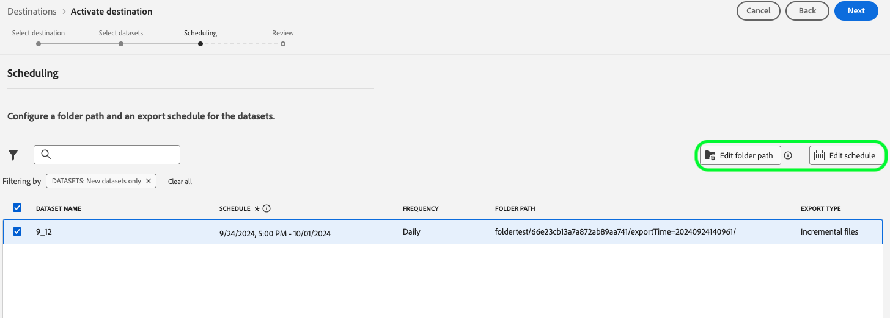

# Adobe Experience Platform 發行說明

**發行日期： 2024年9月24日**

Adobe Experience Platform現有功能和檔案的更新：

- [警示](#alerts)
- [儀表板](#dashboards)
- [資料準備](#data-prep)
- [目標](#destinations)
- [體驗資料模式 (XDM)](#xdm)
- [身分識別服務](#identity-service)
- [查詢服務](#query-service)
- [Segmentation Service](#segmentation-service)
- [來源](#sources)

## 警示 {#alerts}

Experience Platform 可讓您訂閱各種 Platform 活動的事件型警示。您可以透過 Platform 使用者介面中的「[!UICONTROL 警示]」索引標籤訂閱不同的警示規則，而且可以選擇在使用者介面本身內或透過電子郵件通知接收警示訊息。

**新功能或更新功能**

| 功能 | 說明 |
| --- | --- |
| 開發沙箱支援 | 您現在可以在生產及開發沙箱中[訂閱警示](../../observability/alerts/ui.md)，以順暢地監視所有環境。 |
| 電子郵件範本 | [電子郵件警示](../../observability/alerts/ui.md)現在包含詳細的資產資訊，確保您擁有所有重要的詳細資訊，觸手可及。 |
| 增強的自訂功能 | 您現在可以設定[警示臨界值](../../observability/alerts/ui.md#alert-threshold)，提供更大的彈性來針對下列警示型別的特定需求量身打造警示： <ul><li>區段工作延遲</li><li>區段匯出延遲</li><li>目的地資料流執行延遲</li><li>Identity服務流程執行延遲</li><li>設定檔流程執行延遲</li><li>來源資料流執行延遲</li><li>查詢執行延遲</li><li>超出啟用略過率</li><li>超過來源擷取錯誤率</ul> |
| 擴展的警報 | 稽核事件資訊警示現在可用於下列[警示規則](../../observability/alerts/rules.md)的訂閱： <ul><li>對象建立</li><li>對象更新</li><li>對象刪除</li><li>資料集建立</li><li>資料集更新</li><li>資料集刪除</li><li>結構描述建立</li><li>結構描述更新</li><li>結構描述刪除。 |

{style="table-layout:auto"}

如需有關警示的詳細資訊，請閱讀[[!DNL Observability Insights] 總覽](../../observability/home.md)。

## 儀表板 {#dashboards}

Experience Platform提供多個儀表板，您可在其中檢視有關組織資料的重要深入分析，如每日快照期間所擷取。

**新功能或更新功能**

| 功能 | 說明 |
| --- | --- |
| 授權使用附加元件表格 | 透過核心產品和附加元件的專用表格，取得授權使用情況的精細可見度，並管理您的平台資源。 透過沙箱層級的鑽研檢視追蹤和分析每個核心產品的關鍵量度。 附加量度可與核心產品量度緊密整合，提供使用的全面檢視。 增強的可見度可協助您最佳化授權管理，並根據組織需求調整資源。 如需詳細資訊，請參閱[[!UICONTROL 授權使用情況]儀表板指南](../../dashboards/guides/license-usage.md#overview-tab)。 |
| Query Pro模式 — 全域篩選器升級 | 使用Query Pro Mode的新日期篩選器增強分析。 使用SQL查詢中的動態日期引數來完善深入分析，並依特定時間範圍篩選資料。 使用直覺式UI選擇預設或自訂日期範圍，讓儀表板保持與所有使用者相關。 簡化工作流程、維持精確度並及時做出決策。 如需詳細資訊，請參閱建立日期篩選器](../../dashboards/data-distiller/query-pro-mode/filters/global-filter.md)的[指南。 |
| Query Pro模式 — 鑽研 | 使用Query Pro模式的Drill Through功能，解鎖更深入的深入分析，並可順暢地從高階圖表導覽至詳細儀表板。 使用此功能可輕鬆從摘要轉換為深入分析，並探索趨勢、客戶行為和KPI。 自動篩選通過和多層級鑽研可保持資料的一致性，確保順利的探索。 簡化工作流程、保留內容並加速決策。 如需詳細資訊，請參閱建立鑽研的[逐步指南](../../dashboards/data-distiller/query-pro-mode/drill-through.md)。 |
| Query Pro模式 — 進階表格屬性 | 使用Query Pro Mode進階表格屬性來簡化資料視覺效果、提升工作流程效率並改善資料清晰度。 直接從自訂儀表板將自動排序、調整大小和分頁新增到表格中。 排序欄以排列關鍵資料的優先順序、調整大小以獲得最佳可讀性，以及無縫導覽大型資料集而不修改SQL查詢。 閱讀&#39;[檢視更多](../../dashboards/data-distiller/query-pro-mode/view-more.md)&#39;指南，瞭解如何整合這些功能並提升您的資料深入分析。 |
| 總資料量 | 「平均設定檔豐富度」量度已替換為「總資料量」量度。 總資料量是指可用於即時客戶個人檔案的參與和個人化工作流程的總資料量。 您可以在[總計資料磁碟區指南](../../landing/license-usage-and-guardrails/total-data-volume.md)中找到有關這項變更的更多詳細資料。 |

{style="table-layout:auto"}

如需有關儀表板的詳細資訊，包括如何授予存取權限和建立自訂 Widget，請先詳閱[儀表板概觀](../../dashboards/home.md)。

## 資料準備 {#data-prep}

使用資料準備可在體驗資料模型 (XDM) 之間對應、轉換和驗證資料。

**新功能或更新功能**

| 功能 | 說明 |
| --- | --- |
| [!BADGE Beta]{type=Informative}新的資料準備函式，用於目的地 | 您現在可以在目的地使用案例中使用下列陣列函式：<ul><li>`array_to_string`</li><li>`filterArray`</li><li>`transformArray`</li><li>`flattenArray`</li></ul> 如需詳細資訊，請閱讀[資料準備功能指南](../../data-prep/functions.md#arrays)。 |

{style="table-layout:auto"}

如需有關資料準備的詳細資訊，請閱讀[資料準備概觀](../../data-prep/home.md)。

## 目標 {#destinations}

[!DNL Destinations] 是預先建立的和目標平台的整合，可讓來自 Adobe Experience Platform 的資料順暢啟動。您可使用目標啟用已知和未知的資料，以進行跨通路行銷活動、電子郵件行銷活動、設定目標的廣告活動和其他諸多使用案例。

**新目標或更新的目標** {#new-updated-destinations}

| 目標 | 說明 |
| --- | --- |
| [Amazon廣告](/help/destinations/catalog/advertising/amazon-ads.md) | 2024年9月發行版本新增對應選項，將`countryCode`引數匯出至Amazon Ads。 在[對應步驟](/help/destinations/catalog/advertising/amazon-ads.md#map)中使用`countryCode`來提高您與Amazon的身分符合率。 |

{style="table-layout:auto"}

**新功能或更新的功能** {#destinations-new-updated-functionality}

| 功能 | 說明 |
| --- | --- |
| [資料集匯出](/help/destinations/ui/export-datasets.md)增強功能 | 2024年9月發行的Experience Platform包含數項資料集匯出功能增強，以更妥善支援各種資料匯出使用案例。 這些功能增強功能包括： <ul><li>新的資料夾可設定性選項，包括新增和移除子資料夾的選項。</li><li>新的匯出選項，包括完整檔案匯出（一次）和指定結束日期的功能</li><li>注意：對於9月版本之前建立的所有資料集匯出資料流，Adobe也引入了2025年5月1日的預設結束日期。 對於這些資料流中的任一項，客戶必須在結束日期之前手動更新資料流中的結束日期，否則匯出將在此日期停止。</li></ul>   {width="250" align="center" zoomable="yes"} |

{style="table-layout:auto"}

如需詳細資訊，請閱讀[目標概觀](../../destinations/home.md)。

## 體驗資料模式 (XDM) {#xdm}

XDM 是一種開放原始碼的規格，可為帶到 Adobe Experience Platform 中的資料提供通用結構和定義 (結構描述)。若遵守 XDM 標準，即可將所有客戶體驗資料合併到一個常用表述中，以更快速、更整合的方式傳遞分析。您可以從客戶行為中獲得有價值的分析，透過區段定義客戶客群，並使用客戶屬性實現個人化的目的。

**更新的功能**

| 功能 | 說明 |
| --- | --- |
| 架構編輯器的增強功能 | 使用結構描述編輯器中的更新關係工作流程，控制您的結構描述關係。 直接從Experience PlatformUI輕鬆更新或移除現有關係，讓結構描述管理更順暢、更直覺。 調整參考結構描述和重新命名關係時，請務必確保資料在細分和其他關鍵程式間保持完整無缺。 若要深入瞭解如何有效管理您的結構描述關聯性，請參閱[在UI](../../xdm/tutorials/relationship-ui.md#create-a-relationship-field-group)中定義關聯性欄位的指南[B2B關聯性](../../xdm/tutorials/relationship-b2b.md#edit-a-b2b-schema-relationship)。 |

{style="table-layout:auto"}

如需有關XDM的詳細資訊，請閱讀[XDM系統總覽](../../xdm/home.md)。

## 身分服務 {#identity-service}

使用 Adobe Experience Platform 身分服務，可在裝置及系統間進行身分橋接來建立客戶及其行為的全方位檢視，從而讓您即時實現具影響力的個人數位體驗。

**更新的功能**

| 功能 | 說明 |
| --- | --- |
| 身分圖表連結規則可用性限制 | 身分圖表連結規則是Identity Service中的一套工具，可用來確保使用者的精確個人化。 <ul><li>您現在可以使用[身分最佳化演演算法](../../identity-service/identity-graph-linking-rules/identity-optimization-algorithm.md)來確保身分圖表代表單一人員，因此可防止即時客戶個人檔案中不需要的身分合併。</li><li>設定[名稱空間優先順序](../../identity-service/identity-graph-linking-rules/namespace-priority.md)以定義個別名稱空間的重要性，並影響設定檔的形成和分段方式。</li><li>在UI](../../identity-service/identity-graph-linking-rules/graph-simulation.md)中使用[圖表模擬工具來模擬具有不同組態的身分圖表。</li><li>使用[身分設定介面](../../identity-service/identity-graph-linking-rules/identity-settings-ui.md)指定您唯一的名稱空間，並為您組織中的所有名稱空間建立優先順序。</li><li>有關圖表資料的量度和趨勢，請參閱[身分識別儀表板](../../identity-service/identity-graph-linking-rules/implementation-guide.md#validate-your-graphs)。</li></ul> 若要嘗試使用身分圖表連結規則，請聯絡您的Adobe帳戶團隊，以取得開發沙箱的存取權。 |

**更新的文件**

| 功能 | 說明 |
| --- | --- |
| 身分圖表連結規則疑難排解指南 | 請參閱新的[識別圖形連結規則疑難排解指南](../../identity-service/identity-graph-linking-rules/troubleshooting.md)，瞭解您可以採取哪些方法和偵錯解決方案，以解決使用識別圖形連結規則時可能遇到的常見問題。 |
| 身分圖表連結規則的常見問題集 | 閱讀新的[身分圖表連結規則常見問題集](../../identity-service/identity-graph-linking-rules/troubleshooting.md#frequently-asked-questions)，以取得有關名稱空間優先順序、身分最佳化演演算法及其他身分圖表連結規則方面常見問題的解答清單。 |

{style="table-layout:auto"}

若要了解更多有關身分服務的資訊，請閱讀[身分服務概觀](../../identity-service/home.md)。

## 查詢服務 {#query-service}

查詢服務可讓您使用標準的 SQL 查詢 Adobe Experience Platform 中的資料[!DNL data lake]。您可以加入任何資料湖的資料集，並將查詢結果擷取為新資料集，以用於報表、資料科學工作區或擷取至即時客戶輪廓。

**更新的功能**

| 功能 | 說明 |
| --- | --- |
| 資料Distiller受眾 | 使用Experience Platform資料Distiller中的SQL對象擴充功能，輕鬆建立、管理和啟用對象。 使用直接來自資料湖的SQL命令定義對象區段，略過設定檔中原始資料的需求。 調整目標定位策略，並透過此彈性資料導向方法，自動將受眾同步至檔案型目的地。 簡化工作流程、最佳化對象管理，並釋放資料的完整潛能。 閱讀使用SQL對象擴充功能](../../query-service/data-distiller-audiences/overview.md)提升對象策略的[指南。 |
| 資料Distiller統計資料 — 超立方體 | 使用Hypercubes最佳化大資料分析。 處理複雜的計算（例如不同的計數和多維度分析），而不需重新處理歷史資料。 以漸進方式更新資料、簡化工作流程，並縮短處理時間，同時維持精確度和效率。 取得更快、可擴充且符合成本效益的深入分析，進而轉變決策方式。 探索有關使用超多維度資料集](../../query-service/hypercubes.md)以解除鎖定進階分析的[指南。 |
| 查詢編輯器物件瀏覽器 | 在查詢編輯器中使用新的物件瀏覽器提高查詢效率。 快速搜尋、篩選和存取資料集，以更快撰寫和調整查詢。 透過即時結構描述更新和即時表格中繼資料，您可以簡化工作流程、縮短導覽時間，並增強您的查詢體驗。 釋放資料的潛力並最佳化分析。 如需詳細資訊，請參閱使用物件瀏覽器](../../query-service/ui/user-guide.md#object-browser)的[指南。 |
| 計算時數 | 使用排程查詢的最新可見計算時數量度，取得資源使用情況的控制權。 在查詢執行層級檢視「計算時數」，以監視和最佳化CTAS/ITAS批次查詢的資源使用。 追蹤每次查詢執行的開始時間、完成狀態和運算時間。 輕鬆調整效能並降低成本。 請閱讀計算時數](../../query-service/ui/query-schedules.md#compute-hours-at-job-level)的[指南，瞭解如何最大化您的查詢效率。 |

{style="table-layout:auto"}

若要深入瞭解查詢服務，請閱讀[查詢服務概觀](../../query-service/home.md)。

## Segmentation Service {#segmentation-service}

[!DNL Segmentation Service] 會說明區分客戶群中可行銷的一群人的標準，從而定義輪廓的特定子集。區段的基礎可能是記錄資料 (例如人口統計資訊) 或表示客戶與您的品牌互動的時間序列事件。

**新功能或更新功能**

| 功能 | 說明 |
| ------- | ----------- |
| 串流區段條件更新 | 從2024年9月版本開始，已更新受眾符合串流細分資格的條件。 如需有關這些變更的詳細資訊，請參閱[串流區段適用性准則更新](../../segmentation/eligibility-criteria-update.md)。 |
| 整合式搜尋實施 | 「區段產生器」中的搜尋行為現在使用「整合式搜尋」。 這樣可在管理和搜尋對象時提供更強大的體驗，以便重複使用區段成員資格。 如需有關此變更的詳細資訊，請閱讀[客戶細分工具指南](../../segmentation/ui/segment-builder.md#rule-builder-canvas)。 |

{style="table-layout:auto"}

如需[!DNL Segmentation Service]的詳細資訊，請閱讀[區段概觀](../../segmentation/home.md)。

## 來源 {#sources}

Experience Platform 可提供 RESTful API 和互動式 UI，可讓您輕鬆為各種資料提供者設定來源連線。這些來源連線可讓您進行驗證並連線到外部儲存系統和 CRM 服務、設定攝取執行的時間並管理資料攝取輸送量。

使用 Experience Platform 中的來源，即可從 Adobe 應用程式或第三方資料來源攝取資料。

**更新的功能**

| 功能 | 說明 |
| --- | --- |
| 在UI中[!BADGE Beta]{type=Informative}支援加密的資料擷取 | 您現在可以使用Experience Platform使用者介面中的來源工作區，從雲端儲存批次來源內嵌加密的資料。 閱讀有關[在UI](../../sources/tutorials/ui/encryped-ingestion.md)中擷取加密資料的教學課程，以瞭解詳細資訊。 |
| [!DNL Snowflake Streaming]來源的一般可用性 | [!DNL Snowflake Streaming]來源現在為GA。 使用此來源從您的[!DNL Snowflake]帳戶串流資料以進行Experience Platform。 如需詳細資訊，請閱讀[[!DNL Snowflake Streaming] 概觀](../../sources/connectors/databases/snowflake-streaming.md)。 |
| 支援[!DNL Google BigQuery]中的服務帳戶驗證 | 您現在可以連線您的[!DNL Google BigQuery]帳戶，以使用服務帳戶驗證Experience Platform。 如需詳細資訊，請閱讀[[!DNL Google BigQuery] 概觀](../../sources/connectors/databases/bigquery.md#generate-your-google-bigquery-credentials)。  {width="250" align="center" zoomable="yes"} |
| 支援略過範例資料預覽 | 您現在可以選擇在建立與以下來源的來源連線時略過資料預覽： <ul><li>[[!DNL Google BigQuery]](../../sources/tutorials/ui/create/databases/bigquery.md#skip-preview-of-sample-data)</li><li>[[!DNL Salesforce]](../../sources/tutorials/ui/create/crm/salesforce.md#skip-preview-of-sample-data)</li><li>[[!DNL Snowflake]](../../sources/tutorials/ui/create/databases/snowflake.md#skip-preview-of-sample-data)</li></ul> 您可以略過資料預覽，以規避擷取大型批次資料時可能發生的逾時。 這樣做可能會阻止自動驗證計算和必填欄位。 如果您選擇略過資料預覽，則可能必須在對應期間手動驗證計算欄位和必填欄位。 |
| 支援在[!DNL SFTP]中停用區塊化 | 您現在可以設定可讓您停用[!DNL SFTP]來源中的區塊化的設定。 如需詳細資訊，請閱讀 [[!DNL SFTP] 概觀](../../sources/connectors/cloud-storage/sftp.md)。 |

{style="table-layout:auto"}

如需詳細資訊，請閱讀[來源概觀](../../sources/home.md)。
