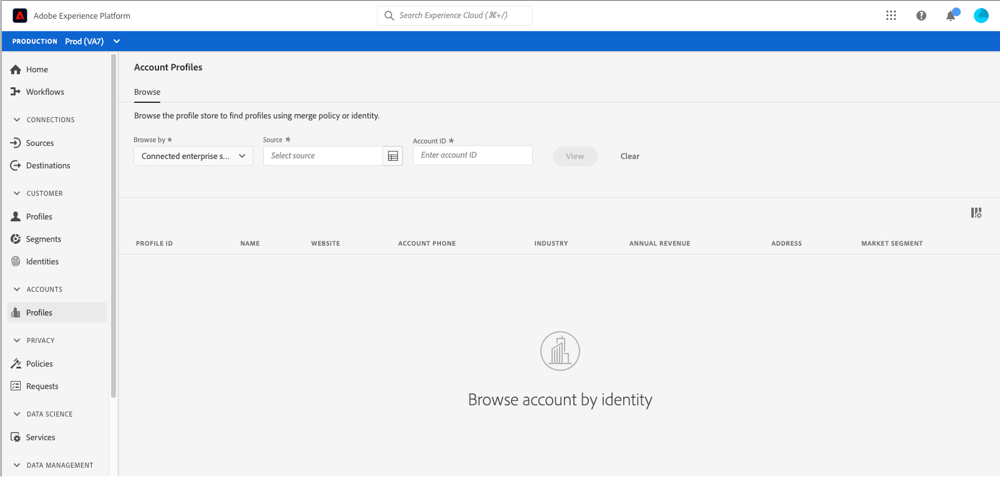
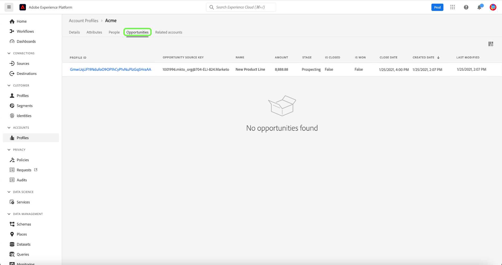

# 帳戶設定檔UI指南

>[!NOTE]
>
>帳戶設定檔僅供Real-time Customer Data Platform B2B Edition客戶使用。 若要進一步了解即時CDP，包括每種許可證類型可用的功能，請從閱讀 [Real-time CDP概述](../overview.md).

帳戶設定檔可讓您統一來自多個來源的帳戶資訊。 帳戶的統一檢視會匯集來自許多行銷管道的資料，以及貴組織目前用來儲存客戶帳戶資訊的不同系統。 本檔案提供使用Adobe Experience Platform使用者介面(UI)中提供的即時CDP B2B Edition功能，與帳戶設定檔互動的指南。

若要進一步了解如何在B2B工作流程中建立帳戶設定檔，請參閱 [端對端教學課程](../b2b-tutorial.md).

## 帳戶設定檔概觀 {#account-profiles-overview}

選擇 **[!UICONTROL 設定檔]** 在 [!UICONTROL 帳戶] 在左側導覽中，檢視帳戶設定檔的概觀。 在 [!UICONTROL 概述] 頁簽中，控制面板顯示一個圖形或圖表，顯示單個入口點中的小部件。

請參閱 [[!UICONTROL 帳戶設定檔]](../../dashboards/guides/account-profiles.md) 控制面板以了解更多。

## 配置銷售機會到帳戶匹配 {#configure-lead-to-account-matching}

>[!IMPORTANT]
>
> 只有B2B AI管理員可以啟用、停用和設定帳戶比對服務的銷售機會。 停用服務後，將在24小時內刪除相符的結果。

要配置銷售機會到帳戶匹配，請選擇 **[!UICONTROL 設定檔]** 在 [!UICONTROL 帳戶] 的下一頁。 在 **[!UICONTROL 概述]** 索引標籤，選取 **[!UICONTROL 設定]** 在右上角。

此 **[!UICONTROL 帳戶設定]** 對話框開啟。 從此處選取 **[!UICONTROL 啟用銷售機會到帳戶匹配]** 切換以啟用功能。 使用下拉式功能表來選取 **[!UICONTROL 每日]** 針對 **[!UICONTROL 匹配順序]** 設定。 最後，選取相關 **[!UICONTROL 符合條件]** 後跟選項 **[!UICONTROL 儲存]** 確認設定並返回 **[!UICONTROL 帳戶設定檔]** 螢幕。

>[!NOTE]
>
> 地址不能作為唯一的匹配標準。 必須選取一或多個其他符合標準。

若要進一步了解銷售機會與帳戶比對，請參閱 [在Real-time CDP B2B概述中提供帳戶匹配](../../rtcdp/b2b-ai-ml-services/lead-to-account-matching.md).

## 瀏覽帳戶設定檔 {#browse-account-profiles}

若要瀏覽帳戶設定檔，請先選取 **[!UICONTROL 設定檔]** 在 [!UICONTROL 帳戶] 的下一頁。

在 **[!UICONTROL 瀏覽]** 索引標籤中，您可以使用來自連線企業來源的帳戶ID或直接輸入來源詳細資訊來探索帳戶設定檔。

### 瀏覽依據 [!UICONTROL 連接的企業源] {#browse-by-connected-enterprise-source}

要按連接的企業源瀏覽帳戶配置檔案，請選擇 **[!UICONTROL 連接的企業源]** 從 **[!UICONTROL 瀏覽依據]** 下拉式清單，然後使用旁邊的選取器按鈕選擇已連線的來源 **[!UICONTROL 來源]** 欄位。

這會開啟 **[!UICONTROL 選擇源]** 對話框，您可以在其中根據貴組織已建立的連接選擇源。

>[!NOTE]
>
>貴組織可能為同一服務提供商(例如，Marketo)配置了多個源，因此，務必複查連接名稱、源系統和源系統實例，以確保按正確的源實例進行搜索。

要了解有關連接企業源的詳細資訊，請參閱 [來源概觀](../sources/sources-overview.md).

您可以選取連線名稱旁的選項按鈕來選擇來源，然後使用 **[!UICONTROL 選擇]** 返回 [!UICONTROL 瀏覽] 標籤。

在選取來源後，您現在必須輸入 **[!UICONTROL 帳戶ID]** 與來源相關。 例如，選擇Salesforce源將要求您從Salesforce實例中輸入帳戶ID，以便查看與該ID綁定的帳戶配置檔案。

>[!NOTE]
>
>對於Marketo帳戶ID，有兩個可能的帳戶表可供參考，因此您必須使用特定語法，以確保您檢視的是正確的帳戶。
>
>最常見的標準語法是附加在 `.mkto_org` (例如， `1234567.mkto_org`)。 Marketo Account-Based Marketing客戶可能有其他值，可使用附加於 `.mkto_account`. 如果您不確定要使用哪種語法，請洽詢您的Marketo管理員。

### 瀏覽依據 [!UICONTROL 其他] {#browse-by-others}

Real-time CDP, B2B Edition支援通過輸入 **[!UICONTROL 源名稱]**, **[!UICONTROL 源實例]**，和 **[!UICONTROL 帳戶ID]** 的帳戶。 通過直接輸入源名稱和實例，您可以提供Experience Platform搜索和顯示正確帳戶配置檔案資料所需的上下文。

在無法直接連線至資料的來源情況下，執行直接查閱的功能相當實用。 例如，如果貴組織已制定資料控管原則，防止直接連線至CRM，您可以將該資料匯出至雲端儲存系統，然後內嵌至Experience Platform。

另一個範例可能是，您在資料離開系統並進入Platform之間執行轉換。 您可以使用直接查詢功能來提供資料的內容(例如，指定該資料為Marketo資料，儘管事實上該資料來自Amazon S3儲存貯體)，讓系統知道要尋找的位置，以及如何正確轉譯資料。

若要開始直接查閱，請選取 **[!UICONTROL 其他]** 從 **[!UICONTROL 瀏覽依據]** 下拉式清單，然後輸入 **[!UICONTROL 源名稱]**, **[!UICONTROL 源實例]**，和 **[!UICONTROL 帳戶ID]** 的帳戶。

## 查看帳戶配置檔案詳細資訊 {#view-account-profile-details}

使用 **[!UICONTROL 瀏覽]** 索引標籤來尋找帳戶設定檔，請選取 **[!UICONTROL 設定檔ID]** 開啟 **[!UICONTROL 詳細資料]** 標籤。 顯示在 **[!UICONTROL 詳細資料]** 索引標籤已從多個設定檔片段合併在一起，以形成個別帳戶的單一檢視。 這包括基本屬性和社交媒體資料等帳戶詳細資訊。

您也可以在組織層級變更顯示的預設欄位，以顯示偏好的帳戶設定檔屬性。

>[!NOTE]
>
>客戶設定檔也有類似的功能，而且已建立逐步指南，內含新增和移除屬性、調整面板大小等指示。 請閱讀 [設定檔詳細自訂指南](../../profile/ui/profile-customization.md) 了解更多。

您可以選取其他可用標籤，以檢視與帳戶相關的其他詳細資訊。 這些頁簽包括屬性、人員和機會頁簽，這些頁簽顯示與企業系統中的帳戶相關的未結和已結業務機會。 請參閱下列章節，以取得每個標籤的詳細資訊。

## 「屬性」索引標籤 {#attributes-tab}

此 **[!UICONTROL 屬性]** 索引標籤會列出與帳戶相關的所有記錄資訊。 這包括來自多個來源的屬性資料，這些來源已合併在一起，以形成帳戶的單一檢視。

除了能夠檢視清單中的資料之外，您還可以使用搜尋列來搜尋特定屬性，或以JSON形式檢視記錄資料。

## 人員標籤 {#people-tab}

此 **[!UICONTROL 人員]** 索引標籤提供與帳戶相關聯的個別人員清單。 這些人員可能是來自您組織內不同團隊管理的不同企業系統的聯絡人和銷售線索，但在即時CDP B2B Edition中，他們會以單一清單的形式一起呈現，讓您更全面地了解客戶聯絡人。

>[!NOTE]
>
>此 [!UICONTROL 人員] 索引標籤會顯示與帳戶相關聯的最多25人清單。 對於擁有25個以上關聯人員的帳戶，系統會顯示25個記錄的隨機抽樣。

除了顯示聯繫人的資訊快照外，列出的每個人還包括 **[!UICONTROL 設定檔ID]**，此可點按連結可讓您探索該個人的即時客戶設定檔。 若要進一步了解如何檢視與您帳戶相關的個別客戶設定檔，請參閱指南 [在Real-time CDP, B2B Edition中瀏覽配置檔案](../profile/profile-browse.md).

## 「機會」頁簽 {#opportunities-tab}

此 **[!UICONTROL 機會]** 頁簽提供與帳戶相關的未結和已結業務機會的資訊。 這些機會可能會從多個來源Experience Platform，但即時CDP B2B Edition可讓行銷人員輕鬆在一個地方一起查看所有這些機會。

>[!NOTE]
>
>此 [!UICONTROL 機會] 索引標籤會顯示與帳戶相關聯的最多25個機會的清單。 對於擁有25個以上關聯機會的帳戶，系統會顯示25條記錄的隨機抽樣。

每個機會都包括以下資訊：機會的名稱、其金額、階段，以及該機會是開啟、關閉、成功還是丟失。

## 「相關帳戶」頁簽 {#related-accounts-tab}

此 **[!UICONTROL 相關帳戶]** 索引標籤提供與您瀏覽之帳戶相關的其他帳戶資訊。 如需功能的詳細資訊，請閱讀 [相關帳戶概述](/help/rtcdp/b2b-ai-ml-services/related-accounts.md).

>[!NOTE]
>
>* 一個「相關帳戶」組最多可以有30個帳戶配置檔案。 如果發現超過30個帳戶設定檔相關，則會任意分割為多個群組，每個群組的成員不超過30個。 帳戶設定檔的「相關帳戶」群組一律包含本身。
>* 此 [!UICONTROL 相關帳戶] 索引標籤目前會顯示與您瀏覽之帳戶相關聯的最多25個相關帳戶清單。 這是將在未來更新中解決的限制。 儘管有此UI限制，當您在區段定義中使用相關帳戶時，對於30個相關帳戶設定檔的群組，所有設定檔都會用於鎖定目標。

每個相關帳戶包括諸如帳戶配置檔案ID和名稱、其帳戶源密鑰等資訊，以及與首頁、地址、父帳戶、電話、行業和年收入相關的進一步資訊。

您可以將此清單中的相關帳戶用於細分用途。 請參閱 [細分範例](/help/rtcdp/segmentation/b2b.md#related-account) 了解如何使用相關帳戶來擴充區段定義中的觸及範圍。