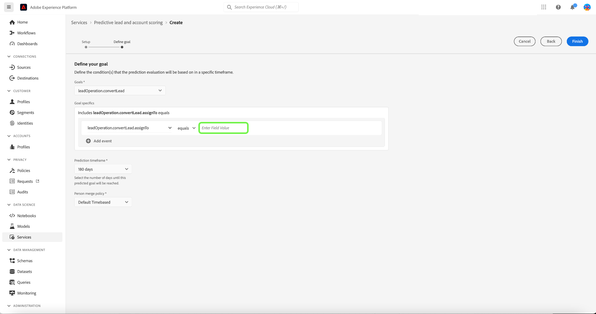
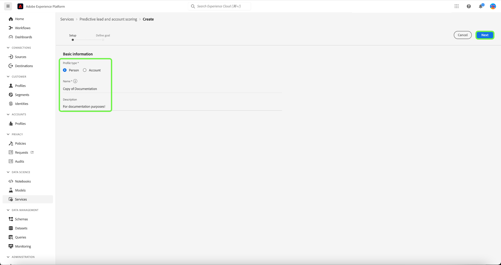
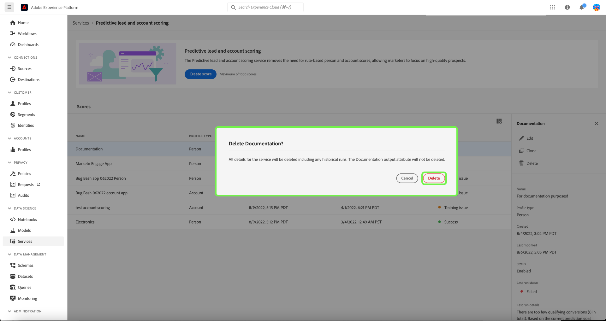

# 在Adobe Real-time Customer Data Platform B2B版本中管理預測性銷售線索和帳戶評分

>[!NOTE]
>
>只有具有「管理B2B AI」許可權的使用者才能建立、變更和刪除分數目標。

本教學課程將逐步帶您瞭解管理預測性銷售線索和帳戶評分服務之評分目標的步驟。 分數目標可用於個人設定檔或帳戶設定檔

## 建立新分數

若要建立新分數，請選取 **[!UICONTROL 服務]** 在側邊欄中並選取 **[!UICONTROL 建立分數]**.

此 **[!UICONTROL 基本資訊]** 畫面會出現，提示您選取設定檔型別、輸入名稱以及可選的說明。 完成後，選取 **[!UICONTROL 下一個]**.

此 **[!UICONTROL 定義您的目標]** 畫面隨即顯示。 選取下拉箭頭，然後從出現的下拉式視窗中選取目標型別。

此 **[!UICONTROL 目標細節]** 對話方塊開啟。 選取下拉箭頭，然後從出現的下拉式視窗中選取目標欄位名稱。

此 **[!UICONTROL 目標條件]** 選取範圍隨即顯示。 選取下拉箭頭，然後從出現的下拉式視窗中選取條件。

此 **[!UICONTROL 目標值]** 欄位隨即顯示。 接下來，設定您的 [!UICONTROL 目標細節]. 選取 [!UICONTROL 輸入欄位值] 面板，然後輸入目標值。

>[!NOTE]
>
>可以新增多個目標值。

若要新增其他欄位，請選取 **[!UICONTROL 新增欄位]**.

若要設定預測時間範圍，請選取下拉箭頭，然後選取您選擇的時間範圍。

選取的合併原則會決定如何選取人員設定檔的欄位值。 使用下拉式箭頭選取您選擇的合併原則，然後選取 **[!UICONTROL 完成]**.

此 **[!UICONTROL 評分設定完成]** 會出現對話方塊，確認已建立新分數。 選取 **[!UICONTROL 確定]**.

>[!NOTE]
>
>完成每個評分程式最多可能需要24小時的時間。

您將返回 **[!UICONTROL 服務]** 索引標籤，您可在其中檢視在分數清單中建立的新分數。

選取分數以檢視詳細資料與上次執行詳細資料的其他資訊。

如需有關可在上次執行詳細資料下看到的錯誤碼的詳細資訊，請參閱以下章節： [潛在客戶AI管道錯誤代碼](#leads-ai-pipeline-error-codes) （在此檔案中）。

## 編輯分數

若要編輯分數，請從 **[!UICONTROL 服務]** 標籤並選取 **[!UICONTROL 編輯]** 從畫面右側的其他詳細資訊面板。

此 **[!UICONTROL 編輯例項]** 對話方塊隨即顯示，您可以在其中編輯評分的說明。 進行變更並選取 **[!UICONTROL 儲存]**.

>[!NOTE]
>
>無法變更分數設定，因為這會觸發模型重新訓練與重新評分。 這等同於刪除分數並建立新分數。 若要編輯此分數的設定，您必須複製此分數或建立新分數。

您將返回 **[!UICONTROL 服務]** 標籤。 選取分數可在畫面右側的其他詳細資訊面板中檢視更新的說明詳細資訊。

## 原地複製分數

若要複製分數，請從 **[!UICONTROL 服務]** 標籤並選取 **[!UICONTROL 原地複製]** 從畫面右側的其他詳細資訊面板。

此 **[!UICONTROL 基本資訊]** 畫面隨即顯示。 設定檔型別、名稱和說明是從原始分數複製而來。 修改這些詳細資料並選取 **[!UICONTROL 下一個]**.

此 **[!UICONTROL 定義您的目標]** 畫面隨即顯示。 完成目標區段，就像建立新分數時一樣，然後選取 **[!UICONTROL 完成]**.

您將返回 **[!UICONTROL 服務]** 索引標籤，您可在其中檢視清單中新複製的分數。

>[!NOTE]
>
>此 **[!UICONTROL 定義您的目標]** 區段並非從原始分數複製。

## 刪除分數

若要刪除分數，請從 **[!UICONTROL 服務]** 標籤並選取 **[!UICONTROL 刪除]** 從畫面右側的其他詳細資訊面板。

此 **[!UICONTROL 刪除檔案]** 確認對話方塊隨即顯示。 選取「**[!UICONTROL 刪除]**」。

>[!NOTE]
>
>刪除分數定義也會刪除個人設定檔或帳戶設定檔上的所有預測分數，但不會刪除為分數定義建立的欄位群組。 欄位群組在資料模型中將會保持「孤立」。

您將返回 **[!UICONTROL 服務]** 索引標籤中無法再看到清單中的分數。

## 潛在客戶AI管道錯誤代碼

| 錯誤代碼 | 錯誤訊息 |
| --- | --- |
| 401 | 錯誤401。 潛在客戶AI管道已停止：帳戶評分的有效帳戶不足。 帳戶計數： {}. |
| 402 | 錯誤402。 潛在客戶AI管道已停止：沒有足夠的有效聯絡人進行聯絡人評分。 連絡人計數： {}. |
| 403 | 錯誤403。 潛在客戶AI管道已停止：活動量不足以進行模型訓練。 事件計數： {}. |
| 404 | 錯誤404。 潛在客戶AI管道已停止：轉換不足以進行模型訓練。 轉換次數： {}. |
| 405 | 錯誤405。 潛在客戶AI管道已停止：活動太稀疏，無法進行有效的模型訓練。 僅限 {} 有活動的帳戶百分比。 |
| 406 | 錯誤406。 潛在客戶AI管道已停止：活動太稀疏，無法進行有效的模型訓練。 僅限 {} 有活動的連絡人百分比。 |
| 407 | 錯誤407。 銷售機會AI管道已停止：評分資料活動型別與訓練資料不符。 |
| 408 | 錯誤408。 潛在客戶AI管道已停止：活動功能的遺漏率太高。 遺失率： {}. |
| 409 | 錯誤409。 潛在客戶AI管道已停止：測試auc太低。 測試auc： {}. |
| 410 | 錯誤410。 潛在客戶AI管道已停止：引數調整後測試auc太低。 測試auc： {}. |
| 411 | 錯誤411。 潛在客戶AI管道已停止：訓練資料沒有足夠的轉換來產生可靠的模型。 轉換: {}. |
| 412 | 錯誤412。 潛在客戶AI管道已停止：測試資料沒有任何轉換可計算AUC-ROC。 |

| 警告/資訊代碼 | 訊息 |
| --- | --- |
| 100 | 資訊100。 銷售機會AI品質檢查：帳戶計數為： {}. |
| 101 | 資訊101。 銷售機會AI品質檢查：連絡人計數為： {}. |
| 102 | 資訊102。 銷售機會AI品質檢查：商機計數為： {}. |
| 103 | 資訊103。 潛在客戶AI品質檢查：測試auc為低。 開始引數調整。 測試auc： {}. |
| 200 | 警告200。 銷售機會AI品質檢查：第一代功能的遺漏率為： {}. |
| 201 | 警告201。 銷售機會AI品質檢查：活動功能的遺漏率為： {}. |

## 後續步驟

依照此教學課程，您現在可以成功建立和管理分數。 如需更多詳細資訊，請參閱下列檔案：

* [預測性銷售機會和帳戶評分](/help/rtcdp/b2b-ai-ml-services/predictive-lead-and-account-scoring.md)
* [監視預測性銷售線索和帳戶評分工作](/help/dataflows/ui/b2b/monitor-profile-enrichment.md)
