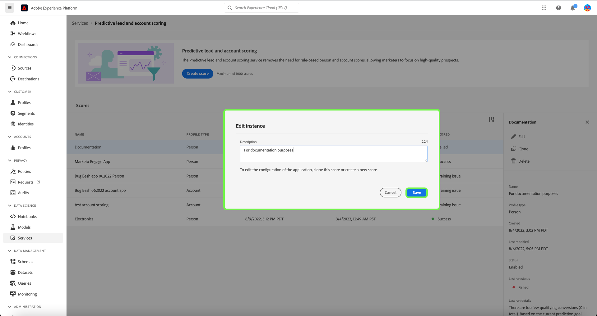

# 在Adobe Real-time Customer Data Platform B2B版中管理預測性銷售機會和帳戶分數

>[!NOTE]
>
>只有具有管理B2B AI權限的使用者才能建立、變更和刪除分數目標。

本教學課程會逐步帶您了解如何管理預測性銷售機會和帳戶分數服務的分數目標。 分數目標可為人員設定檔或帳戶設定檔

## 建立新分數

若要建立新分數，請選取 **[!UICONTROL 服務]** 在側欄中，並選取 **[!UICONTROL 建立分數]**.

此 **[!UICONTROL 基本資訊]** 畫面隨即顯示，提示您選取設定檔類型、輸入名稱和可選說明。 完成後，請選取 **[!UICONTROL 下一個]**.

此 **[!UICONTROL 定義目標]** 畫面。 選取下拉式箭頭，然後從顯示的下拉式視窗中選取目標類型。

此 **[!UICONTROL 目標細節]** 對話框開啟。 選取下拉式箭頭，然後從顯示的下拉式視窗中選取目標欄位名稱。

此 **[!UICONTROL 目標條件]** 選項。 選取下拉式箭頭，然後從顯示的下拉式視窗中選取條件。

此 **[!UICONTROL 目標值]** 欄位。 接下來，配置 [!UICONTROL 目標細節]. 選取 [!UICONTROL 輸入欄位值] 並輸入目標值。

>[!NOTE]
>
>可以新增多個目標值。

若要新增其他欄位，請選取 **[!UICONTROL 新增欄位]**.

若要設定預測時間範圍，請選取下拉式箭頭，然後選取您選擇的時間範圍。

選定的合併策略確定如何選擇人員配置檔案的欄位值。 使用下拉箭頭選擇您選擇的合併策略，然後選擇 **[!UICONTROL 完成]**.

此 **[!UICONTROL 計分設定已完成]** 對話方塊隨即顯示，確認已建立新分數。 選擇 **[!UICONTROL 確定]**.

>[!NOTE]
>
>完成每個計分程式最多需要24小時。

您會回到 **[!UICONTROL 服務]** 標籤中，您可以在此查看分數清單中建立的新分數。

選取分數以檢視詳細資料和上次執行詳細資料的其他資訊。

如需可在上次執行詳細資料下查看之錯誤代碼的詳細資訊，請參閱 [AI管線錯誤代碼](#leads-ai-pipeline-error-codes) 在此文檔中。

## 編輯分數

若要編輯分數，請從 **[!UICONTROL 服務]** 索引標籤和選取 **[!UICONTROL 編輯]** 從畫面右側的「其他詳細資訊」面板。

此 **[!UICONTROL 編輯執行個體]** 對話方塊中顯示，您可在其中編輯分數的說明。 進行變更並選取 **[!UICONTROL 儲存]**.

>[!NOTE]
>
>無法變更分數設定，因為這會觸發模型再訓練和重新計分。 這等同於刪除分數並建立新分數。 若要編輯分數的設定，您必須複製此分數或建立新分數。

您會回到 **[!UICONTROL 服務]** 標籤。 選取分數，即可在畫面右側的其他詳細資料面板中檢視更新的說明詳細資料。

## 複製分數

若要複製分數，請從 **[!UICONTROL 服務]** 索引標籤和選取 **[!UICONTROL 原地複製]** 從畫面右側的「其他詳細資訊」面板。

此 **[!UICONTROL 基本資訊]** 畫面。 描述檔類型、名稱和說明會從原始分數複製。 修改這些詳細資訊並選擇 **[!UICONTROL 下一個]**.

此 **[!UICONTROL 定義目標]** 畫面。 按照建立新分數並選取時的方式，完成目標區段 **[!UICONTROL 完成]**.

您會回到 **[!UICONTROL 服務]** 索引標籤，您可以在清單中查看新複製的分數。

>[!NOTE]
>
>此 **[!UICONTROL 定義目標]** 不會從原始分數複製區段。

## 刪除分數

若要刪除分數，請從 **[!UICONTROL 服務]** 索引標籤和選取 **[!UICONTROL 刪除]** 從畫面右側的「其他詳細資訊」面板。

此 **[!UICONTROL 刪除檔案]** 確認對話框出現。 選取「**[!UICONTROL 刪除]**」。

>[!NOTE]
>
>刪除分數定義也會刪除人員設定檔或帳戶設定檔上的所有預計分數，但不會刪除為分數定義建立的欄位群組。 欄位群組在資料模型中將保留為「孤立」。

您會回到 **[!UICONTROL 服務]** 標籤，您將無法再在清單中查看分數。

## Leads AI管線錯誤代碼

| 錯誤代碼 | 錯誤訊息 |
| --- | --- |
| 401 | 錯誤401。 導致AI管道停止：帳戶分數的有效帳戶不足。 帳戶計數：{}。 |
| 402 | 錯誤402。 導致AI管道停止：沒有足夠的有效聯繫人進行聯繫計分。 聯繫人數：{}。 |
| 403 | 錯誤403。 導致AI管道停止：沒有足夠的活動量用於模型培訓。 事件計數：{}。 |
| 404 | 錯誤404。 導致AI管道停止：模型培訓的轉換不足。 轉換計數：{}。 |
| 405 | 錯誤405。 導致AI管道停止：活動太稀疏，無法進行有效的模型訓練。 只有{}%的帳戶具有活動。 |
| 406 | 錯誤406。 導致AI管道停止：活動太稀疏，無法進行有效的模型訓練。 只有{}%的聯繫人有活動。 |
| 407 | 錯誤407。 導致AI管道停止：計分資料活動類型與訓練資料不匹配。 |
| 408 | 錯誤408。 導致AI管道停止：活動功能的遺失率太高。 缺少率：{}。 |
| 409 | 錯誤409。 導致AI管道停止：測試auc太低。 測試對象：{}。 |
| 410 | 錯誤410。 導致AI管道停止：參數調整後，測試auc太低。 測試對象：{}。 |
| 411 | 錯誤411。 導致AI管道停止：訓練資料沒有足夠的轉換來產生可靠的模型。 轉換: {}. |
| 412 | 錯誤412。 導致AI管道停止：測試資料沒有任何轉換可計算AUC-ROC。 |

| 警告/資訊代碼 | 訊息 |
| --- | --- |
| 100 | 資訊100。 銷售機會AI質量檢查：帳戶數為：{}。 |
| 101 | 資訊101。 銷售機會AI質量檢查：聯繫人的計數為：{}。 |
| 102 | 資訊102。 銷售機會AI質量檢查：機會數量是：{}。 |
| 103 | 資訊103。 銷售機會AI質量檢查：測試auc較低。 開始參數調整。 測試對象：{}。 |
| 200 | 警告200。 銷售機會AI質量檢查：第一圖特徵的缺失率為：{}。 |
| 201 | 警告201。 銷售機會AI質量檢查：活動功能的遺失率為：{}。 |

## 後續步驟

依照本教學課程，您現在可以成功建立和管理分數。 如需詳細資訊，請參閱下列檔案：

* [預測性銷售機會和帳戶計分](/help/rtcdp/b2b-ai-ml-services/predictive-lead-and-account-scoring.md)
* [監控預測性銷售機會和帳戶計分作業](/help/dataflows/ui/b2b/monitor-profile-enrichment.md)
