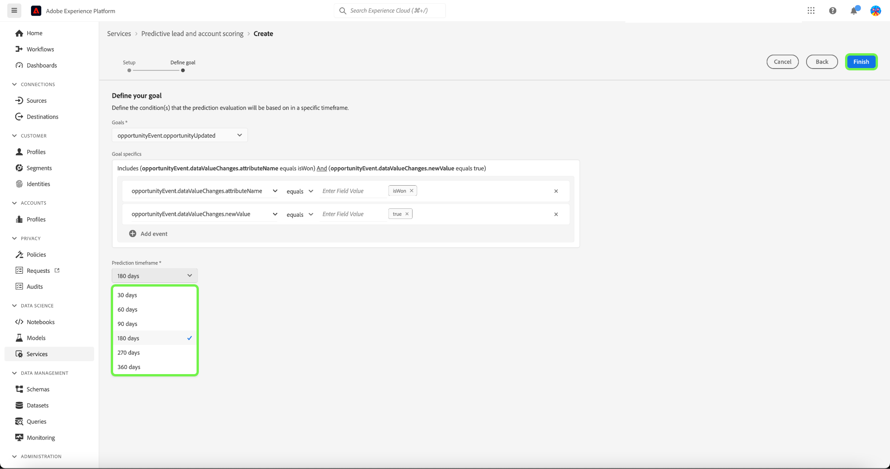

# 在Adobe Real-time Customer Data PlatformB2B版中管理預測性線索和帳戶評分

>[!NOTE]
>
>只有具有「管理B2B AI」權限的用戶才能建立、更改和刪除分數目標。

本教程將指導您完成管理預測銷售線索和帳戶評分服務的得分目標的步驟。 得分目標可以是個人配置檔案或帳戶配置檔案

## 建立新分數

要建立新分數，請選擇 **[!UICONTROL 服務]** 在邊欄中，然後選擇 **[!UICONTROL 建立分數]**。

的 **[!UICONTROL 基本資訊]** 螢幕，提示您選擇配置檔案類型、輸入名稱和可選說明。 完成後，選擇 **[!UICONTROL 下一個]**。

的 **[!UICONTROL 定義目標]** 的上界。 選擇下拉箭頭，然後從顯示的下拉窗口中選擇目標類型。

的 **[!UICONTROL 目標細節]** 對話框。 選擇下拉箭頭，然後從顯示的下拉窗口中選擇目標欄位名稱。

的 **[!UICONTROL 目標條件]** 的上界。 選擇下拉箭頭，然後從顯示的下拉窗口中選擇條件。

的 **[!UICONTROL 目標值]** 的子菜單。 接下來，配置 [!UICONTROL 目標細節]。 選擇 [!UICONTROL 輸入欄位值] 並輸入目標值。

>[!NOTE]
>
>可以添加多個目標值。

要添加其他欄位，請選擇 **[!UICONTROL 添加欄位]**。

要配置預測時間範圍，請選擇下拉箭頭，然後選擇您選擇的時間範圍。

所選合併策略確定如何選擇人員配置檔案的欄位值。 使用下拉箭頭選擇選擇的合併策略，然後選擇 **[!UICONTROL 完成]**。

的 **[!UICONTROL 計分設定已完成]** 對話框，確認已建立新分數。 選擇 **[!UICONTROL 確定]**。

>[!NOTE]
>
>完成每個評分過程可能需要24小時。

您返回 **[!UICONTROL 服務]** 頁籤中，您可以查看在分數清單中建立的新分數。

選擇分數以查看詳細資訊和有關上次運行詳細資訊的附加資訊。

有關在上次運行詳細資訊下可看到的錯誤代碼的詳細資訊，請參閱上 [引線AI管道錯誤代碼](#leads-ai-pipeline-error-codes) 的子菜單。

## 編輯分數

要編輯分數，請從 **[!UICONTROL 服務]** 頁籤 **[!UICONTROL 編輯]** 從螢幕右側的附加詳細資訊面板。

的 **[!UICONTROL 編輯實例]** 對話框，您可以在其中編輯分數的說明。 進行更改並選擇 **[!UICONTROL 保存]**。

>[!NOTE]
>
>無法更改分數配置，因為這將觸發模型再培訓和重新計分。 它相當於刪除分數並建立新分數。 要編輯分數的配置，您需要克隆此分數或建立新分數。

您返回 **[!UICONTROL 服務]** 頁籤。 選擇分數，在螢幕右側的附加詳細資訊面板中查看更新的說明詳細資訊。

## 克隆分數

要克隆分數，請從 **[!UICONTROL 服務]** 頁籤 **[!UICONTROL 克隆]** 從螢幕右側的附加詳細資訊面板。

的 **[!UICONTROL 基本資訊]** 的上界。 配置檔案類型、名稱和說明是從原始分數中克隆的。 修改這些詳細資訊並選擇 **[!UICONTROL 下一個]**。

的 **[!UICONTROL 定義目標]** 的上界。 按建立新分數並選擇時的方式完成目標部分 **[!UICONTROL 完成]**。

您返回 **[!UICONTROL 服務]** 頁籤，您可以在清單中查看新克隆的分數。

>[!NOTE]
>
>的 **[!UICONTROL 定義目標]** 未從原始分數中克隆截面。

## 刪除分數

要刪除分數，請從 **[!UICONTROL 服務]** 頁籤 **[!UICONTROL 刪除]** 從螢幕右側的附加詳細資訊面板。

的 **[!UICONTROL 刪除文檔]** 確認對話框。 選取「**[!UICONTROL 刪除]**」。

>[!NOTE]
>
>刪除分數定義還會刪除人員配置檔案或帳戶配置檔案上的所有預測分數，但不會刪除為分數定義建立的欄位組。 該欄位組將在資料模型中被「孤立」。

您返回 **[!UICONTROL 服務]** 頁籤，此時您將無法再在清單中查看分數。

## 導線AI管道錯誤代碼

| 錯誤代碼 | 錯誤訊息 |
| --- | --- |
| 401 | 錯誤401。 Leads AI管道已停止：帳戶計分的有效帳戶不足。 帳戶計數：{}。 |
| 402 | 錯誤402。 Leads AI管道已停止：聯繫人記分的有效聯繫人不足。 聯繫人數：{}。 |
| 403 | 錯誤403。 Leads AI管道已停止：活動量不足，無法進行模型培訓。 事件計數：{}。 |
| 404 | 錯誤404。 Leads AI管道已停止：模型培訓轉換不夠。 轉換計數：{}。 |
| 405 | 錯誤405。 Leads AI管道已停止：活動太稀疏，無法進行有效的模型培訓。 只有{}%的帳戶具有活動。 |
| 406 | 錯誤406。 Leads AI管道已停止：活動太稀疏，無法進行有效的模型培訓。 只有{}%的聯繫人具有活動。 |
| 407 | 錯誤407。 Leads AI管道已停止：評分資料活動類型與培訓資料不匹配。 |
| 408 | 錯誤408。 Leads AI管道已停止：對於活動功能，丟失率過高。 缺少率：{}。 |
| 409 | 錯誤409。 Leads AI管道已停止：testAUC太低。 TestAUC:{}。 |
| 410 | 錯誤410。 Leads AI管道已停止：testAUC在參數調整後太低。 TestAUC:{}。 |
| 411 | 錯誤411。 Leads AI管道已停止：訓練資料沒有足夠的轉換來生成可靠的模型。 轉換: {}. |
| 412 | 錯誤412。 Leads AI管道已停止：test資料沒有任何轉換來計算AUC-ROC。 |

| 警告/資訊代碼 | 訊息 |
| --- | --- |
| 100 | 資訊100。 線索AI質量檢查：帳戶數為：{}。 |
| 101 | 資訊101。 線索AI質量檢查：聯繫人數為：{}。 |
| 102 | 資訊102。 線索AI質量檢查：機會的數量是：{}。 |
| 103 | 資訊103。 線索AI質量檢查：測試auc低。 啟動參數優化。 測試審核：{}。 |
| 200 | 警告200。 線索AI質量檢查：第一特徵缺失率為：{}。 |
| 201 | 警告201。 線索AI質量檢查：活動功能的缺失率為：{}。 |

## 後續步驟

按照本教程，您現在可以成功建立和管理分數。 有關詳細資訊，請參閱以下文檔：

* [預測線索和帳戶記分](/help/rtcdp/b2b-ai-ml-services/predictive-lead-and-account-scoring.md)
* [監視預測性線索和帳戶記分作業](/help/dataflows/ui/b2b/monitor-profile-enrichment.md)
