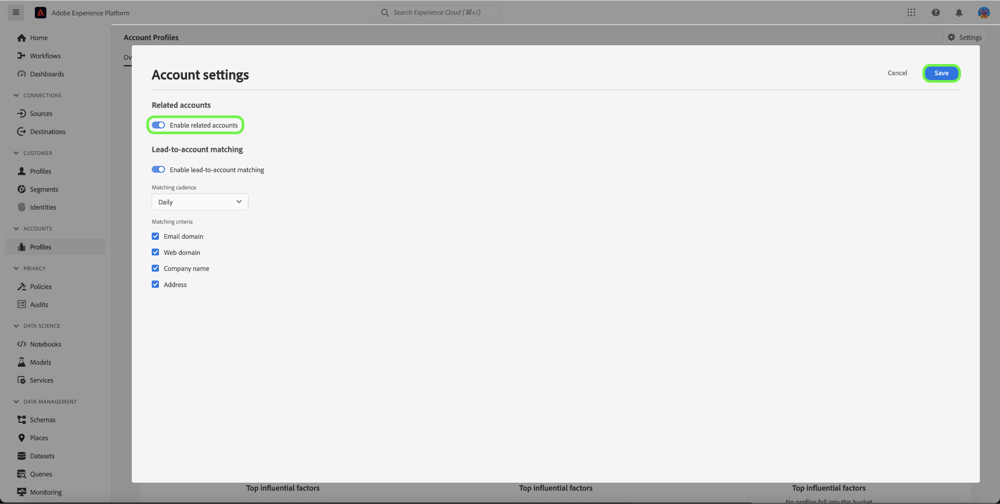

# Real-Time CDP B2B版中的相關帳戶

## 總覽 {#overview}

B2B企業通常將客戶資訊儲存在多個系統中，每個系統都只包含同一實際業務實體的部分或甚至衝突資料。 這對於準確了解客戶構成了巨大挑戰，因此降低了B2B行銷和銷售工作的效率和效益。

| ID | 名稱 | 網站 | 產業 | 狀態 | 電話 | 具有金額>的未結業務機會 `$1 million` |
|---|---|---|---|---|---|---|
| 1 | Acme | acme.com | 軟體 | CA | (408)536-6000 |  |
| 2 | Acme | acm.com | 軟體 | CA | 4085366000 | x |
| 3 | Acme Inc |  |  | CA | (408)5366000 |  |
| 4 | Acme諮詢服務 | `http://www.acme.com/consulting` | 技術咨詢 | 紐約 | (212)471-0904 | x |
| 5 | Acme IT |  |  | CA |  |  |

{style=&quot;table-layout:auto&quot;}

有了相關賬戶， [!DNL Real-Time CDP B2B] 現在會顯示與您瀏覽之帳戶類似的帳戶清單。

使用此功能，在Experience PlatformUI中檢視帳戶設定檔的相關帳戶設定檔，然後在區段定義中納入相關帳戶，以擴大觸及範圍或在區段中套用更寬的條件。

## 啟用相關帳戶服務 {#enable}

若要啟用服務，請選取 **[!UICONTROL 設定檔]** 在側欄中，後跟 **[!UICONTROL 設定]**.

選取旁邊的切換 [!UICONTROL 啟用相關帳戶] 啟用服務，然後選擇 **[!UICONTROL 儲存]**.

## 運作方式 {#how-it-works}

日常運行的機器學習作業使用分層算法來根據三個因素將類似的帳戶配置檔案分組：

* 父帳戶連結
* 網域
* 帳戶名稱

成功處理作業後，帳戶設定檔群組的每個成員都會以「相關帳戶」清單標籤。 您可以在 **相關帳戶** 頁簽，並在區段定義中使用相關帳戶。

如需 [配置檔案擴充相關帳戶作業](/help/dataflows/ui/b2b/monitor-profile-enrichment.md).

## 如何檢視相關帳戶 {#how-to-view}

您可以在Experience PlatformUI中檢視您正在瀏覽之帳戶的相關帳戶。

如需 [如何在UI中尋找相關帳戶](/help/rtcdp/accounts/account-profile-ui-guide.md#related-accounts-tab).

## 如何使用相關帳戶 {#how-to-use}

您可以在細分中使用帳戶和相關帳戶。 是否在區段定義中使用相關帳戶的決定取決於您的行銷使用案例。 例如，您可以將相關帳戶用於電子郵件行銷或廣告促銷活動，以接受較低的準確度換取更廣的觸及。

請參閱 [細分範例](/help/rtcdp/segmentation/b2b.md#related-accounts) 使用相關帳戶。
