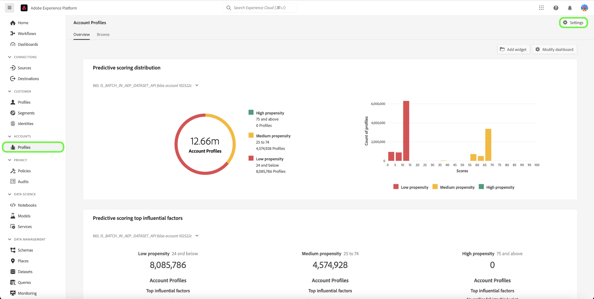

# Real-Time CDPB2B版相關帳戶

## 總覽 {#overview}

B2B企業通常將客戶資訊儲存在多個系統中，每個系統都只包含同一真實業務實體的部分甚至衝突資料。 這就帶來了一個巨大的挑戰，即要準確地瞭解客戶的情況，從而降低其B2B營銷和銷售工作的效率和效率。

| ID | 名稱 | 網站 | 產業 | 狀態 | 電話 | 具有金額>的未結機會 `$1 million` |
|---|---|---|---|---|---|---|
| 1 | 埃克 | acme.com | 軟體 | CA | (408)536-6000 |  |
| 2 | 埃克 | acm.com | 軟體 | CA | 4085366000 | x |
| 3 | 阿克姆公司 |  |  | CA | (408)5366000 |  |
| 4 | Acme咨詢服務 | `http://www.acme.com/consulting` | 技術咨詢 | 尼 | (212)471-0904 | x |
| 5 | ACME IT |  |  | CA |  |  |

{style="table-layout:auto"}

有了相關帳戶， [!DNL Real-Time CDP B2B] 現在顯示與您正在瀏覽的帳戶類似的帳戶清單。

使用此功能可以在Experience PlatformUI中查看帳戶配置檔案的相關帳戶配置檔案，然後將相關帳戶包括在段定義中，以擴大範圍或在段中應用更寬的標準。

## 啟用相關帳戶服務 {#enable}

要啟用服務，請選擇 **[!UICONTROL 配置檔案]** 在邊欄中，後跟 **[!UICONTROL 設定]**。

選擇旁邊的切換 [!UICONTROL 啟用相關帳戶] 啟用服務，然後選擇 **[!UICONTROL 保存]**。

## 運作方式 {#how-it-works}

日常運行的機器學習作業使用分層算法將相似帳戶配置檔案根據三個因素分組：

* 父帳戶連結
* Web域
* 帳戶名

成功處理作業後，帳戶配置檔案組的每個成員都將用「相關帳戶」清單進行標籤。 您可以在 **相關帳戶** 的子菜單。

有關 [配置檔案富集相關帳戶作業](/help/dataflows/ui/b2b/monitor-profile-enrichment.md)。

## 如何查看相關帳戶 {#how-to-view}

您可以在Experience PlatformUI中查看正在瀏覽的帳戶的相關帳戶。

有關 [如何在UI中查找相關帳戶](/help/rtcdp/accounts/account-profile-ui-guide.md#related-accounts-tab)。

## 如何使用相關帳戶 {#how-to-use}

您可以在細分時使用帳戶和相關帳戶。 是否在段定義中使用相關帳戶的決定取決於您的市場營銷使用案例。 例如，您可以將相關帳戶用於電子郵件營銷或廣告活動，在這些活動中，您可能會接受較低的準確性，以換取更廣的覆蓋面。

查看 [分段示例](/help/rtcdp/segmentation/b2b.md#related-accounts) 使用相關帳戶。
