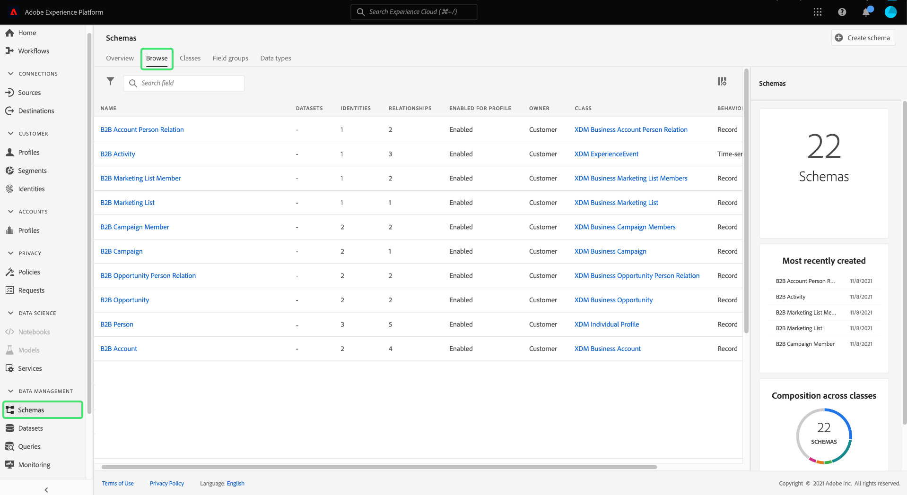

# Real-time Customer Data Platform B2B版本快速入門

本檔案提供開始使用Real-time Customer Data Platform (CDP) B2B Edition的高階端對端工作流程，使用範例使用案例來說明重要概念。

技術公司Bodea想要結合來自不同獨立資料來源的個人和帳戶資料，以便透過電子郵件及其新產品的LinkedIn廣告行銷活動來有效鎖定客戶。 Bodea使用Marketo Engage作為其行銷自動化平台，並需要從包含客戶資料的多個CRM中區隔B2B特定對象。

## 快速入門

此教學課程工作流程仰賴數個Adobe Experience Platform服務做為示範的一部分。 如果您希望跟進，建議您充分瞭解以下服務：

- [體驗資料模組(XDM)](../xdm/home.md)
- [來源](../sources/home.md)
- [區段](../segmentation/home.md)
- [目的地](../destinations/home.md)

## 為您的資料建立結構描述

在初始設定過程中，Bodea的IT部門需要建立XDM結構描述，以確保在將資料匯入Platform時符合標準格式，並且可在不同的Platform服務和Adobe Experience Cloud產品(例如Adobe Analytics和Adobe Target)中操作。

>[!WARNING]
>
>您必須依照本教學課程中連結的相關來原始檔所述來擷取模式。 其他欄位對應方法無法保證有效。

Adobe Experience Platform可讓您自動產生B2B資料來源所需的結構描述和名稱空間。 此工具可確保建立的結構描述能以結構化的可重複使用方式描述資料。 請遵循 [B2B名稱空間和結構描述自動產生公用程式檔案](../sources/connectors/adobe-applications/marketo/marketo-namespaces.md) 以取得設定程式的完整參考。

在Adobe Experience Platform UI中，Bodea行銷人員選取 **[!UICONTROL 方案]** 在左側邊欄中，後面接著 **[!UICONTROL 瀏覽]** 標籤。 由於它們使用Marketo Engage自動產生公用程式，新的空白結構描述會出現在清單中，而且全都有前置詞「B2B」。

自動產生公用程式使用標準XDM B2B類別(例如 [XDM商業帳戶](../xdm/classes/b2b/business-account.md) 和 [XDM商業機會](../xdm/classes/b2b/business-opportunity.md))擷取基本B2B資料實體。 此外，在這些類別上建置的自動產生B2B結構描述具有預先建立的關係，可支援進階細分使用案例。 您可以透過UI在此輕鬆建立資料結構所需的任何其他欄位群組。 請參閱 [XDM UI指南，將欄位群組新增到結構描述區段](../xdm/ui/resources/schemas.md#add-field-groups) 以取得詳細資訊。

>[!NOTE]
> 
>如果您未使用自動產生器公用程式，或需要建立新的關係，請參閱下列教學課程： [在B2B結構描述之間建立關係](../xdm/tutorials/relationship-b2b.md).

即時客戶設定檔會合併來自不同來源的資料，以建立關鍵B2B實體的整合設定檔。 由於設定檔是根據單一類別產生的，因此自動產生公用程式會根據常見的業務使用案例來設定方案之間的關係。 因此，Bodea團隊現在已準備好根據其B2B結構描述擷取資料。

>[!NOTE]
> 
>透過自動產生公用程式為結構建立的預設身分名稱空間、主要金鑰和關係，可在結構工作區中輕鬆找到。
>
>

## 將您的資料內嵌至Experience Platform

接下來，Bodea行銷人員使用 [Marketo Engage聯結器](../sources/connectors/adobe-applications/marketo/marketo.md) 將資料內嵌至Platform以用於下游服務。 您也可以使用Real-Time CDP B2B Edition的其中一個已核准來源來內嵌資料。

>[!NOTE]
> 
>若要瞭解貴組織可使用哪些來源聯結器，您可以在Platform UI中檢視來源目錄。 若要存取目錄，請選取 **來源** 在左側導覽中，然後選取 **目錄**.

為了在Marketo帳戶和平台之間建立連線，您必須取得驗證認證。 請參閱 [取得Marketo來源聯結器驗證憑證的指南](../sources/connectors/adobe-applications/marketo/marketo-auth.md) 以取得詳細指示。

取得驗證認證後，Bodea行銷人員會建立Marketo帳戶與其Platform組織之間的連線。 如需相關指示，請參閱檔案 [如何使用Platform UI連線Marketo帳戶](../sources/tutorials/ui/create/adobe-applications/marketo.md).

Marketo Engage來源聯結器提供自動對應功能，可讓您更輕鬆地將所有資料欄位對應到新建立的結構描述欄位。

>[!NOTE]
> 
>如果您已在XDM結構描述中建立自訂欄位群組，在流程的這個階段可能會有未連線的欄位。 請務必勾選填入自訂欄位群組的所有值。

Bodea行銷人員會檢查所有欄位群組是否已適當對應，並透過初始化資料流來繼續來源設定流程。 藉由建立資料流以匯入Marketo資料，下游Platform服務即可使用傳入的資料。 在初始內嵌流程中，資料會以批次形式帶入Experience Platform。 之後，後續擷取的資料會以近乎即時更新的方式串流至設定檔中。

## 建立受眾以評估您的資料

下一個任務是根據來源資料中相關實體的特定屬性，為Bodea的新電子郵件行銷活動建立對象。 在Platform UI中，Bodea行銷人員會先選取 **[!UICONTROL 區段]** 在左側導覽中，然後 **[!UICONTROL 建立區段]**.

在此範例中，受眾會尋找所有在銷售部門工作的人員，以及和至少有一個未完成銷售機會的任何帳戶相關的人員。 此對象需要XDM個人資料類別、XDM商業帳戶類別和XDM商業機會類別之間的連結。

>[!NOTE]
> 
>如需如何建立對象以評估資料的指示，請參閱 [區段產生器UI指南](../segmentation/ui/segment-builder.md). 如需更具體的B2B分段使用案例，請參閱 [Real-Time CDP B2B Edition的區段概觀](./segmentation/b2b.md).

區段產生器可讓您從即時客戶個人檔案資料建立可行銷的受眾，並依據您定義的屬性、事件和現有受眾組合，檢視潛在受眾的估計值。

## 將評估過的資料啟用到目的地

成功建立受眾後，中會提供摘要 [!UICONTROL 詳細資料] 區段。 由於目前沒有針對區段定義啟用的目的地，因此Bodea行銷人員需要將受眾匯出至資料集，以便對其進行存取和操作。

在 [!UICONTROL 區段] Platform UI的工作區中，Bodea行銷人員選取 **[!UICONTROL 啟用到目的地]**.

>[!NOTE]
> 
>請參閱上的教學課程 [將對象啟用至目的地](https://experienceleague.adobe.com/docs/marketo/using/product-docs/core-marketo-concepts/smart-lists-and-static-lists/static-lists/push-an-adobe-experience-cloud-segment-to-a-marketo-static-list.html) 以瞭解如何完成此任務的完整步驟。

Bodea行銷人員會將對象啟用至Marketo目的地，這可讓他們以靜態清單的形式，將對象資料從Platform推送至Marketo Engage。 請參閱 [Marketo目的地](https://experienceleague.adobe.com/docs/experience-platform/destinations/catalog/adobe/marketo-engage.html) 以取得詳細資訊。

## 後續步驟

依照本教學課程指示，您已成功運用Real-Time CDP B2B Edition所使用的各種Adobe Experience Platform服務。 因此，您已瞭解如何內嵌、區隔、評估及匯出B2B資料，作為可跨不同管道參與的可操作對象。
