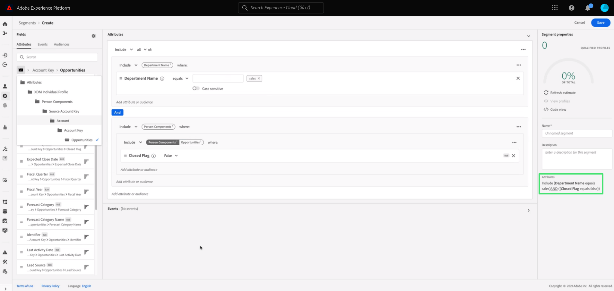

# Real-time Customer Data Platform B2B版快速入門

本檔案提供高階的端對端工作流程，以開始使用Real-time Customer Data Platform(CDP)B2B Edition，透過範例使用案例來說明重要概念。

科技公司Bodea希望結合來自不同孤立資料來源的人員和帳戶資料，以便透過電子郵件和LinkedIn新產品廣告促銷活動，有效鎖定客戶。 Bodea使用Marketo Engage作為其行銷自動化平台，且需要從包含客戶資料的多個CRM中劃分B2B特定對象。

## 快速入門

本教學課程工作流程依賴數個Adobe Experience Platform服務，做為示範的一部分。 若您想繼續使用，建議您妥善了解下列服務：

- [體驗資料強制回應(XDM)](../xdm/home.md)
- [來源](../sources/home.md)
- [區段](../segmentation/home.md)
- [目的地](../destinations/home.md)

## 建立資料的結構

作為初始設定的一部分，Bodea的IT部門需建立XDM結構，以確保其資料匯入Platform時遵循標準格式，並可在不同的Platform服務和Adobe Experience Cloud產品(例如Adobe Analytics和Adobe Target)中操作。

>[!WARNING]
>
>您必須依照本教學課程連結的相關來源檔案所述的擷取模式。 其他欄位對應方法無法保證運作。

Adobe Experience Platform可讓您自動產生B2B資料來源所需的結構和命名空間。 此工具可確保建立的結構以可重複使用的方式描述資料。 關注 [B2B命名空間和架構自動產生公用程式檔案](../sources/connectors/adobe-applications/marketo/marketo-namespaces.md) 以完整參考設定程式。

在Adobe Experience Platform UI中，Bodea行銷人員會選取 **[!UICONTROL 結構]** 在左側邊欄中，後面 **[!UICONTROL 瀏覽]** 標籤。 由於他們使用Marketo Engage自動產生公用程式，新的空白結構會顯示在清單中，且前置詞都為&quot;B2B&quot;。

自動產生公用程式使用標準XDM B2B類別(例如 [XDM商業帳戶](../xdm/classes/b2b/business-account.md) 和 [XDM業務機會](../xdm/classes/b2b/business-opportunity.md))擷取基本B2B資料實體。 此外，這些類別上自動產生的B2B結構已預先建立關係，可支援進階細分使用案例。 您可以透過UI在此輕鬆建立資料結構所需的任何其他欄位群組。 請參閱 [XDM UI指南，將欄位群組新增至結構區段](../xdm/ui/resources/schemas.md#add-field-groups) 以取得更多資訊。

>[!NOTE]
> 
>如果您未使用自動產生器公用程式，或需要建立新關係，請參閱上的教學課程 [建立B2B架構之間的關係](../xdm/tutorials/relationship-b2b.md).

即時客戶設定檔會合併不同來源的資料，以建立關鍵B2B實體的整合設定檔。 由於設定檔是根據單一類別產生，因此自動產生公用程式會根據一般業務使用案例來設定結構之間的關係。 因此，Bodea團隊現在已準備好根據其B2B結構擷取資料。

>[!NOTE]
> 
>在架構工作區中，可輕鬆找到自動產生公用程式為架構建立的預設身分命名空間、主要索引鍵和關係。
>
>

## 將資料內嵌至Experience Platform

接下來，Bodea行銷人員會使用 [Marketo Engage連接器](../sources/connectors/adobe-applications/marketo/marketo.md) 將資料內嵌至Platform以用於下游服務。 您也可以使用Real-Time CDP B2B版的其中一個核准來源來內嵌資料。

>[!NOTE]
> 
>若要了解貴組織可使用的來源連接器，您可以在Platform UI中檢視來源目錄。 若要存取目錄，請選取 **來源** 在左側導覽器中，然後選取 **目錄**.

若要建立Marketo帳戶與Platform之間的連線，您必須取得驗證憑證。 請參閱 [取得Marketo原始碼連接器驗證認證指南](../sources/connectors/adobe-applications/marketo/marketo-auth.md) 以取得詳細指示。

取得驗證憑證後，Bodea行銷人員會建立Marketo帳戶與其Platform IMS組織之間的連線。 如需相關指示，請參閱本檔案。 [如何使用Platform UI連線Marketo帳戶](../sources/tutorials/ui/create/adobe-applications/marketo.md).

Marketo Engage來源連接器提供自動對應功能，讓將所有資料欄位對應至新建立結構的欄位的程式簡單得多。

>[!NOTE]
> 
>如果您已在XDM結構中建立自訂欄位群組，則在此程式階段中可能會有未連結的欄位。 請務必檢查填入自訂欄位群組的所有值。

Bodea行銷人員會檢查所有欄位群組是否已適當對應，並透過初始化資料流來繼續來源設定程式。 借由建立資料流以匯入Marketo資料，下游Platform服務便可使用傳入資料。 在初始擷取程式期間，資料會以批次形式匯入Experience Platform。 之後，後續擷取的資料便會以近乎即時的更新串流至設定檔中。

## 建立區段以評估您的資料

下一個任務是根據來源資料中相關實體的特定屬性，為Bodea的新電子郵件行銷活動建立對象。 在Platform UI中，Bodea行銷人員會先選取 **[!UICONTROL 區段]** 在左側導覽中，然後 **[!UICONTROL 建立區段]**.

在此示例中，該區段查找在銷售部門工作並且與具有至少一個未結業務機會的任何帳戶相關的所有人員。 此區段需要XDM個別設定檔類別、 XDM商業帳戶類別和XDM商業機會類別之間的連結。

>[!NOTE]
> 
>如需如何建立區段以評估資料的指示，請參閱 [區段產生器UI指南](../segmentation/ui/segment-builder.md). 如需更具體的B2B區段使用案例，請參閱 [Real-Time CDP B2B版的區段概觀](./segmentation/b2b.md).

區段產生器可讓您從即時客戶設定檔資料建立有價對象，並根據您定義的屬性、事件和現有對象的組合，檢視潛在對象的估計值。

## 將評估的資料激活到目標

成功建立區段後，會在 [!UICONTROL 詳細資料] 區段。 由於目前沒有為區段啟用任何目標，因此Bodea行銷人員需要將對象匯出至資料集，以便存取資料集並加以處理。

在 [!UICONTROL 區段] 平台UI的工作區，Bodea行銷人員會選取 **[!UICONTROL 啟動至目的地]**.

>[!NOTE]
> 
>請參閱 [將區段啟用至目的地](https://experienceleague.adobe.com/docs/marketo/using/product-docs/core-marketo-concepts/smart-lists-and-static-lists/static-lists/push-an-adobe-experience-cloud-segment-to-a-marketo-static-list.html) 以取得完成此作業的完整步驟。

Bodea行銷人員會啟動區段至Marketo目的地，以便以靜態清單的形式從Platform將區段資料推送至Marketo Engage。 請參閱 [Marketo目的地](https://experienceleague.adobe.com/docs/experience-platform/destinations/catalog/adobe/marketo-engage.html) 以取得更多資訊。

## 後續步驟

依照本教學課程，您已成功運用Real-Time CDP B2B Edition使用的各種Adobe Experience Platform服務。 因此，您已學會內嵌、劃分、評估和匯出B2B資料，以便成為可操作的對象，並可跨不同管道參與。
