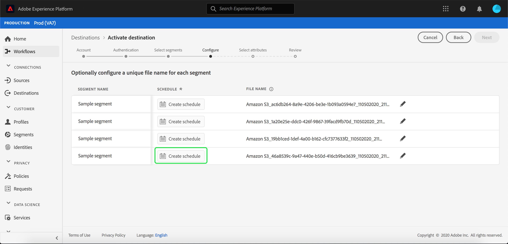
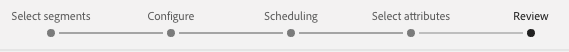

# 將描述檔和區段啟用至目標

將區段對應至目標，以啟用您在即時客戶資料平台中擁有的資料。 若要完成此作業，請遵循下列步驟。

## 先決條件 {#prerequisites}

要將資料激活到目標，必須已成功 [連接目標](/help/rtcdp/destinations/connect-destination.md)。 如果您尚未這麼做，請前往目標目錄 [](/help/rtcdp/destinations/destinations-catalog.md)，瀏覽支援的目標，並設定一或多個目標。

## 啟動資料 {#activate-data}

啟動工作流程中的步驟依目標類型略有不同。 以下列出所有目標類型的完整工作流程。

### 選擇要啟動資料的目標 {#select-destination}

適用於：所有目標

在即時CDP使用者介面中，導覽至「 **[!UICONTROL 目標]** >瀏 **[!UICONTROL 覽]**」，並選取您要啟動區段的目標。


選擇要導覽至啟動工作流程的目標名稱。


請注意，如果目的地的啟動工作流程已存在，您可以看到目前正在啟動至目的地的區段。 選取 **[!UICONTROL 右側邊欄]** 「編輯啟動」，然後依照下列步驟修改啟動詳細資訊。

選擇目標後，選擇「激 **[!UICONTROL 活」]**。

### [!UICONTROL 選取區段] 步驟 {#select-segments}

適用於：所有目標


在「啟 **[!UICONTROL 動目標]** 」工作流程的「選 **** 取區段」頁面上，選取一或多個區段以啟動至目標。 選擇 **[!UICONTROL 下一步]** ，繼續下一步。


### [!UICONTROL 身份映射] 步驟 {#identity-mapping}

適用於：社交目的地與Google客戶符合廣告目的地


對於社交目標，您可以選取來源屬性，以在目標中對應為目標身分。 此步驟為可選或必選步驟，具體取決於您在架構中使用的主要身份。

如果您在架構中使用電子郵件地址作為主要身份，則可以跳過「身份映射」步驟，如下所示：


如果您使用其他ID（例如「獎勵ID」或「忠誠度ID」）作為架構中的主要身分識別，則您必須手動將來自身分識別架構的電子郵件地址映射為社交目標中的目標身分識別，如下所示：


如果 `Email_LC_SHA256` 您根據電子郵件雜湊要求，將客戶資料擷取的電子郵件地址雜湊到Adobe Experience Platform中，請選 [!DNL Facebook][為目標身分](/help/rtcdp/destinations/facebook-destination.md#email-hashing-requirements)。

如果 `Email` 您使用的電子郵件地址未雜湊，請選取為目標身分。 即時CDP將對電子郵件地址進行雜湊處理，以符合 [!DNL Facebook] 要求。


### **[!UICONTROL 設定步驟]** {#configure}

適用於：電子郵件行銷目的地和雲端儲存空間目的地


在「設 **[!UICONTROL 定]** 」步驟中，您可以設定要匯出之每個區段的排程和檔案名稱。 配置計畫是強制的，但配置檔案名是可選的。

若要新增區段的排程，請選取「建 **[!UICONTROL 立排程」]**。



此時會出現一個快顯視窗，顯示建立區段排程的選項。

- **檔案匯出**:您可以選擇導出完整檔案或增量檔案。 匯出完整檔案會發佈符合該區段之所有描述檔的完整快照。 匯出增量檔案會發佈自上次匯出以來符合該區段資格的描述檔增量。
- **頻率**:如果 **[!UICONTROL 選取「匯出完整檔案]** 」，您可以選擇「一次」或「每日 **[!UICONTROL 」匯出]******。 如果選 **[!UICONTROL 取「匯出增量檔]** 」，則您只能選擇「每日」 **[!UICONTROL 匯出]**。 導出檔案 **[!UICONTROL 一次]** 導出檔案一次。 導出檔案 **[!UICONTROL Daily]** （每日）每天從開始日期導出檔案，如果選擇了完整檔案，則從每天12:00 AM UTC（東部時間7:00 PM）到結束日期（東部時間7:00 PM）導出檔案。
- **日期**:如果 **[!UICONTROL 選取]** 「一次」，您可以選取一次匯出的日期。 如果 **[!UICONTROL 選取]** 「每日」，您可以選取匯出的開始和結束日期。


預設檔案名稱包含目標名稱、區段ID和日期和時間指標。 例如，您可以編輯匯出的檔案名稱，以區分不同的促銷活動，或將資料匯出時間附加至檔案。

選取鉛筆圖示以開啟模式視窗並編輯檔案名稱。 請注意，檔案名稱的限制為255個字元。


在檔案名編輯器中，可以選擇要添加到檔案名中的不同元件。 無法從檔案名稱中移除目標名稱和區段ID。 除了這些外，您還可以新增下列項目：

- **[!UICONTROL 區段名稱]**:您可以將區段名稱附加至檔案名稱。
- **[!UICONTROL 日期和時間]**:選擇添加格 `MMDDYYYY_HHMMSS` 式或生成檔案時的Unix 10位時間戳。 如果您希望檔案在每次增量匯出時產生動態檔案名稱，請選擇其中一個選項。
- **[!UICONTROL 自訂文字]**:新增自訂文字至檔案名稱。

選擇 **[!UICONTROL 應用更改]** ，以確認選擇。

>[!IMPORTANT]
> 
>如果您未選擇「日期和時間 **** 」元件，則檔案名將是靜態的，而新導出的檔案將用每次導出覆蓋儲存位置中的先前檔案。 當從儲存位置將重複匯入工作執行至電子郵件行銷平台時，建議使用此選項。


完成所有區段的設定後，請選取「下 **[!UICONTROL 一步]** 」繼續。

### **[!UICONTROL 區段排程步驟]** (Segment schedule step) {#segment-schedule}

適用於：廣告目的地，社交目的地


在「區 **[!UICONTROL 段排程]** 」頁面上，您可以設定傳送資料至目的地的開始日期，以及傳送資料至目的地的頻率。

>[!IMPORTANT]
>
>對於社交目的地，您必須在此步驟中選取對象的來源。 您只能在選取下圖中的其中一個選項後，才可繼續下一步。


### **[!UICONTROL 選擇屬性]** 步驟 {#select-attributes}

適用於：電子郵件行銷目的地和雲端儲存目的地


在「選 **[!UICONTROL 擇屬性]** 」頁上，選擇「 **[!UICONTROL 添加新欄位]** 」，然後選擇要發送到目標的屬性。

>[!NOTE]
>
> 即時CDP用模式中四個建議的常用屬性預填充您的選擇： `person.name.firstName`, `person.name.lastName`, `personalEmail.address`, `segmentMembership.status`。

檔案匯出會依下列方式而有所不同，視是否已選 `segmentMembership.status` 取而定：
- 如果選 `segmentMembership.status` 擇了該欄位，則導出的檔案在初始完整快照中包括 **[!UICONTROL Active]** members，在後續增量導出中包括 **[!UICONTROL Active]** 和 **[!UICONTROL Expired]** members。
- 如果未 `segmentMembership.status` 選擇該欄位，則導出的檔案在初始完整快照和後續增量導出中僅包括 **[!UICONTROL Active]** members。


此外，您可以將不同的屬性標示為必填。 將屬性標示為強制屬性，則會使其變成匯出的區段必須包含該屬性。 因此，它可以用作另外的過濾形式。 不需要將屬性標 **記為** mandatory。

建議其中一個屬性是架構中的 [唯一識別碼](/help/rtcdp/destinations/email-marketing-destinations.md#identity) 。 如需必要屬性的詳細資訊，請參閱「電子郵件行銷目標」文 [件中的識別](/help/rtcdp/destinations/email-marketing-destinations.md#identity) 區段。

>[!NOTE]
> 
>如果任何資料使用標籤已套用至資料集內的特定欄位（而非整個資料集），在啟動時會在下列情況下強制執行這些欄位層級標籤：
>- 欄位會用於區段定義中。
>- 欄位被配置為目標目標的預計屬性。

>
> 
例如，如果欄位有 `person.name.firstName` 某些與目標行銷使用案例相衝突的資料使用標籤，則在檢閱步驟中會顯示資料使用政策違規。 有關詳細資訊，請 [參閱即時CDP中的資料治理](/help/rtcdp/privacy/data-governance-overview.md#destinations)。

### **[!UICONTROL 審核步驟]** (Review step) {#review}

適用於：所有目標



在「審 **[!UICONTROL 閱]** 」頁面上，您可以看到您所選項目的摘要。 選擇 **[!UICONTROL 取消]** ，以劃分流程，選擇 **[!UICONTROL 返回]** ，修改設定，或選擇完 **[!UICONTROL 成]** ，確認選擇並開始向目標發送資料。

>[!IMPORTANT]
>
>在此步驟中，即時CDP檢查資料使用策略違規。 以下是違反原則的範例。 除非您解決違規問題，否則無法完成區段啟動工作流程。 有關如何解決違反策略的資訊，請參 [閱資料治理文檔部分](/help/rtcdp/privacy/data-governance-overview.md#enforcement) 中的策略實施。


如果未檢測到任何違反策略的情況，請選擇「完 **[!UICONTROL 成]** 」以確認您的選擇並開始向目標發送資料。


## 編輯啟動 {#edit-activation}

請依照下列步驟，在即時CDP中編輯現有的啟動流程：

1. 在左 **[!UICONTROL 側導覽列中選取]** 「目標」，然後按一下「 **[!UICONTROL 瀏覽]** 」標籤，然後按一下目標名稱。
2. 選取 **[!UICONTROL 右側欄]** 「編輯啟動」，以變更要傳送至目的地的區段。

## 確認區段啟動成功 {#verify-activation}

### 電子郵件行銷目的地和雲端儲存空間目的地 {#esp-and-cloud-storage}

對於電子郵件行銷目標和雲端儲存目標，即時CDP會在您提供的儲存位置 `.csv` 中 `.txt` 建立以定位點分隔或檔案。 希望每天在您的儲存位置中建立一個新檔案。 The default file format is:
`<destinationName>_segment<segmentID>_<timestamp-yyyymmddhhmmss>.csv|txt`

請注意，您可以編輯檔案格式。 如需詳細資訊，請前往雲端儲 [存目的地](/help/rtcdp/destinations/activate-destinations.md#configure) 、電子郵件行銷目的地的設定步驟。

使用預設檔案格式，您在連續三天收到的檔案可能如下所示：

```console
Salesforce_Marketing_Cloud_segment12341e18-abcd-49c2-836d-123c88e76c39_20200408061804.csv
Salesforce_Marketing_Cloud_segment12341e18-abcd-49c2-836d-123c88e76c39_20200409052200.csv
Salesforce_Marketing_Cloud_segment12341e18-abcd-49c2-836d-123c88e76c39_20200410061130.csv
```

這些檔案在您的儲存位置即表示確認是否成功啟動。 若要瞭解匯出檔案的結構，您可 [以下載範例。csv檔案](assets/sample_export_file_segment12341e18-abcd-49c2-836d-123c88e76c39_20200408061804.csv)。 此範例檔案包含描述檔 `person.firstname`屬性 `person.lastname`、 `person.gender`、 `person.birthyear`和 `personalEmail.address`。

### 廣告目的地

在您要啟動資料的各個廣告目的地檢查您的帳戶。 如果啟動成功，您的廣告平台會填入受眾。

### 社交網路目的地

例 [!DNL Facebook]如，成功啟動表示將在 [!DNL Facebook] Facebook廣告管理員中以程式設計方式建立自訂對象 [](https://www.facebook.com/adsmanager/manage/)。 當使用者符合已啟用區段的資格或被取消資格時，會新增及移除觀眾中的區段成員資格。

>[!TIP]
>
>即時CDP與支援歷史觀眾回填 [!DNL Facebook] 的整合。 當您將區段啟動至目的地 [!DNL Facebook] 時，所有歷史區段資格都會傳送至。

## 停用啟動 {#disable-activation}

若要停用現有的啟動流程，請遵循下列步驟：

1. 在左 **[!UICONTROL 側導覽列中選取]** 「目標」，然後按一下「 **[!UICONTROL 瀏覽]** 」標籤，然後按一下目標名稱。
2. 按一下 **[!UICONTROL 右邊欄]** 中的「已啟用」控制項，以變更啟動流程狀態。
3. 在「更 **新資料流狀態** 」視窗中，選 **取「確認** 」以停用啟動流程。
