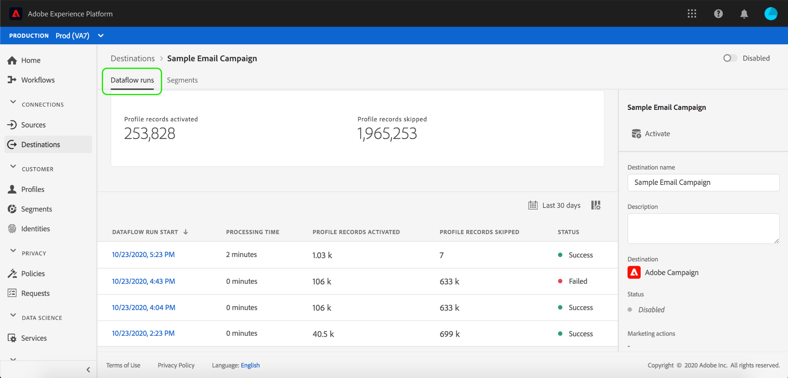

# 目標詳細資訊頁

在Adobe Experience Platform使用者介面中，您可以檢視和監控目標的屬性和活動。 這些詳細資訊包括目標的名稱和ID、啟用或停用目標的控制項，以及更多功能。 批次目的地的詳細資訊還包括已啟動描述檔記錄的度量和資料流執行的歷史記錄。

>[!NOTE]
>
>目標詳細資訊頁面是平台UI中 [!UICONTROL 「目標] 」工作區的一部分。 如需詳細 [[!UICONTROL 資訊，請參閱] 「目標」工作區總覽](./destinations-workspace.md) 。

在「平 **[!UICONTROL 台]** 」UI的「目標」工作區中，導覽至「瀏覽 **** 」標籤並選取您要檢視的目標名稱。

此時會顯示目標的詳細資料頁面，顯示其可用控制項。 如果您正在查看批處理目標的詳細資訊，則還會顯示一個監視控制面板。

## 右邊欄

右側邊欄會顯示目標的基本資訊。

下表涵蓋右側導軌提供的控制項和詳細資訊：

| 右側欄項目 | 說明 |
| --- | --- |
| [!UICONTROL 啟動] | 選取此控制項可編輯哪些區段已對應至目標。 如需詳細資訊，請 [參閱啟用區段至目的地](/help/rtcdp/destinations/activate-destinations.md) 的指南。 |
| [!UICONTROL 目標名稱] | 可以編輯此欄位以更新目標的名稱。 |
| [!UICONTROL 說明] | 您可以編輯此欄位，以更新或新增選擇性說明至目標。 |
| [!UICONTROL 目標] | 代表對象被傳送至的目標平台。 如需詳細 [資訊，請參閱目](./destinations-catalog.md) 標目錄。 |
| [!UICONTROL 狀態] | 指示目標是啟用還是禁用。 |
| [!UICONTROL 行銷動作] | 指出針對資料治理用途適用於此目的地的行銷動作（使用案例）。 |
| [!UICONTROL 類別] | 指示目標類型。 如需詳細 [資訊，請參閱目](./destinations-catalog.md) 標目錄。 |
| [!UICONTROL 連線類型] | 指出將觀眾傳送至目的地的表單。 可能的值包[!UICONTROL 括「Cookie]」和「[!UICONTROL 基於描述檔]」。 |
| [!UICONTROL 頻率] | 指出觀眾被傳送至目的地的頻率。 可能的值包[!UICONTROL 括]「串流」和[!UICONTROL 「Batch]」。 |
| [!UICONTROL 身份] | 代表目標所接受的身分名稱空間， `GAID`例如 `IDFA`、或 `email`。 如需接受身分名稱空間的詳細資訊，請參閱 [身分名稱空間概觀](../../identity-service/namespaces.md)。 |
| [!UICONTROL 建立者] | 表示建立此目標的用戶。 |
| [!UICONTROL 已建立] | 指示建立此目標時的UTC日期時間。 |

## [!UICONTROL 啟用]/停用[!UICONTROL 切換]

您可以使用「啟 **[!UICONTROL 用]/停用** 」切換來啟動和暫停所有匯出至目的地的資料。

## [!UICONTROL 資料流運行]

「數 [!UICONTROL 據流運行] 」頁籤提供資料流運行到批處理目標的度量資料。 會顯示個別執行及其特定度量的清單，以及下列描述檔記錄總計：

* **[!UICONTROL 已激活配置檔案記錄]**:為啟動而建立或更新的描述檔記錄總計。
* **[!UICONTROL 已略過描述檔記錄]**: 根據描述檔退出或遺失屬性，跳過以進行啟動的描述檔記錄總計。

>[!NOTE]
>
>根據目標資料流的調度頻率生成資料流運行。 會針對套用至區段的每個合併原則執行個別的資料流。

要查看特定資料流運行的詳細資訊，請從清單中選擇運行的開始時間。 資料流運行的詳細資訊頁包含其他資訊，如處理的資料大小和錯誤診斷詳細資訊中發生的所有錯誤的清單。

## [!UICONTROL 區段]

「區 [!UICONTROL 段] 」標籤會顯示已映射至目標的區段清單，包括其開始日期和結束日期（如果適用）。 若要檢視特定區段的詳細資訊，請從清單中選取其名稱。

>[!NOTE]
>
>如需探索區段詳細資訊頁面的詳細資訊，請參閱區段 [UI概觀](../../segmentation/ui/overview.md#segment-details)。

## 後續步驟

本檔案涵蓋目標詳細資訊頁面的功能。 如需在UI中管理目標的詳細資訊，請參閱「目標」工作區 [[!UICONTROL 的] 概觀](./destinations-workspace.md)。