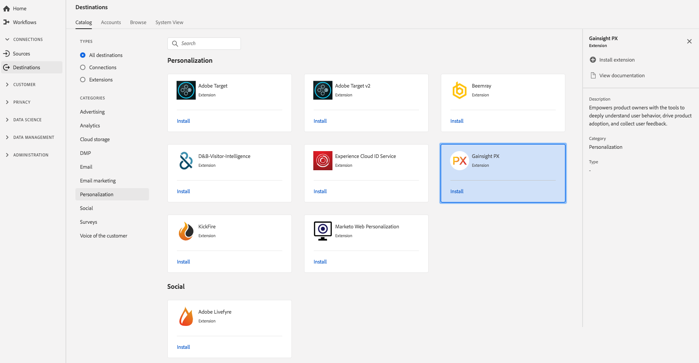

# Gainsight擴充功能 {#gainsight-extension}

## 概述 {#overview}

Gainsight可讓產品擁有者運用工具深入瞭解使用者行為、推動產品採用率，並收集使用者意見回應。

Gainsight是Adobe即時客戶資料平台中的個人化延伸。 如需擴充功能的詳細資訊，請參閱 [Adobe Exchange的擴充功能頁面](https://www.adobeexchange.com/experiencecloud.details.103343.html)。

此目標是Experience Platform Launch擴充功能。 如需Launch擴充功能如何在Adobe Real-time CDP中運作的詳細資訊，請參閱 [Experience Platform Launch擴充功能總覽](/help/rtcdp/destinations/experience-platform-launch-extensions.md)。

## 先決條件 {#prerequisites}

此擴充功能可在「目標」目錄中，針對所有已購買Adobe即時CDP的客戶提供。

若要使用此擴充功能，您需要存取Experience Platform Launch。 Experience Platform Launch是以附加的增值功能提供給Adobe Experience Cloud客戶。 請連絡您的組織管理員以取得Launch的存取權，並要求他們授予您權限， **[!UICONTROL manage_properties]** 以便您安裝擴充功能。

## 安裝擴充功能 {#install-extension}

若要安裝Gainsight擴充功能：

1. 在 [Adobe Real-time CDP介面中](http://platform.adobe.com/)，請轉至 **[!UICONTROL Destinations > Catalog]**。
2. 從目錄中選擇副檔名或使用搜索欄。
3. 按一下目的地以反白標示，然後在右 **[!UICONTROL Install Extension]** 側導軌中選取。 如果控 **[!UICONTROL Install Extension]** 制項呈灰色，表示您遺失權 **[!UICONTROL manage_properties]** 限。 請參 [閱必要條件](#prerequisites)。
4. 在窗 **[!UICONTROL Select available Launch property]** 口中，選擇要在其中安裝擴展的Launch屬性。 您也可以在Launch中選擇建立新屬性。 屬性是規則、資料元素、設定的擴充功能、環境和程式庫的集合。瞭解Launch檔案「屬 [性」頁面](https://docs.adobe.com/content/help/en/launch/using/reference/admin/companies-and-properties.html#properties-page) ，以取得屬性。
5. 工作流程會帶您至Launch以完成安裝。

如需擴充功能設定選項和安裝支援的詳細資訊，請參 [閱Adobe Exchange的Gainsight頁面](https://www.adobeexchange.com/experiencecloud.details.103343.html)。

您也可以直接在 [Experience Platform Launch介面中安裝擴充功能](https://launch.adobe.com/)。 請參 [閱Launch檔案中](https://docs.adobe.com/content/help/en/launch/using/reference/manage-resources/extensions/overview.html#add-a-new-extension) 「新增擴充功能」。

## 如何使用擴充功能 {#how-to-use}

在安裝擴充功能後，您就可以直接在Launch中開始設定擴充功能的規則。

在Launch中，您可以為已安裝的擴充功能設定規則，只有在特定情況下，才會將事件資料傳送至擴充功能目的地。 如需為擴充功能設定規則的詳細資訊，請參閱規 [則檔案](https://docs.adobe.com/help/zh-Hant/launch/using/reference/manage-resources/rules.html)。

## 設定、升級和刪除擴充功能 {#configure-upgrade-delete}

您可以在Launch介面中設定、升級和刪除擴充功能。

>[!TIP]
>
>如果擴充功能已安裝在您的其中一個屬性上，Adobe即時CDP使用者介面仍會顯示該 **[!UICONTROL Install]** 擴充功能。 如「安裝擴充功能」中所述，開始安 [裝工作流程](#install-extension) ，以開始啟動並設定或刪除您的擴充功能。

若要升級您的擴充功能，請參 [閱Launch檔案中](https://docs.adobe.com/content/help/en/launch/using/reference/manage-resources/extensions/extension-upgrade.html) 的擴充功能升級。