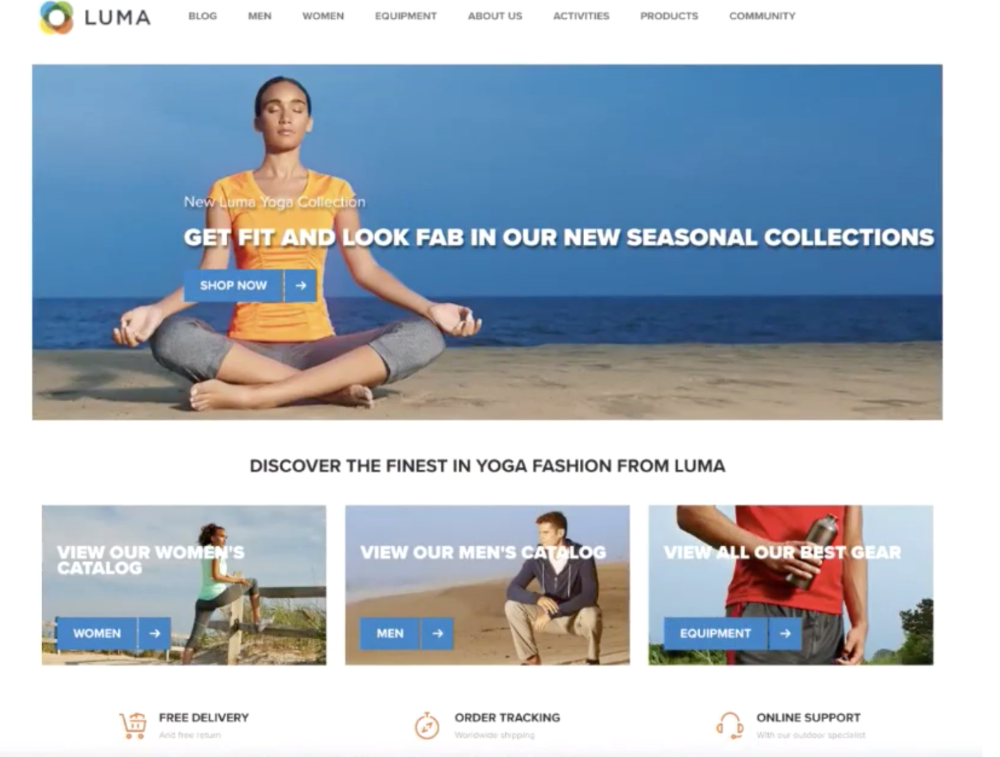

# 開始使用Real-time Customer Data Platform

本快速入門手冊會引導您進行Real-time Customer Data Platform(Real-Time CDP)的範例實作。 您可以在設定自己的實作時使用它作為範例。 雖然本指南會顯示特定範例，但會連結至建立設定時可使用的其他資訊。

此範例說明由Adobe Experience Platform提供技術支援的Real-time Customer Data Platform，其功能如下：

* 從多個來源內嵌資料
* 將它們合併為單一 [!DNL real-time customer profile]
* 跨裝置提供一致、相關且個人化的體驗。

## 使用案例

運動服裝公司Luma總是在努力改善客戶體驗。 他們有一項新計畫，以增加與禮品相關的銷售。 他們還希望減少過度曝光，比如跟隨顧客的煩人廣告。

目前，他們在媒體上花費太多，針對訪客未來不會購買的項目重新進行目標定位。 例如，Luma不想將目標重新定位為某人，而某個項目原本是為其他人一次性購買。

目前，Luma的資料分散於多個來源。 因此，他們面臨著重大挑戰：

* 行銷組織必須與各自擁有資料來源的不同團隊合作，包括網站、行動應用程式、忠誠度系統、CRM等。
* 當行銷團隊存取資料時，資料通常已過時，不再與其具時效性的行銷活動相關。
* 他們需要統一資料，以鎖定人員而非管道。

因此，Luma有下列業務目標：

* 從不同的資料來源建立消費者的即時單一檢視。
* 使用跨不同通道和裝置的相關訊息個人化行銷活動。

為了達成這些目標，行銷團隊必須能夠大規模管理客戶資料。

有了由Adobe Experience Platform支援的Real-Time CDP,Luma的行銷組織可以：

1. 從不同的平台收集資料，並確保資料可供下游的其他行銷活動使用。
1. 建立消費者的單一即時檢視，不受資料來源影響。
1. 在每個接觸點間提供一致、相關且個人化的體驗。

## 步驟

本教學課程包含下列步驟：

1. 建置 [客戶設定檔](#customer-profile).
1. [個人化](#personalizing-the-user-experience) 使用者體驗。
1. 使用 [多個資料來源](#using-multiple-data-sources).
1. [設定資料來源](#configuring-a-data-source).
1. [收集資料](#bringing-the-data-together-for-a-specific-customer) 特定客戶。
1. 設定 [區段](#segments).
1. 設定 [目的地](#destinations).
1. [跨裝置匯整設定檔](#cross-device-identity-stitching).
1. [分析設定檔](#analyzing-the-profile).

## 客戶設定檔

當客戶首次造訪您的網站時，您對他們一無所知。



資料會在導覽時即時擷取，並不僅傳送至Adobe Analytics中的報表套裝，也直接傳送至Adobe Experience Platform。 收集資料後，您就會開始根據 [!DNL Experience Platform's real-time customer profile].

網站的許多訪客可能會重複先前從Luma購買的客戶。  Luma必須個人化訊息和產品，以處理新訪客和回訪訪客，以及已知客戶，這一點非常重要。

### 新客戶的首次造訪

例如，未確認的訪客導覽至Luma網站的「男性」區段，並檢視幾個執行運動衫的訪客。


當客戶導覽以深入了解這些產品時，這些產品檢視會在Adobe Analytics中收集並傳送至 [!DNL Experience Platform].

<!---->

Luma可將訪客的行為對應至Adobe Experience Platform上的使用者設定檔，並開始匯整該消費者行為的更豐富檢視。

### 獲得更詳細的客戶視圖

隨著客戶繼續與網站互動，畫面會更加清晰。 例如，假設訪客新增產品至購物車並登入。

當客戶登入時，她自稱莎拉·羅絲。


會合併兩個身分：

* 匿名瀏覽資料
* 與莎拉·羅絲的帳戶相關的現有資料

兩個身分會結合為單一設定檔，位於 [!DNL Experience Platform]. Luma現在對這個消費者有統一的看法。

根據網站「男性」區段中匿名訪客的瀏覽行為，可能已假設客戶為男性。 現在她登錄了，Luma認出莎拉·羅絲。 Luma使用 [!DNL Real-time Customer Profile] 調整跨管道傳送給她的訊息。

## 個人化使用者體驗

莎拉受到了忠誠的歡迎，並感謝她成為銅牌會員，提供更多關於福利以及如何提高她的地位和分數的資訊。

她瀏覽到首頁，瀏覽更多內容。


Sarah會獲得個人化的首頁體驗，這些體驗會根據她動態傳送 [!DNL Real-time Customer Profile] 在Adobe Experience Platform。

由於Adobe Target的Adobe Sensei支援個人化，她看到了相關內容，這要考慮到她過去的購買行為，以及對跑步服和齒輪的親和力。 Luma還根據她最近的瀏覽，為男性定製了跑步器材。

在頁面的下方，會顯示精選產品，以及根據她最近檢視的項目的新建議匣。

此個人化內容可協助Sarah快速找到相關項目。 這可提高轉換率，並提供更愉快的客戶體驗。

### 將客戶帶回

莎拉分心了，離開了網站，結束了她的工作。 Luma可使用Adobe Experience Platform中的資料來協助將她帶回網站。

Real-time Customer Data Platform採用Adobe Experience Platform技術，專為客戶體驗管理而打造。 它可讓組織：

* 簡化資料整合和啟用
* 控管已知和未知的資料使用情形
* 大規模加速行銷使用案例

## 使用多項資料來源

Luma團隊在單一位置提供其所有行為和客戶資料。


他們可以內嵌來自下列所有來源的資料：

* 現有Adobe Experience Cloud解決方案資料
* 非Adobe來源，例如Luma的忠誠度計畫、客服中心和銷售點系統資料
* 從Luma資料來源即時串流資料
* 來自Adobe解決方案的即時資料（不需要新標籤）

所有來自不同來源的這些資料會合併為單一統一的客戶設定檔。

## 設定資料來源

使用 [!DNL Real-Time Customer Data Platform] 將新資料來源帶入Platform。 Real-Time CDP包含資料來源目錄，可快速且輕鬆地新增至設定檔。


例如，若要內嵌Luma的CRM資料，請依 *CRM*，以及所有現成可用的連接器，包含 *CRM* 清單中。 若要新增 [!DNL Microsoft Dynamics CRM] 資料：

1. 授權連線。

   

1. 從建議的XDM預先對應表格清單中，選擇要匯入的項目。

   <!--     -->

   例如，選取 **[!UICONTROL 聯繫人]**. 聯繫人資料的預覽會自動載入，這樣您就可以確保所有內容都如預期。

   透過將標準欄位自動對應至 [!DNL Experience Data Model] (XDM)設定檔結構。

1. 檢閱欄位對應。

   <!--     -->

   例如，仔細檢查聯繫人的電子郵件欄位是否正確映射。\
   您可以選擇預覽資料並執行進階對應。

1. 設定排程。

   

已經完成了。 您剛補充 [!DNL Microsoft CRM] 作為資料來源， [!DNL Experience Platform].

### 為使用策略的擷取資料加上標籤

Luma有許多內部政策，限制使用特定種類收集到的資訊，且必須符合有關資料使用的法律和隱私權相關疑慮。 使用Adobe Experience Platform資料控管，預先定義的資料使用量標籤可套用至資料集（以及這些資料集內的特定欄位），讓Luma能根據特定使用量限制來分類其資料。


套用資料使用量標籤後，Luma就可以使用資料控管來建立資料使用量原則。 資料使用原則是描述允許對包含特定標籤的資料執行的動作種類的規則。 在Real-Time CDP中嘗試執行構成策略違規的操作時，將阻止該操作，並提供警報以顯示違反了哪些策略以及原因。

## 為特定客戶將資料匯整在一起

在此案例中，請搜尋Sarah Rose的設定檔。 她的個人資料隨著她以前登錄的電子郵件一起出現。

<!--  -->

Luma擁有的關於Sarah的所有設定檔資訊都會顯示。 這包括她的個人資訊，如地址和電話號碼、通信首選項以及她符合資格的區段。

| 類別 | 說明 |
|---|---|
| 身分 | 顯示中已連結在一起的身分 [!DNL Platform] 從莎拉與Luma的互動中。 會顯示其網站的ECID。 其身分也包含行動應用程式的ECID、電子郵件ID、最近新增的CRM ID [!DNL Microsoft Dynamics] 資料集和從Luma忠誠度系統傳入Adobe Experience Platform的忠誠度ID。 |
| 活動 | 顯示Sarah與Luma品牌的所有互動資料。 這包括她剛剛檢視的項目、過去檢視的任何項目、她收到的電子郵件、她與客服中心的互動，以及每次互動發生的管道和裝置。 |

Real-Time CDP設定檔將Luma行銷團隊的工作流程從數週縮短為數分鐘，並根據這個360度的客戶檢視來解鎖個人化的可能性。 此設定檔會合併她在登入前瀏覽網站時的行為資料，與現有的客戶設定檔，進而全面了解Sarah。

行銷團隊可使用這項增強功能， [!DNL Real-time Customer Profile] 更妥善地個人化莎拉的體驗，並提升她對Luma的品牌忠誠度。

## 區段

強大的Adobe Experience Platform細分功能可讓行銷人員根據 [!DNL Real-time Customer Profile].

<!--  -->

在此情境中，Sarah最近在網站上的互動行為與她過去的動作不同。 她通常買女裝。 不過，她購物車裡的物品是男性的大運動衫。

Luma資料科學團隊已建立了關於購買傾向的模型。 一個模型可識別現有消費者服裝類別（例如男性/女性）或大小的突然變化。 莎拉的購買行為改變表明她不是為自己買東西。

<!--  -->

### 定義區段

修改或建立代表購物車放棄者的區段，這些放棄者似乎正在購買禮品：

```sql
Profile: Category != Preferred Category 
AND 
Product Size != Preferred Size 
in last 7 days.  
AND 
Abandoned Cart 
AND 
Loyalty member 
```

<!-- -->

因為Sarah在購物車中添加了一個明顯的禮品項目，並且放棄了它，Luma可以以免費禮品包裝來定位她。

## 目的地

新增「贈送購物車放棄者」區段後，您便可了解此區段中約有多少人加入。 您可以對其採取動作，並讓其可供跨管道個人化使用。

選擇 **[!UICONTROL 傳送至目的地]**.

在Real-Time CDP中，Luma可順暢地對其對象區段執行動作，以提供個人化體驗。\
在此，我們會看到Luma可將此目的地(包括Adobe和非Adobe解決方案)傳送至的所有目的地：


### 選取目的地

此情境中，Luma想要透過這些目的地的個人化來重新鎖定此對象：

* Google，顯示

   <!--* Facebook -->
* Adobe Campaign，用於電子郵件

<!--  -->

### 排程目的地

您也可以排程區段在特定時間開始或結束。 區段會在已設定的平台中，於排程日期張貼並自動更新。

>[!NOTE]
>
>（可選）如果選擇日期欄位，則會自動排程90天外。

選擇 **[!UICONTROL 儲存]** 前往下一頁。

此對象中的客戶進行購買時，會即時抑制其對此對象的成員資格。 他們不再符合資格，因為他們的狀態已經改變。

如此一來，若對不符合資格的受眾未使用完整庫存，Luma媒體團隊的主管便可節省數十萬美元。

### 強制目標的資料使用原則

Adobe Experience Platform包含隱私權和安全性控制項，可判斷區段是否可啟動至特定目的地。 啟動會根據建立時指派給目的地的行銷目的，以及貴組織定義的資料使用原則，來啟用或限制。

如果活動違反原則，則會顯示警告。 此警告包含資料處理資訊，可幫助您確定違反策略的原因，以及您可以採取什麼措施來解決違規。

有了這些控制， [!DNL Experience Platform] 有助於Luma以負責任的態度遵守法規和市場。 這些控制是靈活的，可修改以符合Luma的安全性和治理團隊的要求，使他們能夠放心地滿足管理已知和未知客戶資料的地區和組織要求。

### 資料流畫布

儲存時，視覺資料流畫布會顯示從統一設定檔對應至您選取的三個目的地的區段。


## 跨裝置身分識別匯整

Sarah瀏覽了移動設備上的社交媒體網站，看到了Luma廣告。 這讓她想起了她在購物車裡留下的物品。

之後，她開啟了電子郵件，看到了重新定位的電子郵件。 她會從電子郵件中選取Luma的連結。

此連結會帶Sarah前往行動Luma首頁，她在那裡看到Adobe Target提供的高度個人化體驗。

* 她是銅牌會員。
* 她看到了「禮物」的訊息。
* 她還看到了「免費禮包」訊息，這是她獲得銅牌會籍福利的一部分。
* 她仍然是主角形象中的目標，因為她喜歡跑步。

她買毛衣，加上禮物包，寫禮物便箋。 她還可以選擇記住這個活動，並明年收到提醒，以便在這個時候得到禮物。 她說是的，並安排在次年進行電子郵件宣傳，提醒她再買一件禮物。

由於觀眾抑制能力，莎拉不會成為未來男人毛衣的目標。

## 分析設定檔

Luma行銷人員會使用Adobe Experience Platform來查看Real-Time CDP控制面板上的送禮區段。 他們看到了這一計畫的結果，並看到它正在增長。 客戶正在響應優惠方案並投入更多資金。

這些見解可讓行銷人員對此訊號採取行動，而這是因為CDP提供此資料，並將Sarah等客戶附加至區段所推動。

Luma使用此CDP資料來提升忠誠度和客戶滿意度。
