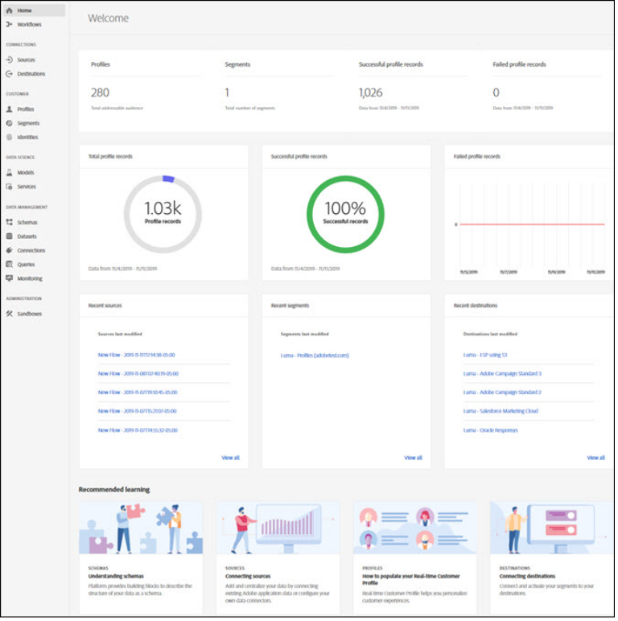

# [!DNL Real-time Customer Data Platform] 首頁和儀表板

Real-time Customer Data Platform(Real-time CDP)首頁包含量度控制面板，會在您登入Real-time CDP時顯示。

首頁只是顯示量度卡的其中一個位置。 Real-time CDP提供您整個體驗中的量度卡。 這些量度會通知您系統中的資料、設定檔和區段對象。

如果您登入Real-time CDP時系統中沒有資料，則首頁上的控制面板不會顯示。 在這種情況下，首頁會提供第一次使用者體驗的學習資料。 當收集資料時，換句話說， <!--sources-->資料集、設定檔、區段和目的地會建立，資料會流入系統，控制面板會自動更新，以顯示該資料的相關資訊<!-- in metric cards-->.

## 首頁儀表板視圖

<!--The dashboard shows information in several areas. Each category of information displays for the time range shown beneath the data.-->

控制面板分為<!-- two areas.-->:

* **排行榜** 在控制面板的頂端。 排行榜會顯示系統中的資料集、設定檔、區段和目的地數量。

   

<!-- * **Metric cards** display beneath the leaderboard. Metric cards show additional information, such as percentages or trends. Metric cards appear as data is collected.
    
Some information is shown in different ways on both the leaderboard and metric cards. -->
* **最近的項目** 列出系統中新增的5個最近資料集、來源、區段和目的地。

   

其他量度（例如設定檔和區段）可在Real-time Customer Data Platform的其他部分使用。

### 資料集

此 **[!UICONTROL 資料集]** 計數器會顯示系統中的資料集數，以及 [!DNL Platform]. 建立資料集時，會更新此計數器。

如需資料集的詳細資訊，請參閱 [資料集概述](../catalog/datasets/overview.md).

### 設定檔

此 **[!UICONTROL 設定檔]** count會顯示在 [!DNL Real-time Customer Profile]. 其中不包含設定檔片段。 這是可定址的受眾總數。

此計數使用預設值 [合併策略](profile/merge-policies.md) 在統一配置檔案的合併策略配置中設定。

每24小時更新一次設定檔數目。

如需設定檔的詳細資訊，請參閱 [Real-time CDP中客戶的統一視圖](profile/profile-overview.md).

### 區段

**[!UICONTROL 區段]** 顯示為組織建立的區段總數。 建立新區段時，會更新此數字。

如需區段的詳細資訊，請參閱 [區段服務概觀](segmentation/segmentation-overview.md).

### 目的地

**[!UICONTROL 目的地]** 顯示為組織建立的目的地總數。 建立新目的地時，會更新此數字。

如需目的地的詳細資訊，請參閱 [目的地概觀](destinations/overview.md).

<!-- ### Successful profile records

In the leaderboard **[!UICONTROL Successful profile records]** shows the total number of records that have been successfully processed into the profile.

There is also a metric card that shows the percentage of successful records. Select **[!UICONTROL View datasets]** to see more details about the profile records. Hover over the colored area of the graph to see additional details:

The number of successful profile records is updated hourly. 

For more information about profiles, see [A unified view of your customer in Real-time CDP](profile/profile-overview.md).

### Total profile records

The **[!UICONTROL Total profile records]** metric card shows the total number of data records enabled to feed into the profiles, and the percentage that are successful, updated once per day. This does not include all data in the data lake, because some data might not be enabled to feed into the profiles.

 Hover over the colored area of the graph to see additional details about the successful profiles:

Select **[!UICONTROL View profiles]** to see more details about the profile records.

For more information about profiles, see [A unified view of your customer in Real-time CDP](profile/profile-overview.md).

For more information about viewing a specific profile, see [Profile viewer](profile/profile-viewer.md).

### Failed profile records

In the leaderboard, **[!UICONTROL Failed profile records]** counts the number of records that failed to process into the profile.

The **[!UICONTROL Failed profile records]** metric card shows this count, and includes a graphical representation that helps you see how failures have trended during the time shown below the graphic. This chart is updated hourly. Select **[!UICONTROL View datasets]** to see more details about the profile records.

The number of failed profile records is updated hourly. -->

### 最近的資料集

此 **[!UICONTROL 最近的資料集]** 卡片顯示組織內最近建立的五個資料集。 建立新資料集時，會更新此清單。

選取資料集以檢視該項目的詳細資訊，或 **[!UICONTROL 查看全部]** 來查看資料集清單。 從那裡，您可以選擇特定的來源以獲取詳細資訊。

如需資料集的詳細資訊，請參閱 [資料集概述](../catalog/datasets/overview.md).

### 最近的來源

此 **[!UICONTROL 最近的來源]** 「量度卡」會顯示組織內建立的5個最近來源。 建立新源時，將更新此清單。

選擇一個源以查看該項的詳細資訊，或 **[!UICONTROL 查看全部]** 來查看源清單。 從那裡，您可以選擇特定的來源以獲取詳細資訊。

如需來源的詳細資訊，請參閱 [來源概觀](sources/sources-overview.md).

### 最近區段

此 **[!UICONTROL 最近區段]** 量度卡顯示組織內建立的5個最近區段。 建立新區段時，會更新此清單。

選取區段以檢視該項目的詳細資訊，或 **[!UICONTROL 查看全部]** 以查看更多區段的相關資訊。

如需區段的詳細資訊，請參閱 [區段服務概觀](segmentation/segmentation-overview.md).

### 近期目的地

此 **[!UICONTROL 近期目的地]** 量度卡顯示組織內建立的5個最近目的地。 建立新目的地時，會更新此清單。

選取要檢視該項目詳細資訊的目的地，或 **[!UICONTROL 查看全部]** 以了解更多目的地的相關資訊。

如需目的地的詳細資訊，請參閱 [目的地概觀](destinations/overview.md).
