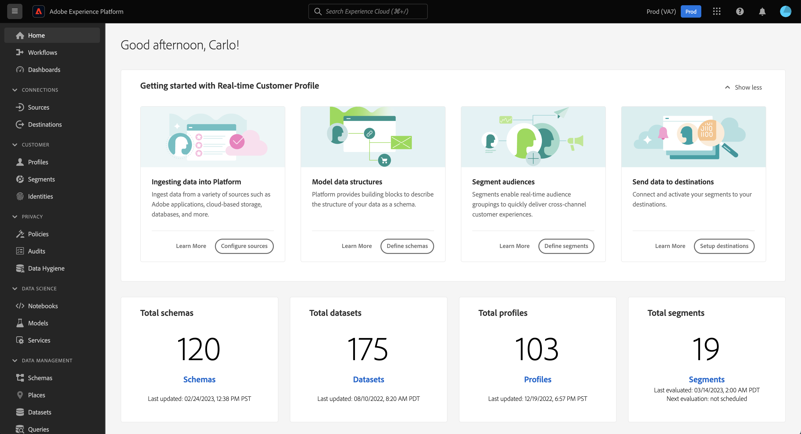
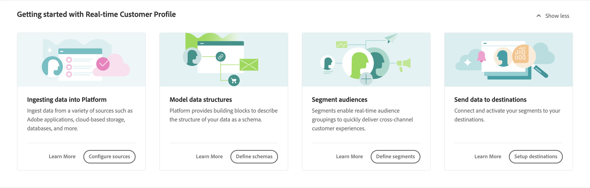
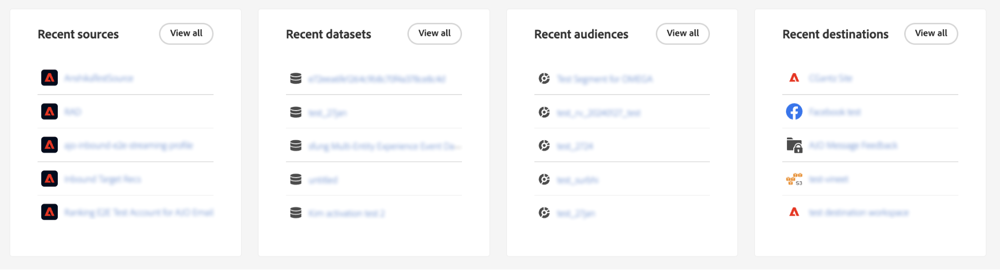

# [!DNL Real-Time Customer Data Platform]首頁

Adobe Real-Time Customer Data Platform (Real-Time CDP)首頁是登入Real-Time CDP後顯示的第一個頁面。

Real-Time CDP首頁包含快速入門Widget，可讓您快速存取多項不同功能，以及顯示組織內資料最新資訊的量度區段。

本檔案提供Real-Time CDP首頁概觀和量度控制面板。

## 快速入門widget

[!UICONTROL 即時客戶個人檔案快速入門] Widget分為四個部分：

* **將資料內嵌至Experience Platform**：此Widget會將您導向來源目錄。 使用來源目錄來選取來源，並將您的資料內嵌至Experience Platform。 選取&#x200B;**[設定來源]**&#x200B;以瀏覽至來源目錄。 請閱讀[來源概觀](../sources/home.md)以了解更多資訊。
* **模型資料結構**：此Widget會將您導向結構概觀。 使用方案概觀來瀏覽現有方案或建立說明資料結構的Blueprint。 選取「**[!UICONTROL 建立結構描述]**」以瀏覽至結構描述建立介面。 如需詳細資訊，請閱讀[結構描述概觀](../xdm/home.md)。
* **建立對象**：此Widget會將您導向至UI中的區段產生器。 使用「區段產生器」與「設定檔」資料元素互動，並定義區段定義的條件。 選取&#x200B;**[!UICONTROL 建立對象]**&#x200B;以瀏覽至「區段產生器」。 如需詳細資訊，請閱讀[分段服務總覽](../segmentation/home.md)。
* **將資料傳送至目的地**：此Widget會將您導向目的地目錄。 使用目的地目錄來選取目的地，然後您可以連線至目的地並將對象傳送至該目的地。 選取「**[!UICONTROL 設定目的地]**」以導覽至目的地目錄。 如需更多資訊，請閱讀[目標概觀](../destinations/home.md)。

## 指標儀表板 {#metrics-dashboard}

>[!CONTEXTUALHELP]
>id="platform_home_metrics_totalProfiles"
>title="設定檔總數"
>abstract="您的組織在 Experience Platform 中擁有的設定檔總數。此計數是根據您組織的合併原則計算，不包括設定檔片段。設定檔數量每 24 小時更新一次。"
>additional-url="https://experienceleague.adobe.com/docs/experience-platform/profile/ui/user-guide.html#profile-count" text="如需了解詳細資訊，請參閱文件"

量度控制面板會顯示Experience Platform資料的最新資訊。 儀表板分為兩個區段：

### 排行榜

排行榜顯示貴組織中目前的結構描述、資料集、設定檔和對象的總數及其最近更新日期。

* **結構描述總數**： **結構描述總數**&#x200B;計數器會顯示系統中的結構描述數目。 建立結構描述時會更新此計數器。 如需詳細資訊，請閱讀[結構描述概觀](../xdm/home.md)。
* **資料集總數**： **資料集總數**&#x200B;計數器會顯示系統中的資料集數目以及Experience Platform中的資料量。 建立資料集時會更新此計數器。 如需資料集的詳細資訊，請閱讀[資料集總覽](../catalog/datasets/overview.md)。
* **設定檔總數**： **設定檔**&#x200B;計數會顯示貴組織在Experience Platform中的設定檔總數。 其中不包含設定檔片段。 這是您的總計可定址對象。 此計數使用在即時客戶個人檔案的合併原則設定中設定的預設[合併原則](profile/merge-policies.md)。 設定檔的數量每24小時更新一次。 選取&#x200B;**[!UICONTROL 設定檔]**&#x200B;以瀏覽至「設定檔總覽」頁面，並檢視所有設定檔量度。 如需設定檔的詳細資訊，請閱讀[即時客戶設定檔總覽](../profile/home.md)。
* **對象總數**： **對象總數**&#x200B;計數器會顯示為您的組織建立的對象總數。 此數字會在建立新對象時更新。 如需對象的詳細資訊，請閱讀[細分服務總覽](../segmentation/home.md)。

### 最近專案

最近專案會列出組織中最近的變更。 在以下範例中，最新變更與資料集、來源、對象和目的地有關。

* **最近的資料集**： **[!UICONTROL 最近的資料集]**&#x200B;卡片會顯示組織內建立的五個最近的資料集。 建立新資料集時會更新此清單。 選取資料集以檢視該專案的詳細資料，或針對資料集清單選取&#x200B;**[!UICONTROL 全部檢視]**。 從那裡，您可以選取特定來源以取得詳細資訊。 如需資料集的詳細資訊，請參閱[資料集總覽](../catalog/datasets/overview.md)。
* **最近的來源**： **[!UICONTROL 最近的來源]**&#x200B;量度卡片會顯示組織內建立的五個最近的來源。 此清單會在建立新來源時更新。 選取來源以檢視該專案的詳細資料，或選取&#x200B;**[!UICONTROL 檢視全部]**&#x200B;以取得來源清單。 從那裡，您可以選取特定來源以取得詳細資訊。 如需來源的詳細資訊，請參閱[來源概觀](../sources/home.md)。
* **最近對象**： **[!UICONTROL 最近對象]**&#x200B;量度卡片會顯示組織內建立的五個最近對象。 此清單會在建立新受眾時更新。 選取對象以檢視該專案的詳細資料，或選取&#x200B;**[!UICONTROL 檢視全部]**&#x200B;以取得對象清單。 如需對象的詳細資訊，請參閱[細分服務總覽](../segmentation/home.md)。
* **最近的目的地**： **[!UICONTROL 最近的目的地]**&#x200B;量度卡片會顯示組織中建立的五個最近的目的地。 此清單會在建立新目的地時更新。 選取一個目的地以檢視該專案的詳細資料，或選取&#x200B;**[!UICONTROL 檢視全部]**&#x200B;以取得目的地清單。 如需更多資訊，請閱讀[目標概觀](../destinations/home.md)。

## 資源

最後，資源Widget提供您可參考的其他檔案資源。 這些功能包括：

* [了解結構描述](../xdm/schema/composition.md)
* [正在連接來源](../sources/home.md)
* [如何填寫您的Real-Time Customer Profile](../profile/home.md)
* [正在連接目的地](../destinations/home.md)
* [管理存取權](../access-control/abac/overview.md)

<!-- ### Successful profile records

In the leaderboard **[!UICONTROL Successful profile records]** shows the total number of records that have been successfully processed into the profile.

There is also a metric card that shows the percentage of successful records. Select **[!UICONTROL View datasets]** to see more details about the profile records. Hover over the colored area of the graph to see additional details:

The number of successful profile records is updated hourly. 

For more information about profiles, see [A unified view of your customer in Real-Time CDP](profile/profile-overview.md).

### Total profile records

The **[!UICONTROL Total profile records]** metric card shows the total number of data records enabled to feed into the profiles, and the percentage that are successful, updated once per day. This does not include all data in the data lake, because some data might not be enabled to feed into the profiles.

 Hover over the colored area of the graph to see additional details about the successful profiles:

Select **[!UICONTROL View profiles]** to see more details about the profile records.

For more information about profiles, see [A unified view of your customer in Real-Time CDP](profile/profile-overview.md).

For more information about viewing a specific profile, see [Profile viewer](profile/profile-viewer.md).

### Failed profile records

In the leaderboard, **[!UICONTROL Failed profile records]** counts the number of records that failed to process into the profile.

The **[!UICONTROL Failed profile records]** metric card shows this count, and includes a graphical representation that helps you see how failures have trended during the time shown below the graphic. This chart is updated hourly. Select **[!UICONTROL View datasets]** to see more details about the profile records.

The number of failed profile records is updated hourly. -->
