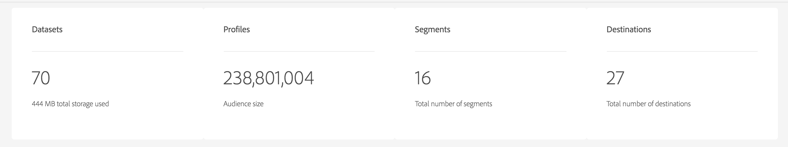

# [!DNL Real-time Customer Data Platform] 首頁和儀表板

登錄到即時CDP時，將顯示Real-time Customer Data Platform（即時CDP）首頁，其中包括度量儀表板。

首頁只是顯示度量卡的位置之一。 即時CDP在您的整個體驗中都提供了度量卡。 這些指標將通知您系統中的資料、配置檔案和段訪問群體。

如果登錄到即時CDP時系統中沒有資料，則首頁上的儀表板不會顯示。 在這種情況下，首頁為第一次用戶體驗提供學習材料。 當資料被收集時 — 換句話說， <!--sources-->資料集、配置檔案、段和目標已建立，並且資料流入系統 — 儀表板會自動更新以顯示有關該資料的資訊<!-- in metric cards-->。

## 首頁儀表板視圖

<!--The dashboard shows information in several areas. Each category of information displays for the time range shown beneath the data.-->

儀表板分為<!-- two areas.-->:

* **排行榜** 在儀表板的頂部。 該排行榜顯示了系統中資料集、配置檔案、段和目標的數量。

   

<!-- * **Metric cards** display beneath the leaderboard. Metric cards show additional information, such as percentages or trends. Metric cards appear as data is collected.
    
Some information is shown in different ways on both the leaderboard and metric cards. -->
* **最近的項目** 列出了添加到系統的五個最新資料集、源、段和目標。

   

其他度量（例如，配置檔案和段）在Real-time Customer Data Platform的其他部分提供。

### 資料集

的 **[!UICONTROL 資料集]** 計數器顯示系統中的資料集數和中的資料量 [!DNL Platform]。 建立資料集時會更新此計數器。

有關資料集的詳細資訊，請參見 [資料集概述](../catalog/datasets/overview.md)。

### 設定檔

的 **[!UICONTROL 配置檔案]** count顯示在中具有配置檔案的人員總數 [!DNL Real-time Customer Profile]。 它不包括配置檔案片段。 這是您可定址的總受眾。

此計數使用預設 [合併策略](profile/merge-policies.md) 在統一配置檔案中的合併策略配置中設定。

配置檔案數每24小時更新一次。

有關配置式的詳細資訊，請參見 [在即時CDP中為客戶提供統一視圖](profile/profile-overview.md)。

### 區段

**[!UICONTROL 段]** 顯示為組織建立的段總數。 在建立新段時更新此數字。

有關段的詳細資訊，請參見 [分段服務概述](segmentation/segmentation-overview.md)。

### 目的地

**[!UICONTROL 目標]** 顯示為組織建立的目標總數。 建立新目標時，將更新此編號。

有關目標的詳細資訊，請參閱 [目標概述](destinations/overview.md)。

<!-- ### Successful profile records

In the leaderboard **[!UICONTROL Successful profile records]** shows the total number of records that have been successfully processed into the profile.

There is also a metric card that shows the percentage of successful records. Select **[!UICONTROL View datasets]** to see more details about the profile records. Hover over the colored area of the graph to see additional details:

The number of successful profile records is updated hourly. 

For more information about profiles, see [A unified view of your customer in Real-time CDP](profile/profile-overview.md).

### Total profile records

The **[!UICONTROL Total profile records]** metric card shows the total number of data records enabled to feed into the profiles, and the percentage that are successful, updated once per day. This does not include all data in the data lake, because some data might not be enabled to feed into the profiles.

 Hover over the colored area of the graph to see additional details about the successful profiles:

Select **[!UICONTROL View profiles]** to see more details about the profile records.

For more information about profiles, see [A unified view of your customer in Real-time CDP](profile/profile-overview.md).

For more information about viewing a specific profile, see [Profile viewer](profile/profile-viewer.md).

### Failed profile records

In the leaderboard, **[!UICONTROL Failed profile records]** counts the number of records that failed to process into the profile.

The **[!UICONTROL Failed profile records]** metric card shows this count, and includes a graphical representation that helps you see how failures have trended during the time shown below the graphic. This chart is updated hourly. Select **[!UICONTROL View datasets]** to see more details about the profile records.

The number of failed profile records is updated hourly. -->

### 最近的資料集

的 **[!UICONTROL 最近的資料集]** card顯示了組織內最近建立的五個資料集。 建立新資料集時將更新此清單。

選擇資料集以查看該項的詳細資訊，或 **[!UICONTROL 查看全部]** 查看資料集清單。 從中，您可以選擇特定的來源來獲取詳細資訊。

有關資料集的詳細資訊，請參見 [資料集概述](../catalog/datasets/overview.md)。

### 最近的來源

的 **[!UICONTROL 最近的來源]** 度量卡顯示在組織內建立的五個最近的源。 建立新源時，將更新此清單。

選擇要查看該物料的詳細資訊的來源，或 **[!UICONTROL 查看全部]** 來查看源清單。 從中，您可以選擇特定的來源來獲取詳細資訊。

有關源的詳細資訊，請參見 [源概述](sources/sources-overview.md)。

### 最近段

的 **[!UICONTROL 最近段]** 度量卡顯示在組織內建立的五個最近段。 建立新段時會更新此清單。

選擇要查看該物料詳細資訊的段，或 **[!UICONTROL 查看全部]** 查看有關更多段的資訊。

有關段的詳細資訊，請參見 [分段服務概述](segmentation/segmentation-overview.md)。

### 最近的目的地

的 **[!UICONTROL 最近的目的地]** 度量卡顯示組織內建立的五個最近的目標。 建立新目標時，將更新此清單。

選擇要查看該項的詳細資訊的目標，或 **[!UICONTROL 查看全部]** 查看有關更多目標的資訊。

有關目標的詳細資訊，請參閱 [目標概述](destinations/overview.md)。
