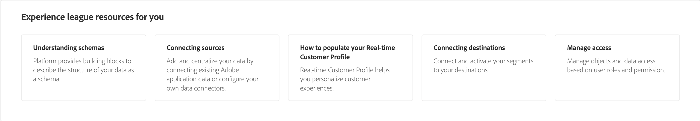

# [!DNL Real-Time Customer Data Platform] 首頁

Adobe Real-time Customer Data Platform(Real-Time CDP)首頁是登錄到Real-Time CDP後顯示的第一頁。

Real-Time CDP首頁包括入門小部件，可讓您快速訪問多個不同的功能，以及度量部分，該部分顯示組織內資料的最新資訊。

此文檔概述了Real-Time CDP首頁和度量儀表板。

## 入門小部件

的 [!UICONTROL 即時客戶概要資訊入門] 小部件分為四個部分：

* **將資料導入平台**:此小部件將引導您進入源目錄。 使用源目錄選擇源並將資料接收到Experience Platform。 有關詳細資訊，請閱讀 [源概述](../sources/home.md)
* **模型資料結構**:此小部件將引導您進入架構概述。 使用架構概述可瀏覽現有架構或建立描述資料結構的構建塊。 有關詳細資訊，請閱讀 [架構概述](../xdm/home.md)。
* **分部受眾**:此小部件將引導您 [!DNL Segment Builder] 的子菜單。 使用 [!DNL Segment Builder] 與「配置檔案」資料元素交互並定義段的規則。 有關詳細資訊，請閱讀 [分段服務概述](../segmentation/home.md)。
* **將資料發送到目標**:此小部件將引導您到目標目錄。 使用目標目錄選擇目標，然後可以連接到該目標並將段發送到該目標。 有關詳細資訊，請閱讀 [目標概述](../destinations/home.md)

## 度量儀表板

度量儀表板顯示有關Experience Platform資料的最新資訊。 儀表板分為兩個部分：

### 排行榜

該排行榜顯示您組織中的架構、資料集、配置檔案和段的當前總數，以及它們的最新更新日期。

* **方案總數**:的 **方案總數** counter顯示系統中的架構數。 建立架構時會更新此計數器。 有關詳細資訊，請閱讀 [架構概述](../xdm/home.md)。
* **資料集總數**:的 **資料集總數** 計數器顯示系統中的資料集數和中的資料量 [!DNL Platform]。 建立資料集時會更新此計數器。 有關資料集的詳細資訊，請閱讀 [資料集概述](../catalog/datasets/overview.md)。
* **配置檔案總數**:的 **配置檔案** count顯示在中具有配置檔案的人員總數 [!DNL Real-Time Customer Profile]。 它不包括配置檔案片段。 這是您可定址的總受眾。 此計數使用預設 [合併策略](profile/merge-policies.md) 在統一配置檔案中的合併策略配置中設定。 配置檔案數每24小時更新一次。 有關配置檔案的詳細資訊，請閱讀 [即時客戶概要資訊概述](../profile/home.md)。
* **段總數**: **段** 顯示為組織建立的段總數。 在建立新段時更新此數字。 有關段的詳細資訊，請閱讀 [分段服務概述](../segmentation/home.md)。

### 最近的項目

最近的項目列出了您組織中最近的更改。 在以下示例中，最近的更改與資料集、源、段和目標有關。

* **最近的資料集**:的 **[!UICONTROL 最近的資料集]** card顯示了組織內最近建立的五個資料集。 建立新資料集時將更新此清單。 選擇資料集以查看該項的詳細資訊，或選擇 **[!UICONTROL 查看全部]** 清單中。 從中，您可以選擇特定的來源來獲取詳細資訊。 有關資料集的詳細資訊，請參見 [資料集概述](../catalog/datasets/overview.md)。
* **最近的來源**:的 **[!UICONTROL 最近的來源]** 度量卡顯示在組織內建立的五個最近的源。 建立新源時，將更新此清單。 選擇要查看該物料的詳細資訊的來源，或選擇 **[!UICONTROL 查看全部]** 清單中。 從中，您可以選擇特定的來源來獲取詳細資訊。 有關源的詳細資訊，請參見 [源概述](../sources/home.md)。
* **最近段**:的 **[!UICONTROL 最近段]** 度量卡顯示在組織內建立的五個最近段。 建立新段時會更新此清單。 選擇要查看該物料詳細資訊的段，或選擇 **[!UICONTROL 查看全部]** 的子菜單。 有關段的詳細資訊，請參見 [分段服務概述](../segmentation/home.md)。
* **最近的目的地**:的 **[!UICONTROL 最近的目的地]** 度量卡顯示組織內建立的五個最近的目標。 建立新目標時，將更新此清單。 選擇要查看該項的詳細資訊的目標，或選擇 **[!UICONTROL 查看全部]** 清單。 有關詳細資訊，請閱讀 [目標概述](../destinations/home.md)。

## 資源

最後，資源構件為您提供了可參考的其他文檔資源。 這些類別包括：

* [瞭解架構](../xdm/schema/composition.md)
* [連接源](../sources/home.md)
* [如何填寫即時客戶配置檔案](../profile/home.md)
* [連接目標](../destinations/home.md)
* [管理訪問](../access-control/abac/overview.md)

<!-- ### Successful profile records

In the leaderboard **[!UICONTROL Successful profile records]** shows the total number of records that have been successfully processed into the profile.

There is also a metric card that shows the percentage of successful records. Select **[!UICONTROL View datasets]** to see more details about the profile records. Hover over the colored area of the graph to see additional details:

The number of successful profile records is updated hourly. 

For more information about profiles, see [A unified view of your customer in Real-Time CDP](profile/profile-overview.md).

### Total profile records

The **[!UICONTROL Total profile records]** metric card shows the total number of data records enabled to feed into the profiles, and the percentage that are successful, updated once per day. This does not include all data in the data lake, because some data might not be enabled to feed into the profiles.

 Hover over the colored area of the graph to see additional details about the successful profiles:

Select **[!UICONTROL View profiles]** to see more details about the profile records.

For more information about profiles, see [A unified view of your customer in Real-Time CDP](profile/profile-overview.md).

For more information about viewing a specific profile, see [Profile viewer](profile/profile-viewer.md).

### Failed profile records

In the leaderboard, **[!UICONTROL Failed profile records]** counts the number of records that failed to process into the profile.

The **[!UICONTROL Failed profile records]** metric card shows this count, and includes a graphical representation that helps you see how failures have trended during the time shown below the graphic. This chart is updated hourly. Select **[!UICONTROL View datasets]** to see more details about the profile records.

The number of failed profile records is updated hourly. -->
