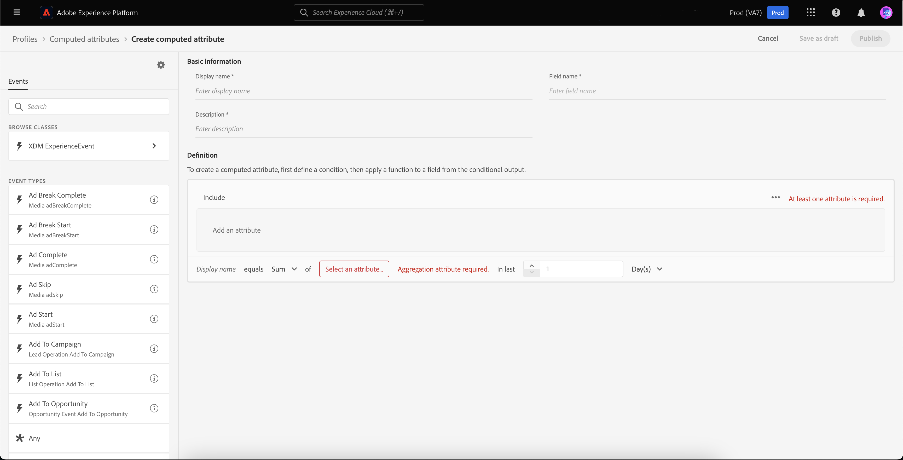

# 未驗證訪客的離站重新目標定位

>[!AVAILABILITY]
>
>已授權Real-Time CDP （應用程式服務）、Adobe Experience Platform Activation、Real-Time CDP、Real-Time CDP Prime、Real-Time CDP Ultimate的客戶可使用此功能。 如需詳細資訊，請閱讀[產品說明](https://helpx.adobe.com/tw/legal/product-descriptions.html)中有關這些套件的詳細資料，並和您的 Adob&#x200B;&#x200B;e 代表聯絡。

瞭解如何建立未驗證訪客的受眾，並使用合作夥伴提供的永久ID重新鎖定他們。

## 為什麼要考慮此使用案例 {#why-use-case}

隨著第三方Cookie的淘汰，數位行銷人員必須重新構想與匿名訪客重新接觸的策略。 選擇與身分供應商整合以即時辨識訪客的品牌，也可運用合作夥伴提供的永續性識別碼，進行離站付費媒體重新目標定位。

雖然流量很高，但許多品牌在轉換階段都會看到大幅下滑。 訪客參與內容和產品示範，但未註冊或購買就離開。

您不僅可以根據站上參與來建立受眾以個人化行銷訊息，還可以使用Adobe對合作夥伴ID的支援來與付費媒體目的地上的訪客重新互動。

## 必要條件和規劃 {#prerequisites-and-planning}

規劃重新鎖定未經驗證的訪客時，請在規劃程式期間考量下列必要條件：

- 我是否已使用適當的身分名稱空間設定合作夥伴ID？

此外，為實施使用案例，您將使用下列Real-Time CDP功能和UI元素。 確保您擁有所有這些區域必要的屬性型存取控制許可權，或要求系統管理員授與您必要的許可權。

- [對象](../../segmentation/home.md)
- [計算屬性](../../profile/computed-attributes/overview.md)
- [目的地](../../destinations/home.md)
- [Web SDK](../../web-sdk/home.md)

## 將合作夥伴資料帶入Real-Time CDP {#get-data-in}

若要建立未驗證訪客的受眾，您必須先將合作夥伴資料匯入Real-Time CDP。

若要瞭解如何使用Web SDK將資料匯入Real-Time CDP的最佳方式，請參閱站上個人化使用案例的[資料管理和事件資料收集區段](./onsite-personalization.md#data-management)。

## 將合作夥伴提供的ID帶往未來 {#bring-partner-ids-forward}

將合作夥伴提供的ID匯入事件資料集後，您需要將此資料放入設定檔記錄中。 您可以利用計算屬性來執行此操作。

計算屬性可讓您快速將設定檔行為資料轉換為設定檔層級的彙總值。 因此，您可以使用這些運算式（例如設定檔的「期限購買總計」），讓您在對象中輕鬆使用計算屬性。 您可以在[計算屬性概述](../../profile/computed-attributes/overview.md)中找到有關計算屬性的詳細資訊。

若要存取計算屬性，請選取&#x200B;**[!UICONTROL 設定檔]**，然後選取&#x200B;**[!UICONTROL 計算屬性]**&#x200B;和&#x200B;**[!UICONTROL 建立計算屬性]**。

![除了[!UICONTROL 設定檔]工作區中的[!UICONTROL 計算屬性]索引標籤之外，還反白顯示[!UICONTROL 建立計算屬性]按鈕。](../assets/offsite-retargeting/create-ca.png)

**[!UICONTROL 建立計算屬性]**&#x200B;頁面就會顯示。 您可以在此頁面使用元件來建立計算屬性。

>[!NOTE]
>
>如需建立計算屬性的詳細資訊，請參閱[計算屬性UI指南](../../profile/computed-attributes/ui.md)。

對於此使用案例，您可以建立計算屬性，如果合作夥伴ID存在，此屬性就會取得過去24小時內合作夥伴ID的最新值。

使用搜尋列，您可以尋找並新增您在站上個人化使用案例[&#128279;](#get-data-in)期間建立的「合作夥伴ID」事件到計算的屬性畫布。

![ [!UICONTROL 事件]索引標籤和搜尋列已反白顯示。](../assets/offsite-retargeting/ca-add-partner-id.png)

將「合作夥伴ID」事件新增至定義後，請將事件篩選條件設為&#x200B;**[!UICONTROL 存在]**，將事件篩選條件設為新增合作夥伴ID的&#x200B;**[!UICONTROL 最近]**&#x200B;值，且回顧期間為24小時。

為計算屬性指定適當的名稱（例如「合作夥伴ID」）和說明，然後選取&#x200B;**[!UICONTROL Publish]**&#x200B;以完成計算屬性建立程式。

## 使用運算屬性建立對象 {#create-audience}

現在您已建立運算屬性，可以使用此運算屬性來建立對象。 在此範例中，您將建立一個受眾，其中包括本月造訪您網站超過5次但尚未註冊的訪客。

若要建立對象，請選取&#x200B;**[!UICONTROL 對象]**，然後選取&#x200B;**[!UICONTROL 建立對象]**。

![已醒目顯示[!UICONTROL 建立對象]按鈕。](../assets/offsite-retargeting/create-audience.png)

會出現對話方塊，要求您選擇[!UICONTROL 撰寫對象]與[!UICONTROL 建置規則]。 選取&#x200B;**[!UICONTROL 建置規則]**，然後選取&#x200B;**[!UICONTROL 建立]**。

![ [!UICONTROL 建置規則]按鈕已反白顯示。](../assets/offsite-retargeting/select-build-rule.png)

便會顯示「區段產生器」頁面。 在此頁面上，您可以使用元件來建立您的對象。

>[!NOTE]
>
>如需有關使用區段產生器的詳細資訊，請參閱[區段產生器UI指南](../../segmentation/ui/segment-builder.md)。

若要達到尋找這些訪客的目標，您必須先將&#x200B;**[!UICONTROL 頁面檢視]**&#x200B;事件新增到您的對象。 選取&#x200B;**[!UICONTROL 欄位]**&#x200B;下的&#x200B;**[!UICONTROL 事件]**&#x200B;索引標籤，然後拖放&#x200B;**[!UICONTROL 頁面檢視]**&#x200B;事件並將其新增至事件區段畫布。

![顯示[!UICONTROL 頁面檢視]事件時，[!UICONTROL 欄位]區段中的[!UICONTROL 事件]索引標籤會反白顯示。](../assets/offsite-retargeting/add-page-view.png)

選取新新增的&#x200B;**[!UICONTROL 頁面檢視]**&#x200B;事件。 將回顧期間從&#x200B;**[!UICONTROL 任何時間]**&#x200B;變更為&#x200B;**[!UICONTROL 本月]**，並變更事件規則以包含&#x200B;**至少5**。

![顯示新增的[!UICONTROL 頁面檢視]事件的詳細資料。](../assets/offsite-retargeting/edit-event.png)

新增事件後，您需要新增屬性。 由於您使用的是未經驗證的訪客，因此可以新增您剛建立的計算屬性。 這個新建立的計算屬性可讓您將合作夥伴ID連結至對象。

若要新增運算屬性，請在&#x200B;**[!UICONTROL 屬性]**&#x200B;下選取&#x200B;**[!UICONTROL XDM個人設定檔]**，接著選取&#x200B;**[您組織的租使用者識別碼](../../xdm/api/getting-started.md#know-your-tenant-id)。**、**[!UICONTROL SystemComputedAttributes]**&#x200B;和&#x200B;**[!UICONTROL 夥伴識別碼]**。 現在，將計算屬性的&#x200B;**[!UICONTROL Value]**&#x200B;新增至畫布的屬性區段。

此外，請搜尋&#x200B;**[!UICONTROL 個人電子郵件]**，並將&#x200B;**[!UICONTROL PartnerID]**&#x200B;下方的&#x200B;**[!UICONTROL Address]**&#x200B;屬性新增至畫布的屬性區段。

![在Segment Builder畫布上反白顯示[!UICONTROL PartnerID]計算屬性和[!UICONTROL 個人電子郵件地址]屬性。](../assets/offsite-retargeting/added-attributes.png)

現在您已新增屬性，您必須設定其評估准則。 針對&#x200B;**[!UICONTROL PartnerID]**，將條件設定為&#x200B;**[!UICONTROL 存在]**，針對&#x200B;**[!UICONTROL 位址]**，將條件設定為&#x200B;**[!UICONTROL 不存在]**。

您現在已成功建立受眾，尋找具有合作夥伴提供ID但尚未註冊您網站的高強度訪客。 將您的對象命名為「重新鎖定未經驗證的使用者」，並選取「**[!UICONTROL 儲存]**」以完成建立您的對象。

## 啟用您的對象 {#activate-audience}

成功建立對象後，您現在可以針對下游目的地啟用此對象。 在左側導覽邊欄上選取&#x200B;**[!UICONTROL 對象]**，尋找您新建立的對象，選取省略符號圖示，然後選取&#x200B;**[!UICONTROL 啟用至目的地]**。

![已反白顯示[!UICONTROL 啟用至目的地]按鈕。](../assets/offsite-retargeting/activate-to-destination.png)

>[!NOTE]
>
>所有目的地型別（包括檔案型目的地）都支援使用合作夥伴ID進行受眾啟用。
>
>如需將對象啟用至目的地的詳細資訊，請參閱[啟用概觀](../../destinations/ui/activation-overview.md)。

**[!UICONTROL 啟用目的地]**&#x200B;頁面隨即顯示。 您可以在此頁面選取要啟用目的地的目的地。 在選取選擇的目的地之後，選取&#x200B;**[!UICONTROL 下一步]**。

**[!UICONTROL 排程]**&#x200B;頁面隨即顯示。 您可以在此頁面建立排程，決定要啟動對象的頻率。 選取&#x200B;**[!UICONTROL 建立排程]**&#x200B;以建立對象啟用的排程。

![已反白顯示[!UICONTROL 建立排程]按鈕。](../assets/offsite-retargeting/select-create-schedule.png)

出現[!UICONTROL 排程]彈出視窗。 您可以在此頁面建立對象啟用的排程。 設定排程後，選取&#x200B;**[!UICONTROL 建立]**&#x200B;以繼續。

確認排程詳細資料後，選取&#x200B;**[!UICONTROL 下一步]**。

**[!UICONTROL 選取屬性]**&#x200B;頁面就會顯示。 在此頁面上，您可以選取要連同已啟用的對象一起匯出哪些屬性。 您至少會想要包含合作夥伴ID，因為這樣可讓您識別要重新定位的訪客。 選取&#x200B;**[!UICONTROL 新增對應]**&#x200B;並搜尋計算屬性。 新增必要的屬性後，選取&#x200B;**[!UICONTROL 下一步]**。

![ [!UICONTROL 新增對應]按鈕和計算屬性都會反白顯示。](../assets/offsite-retargeting/add-new-mapping.png)

**[!UICONTROL 檢閱]**&#x200B;頁面隨即顯示。 您可以在此頁面檢閱對象啟用的詳細資訊。 如果您對提供的詳細資料感到滿意，請選取&#x200B;**[!UICONTROL 完成]**。

![顯示[!UICONTROL 檢閱]頁面，顯示對象啟用的詳細資料。](../assets/offsite-retargeting/review-destination-activation.png)

您現在已將未驗證使用者的對象啟動至下游目的地，以進一步重新鎖定目標。

## 其他使用案例 {#other-use-cases}

您可以透過Real-Time CDP中的合作夥伴資料支援，進一步探索啟用的使用案例：

- [使用合作夥伴資料與新客戶互動並取得客戶](./prospecting.md)。
- [利用合作夥伴協助的訪客辨識功能，個人化現場體驗](./offsite-retargeting.md)。
- [使用合作夥伴提供的屬性補充第一方設定檔](./supplement-first-party-profiles.md)。
