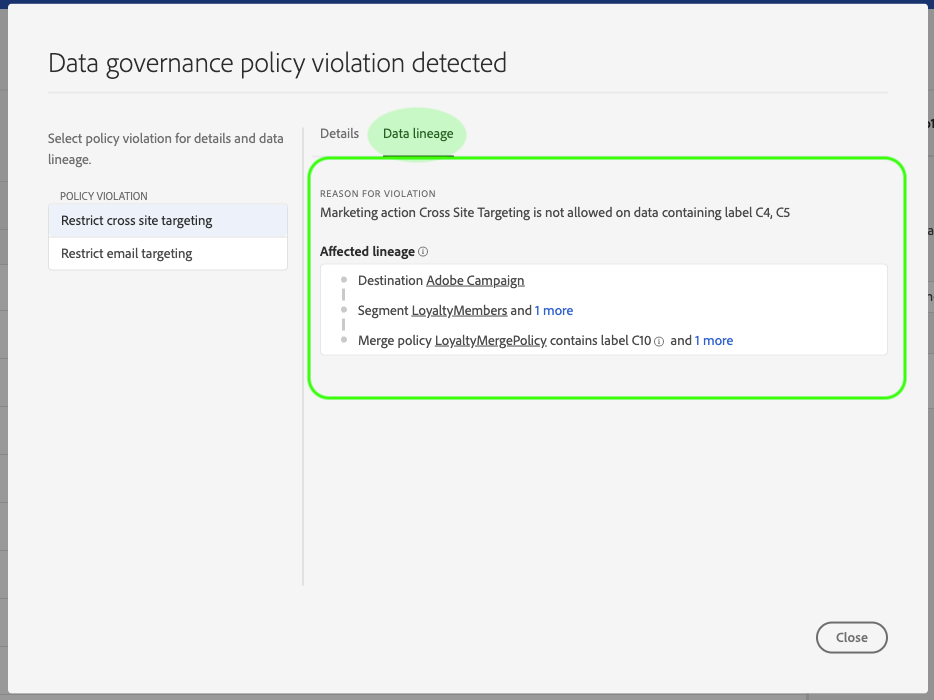

# 即時CDP中的資料治理

即時客戶資料平台（即時CDP）將來自多個企業系統的資料整合在一起，讓行銷人員能夠更好地識別、瞭解並吸引客戶。 此資料可能受您組織或法律法規所定義的使用限制所約束。 因此，在處理資料時，務必確保即時CDP符合使用策略。

Adobe Experience Platform資料管理可讓您管理客戶資料，並確保符合資料使用適用的法規、限制和政策。 它在即時CDP中扮演了關鍵角色，允許您定義使用策略、根據這些策略對資料進行分類，以及在執行某些行銷操作時檢查是否違反策略。

即時CDP建立在Adobe Experience Platform之上，因此Experience Platform檔案中涵蓋了大部分的資料治理功能。 本文檔旨在補充Experience Platform的 [Data Governance概述](../../data-governance/home.md) ，並概述即時CDP中提供的Governance功能。 涵蓋下列主題：

* [將使用標籤套用至您的資料](#labels)
* [管理資料使用原則](#policies)
* [強制符合資料使用規範](#enforcement)

## 將使用標籤套用至您的資料 {#labels}

資料控管可讓您在資料集或資料集欄位層級，將使用標籤套用至資料。 資料使用標籤可讓您根據套用至該資料的使用原則來分類資料。

如需使用資料使用標籤的詳細資訊，請參 [閱Adobe Experience Platform的資料使用標籤](../../data-governance/labels/overview.md) 使用指南。

## 設定目標限制

您可以定義目標的行銷使用案例，以設定目標的資料使用限制。 定義目的地的使用案例可讓您檢查是否違反使用原則，並確保傳送至該目的地的任何描述檔或區段都與「資料管理」規則相容。

您可以在「編輯目標」工作流程的「 _設定_ 」階段中 _定義行銷使用案例_ 。 如需詳細資訊，請參閱目標檔案。

## 管理資料使用原則 {#policies}

為了讓資料使用標籤有效支援資料遵循，必須定義並啟用資料使用原則。 資料使用原則是描述您允許或限制在即時CDP中對資料執行的行銷動作類型的規則。 如需詳細資訊，請參閱Experience Platform [Data Governance總覽中的「資料使](../../data-governance/home.md) 用政策」一節。

Adobe Experience Platform針對常見客 **戶體驗使用案** 例提供數種核心政策。 如 [Policy Service Developer Guide中「List all policies」（列出所有原則）一節所示，可透過向](https://www.adobe.io/apis/experienceplatform/home/api-reference.html#!acpdr/swagger-specs/dule-policy-service.yaml)DULE Policy Service API [(](../../data-governance/policies/overview.md)DULE Policy Service API)提出請求來檢視這些原則。 您也可以建立自己的自 **訂原則** ，以建立自訂使用限制的模型，如開發人員指南的「建立原則」一節所示。

## （測試版）強制符合資料使用規範 {#enforce-data-usage-compliance}

>[!IMPORTANT]
>此功能目前為測試版，並非所有使用者都能使用。 可應要求啟用。 說明檔案和功能可能會有所變更。

在標籤資料並定義使用策略後，您就可以強制資料使用與策略相符。 在即時CDP中激活對象細分到目標時，資料治理會在發生任何違規時自動實施使用策略。

下圖說明如何將策略實施整合到區段啟動的資料流中：

首次啟用區段時，DULE Policy Service會根據下列因素檢查是否有違反原則的情況：

* 套用至區段內要啟用之欄位和資料集的資料使用標籤。
* 目的地的行銷目的。

### 策略違規消息 {#enforcement}

如果發生原則違規，而無法嘗試啟動區段(或對已啟動的區段 [進行編輯](#policy-enforcement-for-activated-segments))，則會防止動作，並出現一個快顯視窗，指出已違反一或多個原則。 在快顯的左欄中選取原則違規，以顯示該違規的詳細資料。

快顯的「詳細 *資訊* 」標籤會指出觸發違規的動作以及違規發生的原因，並提供如何潛在解決問題的建議。

按一下 **資料世系** ，以跟蹤其資料標籤觸發違規的目標、段、合併策略或資料集。

一旦觸發違規， **Save** （儲存）按鈕就會停用以啟動，直到適當的元件更新為符合資料使用政策為止。

### 啟用區段的原則強制 {#policy-enforcement-for-activated-segments}

在區段啟動後，原則實施仍適用於區段，限制對區段或其目的地的任何變更，以致發生原則違規。 由於將區段啟用至目的地時涉及的元件眾多，下列任何動作都可能觸發違規：

* 更新資料使用標籤
* 變更區段的資料集
* 變更區段謂語
* 更改目標配置

如果上述任何動作都觸發違規，則無法儲存該動作，並顯示原則違規訊息，以確保您啟用的區段在被修改時繼續符合資料使用原則。

## 後續步驟

現在，您已經介紹了Real-time CDP的主要資料治理功能，以及Experience Platform如何讓這些功能發揮作用，請繼續閱讀Adobe Experience Platform上的 [資料治理檔案](../../data-governance/home.md)。 本檔案提供基本資料治理概念的概觀，以及管理資料使用標籤和原則的逐步工作流程。