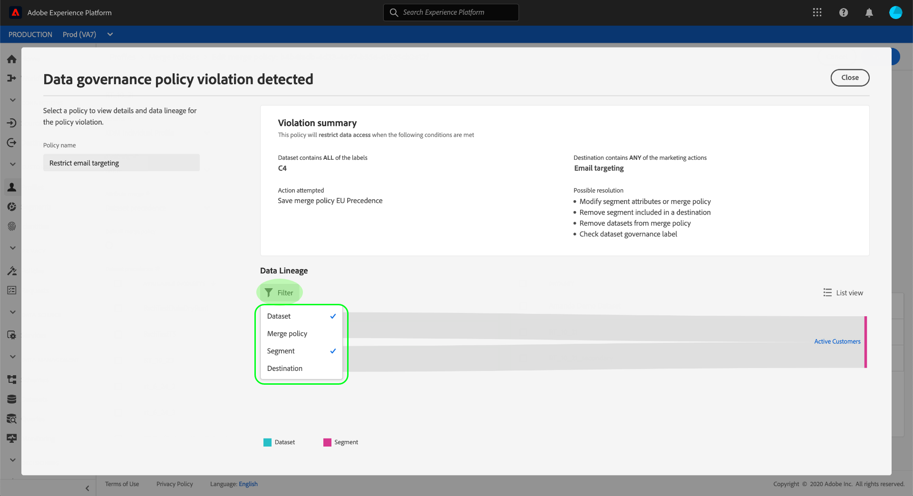

# [!DNL Data Governance] 即時CDP

[!DNL Real-time Customer Data Platform] （即時CDP）將來自多個企業系統的資料整合在一起，讓行銷人員能夠更好地識別、瞭解並吸引客戶。 此資料可能受您組織或法律法規所定義的使用限制所約束。 因此，在處理資料時，務必確保即時CDP符合使用策略。

Adobe Experience Platform可 [!DNL Data Governance] 讓您管理客戶資料，並確保符合資料使用適用的法規、限制和政策。 它在即時CDP中扮演了關鍵角色，允許您定義使用策略、根據這些策略對資料進行分類，以及在執行某些行銷操作時檢查是否違反策略。

即時CDP是以Adobe Experience Platform為基礎而建立的，因此說明檔案中 [!DNL Data Governance] 涵蓋了大部分功 [!DNL Experience Platform] 能。 本文檔旨在補充Data [Governance概述](../../data-governance/home.md)[!DNL Experience Platform]，並概述Real-time CDP中提供的Governance功能。 涵蓋下列主題：

* [將使用標籤套用至您的資料](#labels)
* [管理資料使用原則](#policies)
* [強制符合資料使用規範](#enforce-data-usage-compliance)

## 將使用標籤套用至您的資料 {#labels}

[!DNL Data Governance] 可讓您在資料集或資料集欄位層級，將使用標籤套用至您的資料。 資料使用標籤可讓您根據套用至該資料的使用原則來分類資料。

如需使用資料使用標籤的詳細資訊，請參 [閱Adobe Experience Platform的資料使用標籤](../../data-governance/labels/overview.md) 使用指南。

## 設定目標的行銷使用案例 {#destinations}

您可以定義目標的行銷使用案例（也稱為行銷動作），以設定目標的資料使用限制。 目的地的行銷使用案例會指出將匯出至該目的地的資料意圖。

>[!NOTE]
>
>如需行銷動作及其在資料使用政策中使用的詳細資訊，請參閱文 [件中的資料使用政策](../../data-governance/policies/overview.md) 概 [!DNL Experience Platform] 觀。

定義目的地的行銷使用案例可讓您確保傳送至這些目的地的任何描述檔或區段符合資料使用政策。 因此，您應根據組織對啟動實施政策限制的需求，將適當的行銷使用案例新增至您的目的地。

行銷使用案例只能在第一次設定目標時選取。 根據您使用的目的地類型，設定行銷使用案例的機會會顯示在設定工作流程的不同點。 如需如 [何設定特定目的地的步驟](../destinations/destinations-overview.md#data-governance) ，請參閱目的地檔案。

## 管理資料使用原則 {#policies}

為了讓資料使用標籤有效支援資料遵循，必須定義並啟用資料使用原則。 資料使用原則是描述您允許或限制在即時CDP中對資料執行的行銷動作類型的規則。 如需詳細資訊，請參閱資料管理概 [!DNL Experience Platform] 述中 [的「資料使用政策](../../data-governance/home.md) 」一節。

Adobe Experience Platform針對常見客戶體驗使用案例提供數個核心政策。 瀏覽至「原則」工作區並選取「瀏覽」標籤，即可在UI中 **[!UICONTROL 檢視]** 這些 **[!UICONTROL 原則]** 。 請參 [閱說明檔案中的原則](../../data-governance/policies/user-guide.md) ，以 [!DNL Experience Platform] 取得在UI中使用原則的詳細步驟，包括如何制定您自己的自訂原則。

## 強制符合資料使用規範 {#enforce-data-usage-compliance}

在標籤資料並定義使用策略後，您就可以強制資料使用與策略相符。 在即時CDP中啟用對象區段至目標時， [!DNL Data Governance] 當發生任何違規時，會自動實施使用策略。

下圖說明如何將策略實施整合到區段啟動的資料流中：

首次啟用區段時，會根 [!DNL Policy Service] 據下列因素檢查違反原則的情況：

* 套用至區段內要啟用之欄位和資料集的資料使用標籤。
* 目的地的行銷目的。

>[!NOTE]
>
>如果資料集（而非整個資料集）中的某些欄位僅套用資料使用標籤，則只有在下列情況下才會執行這些欄位層級標籤：
>* 欄位會用於區段定義中。
>* 欄位被配置為目標目標的預計屬性。

### 資料世系 {#lineage}

在即時CDP中，資料世系在如何執行策略方面起著關鍵作用。 一般而言，資料世系是指資料集的來源，以及隨著時間變化（或其移動位置）的結果。

在上下文中，世系 [!DNL Data Governance]可讓資料使用標籤從資料集傳播到使用其資料的下游服務，例如即時客戶個人檔案和目標。 這可讓客戶在資料的平台歷程中的幾個關鍵點評估並執行政策，並提供資料消費者關於發生政策違規之原因的上下文。

在即時CDP中，策略執行涉及以下世系：

1. 資料被吸收到即時CDP中並儲存在數 **據集**。
1. 通過根據合併策略合併資料片段，從這些資料集中識別和構建客戶 **概要檔案**。
1. 描述檔群組會根據共 **同屬** 性分為區段。
1. 區段會啟動至下游 **目的地**。

如下表所述，上述時間軸的每個階段代表可能導致違反策略的實體：

| 資料世系階段 | 在政策執行中的角色 |
| --- | --- |
| 資料集 | 資料集包含資料使用標籤（套用在資料集或欄位層級），可定義整個資料集或特定欄位可用於哪些使用案例。 如果資料集或包含特定標籤的欄位用於原則限制的目的，就會發生原則違規。 |
| 合併原則 | 合併原則是平台用來決定在合併多個資料集的片段時，資料的優先順序的規則。 如果您的合併策略被配置為將具有受限制標籤的資料集激活到目標，則將發生策略違規。 如需詳細資訊，請 [參閱合併](../../profile/ui/merge-policies.md) 原則指南。 |
| 區段 | 區段規則定義應從客戶個人檔案中納入哪些屬性。 區段定義會根據區段定義包含哪些欄位，而區段會繼承這些欄位所套用的使用標籤。 如果您啟用的區段繼承的標籤受目標目的地的適用政策（根據其行銷使用案例）所限制，就會發生違反原則的情況。 |
| 目的地 | 設定目標時，可定義行銷動作（有時稱為行銷使用案例）。 此使用案例與資料使用原則中定義的行銷動作相關。 換言之，您為目標定義的行銷使用案例會決定哪些資料使用原則適用於該目標。 如果您啟用區段，且其使用標籤受目標目的地適用原則的限制，就會發生違反原則的情況。 |

當發生違反原則的情況時，UI中顯示的產生訊息會提供有用的工具，以探索違規的貢獻資料世系，以協助解決問題。 下一節將提供更多詳細資訊。

### 策略違規消息 {#enforcement}

如果發生原則違規，而無法嘗試啟動區段(或對已啟動的區段 [進行編輯](#policy-enforcement-for-activated-segments))，則會防止動作，並出現一個快顯視窗，指出已違反一或多個原則。 一旦觸發違規，您要修改的實體的「 **[!UICONTROL Save]** 」（儲存）按鈕會停用，直到適當的元件更新為符合資料使用原則為止。

在快顯的左欄中選取原則違規，以顯示該違規的詳細資料。

違規消息提供了違反策略的概要，包括策略配置為檢查的條件、觸發違規的具體操作以及問題的可能解決方法清單。

違規摘要下方會顯示一個資料世系圖，允許您直觀地顯示哪些資料集、合併策略、段和目標與策略違規有關。 您當前正在更改的圖元在圖中突出顯示，指示流中的哪個點導致違規。 您可以在圖形中選取實體名稱，以開啟相關實體的詳細資訊頁面。

您也可以使用「篩 **[!UICONTROL 選]** 」圖示()，依類別篩選顯示的實體。 至少必須選取兩個類別，才能顯示資料。

選擇 **[!UICONTROL 清單視圖]** ，將資料世系顯示為清單。 若要切換回視覺圖形，請選取「路 **[!UICONTROL 徑檢視」]**。

### 啟用區段的原則強制 {#policy-enforcement-for-activated-segments}

在區段啟動後，原則實施仍適用於區段，限制對區段或其目的地的任何變更，以致發生原則違規。 由於資料世 [系在策略實施中](#lineage) ，下列任何動作都可能觸發違規：

* 更新資料使用標籤
* 變更區段的資料集
* 變更區段謂語
* 更改目標配置

如果上述任何動作都觸發違規，則無法儲存該動作，並顯示原則違規訊息，以確保您啟用的區段在被修改時繼續符合資料使用原則。

## 後續步驟

現在，您已經瞭解Real- [!DNL Data Governance] time CDP的主要功能，以及如何 [!DNL Experience Platform] 啟用這些功能，請繼續閱讀Adobe Experience Platform上 [的資料治理檔案](../../data-governance/home.md)。 本檔案提供基本概念 [!DNL Data Governance] 的概觀，以及管理資料使用標籤和原則的逐步工作流程。

以下視頻概述了即時CDP [!DNL Data Governance] 中的內容，包括對目標的市場營銷使用案例以及不同方案的示例工作流：

>[!VIDEO](https://video.tv.adobe.com/v/33631?quality=12&learn=on)