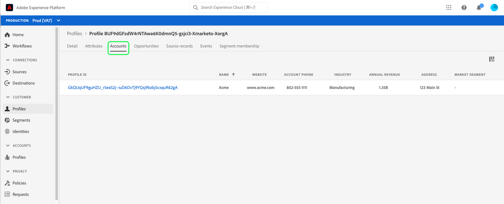

# 在Real-time Customer Data Platform中瀏覽設定檔

即時客戶設定檔可為個別客戶建立整體檢視，並結合來自多個管道的資料，包括線上、離線、CRM和第三方資料。 由於個別設定檔是根據從各種來源帶入系統的資料進行彙總，每個設定檔都成為可操作、附有時間戳記的帳戶，說明客戶與您的品牌每次互動。

在Adobe Experience Platform使用者介面中，您可以檢視這些唯讀設定檔，並檢視有關每個個別客戶的重要資訊，包括其偏好設定、過去事件、互動和個人所屬的對象。

Adobe Real-time Customer Data Platform是以Adobe Experience Platform為基礎所打造，因此能夠使用Experience PlatformUI中的設定檔檢視功能。 如需在平台使用者介面中檢視客戶設定檔的詳細指南，請參閱 [即時客戶設定檔使用手冊](../../profile/ui/user-guide.md).

## Real-Time CDP B2B版本的設定檔增強功能

除了Adobe Experience Platform、Real-Time CDP支援的設定檔瀏覽功能外，B2B版本使用者還可以在以下位置存取客戶設定檔中的B2B屬性和事件： [!UICONTROL 屬性] 和 [!UICONTROL 事件] 標籤之間。 B2B資料也可用來執行分段，使這些受眾出現在客戶的 [!UICONTROL 對象會籍] 標籤中標籤非B2B對象。

Real-Time CDP， B2B Edition也可讓您瀏覽 [!UICONTROL 帳戶]， [!UICONTROL 機會]、和 [!UICONTROL 來源記錄] 來自與個別客戶相關聯的企業來源。

若要探索這些增強功能，請依照以下說明的步驟開始進行 [即時客戶設定檔使用手冊](../../profile/ui/user-guide.md) 依合併原則或身分名稱空間瀏覽設定檔。

設定檔詳細資料包括存取以下專案： [!UICONTROL 帳戶]， [!UICONTROL 機會]、和 [!UICONTROL 來源記錄] 索引標籤中提供的標準資訊之外，客戶設定檔中也增強了B2B事件和屬性。

### 帳戶標籤

選取 **[!UICONTROL 帳戶]** 以檢視與設定檔相關的帳戶清單。 此清單包含帳戶設定檔的基本資訊，例如帳戶的名稱、網站和產業，以及帳戶設定檔的連結。

如需檢視和探索帳戶設定檔的詳細資訊，請從閱讀 [帳戶設定檔概述](../accounts/account-profile-overview.md).

### 機會標籤

此 **[!UICONTROL 機會]** 頁標提供與帳戶相關的未結與已結業務機會的明細。 這些機會可能會從多個來源引入Experience Platform，但Real-Time CDP， B2B版本讓行銷人員輕鬆地在一個位置一起看到所有這些機會。

每個機會都包含一些資訊，例如機會的名稱、數量、階段，以及機會是否開啟、關閉、成功或失敗。

### 來源記錄標籤

此 **[!UICONTROL 來源記錄]** 索引標籤可讓您輕鬆檢視來自企業來源的多個來源記錄，這些記錄對單一客戶設定檔有貢獻。 除了 [!UICONTROL 個人來源金鑰] 和電子郵件地址，每個來源記錄也提供記錄型別（例如，「聯絡人」或「潛在客戶」記錄）以及來源。

