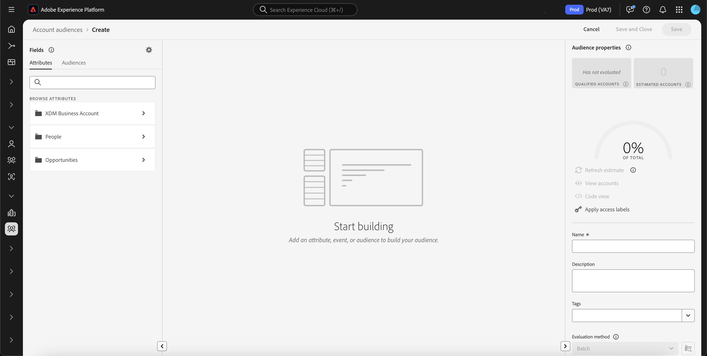

# Real-Time Customer Data Platform中的對象產生器

[!DNL Adobe Real-Time Customer Data Platform]以Adobe Experience Platform為基礎建置，能夠利用[!DNL Experience Platform]所包含的完整Audience Builder功能。 工作區提供用於建置和編輯規則的直覺式控制項，例如用來表示資料屬性的拖放圖磚。

{zoomable="yes"}

## 欄位 {#fields}

針對帳戶使用Audience Builder時，您可以使用帳戶屬性或現有對象作為對象的欄位。

您可以選取來調整顯示欄位的設定。

{zoomable="yes"}

>[!NOTE]
>
>**[!UICONTROL 欄位選項]**&#x200B;區段目前為測試版，僅供特定客戶使用。 如需詳細資訊，請聯絡Adobe客戶服務。

顯示[!UICONTROL 設定]區段。 在此區段中，您可以更新顯示哪些欄位以及欄位之間的關係。

對於&#x200B;**[!UICONTROL 欄位選項]**，您可以只顯示包含資料的欄位或完整XDM結構描述。

針對欄位的&#x200B;**[!UICONTROL 關聯性]**，您可以使用組織的標準關聯性或顯示關聯性選取器。

{width="300"}

### 屬性 {#attributes}

[!UICONTROL 屬性]標籤可讓您瀏覽屬於XDM商業帳戶類別的帳戶屬性，以及商機和以人物為基礎的屬性。 每個資料夾都可以展開以顯示其他屬性，其中每個屬性都是一個可拖曳至工作區中央[規則產生器畫布](#rule-builder-canvas)的圖磚。

選取屬性時，您可以選取[資訊圖示](../../images/icons/info.png)來檢視摘要資料。 摘要資料包含頂端值、欄位內容的說明，以及包含此屬性值的帳戶百分比等資訊。

{width="300"}

如果屬性由少於25%的帳戶填入，則會改為顯示。 無論如何，屬性都會顯示相同的摘要資料。

{width="300"}

>[!NOTE]
>
>摘要資料僅在屬性屬於Account、Person或Opportunity結構描述時才可用。 此外，只有在欄位&#x200B;**not**&#x200B;包含太多不同的值，而且這些欄位的值通常重複時，才會顯示頂端值。
>
>此摘要資料會每日&#x200B;**更新**。

如需對象產生器的詳細指南，請閱讀[對象產生器使用手冊](../../segmentation/ui/segment-builder.md){target="_blank"}。

### 客群 {#audiences}

**[!UICONTROL 對象]**&#x200B;索引標籤會列出Experience Platform中可用的所有以人物為基礎和以帳戶為基礎的對象。

您可以將滑鼠停留在對象旁的上，即可檢視對象的相關資訊，包括其ID、說明以及資料夾階層，以找出對象。

{zoomable="yes"}

## 規則產生器畫布 {#rule-builder-canvas}

在Audience Builder中建立的受眾是用來描述目標受眾關鍵特性或行為的規則集合。 這些規則是使用位於「對象產生器」中心的規則產生器畫布所建立。

若要將新規則新增至您的區段定義，請從&#x200B;**[!UICONTROL 欄位]**&#x200B;標籤中拖曳圖磚，並將其拖曳至規則產生器畫布。

{zoomable="yes"}

如需使用規則產生器畫布的詳細資訊，請參閱[區段產生器檔案](../../segmentation/ui/segment-builder.md#rule-builder-canvas){target="_blank"}。

### 容器 {#containers}

會依列出的順序評估對象規則。 您可以使用容器，透過使用巢狀查詢進一步掌控執行順序。

如需容器的詳細資訊，請參閱[區段產生器檔案](../../segmentation/ui/segment-builder.md#containers){target="_blank"}。

## 客群屬性 {#properties}

**[!UICONTROL 對象屬性]**&#x200B;區段會顯示對象的相關資訊，包括預估的對象人數。 您也可以指定有關對象的詳細資料，包括其名稱、說明和標籤。

{width="300"}

**[!UICONTROL 合格帳戶]**&#x200B;表示符合對象規則的實際帳戶數量。 此數字會在細分工作執行後，每24小時更新一次。

**[!UICONTROL 預估帳戶]**&#x200B;表示根據範例工作的大約帳戶數。 新增新規則或條件並選取&#x200B;**[!UICONTROL 重新整理預估值]**&#x200B;後，您可以更新此值。

{width="300"}

您可以選取&#x200B;**[!UICONTROL 檢視帳戶]**，以檢視符合目前規則對象資格的帳戶抽樣。

![[檢視帳戶]按鈕已反白顯示。](../assets/segmentation/audience-builder/view-accounts.png){width="300"}

**[!UICONTROL 程式碼檢視]**&#x200B;提供對象規則的文字型程式碼描述。

您可以選取&#x200B;**[!UICONTROL 套用存取權標籤]**&#x200B;以套用對象的相關存取權標籤。 如需存取標籤的詳細資訊，請參閱[管理標籤指南](../../access-control/abac/ui/labels.md){target="_blank"}。

![顯示[套用存取權和資料控管標籤]彈出視窗。](../assets/segmentation/audience-builder/apply-access-labels.png)

其餘的「對象屬性」區段可讓您編輯與帳戶對象相關的詳細資訊，包括名稱、說明和標籤。

{width="300"}

您&#x200B;**無法**&#x200B;變更帳戶對象的評估方法，因為所有帳戶對象都是使用批次細分來評估。

## 後續步驟 {#next-steps}

對象產生器提供豐富的工作流程，可讓您從XDM商業帳戶資料建立對象。

若要進一步瞭解客戶設定檔資料的分段服務，請參閱[分段服務總覽](../../segmentation/home.md){target="_blank"}。
