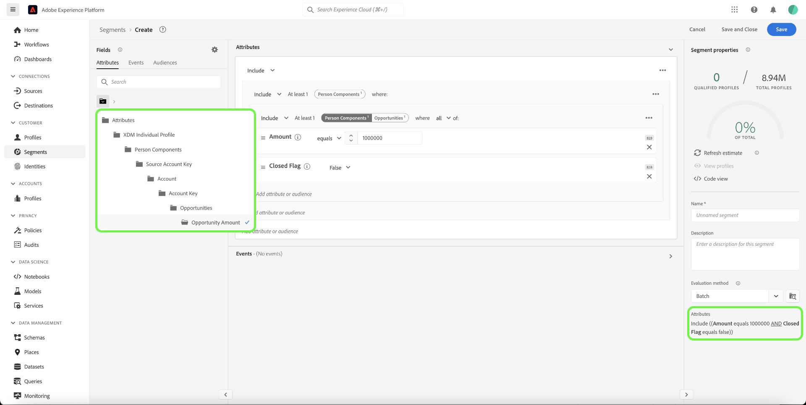
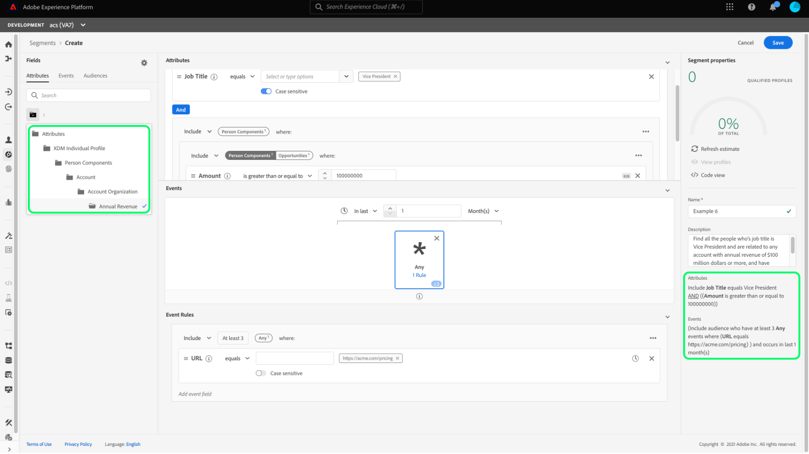

# Real-time Customer Data Platform B2B Edition的分段使用案例

本檔案提供Adobe Real-time Customer Data Platform B2B Edition中的區段定義範例，並說明如何為常見的B2B使用案例合併不同型別的屬性。 若要瞭解目的地如何適合您的B2B工作流程，請參閱 [端到端教學課程](../b2b-tutorial.md#create-a-segment-to-evaluate-your-data).

>[!NOTE]
>
>這些細分使用案例所需的屬性僅供Real-time Customer Data Platform B2B Edition客戶使用。 如果您沒有使用Real-time Customer Data Platform B2B Edition，請參閱 [分段總覽](./segmentation-overview.md) 而非。

## 先決條件 {#prerequisites}

您必須先完成下列步驟，才能對B2B類別使用分段屬性：

1. 建立使用B2B類別的結構描述。 B2B版本類別包括Account、Campaign、Opportunity、Marketing List等。 有關的資訊 [如何設定搭配B2B類別使用的結構描述](../schemas/b2b.md) 請參閱結構描述檔案。
1. 在您的Experience Data Model (XDM) B2B結構描述之間建立關係。 根據B2B版本屬性的區段需要類別之間的關係，才能完全使用擴充的B2B區段功能。 請參閱以下檔案： [如何定義兩個B2B結構描述之間的關係](../../xdm/tutorials/relationship-b2b.md) 以取得詳細資訊。
1. 使用以您的B2B結構為基礎的資料集來擷取資料。 請參閱來原始檔，瞭解 [有關如何內嵌資料的資訊](../../sources/connectors/adobe-applications/marketo/marketo.md).
1. 閱讀 [區段產生器使用手冊](../../segmentation/ui/segment-builder.md) 以取得如何建立對象的詳細指引。

在滿足這些需求後，您就可以針對常見的B2B使用案例來組合這些屬性。

## 快速入門 {#getting-started}

一旦B2B類別的聯合結構描述已建立關係並已用於內嵌資料，其屬性即可在區段產生器的左側邊欄中使用。

B2B類別及其屬性會附加 `B2B` 區段工作區中的標籤，以便與Real-time Customer Data Platform中的標準標籤區分開來。

為了有效建立B2B使用案例的對象，熟悉結構並瞭解資料模型非常重要。 知道資料從一個資料物件前往另一個資料物件的路徑也很有用。

下圖說明Real-Time CDP B2B Edition中可用B2B類別之間的關係。

由於您的資料模型可能很複雜，因此您可以使用Platform UI來檢視資料模型的更詳細視覺化表示法，以協助尋找使用案例的相關屬性。 若要開始，請前往Platform UI，然後在左側導覽中選取結構描述。

從可用清單中選取適當的結構描述，並從中選擇適當的關係 [!UICONTROL 組合] 側邊欄。 在以下範例中，選取「Person」關係會顯示目前結構描述中哪個屬性會參考相關的「Person」結構描述（如果它是關係中的來源結構描述），或被「Person」結構描述（如果它是關係中的參考結構描述）參考。

此關係可透過使用的反映在區段產生器中 `Key` 資料夾，如下圖所示。

請參閱 [Real-time Customer Data Platform B2B Edition檔案中的結構描述](../schemas/b2b.md) 以取得可用B2B類別的詳細資訊。

以下使用案例提供有關哪些類別用於建立不同結構描述之間的關係以實現這些結果的資訊。 這些範例可用來協助您建立自己的區段。

## 不同區段使用案例的範例 {#use-cases}

下列使用案例可用於B2B版本的分段。 每個範例都會提供對象所做動作的說明，以及用來建立對象的類別說明。 提供的影像會反白顯示 [!UICONTROL 屬性] 反映結構描述的側邊欄。 此 [!UICONTROL 區段屬性] 顯示右側的部分包含對象屬性的書面劃分。

### 範例1：尋找B2B機會的「決策者」 {#find-decision-maker}

尋找所有商機的「決策者」人員。 此對象需要 [!UICONTROL XDM個別設定檔] 類別與 [!UICONTROL XDM商業機會個人關係] 類別。

### 範例2：尋找指派給商機超過特定金額的B2B設定檔 {#find-opportunities-amount}

尋找直接指派給任何商機金額超過指定金額（100萬美元）之商機的所有人員。 此對象需要 [!UICONTROL XDM個別設定檔] 類別， [!UICONTROL XDM商業機會個人關係] 類別，和 [!UICONTROL XDM商業機會] 類別。

### 範例3：依地點尋找指派給商機的B2B設定檔 {#find-opportunities-location}

尋找直接指派至帳戶位於指定位置（加拿大）之任何商機的所有人員。 此對象需要 [!UICONTROL XDM個別設定檔] 類別， [!UICONTROL XDM商業機會個人關係] 類別， [!UICONTROL XDM商業機會] 類別，和 [!UICONTROL XDM商業帳戶] 類別。

### 範例4：依產業和瀏覽行為尋找機會的「決策者」 {#find-industry-browsing-behavior}

尋找客戶屬於「金融」產業之任何機會的「決策者」所有人員，並在過去三天造訪過定價頁面。 此對象需要 [!UICONTROL XDM個別設定檔] 類別， [!UICONTROL XDM商業機會個人關係] 類別， [!UICONTROL XDM商業機會] 類別，和 [!UICONTROL XDM商業帳戶] 類別，和 [!UICONTROL XDM ExperienceEvent] 類別。

### 範例5：依部門名稱和商機金額搜尋商機的B2B設定檔 {#find-department-opportunity-amount}

尋找在人力資源(HR)部門工作的所有人員，以及擁有至少有一個與指定金額（100萬美元）或以上的未結商機之帳戶的所有人員。 此對象需要 [!UICONTROL XDM個別設定檔] 類別， [!UICONTROL XDM商業帳戶] 類別，和 [!UICONTROL XDM商業機會] 類別。

### 範例6：依職稱和年度帳戶收入尋找B2B設定檔 {#find-by-job-title-and-revenue}

尋找所有職銜為「副總裁」且帳戶年收入達到或超過指定金額（1億美元）的人，並於上個月至少造訪過3次定價頁面。 此對象需要 [!UICONTROL XDM個別設定檔] 類別， [!UICONTROL XDM商業帳戶] 類別，和 [!UICONTROL XDM ExperienceEvent] 類別。

### 範例7：依機會狀態和瀏覽行為尋找「決策者」 {#find-by-opportunity-status-and-browsing-behavior}

尋找任何已結束但遺失商機的「決策者」人員，並於上週造訪定價頁面。 此對象需要 [!UICONTROL XDM個別設定檔] 類別， [!UICONTROL XDM商業機會個人關係] 類別， [!UICONTROL XDM商業機會] 類別，和 [!UICONTROL XDM ExperienceEvent] 類別。

### 範例8：使用相關帳戶來擴大細分範圍 {#related-accounts}

尋找在人力資源(HR)部門工作並與任何帳戶相關的所有人員 *或帳戶的任何相關帳戶* 至少有一個價值等於或超過指定金額（100萬美元）的未完成商機。 此對象需要 [!UICONTROL XDM個別設定檔] 類別， [!UICONTROL XDM商業帳戶] 類別，和 [!UICONTROL XDM商業機會] 類別。

### 範例9：使用潛在客戶分數和/或帳戶分數來限定個人檔案 {#account-scoring}

尋找潛在客戶分數超過80的所有設定檔。

### 範例10：尋找與帳戶相關聯的B2B設定檔，其上層組織的收入超過特定美元金額 {#find-parent-org-amount}

尋找與上層組織的收入超過指定金額($100,000,000)的帳戶相關聯的所有人員。

### 範例11：依職稱和帳戶名稱尋找具有有效關係的B2B設定檔 {#find-by-job-title-and-account-name}

尋找帳戶「Acme」上所有身為「經理」的人，帳戶關係為「作用中」。

### 範例12：尋找actualCost超過budgetedCost之促銷活動鎖定的B2B設定檔 {#find-actualcost-exceed-budgetcost}

尋找actualCost超過budgetedCost之行銷活動鎖定的所有人員。

### 範例13：尋找屬於Marketo靜態清單的B2B設定檔並且isDeleted=false {#find-marketo-static-list}

尋找屬於Marketo靜態清單「週年紀念使用者」的所有人員，其中isDeleted=false。

## 後續步驟 {#next-steps}

閱讀本概述後，您現在瞭解使用Real-Time CDP B2B Edition時可選用的分段可能性。 如需Segmentation Service的詳細資訊，請參閱 [細分檔案](../../segmentation/home.md).
