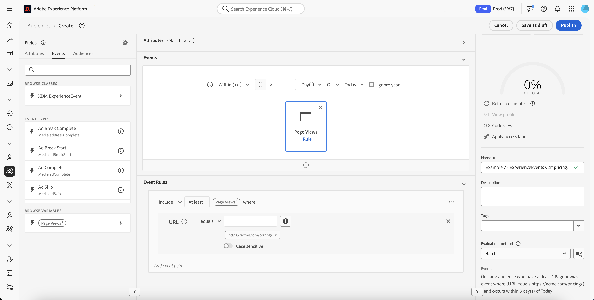

# Real-Time Customer Data Platform B2B edition的分段使用案例

>[!IMPORTANT]
>
>不再支援包含參考B2B實體的體驗事件（例如行銷活動和行銷清單）的受眾。 如需詳細資訊，請閱讀[Real-Time CDP B2B edition架構升級](../../rtcdp/b2b-architecture-upgrade.md)的概觀。

本檔案提供Adobe Real-Time Customer Data Platform B2B edition中的區段定義範例，並說明如何結合常見B2B使用案例的各種屬性型別。 若要瞭解目的地如何適合您的B2B工作流程，請參閱[端對端教學課程](../b2b-tutorial.md#create-a-segment-to-evaluate-your-data)。

>[!NOTE]
>
>這些細分使用案例所需的屬性僅供Real-Time Customer Data Platform B2B edition客戶使用。 如果您沒有使用Real-Time Customer Data Platform B2B edition，請改為參閱[區段總覽](./segmentation-overview.md)。

>[!BEGINSHADEBOX]

## 合併原則變更

在升級至Real-Time CDP B2B edition架構的過程中，具有B2B屬性的多實體對象現在僅支援單一合併原則（預設合併原則），而非多個合併原則。 此外，設定檔符合對象資格的變更可能會影響下游工作流程，例如啟用、歷程協調及行銷活動目標定位。 建議您進行下列操作，確保資料如預期般運作：

- 審查並測試依賴非預設合併邏輯的任何對象，以瞭解此更新的潛在影響。
- 重新評估關鍵對象的對象資格條件，以瞭解合併邏輯中的變更是否可能影響資格。
- 監視您的啟用結果，以偵測由合併原則變更所導致的對象結果的任何轉變。

>[!ENDSHADEBOX]

## 先決條件 {#prerequisites}

您必須先完成下列步驟，才能對B2B類別使用分段屬性：

1. 建立使用B2B類別的結構描述。 B2B edition類別包括Account、Campaign、Opportunity、Marketing List等。 如需有關[如何設定結構描述以搭配B2B類別](../schemas/b2b.md)使用的資訊，請參閱結構描述檔案。
2. 在您的Experience Data Model (XDM) B2B結構描述之間建立關係。 根據B2B edition屬性的對象需要類別之間的關係，才能完全使用擴充的B2B細分功能。 如需詳細資訊，請參閱有關[如何定義兩個B2B結構描述](../../xdm/tutorials/relationship-b2b.md)之間關係的檔案。
3. 使用以您的B2B結構為基礎的資料集來擷取資料。 如需有關如何擷取資料的資訊[，請參閱來原始檔](../../sources/connectors/adobe-applications/marketo/marketo.md)。
4. 閱讀[區段產生器使用手冊](../../segmentation/ui/segment-builder.md)，以取得如何建立對象的詳細指引。

在滿足這些需求後，您就可以針對常見的B2B使用案例來組合這些屬性。

## 快速入門 {#getting-started}

一旦B2B類別的聯合結構描述已建立關係並已用於內嵌資料，其屬性即可在區段產生器的左側邊欄中使用。

B2B類別及其屬性在區段工作區中會附加`B2B`標籤，以區別於Real-Time Customer Data Platform中作為標準可用的類別。

為了有效建立B2B使用案例的對象，熟悉結構並瞭解資料模型非常重要。 知道資料從一個資料物件前往另一個資料物件的路徑也很有用。

下圖說明Real-Time CDP B2B edition中可用B2B類別之間的關係。

由於您的資料模型可能很複雜，因此您可以使用Platform UI來檢視資料模型的更詳細視覺化表示法，以協助尋找使用案例的相關屬性。 若要開始，請前往Platform UI，然後在左側導覽中選取結構描述。

從可用清單中選取適當的結構描述，並從[!UICONTROL 構成]側邊欄中選取適當的關聯性。 在以下範例中，選取「Person」關係會顯示目前結構描述中哪個屬性會參考相關的「Person」結構描述（如果它是關係中的來源結構描述），或被「Person」結構描述（如果它是關係中的參考結構描述）參考。

此關係會透過使用`Key`資料夾反映在區段產生器中，如下圖所示。

如需有關可用B2B類別的詳細資訊，請參閱Real-Time Customer Data Platform B2B edition檔案[中的](../schemas/b2b.md)結構描述。

以下使用案例提供有關哪些類別用於建立不同結構描述之間的關係以實現這些結果的資訊。 這些範例可用來協助您建立自己的受眾。

## 不同區段使用案例的範例 {#use-cases}

以下使用案例適用於透過B2B edition進行分段。 每個範例都會提供對象所做動作的說明，以及用來建立對象的類別說明。 提供的影像反白顯示[!UICONTROL 屬性]側邊欄中的檔案路徑，以反映結構描述的結構。 顯示器右側的[!UICONTROL 區段屬性]區段包含對象屬性的書面劃分。

### 範例1：尋找B2B機會的「決策者」 {#find-decision-maker}

尋找所有商機的「決策者」人員。 此對象需要[!UICONTROL XDM個人設定檔]類別與[!UICONTROL XDM商業機會個人關係]類別之間的連結。

### 範例2：尋找指派給商機超過特定金額的B2B設定檔 {#find-opportunities-amount}

尋找直接指派給任何商機金額超過指定金額（100萬美元）之商機的所有人員。 此對象需要[!UICONTROL XDM個人設定檔]類別、[!UICONTROL XDM商業機會個人關係]類別和[!UICONTROL XDM商業機會]類別之間的連結。

### 範例3：依地點尋找指派給商機的B2B設定檔 {#find-opportunities-location}

尋找直接指派至帳戶位於指定位置（加拿大）之任何商機的所有人員。 此對象需要[!UICONTROL XDM個人設定檔]類別、[!UICONTROL XDM商業機會個人關係]類別、[!UICONTROL XDM商業機會]類別和[!UICONTROL XDM商業帳戶]類別之間的連結。

### 範例4：依產業和瀏覽行為尋找機會的「決策者」 {#find-industry-browsing-behavior}

尋找客戶屬於「金融」產業之任何機會的「決策者」所有人員，並在過去三天造訪過定價頁面。

若要建立此對象，您必須使用「區段區段」，建立過去三天造訪定價頁面之所有人員的基本對象。

建立第一個受眾後，您可以將其與帳戶處於「金融」產業中任何機會的「決策者」人群中的另一個受眾結合。

### 範例5：依部門名稱和商機金額搜尋商機的B2B設定檔 {#find-department-opportunity-amount}

尋找在人力資源(HR)部門工作的所有人員，以及擁有至少有一個與指定金額（100萬美元）或以上的未結商機之帳戶的所有人員。 此對象需要[!UICONTROL XDM個人設定檔]類別、[!UICONTROL XDM商業帳戶]類別和[!UICONTROL XDM商業機會]類別之間的連結。

### 範例6：依職稱和年度帳戶收入尋找B2B設定檔 {#find-by-job-title-and-revenue}

尋找所有職銜為「副總裁」且帳戶年收入達到或超過指定金額（1億美元）的人，並於上個月至少造訪過3次定價頁面。 此對象需要[!UICONTROL XDM個人設定檔]類別、[!UICONTROL XDM商業帳戶]類別和[!UICONTROL XDM ExperienceEvent]類別之間的連結。

### 範例7：依機會狀態和瀏覽行為尋找「決策者」 {#find-by-opportunity-status-and-browsing-behavior}

尋找任何已結束但遺失商機的「決策者」人員，並在過去三天造訪過定價頁面。

若要建立此對象，您必須使用「區段區段」，建立過去三天造訪定價頁面之所有人員的基本對象。

建立第一個受眾後，您可以將其與屬於任何機會之「決策者」的其他受眾結合，其中「已關閉的旗標」設為true，「已遺失的旗標」設為false。

### 範例8：使用相關帳戶來擴大細分範圍 {#related-accounts}

尋找在人力資源(HR)部門工作且與任何帳戶&#x200B;*或帳戶的任何相關帳戶*&#x200B;相關且至少有一個開啟機會值特定金額（$100萬）或以上的所有人員。 此對象需要[!UICONTROL XDM個人設定檔]類別、[!UICONTROL XDM商業帳戶]類別和[!UICONTROL XDM商業機會]類別之間的連結。

### 範例9：使用潛在客戶分數和/或帳戶分數來限定個人檔案 {#account-scoring}

尋找潛在客戶分數超過80的所有設定檔。

### 範例10：尋找與帳戶相關聯的B2B設定檔，其上層組織的收入超過特定美元金額 {#find-parent-org-amount}

尋找與上層組織的收入超過指定金額($100,000,000)的帳戶相關聯的所有人員。

### 範例11：依職稱和帳戶名稱尋找具有有效關係的B2B設定檔 {#find-by-job-title-and-account-name}

尋找帳戶「Acme」上所有身為「經理」的人，帳戶關係為「作用中」。

### 範例12：尋找actualCost超過budgetedCost之促銷活動鎖定的B2B設定檔 {#find-actualcost-exceed-budgetcost}

尋找actualCost超過budgetedCost之行銷活動鎖定的所有人員。

### 範例13：尋找屬於Marketo靜態清單的B2B設定檔並且isDeleted=false {#find-marketo-static-list}

尋找屬於Marketo靜態清單「週年紀念使用者」的所有人員，其中isDeleted=false。

<!-- 
### Example 14: Find "decision makers" by opportunity status using streaming or edge segmentation {#find-decision-makers-personalization}

>[!NOTE]
>
>This example uses **streaming or edge** segmentation, as opposed to batch segmentation.

Find all the people who are a "Decision Maker" of any closed-lost opportunity and visited the pricing page in the last 24 hours. This example can be evaluated using streaming or edge segmentation, to support more real-time use cases.

To create this audience, you must use "segment of segments" by creating a base audience of all the people who visited the pricing page in the last 24 hours.

After creating the first audience, you can combine that with another audience of  people who are a "Decision Maker" of any opportunity where both the "Closed Flag" is set to true and the "Lost Flag" is set to false.

 -->

## 後續步驟 {#next-steps}

閱讀本概述後，您現在已瞭解Real-Time CDP、B2B edition提供的細分可能性。 如需有關Segmentation Service的詳細資訊，請參閱[Segmentation檔案](../../segmentation/home.md)。
