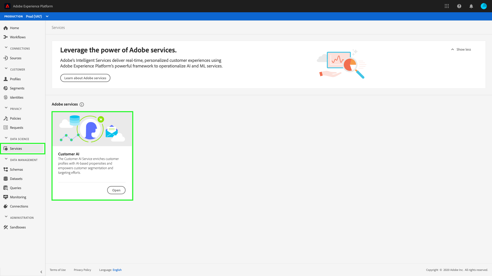

# 客戶AI在Real-time Customer Data Platform

客戶AI是Adobe Real-time Customer Data Platform的嵌入式AI功能，它使營銷人員能夠為特定結果生成個人級別分數，例如轉換或流失。

在影響因子的協助下，Customer AI 可告知您客戶可能會有什麼行為以及原因何在。 此外，您還可以從客戶AI預測和洞察中獲益，通過提供最合適的優惠和消息傳遞來個性化客戶體驗。 客戶AI可協助：

* 為更強的細分和目標提供高精度的客戶傾向模型。
* 瞭解某些客戶行為背後的影響因素和可能性。
* 為您的公司獨特的使用案例和資料提供可定製的選項。
* 利用客戶傾向評分（如流失和轉換）增強即時客戶概要資訊。
* 利用影響傾向得分的因素增強客戶概況。
* 根據影響因素和傾向得分建立客戶細分。

客戶AI位於 **[!UICONTROL 服務]** 頁籤 **[!UICONTROL Adobe服務]**。

## 客戶AI入門

為了開始使用客戶AI，您需要遵循 [資料預操作教程](../../intelligent-services/data-preparation.md) 並根據使用案例配置輸入模式。 接下來，你需要 [配置客戶AI實例](../../intelligent-services/customer-ai/user-guide/configure.md)。 配置實例後，將生成一個模型，您可以在其中 [查看您的見解和成績](../../intelligent-services/customer-ai/user-guide/discover-insights.md)。 使用從模型生成的資料，可以建立資料驅動激活的段。

要瞭解有關客戶AI的詳細資訊，請首先訪問 [客戶AI概述](../../intelligent-services/customer-ai/overview.md)。 此外，以下視頻顯示了客戶AI如何用基於AI的傾向性豐富客戶概況，並增強客戶細分和目標化努力。

>[!VIDEO](https://video.tv.adobe.com/v/40374/?quality=12&learn=on)
