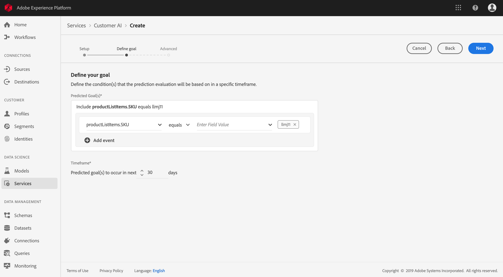

# 使用客戶人工智慧(alpha)預測客戶傾向分數

>[!NOTE]
>本檔案中概述的客戶人工智慧功能為alpha版。 說明檔案和功能可能會有所變更。

Adobe Experience Platform中的客戶人工智慧由Adobe Sensei所建立並提供支援，讓您產生自訂傾向分數，而不需擔心機器學習方面。

本教學課程涵蓋使用Experience Platform使用者介面與客戶AI合作的步驟。 提供以下主題的步驟：

* [設定例項](#configure-an-instance)
* [建立具有預測分數的客戶細分](#create-customer-segments-with-predicted-scores)

## 快速入門

本指南要求對使用客戶AI時涉及的各種平台服務有良好的理解。 在開始本教學課程之前，請先閱讀下列檔案：

* [即時客戶個人檔案總覽](https://www.adobe.io/apis/experienceplatform/home/profile-identity-segmentation/profile-identity-segmentation-services.html#!api-specification/markdown/narrative/technical_overview/unified_profile_architectural_overview/unified_profile_architectural_overview.md)
* [區段服務概觀](https://www.adobe.io/apis/experienceplatform/home/profile-identity-segmentation/profile-identity-segmentation-services.html#!api-specification/markdown/narrative/technical_overview/segmentation/segmentation-overview.md)
* [區段產生器使用指南](https://www.adobe.io/apis/experienceplatform/home/profile-identity-segmentation/profile-identity-segmentation-services.html#!api-specification/markdown/narrative/technical_overview/segmentation/segment-builder-guide.md)

## 設定例項

Experience Platform為客戶提供簡單易用的Adobe Sensei服務，可針對不同使用案例進行設定。 以下各節提供設定客戶AI例項的步驟。

### 設定您的例項

在「平台UI」中，按一下左 **側導覽** 中的「服務」。 「服 **務** 」瀏覽器隨即出現，並顯示您可使用的所有可用服務。 在「客戶AI」的容器中，按一下「開 **啟」**。

「客 *戶AI* 」畫面會顯示所有現有的客戶AI例項。 按一 **下「建立例項**」。

此時將顯示實例建立工作流，從「設定」( *Setup* )步驟開始。

以下是您必須為實例提供的值的重要資訊：

* 在顯示客戶AI分數的所有位置，都會使用實例的名稱。 因此，名稱應該描述預測分數代表什麼，例如「取消雜誌訂閱的可能性」。

* 傾向類型會決定分數和量度極性的意圖。 您可以選擇「流 **失」** 或「 **轉換」**。

* 資料來源是指將用來預測分數的輸入資料集。 根據設計，客戶人工智慧會使用消費者體驗事件資料來計算傾向分數。 從下拉式選取器選取資料集時，只會列出與客戶AI相容的資料集。

* 依預設，會為所有描述檔產生傾向分數，除非指定合格人口。 您可以定義條件，根據事件加入或排除描述檔，以指定合格人口。

提供所需值，然後按一下「下 **一步**」。

### 定義目標

「定 *義目標* 」(Define goal)步驟隨即出現，它提供互動式環境供您以視覺化方式定義目標。 目標由一個或多個事件組成，每個事件的發生基於事件所保持的條件。 客戶AI實例的目標是確定在給定時間範圍內實現其目標的可能性。

按一 **下「輸入欄位名稱** 」，然後從下拉式清單中選取欄位。 按一下第二個輸入，並為事件條件選擇一個子句，然後提供目標值以完成事件。 按一下「新增事件」可設定其 **他事件**。 最後，套用預測時間範圍（以天數計）以完成目標，然後按「下一 **步」**。

### 設定排程 *（選用）*

將出 *現高級* 步驟。 此可選步驟可讓您設定排程以自動執行預測、定義預測排除以篩選特定事件，或在不需要時按一下 **Finish** 。

設定計分頻率，以設定計 *分排程*。 自動預測執行可排程每週或每月執行。

在排程設定下方，您可以定義預測排除，以防止在產生分數時評估符合特定條件的事件。 此功能可用來篩選不相關的資料輸入。

若要排除某些事件，請按一 **下「新增排除** 」，並以定義目標的方式定義事件。 若要移除排除，請按一下事件容器&#x200B;**右上方的省略號(...**)，然後按一下「 **移除容器」**。

視需要排除事件，然後按一 **下「完成** 」以建立例項。

如果成功建立例項，則會立即觸發預測執行，並根據您定義的排程執行後續的預測執行。

>[!NOTE] 根據輸入資料的大小，預測執行最多需要24小時才能完成。

依照本節內容，您已設定客戶AI的例項，並執行預測執行。 在跑完成後，得分見解將自動將Profiles與預測分數加水。 請等候24小時，再繼續本教學課程的下一節。

## 建立具有預測分數的客戶細分

當預測執行完成時，「設定檔」會自動使用預測傾向分數。 利用客戶人工智慧分數豐富個人檔案可建立以傾向分數為基礎的客戶細分。 本節提供使用區段產生器建立區段的步驟。 如需建立區段的更強穩教學課程，請參閱「區段產 [生器」使用指南](https://www.adobe.io/apis/experienceplatform/home/profile-identity-segmentation/profile-identity-segmentation-services.html#!api-specification/markdown/narrative/technical_overview/segmentation/segment-builder-guide.md)。

在「平台UI」中，按一下左 **側導覽中的** 「區段」，然後按一下「 **建立區段」**。

此時會 *顯示「區段產生* 器」。 在左側的 *欄位* ，在「屬性」標籤下，按一下名為「 *XDM Individual Profile***** 」的檔案夾，然後按一下具有您組織名稱空間的檔案夾。 名為 **Customer AI** 的資料夾包含預測執行的結果，並以分數所屬的例項命名。 按一下並存取所需例項的結果。

位於「區段產生器」的中心，將「分數」屬性拖放至 **規則產生器畫布上，** 以定義規則 ** 。

在右側的「 *區段屬性* 」欄下，選取「合併」原則 *，並提供區段的名稱，然後按一下「* 儲存 **** 」以建立區段。

## 後續步驟

透過本教學課程，您已成功設定客戶AI的例項、產生傾向分數，並使用「區段產生器」建立由傾向分數強制執行的區段。 您的客戶區段現在可由啟動的目的地使用，以鎖定您的受眾。 如需詳細 [資訊，請參閱](../destinations/destinations-overview.md) 「目標概觀」。
