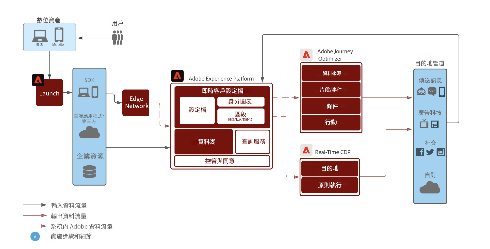
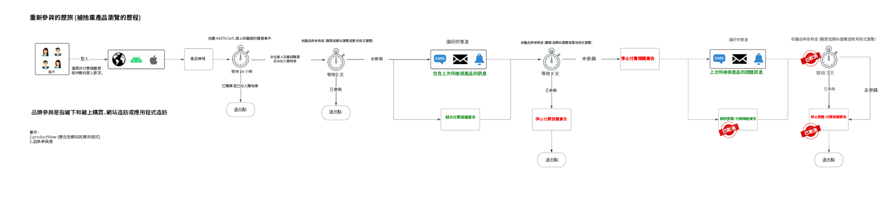
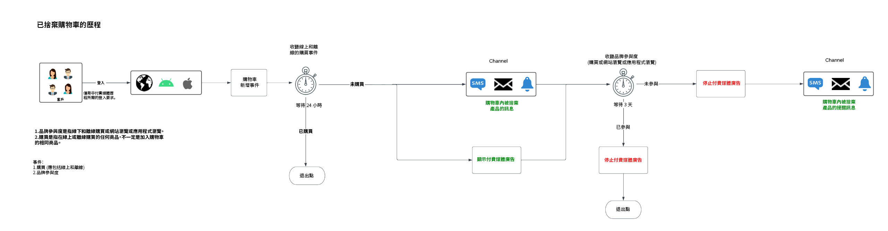
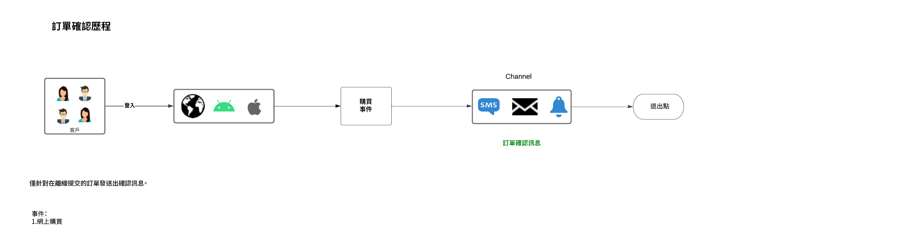

# 以智慧方式重新吸引您的客戶回訪

以智慧且可靠方式重新吸引在完成轉換之前放棄轉換的客戶。不要採用提醒方式，而是要透過體驗方式來吸引流失的客戶，以提高轉化率並推動客戶期限值的增長。

採用即時考慮方式、將所有消費者的品質和行為納入考量，並根據線上和線下事件提供更快的重新資格認證。

## 使用案例概觀

當您使用重新吸引歷程的範例時，您將構建結構描述、資料集和對象。您還將探索在 [!DNL Adobe Journey Optimizer] 設定範例歷程所需的功能，以及探索在目的地中製作付費媒體廣告所需的功能。本指南使用在下面所述使用案例中重新吸引客戶的範例：

* **重新吸引歷程** - 針對在網站和行動應用程式上有捨棄產品瀏覽的客戶。
* **捨棄購物車歷程** - 針對在網站和行動應用程式上已將產品放入購物車但尚未購買的客戶。
* **訂購確認歷程** - 著重已透過網站和行動應用程式購買的產品。

## 必要條件和規劃 {#prerequisites-and-planning}

當您完成實作使用案例的步驟時，您將使用以下 Real-Time CDP 功能和 UI 元素 (按使用順序列出)。確保您擁有所有這些區域所需的屬性型存取控制權限，或要求系統管理員授予您必要的權限。

* [[!DNL Adobe Real-Time Customer Data Platform (Real-Time CDP)]](https://experienceleague.adobe.com/docs/platform-learn/tutorials/rtcdp/understanding-the-real-time-customer-data-platform.html)- 整合跨資料來源的資料，以推動行銷活動。然後，使用此資料來建立行銷活動對象，並呈現用於電子郵件和網頁促銷圖磚的個人化資料元素 (例如姓名或帳戶相關資訊)。CDP 也用於跨電子郵件和網頁啟動對象 (透過 [!DNL Adobe Target]).
   * [結構描述](/help/xdm/home.md)
   * [設定檔](/help/profile/home.md)
   * [資料集](/help/catalog/datasets/overview.md)
   * [對象](/help/segmentation/home.md)
   * [[!DNL Adobe Journey Optimizer]](https://experienceleague.adobe.com/docs/journey-optimizer/using/orchestrate-journeys/journey.html)
   * [目的地](/help/destinations/home.md)
   * [事件或對象觸發](https://experienceleague.adobe.com/docs/journey-optimizer/using/offer-decisioning/collect-event-data/data-collection.html)
   * [對象/事件](https://experienceleague.adobe.com/docs/journey-optimizer/using/audiences-profiles-identities/audiences/about-audiences.html)
   * [歷程動作](https://experienceleague.adobe.com/docs/journey-optimizer/using/orchestrate-journeys/journey.html)

### 如何實現使用案例：高層級概觀 {#achieve-the-use-case-high-level}

以下是三個重新吸引歷程範例的高層次概觀。

>[!BEGINTABS]

>[!TAB 重新吸引歷程]

重新吸引歷程是針對在網站和行動應用程式上的捨棄產品瀏覽。當產品被檢視但未被購買或新增到購物車時，會觸發此歷程。如果過去 24 小時內沒有新增清單，則三天後會觸發品牌吸引。
{width="2560" zoomable="yes"}

1. 您建立結構描述和資料集，然後標記[!UICONTROL 設定檔]。
2. 資料透過 Web SDK、Mobile Edge SDK 或 API 整合至 Experience Platform。也可以使用 Analytics Data Connector，但可能會導致歷程延遲。
3. 您將設定檔載入到 Real-Time CDP 並建立控管原則，以確保以負責方式使用資料。
4. 您從設定檔清單建立重點對象，以檢查&#x200B;**使用者**&#x200B;在過去三天是否有進行參與行動。
5. 您在 [!DNL Adobe Journey Optimizer] 中建立一個重新吸引歷程。
6. 如有需要，與&#x200B;**資料合作夥伴**&#x200B;協作，將對象啟動到所需付費媒體目的地。
7. [!DNL Adobe Journey Optimizer] 檢查是否同意並發送設定的各種動作。

>[!TAB 捨棄購物車歷程]

捨棄購物車歷程是針對網站和行動應用程式上已放入購物車但尚未購買的產品。此外，付費媒體行銷活動可以使用此方法開始和停止。
{width="2560" zoomable="yes"}

1. 您建立結構描述和資料集，然後標記[!UICONTROL 設定檔]。
2. 資料透過 Web SDK、Mobile Edge SDK 或 API 整合至 Experience Platform。也可以使用 Analytics Data Connector，但可能會導致歷程延遲。
3. 您將設定檔載入到 Real-Time CDP 並建立控管原則，以確保以負責方式使用資料。
4. 您從設定檔清單建立重點對象，以檢查&#x200B;**客戶**&#x200B;是否已將商品放入購物車但尚未完成購買。**[!UICONTROL 新增到購物車]**&#x200B;事件會啟動計時器；計時器會等待 30 分鐘，然後檢查是否有購買。如果沒有購買，那麼會將&#x200B;**客戶**&#x200B;新增到&#x200B;**[!UICONTROL 捨棄購物車]**&#x200B;對象。
5. 您在 [!DNL Adobe Journey Optimizer] 中建立一個廢棄購物車歷程。
6. 如有需要，與&#x200B;**資料合作夥伴**&#x200B;協作，將對象啟動到所需付費媒體目的地。
7. [!DNL Adobe Journey Optimizer] 檢查是否同意並發送設定的各種動作。

>[!TAB 訂購確認歷程]

訂購確認歷程著重在透過網站和行動應用程式購買的產品。
{width="2560" zoomable="yes"}

1. 您建立結構描述和資料集，然後標記[!UICONTROL 設定檔]。
2. 資料透過 Web SDK、Mobile Edge SDK 或 API 整合至 Experience Platform。也可以使用 Analytics Data Connector，但可能會導致歷程延遲。
3. 您將設定檔載入到 Real-Time CDP 並建立控管原則，以確保以負責方式使用資料。
4. 您在 [!DNL Adobe Journey Optimizer] 中建立一個確認歷程。
5. [!DNL Adobe Journey Optimizer] 使用偏好管道發送訂購確認訊息。

>[!ENDTABS]

## 如何實現使用案例 {#achieve-use-case-instruction}

要完成上述高層次概觀中的每個步驟，請閱讀以下各節中更多資訊和更詳細說明的連結。

### 您將使用的 UI 功能和元素 {#ui-functionality-and-elements}

當您完成實作使用案例的步驟時，您將使用 Real-Time CDP 功能和 UI 元素 (本文件開頭所列)。確保您擁有所有這些區域所需的屬性型存取控制權限，或要求系統管理員授予您必要的權限。

### 建立結構描述設計並指定欄位群組 {#schema-design}

體驗資料模型 (XDM) 資源是在 [!DNL Adobe Experience Platform] 內的[!UICONTROL 結構描述] 工作區中接受管理。您可以檢視並探索 [!DNL Adobe] 提供的核心資源 (例如，[!UICONTROL 欄位群組])，並為貴組織建立自訂資源和結構描述。

如需深入了解如何建立[結構描述](https://experienceleague.adobe.com/docs/experience-platform/xdm/home.html?lang=zh-Hant)，請參閱[建立結構描述教學課程](/help/xdm/tutorials/create-schema-ui.md)。

有四種用於重新吸引使用案例的結構描述設計。每一種結構描述都需要設定特定欄位，以及一些強烈建議使用的欄位。

#### 客戶屬性結構描述

此結構描述是用來安排和參考構成客戶資訊的設定檔資料。該資料通常會透過您的 CRM 或類似系統被擷取至 [!DNL Adobe Experience Platform]，並且有必要參考用來個人化、行銷同意和加強分段功能的客戶詳細資訊。

客戶屬性結構描述以 [!UICONTROL XDM 個人設定檔]類別表示，其中包括以下欄位群組：

+++個人聯絡詳細資料 (欄位群組)

[個人聯絡詳細資料](/help/xdm/field-groups/profile/personal-contact-details.md)是 XDM 個人設定檔類別的標準結構描述欄位群組，主要在描述個人的聯絡資訊。

| 欄位 | 需求 | 說明 |
| --- | --- | --- |
| `mobilePhone.number` | 必要 | 個人手機號碼，用來發送 SMS。 |
| `personalEmail.address` | 必要 | 個人電子郵件地址。 |

+++

+++人口統計詳細資料 (欄位群組)

[人口統計詳細資料](/help/xdm/field-groups/profile/demographic-details.md)是 XDM 個人設定檔類別的標準結構描述欄位群組。此欄位群組提供根層級個人物件，其子欄位在描述個人的資訊。

| 欄位 | 需求 |
| --- | --- |
| `person.name.firstName` | 建議 |
| `person.name.lastName` | 建議 |

+++

+++外部來源系統稽核詳細資料 (欄位群組)

[外部來源系統稽核屬性](/help/xdm/data-types/external-source-system-audit-attributes.md)是一種標準的體驗資料模式 (XDM) 資料類型，用於擷取外部來源系統的稽核詳細資料。

+++

+++同意和偏好設定欄位群組 (欄位群組)

[同意和偏好設定](/help/xdm/field-groups//profile/consents.md)欄位群組提供單一物件類型的欄位、同意，以擷取同意和偏好設定資訊。

| 欄位 | 需求 |
| --- | --- |
| `consents.marketing.email.val` | 必要 |
| `consents.marketing.preferred` | 必要 |
| `consents.marketing.push.val` | 必要 |
| `consents.marketing.sms.val` | 必要 |
| `consents.personalize.content.val` | 必要 |
| `consents.share.val` | 必要 |

+++

+++設定檔測試詳細資料 (欄位群組)

此欄位群組用於最佳做法。

+++

#### 客戶數位交易結構描述

此結構描述是用來安排和引用構成發生在您網站和/或關聯數位平台上客戶活動的事件資料。該資料通常會透過 Web SDK 被擷取至[!DNL Adobe Experience Platform]，並且需要引用用來觸發歷程、詳細線上客戶分析和加強分段功能的各種瀏覽和轉換事件。

客戶數位交易結構描述是以 [!UICONTROL XDM ExperienceEvent] 類別表示，其中包括以下欄位群組：

+++Adobe Experience Platform Web SDK ExperienceEvent (欄位群組)

| 欄位 | 需求 |
| --- | --- |
| `device.model` | 建議 |
| `environment.browserDetails.userAgent` | 建議 |

+++

+++Web 詳細資料 (欄位群組)

Web 詳細資料是 XDM ExperienceEvent 類別的標準結構描述欄位群組，用於描述 Web 詳細資料事件的相關資訊，例如互動、頁面詳細資料和反向連結。

| 欄位 | 需求 | 說明 |
| --- | --- | --- |
| `web.webInteraction.linkClicks.id` | 建議 | 對應於互動之網頁連結或 URL 的 ID。 |
| `web.webInteraction.linkClicks.value` | 建議 | 對應於互動之網頁連結或 URL 的點擊次數。 |
| `web.webInteraction.name` | 建議 | 網頁的名稱。 |
| `web.webInteraction.URL` | 建議 | 網頁的 URL。 |
| `web.webPageDetails.name` | 建議 | 發生網頁互動的網頁名稱。 |
| `web.webPageDetails.URL` | 建議 | 發生網頁互動的網頁 URL。 |
| `web.webReferrer.URL` | 建議 | 描述網頁互動的反向連結，即訪客在目前網頁互動記錄之前所瀏覽的上一個 URL。 |

+++

+++消費者體驗事件 (欄位群組)

| 欄位 | 需求 |
| --- | --- |
| `commerce.cart.cartID` | 建議 |
| `commerce.cart.cartSource` | 建議 |
| `commerce.cartAbandons.id` | 建議 |
| `commerce.cartAbandons.value` | 建議 |
| `commerce.order.orderType` | 建議 |
| `commerce.order.payments.paymentAmount` | 建議 |
| `commerce.order.payments.paymentType` | 建議 |
| `commerce.order.payments.transactionID` | 建議 |
| `commerce.order.priceTotal` | 建議 |
| `commerce.order.purchaseID` | 建議 |
| `commerce.productListAdds.id` | 建議 |
| `commerce.productListAdds.value` | 建議 |
| `commerce.productListOpens.id` | 建議 |
| `commerce.productListOpens.value` | 建議 |
| `commerce.productListRemoval.id` | 建議 |
| `commerce.productListRemoval.value` | 建議 |
| `commerce.productListViews.id` | 建議 |
| `commerce.productListViews.value` | 建議 |
| `commerce.productViews.id` | 建議 |
| `commerce.productViews.value` | 建議 |
| `commerce.purchases.id` | 建議 |
| `commerce.purchases.value` | 建議 |
| `marketing.campaignGroup` | 建議 |
| `marketing.campaignName` | 建議 |
| `marketing.trackingCode` | 建議 |
| `productListItems.name` | 建議 |
| `productListItems.priceTotal` | 建議 |
| `productListItems.product` | 建議 |
| `productListItems.quantity` | 建議 |

+++

+++一般使用者 ID 詳細資料 (欄位群組)

| 欄位 | 需求 | 說明 |
| --- | --- | --- |
| `endUserIDs._experience.emailid.authenticatedState` | 必要 | 一般使用者電子郵件地址 ID 驗證狀態。 |
| `endUserIDs._experience.emailid.id` | 必要 | 一般使用者電子郵件地址 ID。 |
| `endUserIDs._experience.emailid.namespace.code` | 必要 | 一般使用者電子郵件地址 ID 命名空間代碼。 |
| `endUserIDs._experience.mcid.authenticatedState` | 必要 | [!DNL Adobe] Marketing Cloud ID (MCID) 驗證狀態。MCID 現在稱為 Experience Cloud ID (ECID)。 |
| `endUserIDs._experience.mcid.id` | 必要 | [!DNL Adobe] Marketing Cloud ID (MCID)。MCID 現在稱為 Experience Cloud ID (ECID)。 |
| `endUserIDs._experience.mcid.namespace.code` | 必要 | [!DNL Adobe] Marketing Cloud ID (MCID) 命名空間代碼。 |

+++

+++外部來源系統稽核詳細資料 (欄位群組)

外部來源系統稽核屬性是一種標準體驗資料模式 (XDM) 的資料類型，這模式會擷取外部來源系統的稽核詳細資料。

+++

#### 客戶離線交易結構描述

此結構描述是用來安排和引用構成發生在您網站以外平台上客戶活動的事件資料。該資料通常是從 POS (或類似系統) 被擷取至 [!DNL Adobe Experience Platform]，且大部份通常會透過 API 連線串流至平台。其目的是引用用來觸發歷程、深度的線上和離線客戶分析以及加強分段功能的各種離線轉換事件。

客戶離線交易結構描述以 [!UICONTROL XDM ExperienceEvent] 類別示，其中包括以下欄位群組：

+++商務詳細資料 (欄位群組)

| 欄位 | 需求 | 說明 |
| --- | --- | --- |
| `commerce.cart.cartID` | 必要 | 購物車的 ID。 |
| `commerce.order.orderType` | 必要 | 描述產品訂購類型的物件。 |
| `commerce.order.payments.paymentAmount` | 必要 | 描述產品訂購付款金額的物件。 |
| `commerce.order.payments.paymentType` | 必要 | 描述產品訂購付款類型的物件。 |
| `commerce.order.payments.transactionID` | 必要 | 物件產品訂購交易 ID。 |
| `commerce.order.purchaseID` | 必要 | 物件產品訂單購買 ID。 |
| `productListItems.name` | 必要 | 代表客戶所選產品的項目名稱清單。 |
| `productListItems.priceTotal` | 必要 | 代表客戶所選產品的項目清單總價。 |
| `productListItems.product` | 必要 | 選取的產品。 |
| `productListItems.quantity` | 必要 | 代表客戶所選產品的項目清單數量。 |

+++

+++個人聯絡詳細資料 (欄位群組)

| 欄位 | 需求 | 說明 |
| --- | --- | --- |
| `mobilePhone.number` | 必要 | 個人手機號碼，用來發送 SMS。 |
| `personalEmail.address` | 必要 | 個人電子郵件地址。 |

+++

+++外部來源系統稽核詳細資料 (欄位群組)

外部來源系統稽核屬性是一種標準體驗資料模式 (XDM) 的資料類型，此模式會擷取外部來源系統的稽核詳細資料。

+++

#### Adobe Web 連接器結構描述

>[!NOTE]
>
>如果您使用 [!DNL Adobe Analytics Data Connector]，這是一個實施選項。

此結構描述是用來安排和引用構成發生在您網站和/或關聯數位平台上客戶活動的事件資料。此結構描述類似於客戶數位交易的結構描述，但不同之處在於，此結構描述目的是在 Web SDK 不是資料收集選項時使用；因此，當您使用 [!DNL Adobe Analytics Data Connector] 將您的線上資料發送至 [!DNL Adobe Experience Platform] 作為主要或次要資料流時，您需要此結構描述。

[!DNL Adobe] Web 連接器結構描述以 [!UICONTROL XDM ExperienceEvent] 類別表示，其中包括以下欄位群組：

+++Adobe Analytics ExperienceEvent 範本 (欄位群組)

| 欄位 | 需求 | 說明 |
| --- | --- | --- |
| `web.webInteraction.linkClicks.id` | 建議 | 對應於互動之網頁連結或 URL 的 ID。 |
| `web.webInteraction.linkClicks.value` | 建議 | 對應於互動之網頁連結或 URL 的點擊次數。 |
| `web.webInteraction.name` | 建議 | 網頁的名稱。 |
| `web.webInteraction.URL` | 建議 | 網頁的 URL。 |
| `web.webPageDetails.name` | 建議 | 發生網頁互動的網頁名稱。 |
| `web.webPageDetails.URL` | 建議 | 發生網頁互動的網頁 URL。 |
| `web.webReferrer.URL` | 建議 | 描述網頁互動的反向連結，即訪客在目前網頁互動記錄之前所瀏覽的上一個 URL。 |
| `commerce.cart.cartID` | 建議 | |
| `commerce.cart.cartSource` | 建議 | |
| `commerce.cartAbandons.id` | 建議 | |
| `commerce.cartAbandons.value` | 建議 | |
| `commerce.order.orderType` | 建議 | |
| `commerce.order.payments.paymentAmount` | 建議 | |
| `commerce.order.payments.paymentType` | 建議 | |
| `commerce.order.payments.transactionID` | 建議 | |
| `commerce.order.priceTotal` | 建議 | |
| `commerce.order.purchaseID` | 建議 | |
| `commerce.productListAdds.id` | 建議 | |
| `commerce.productListAdds.value` | 建議 | |
| `commerce.productListOpens.id` | 建議 | |
| `commerce.productListOpens.value` | 建議 | |
| `commerce.productListRemoval.id` | 建議 | |
| `commerce.productListRemoval.value` | 建議 | |
| `commerce.productListViews.id` | 建議 | |
| `commerce.productListViews.value` | 建議 | |
| `commerce.productViews.id` | 建議 | |
| `commerce.productViews.value` | 建議 | |
| `commerce.purchases.id` | 建議 | |
| `commerce.purchases.value` | 建議 | |
| `marketing.campaignGroup` | 建議 | |
| `marketing.campaignName` | 建議 | |
| `marketing.trackingCode` | 建議 | |
| `productListItems.name` | 建議 | |
| `productListItems.priceTotal` | 建議 | |
| `productListItems.product` | 建議 | |
| `productListItems.quantity` | 建議 | |
| `endUserIDs._experience.emailid.authenticatedState` | 必要 | 一般使用者電子郵件地址 ID 驗證狀態。 |
| `endUserIDs._experience.emailid.id` | 必要 | 一般使用者電子郵件地址 ID。 |
| `endUserIDs._experience.emailid.namespace.code` | 必要 | 一般使用者電子郵件地址 ID 命名空間代碼。 |
| `endUserIDs._experience.mcid.authenticatedState` | 必要 | [!DNL Adobe] Marketing Cloud ID (MCID) 驗證狀態。MCID 現在稱為 Experience Cloud ID (ECID)。 |
| `endUserIDs._experience.mcid.id` | 必要 | [!DNL Adobe] Marketing Cloud ID (MCID)。MCID 現在稱為 Experience Cloud ID (ECID)。 |
| `endUserIDs._experience.mcid.namespace.code` | 必要 | [!DNL Adobe] Marketing Cloud ID (MCID) 命名空間代碼。 |

+++

+++外部來源系統稽核詳細資料 (欄位群組)

外部來源系統稽核屬性是一種標準體驗資料模式 (XDM) 的資料類型，此模式會擷取外部來源系統的稽核詳細資料。

+++

### 從結構描述建立資料集 {#dataset-from-schema}

資料集是一組資料的儲存和管理結構。智慧型重新吸引歷程的每個結構描述都有單一資料集。

如需深入了解如何從結構描述建立[資料集](/help/catalog/datasets/overview.md)，請參閱[資料集 UI 指南](/help/catalog/datasets/user-guide.md)。

>[!NOTE]
>
>與結構描述建立步驟類似，您需要啟用資料集以包含在即時客戶設定檔中。如需深入了解關於啟用資料集以用於即時客戶設定檔，請閱讀[建立結構描述教學課程](/help/xdm/tutorials/create-schema-ui.md#profile)。

### 隱私權、同意和資料治理 {#privacy-consent}

#### 同意原則

>[!IMPORTANT]
>
>向客戶提供從品牌接收通訊的取消訂閱功能是法律要求，同時可確保提供此選擇。在[隱私權法規概觀](https://experienceleague.adobe.com/docs/experience-platform/privacy/regulations/overview.html)中，了解更多有關適用法律。

建立重新吸引路徑時，應該考以下[同意原則](https://experienceleague.adobe.com/docs/platform-learn/data-collection/web-sdk/consent/overview.html)：

* 如果為 `consents.marketing.email.val = "Y"`，則可以發送電子郵件
* 如果為 `consents.marketing.sms.val = "Y"`，則可以發送 SMS
* 如果為 `consents.marketing.push.val = "Y"`，則可以推播
* 如果為 `consents.share.val = "Y"`，則可以進行廣告

#### 資料控管標籤和執行

建立重新吸引路徑時，應考慮以下[資料控管標籤](/help/data-governance/labels/overview.md)：

* 個人電子郵件地址可作直接可識別資料供運用，可識別或聯絡特定個人而非裝置。
   * `personalEmail.address = I1`

#### 行銷原則

重新吸引歷程不需要[行銷原則](/help/data-governance/policies/overview.md)，但是，應視需要考慮以下內容：

* 限制敏感資料
* 限制現場廣告
* 限制電子郵件目標定位
* 限制跨站台目標定位
* 限制將直接可識別資料與匿名資料相結合

### 建立對象 {#create-audience}

#### 建立品牌重新吸引歷程的對象

重新吸引歷程使用對象來定義設定檔儲存區中設定檔子集共用的特定屬性或行為，以從您的客戶群中區隔出可行銷的一群人。對象可以在 [!DNL Adobe Experience Platform] 上以多種方式建立。

如需有關如何建立對象的詳細資訊，請詳閱[對象服務 UI 指南](https://experienceleague.adobe.com/docs/experience-platform/segmentation/ui/overview.html#create-audience)。

如需深入了解如何直接組成[對象](/help/segmentation/home.md)，請參閱[對象組成 UI 指南](/help/segmentation/ui/audience-composition.md)。

如需深入了解如何透過平台衍生的區段定義來建立對象，請參閱[對象建立器 UI 指南](/help/segmentation/ui/segment-builder.md)。

>[!BEGINTABS]

>[!TAB 重新吸引歷程]

建立此對象是為了加強經典的「購物車放棄」情境。雖然購物車放棄通常是著重在購物車新增但在特定時間內未接著購買的情形，但此類對象尋求較早參與，特別是在特定時間內於您網站上可能瀏覽過特定產品但未加入購物車且沒有後續活動的人。此對象有助於讓符合此納入標準的客戶「優先考慮」您的品牌，也可運用在數位屬性可能不同於傳統電子商務模式的客戶。

以下事件用於重新吸引歷程，其中使用者線上檢視產品，並且在接下來的 24 小時內沒有將產品新增到購物車，隨後的 3 天內沒有參與品牌。

設定此對象時需要以下欄位和條件：

* `EventType: commerce.productViews`
   * `Timestamp: <= 24 hours before now`
* `EventType is not: commerce.procuctListAdds`
   * `Timestamp: <= 24 hours before now, GAP(>= 3 days)`
* `EventType: application.launch or web.webpagedetails.pageViews or commerce.purchases`
   * `Timestamp: <= 2 days before now`

重新吸引歷程的描述項顯示為：

`Include audience who have at least 1 EventType = ProductViews event THEN have at least 1 Any event where (EventType does not equal commerce.productListAdds) and occurs in last 24 hour(s) then after 3 days do not have any Any event where (EventType = application.launch or web.webpagedetails.pageViews or commerce.purchases) and occurs in last 2 day(s).`

>[!TAB 捨棄購物車歷程]

建立此對象是為了支持一般「購物車放棄」情境。其目的是找到將產品加入購物車但最後未購買的客戶。此對象不僅有助於您的客戶「最先想到」您的品牌，而且還有助於他們保留被遺棄而未繼續購買的產品。

以下事件用於使用者已將產品新增至購物車但過去 24 小時內未完成購買或清除購物車的捨棄購物車歷程。

設定此對象時需要以下欄位和條件：

* `EventType: commerce.productListAdds`
   * `Timestamp: >= 1 days before now and <= 4 days before now `
* `EventType: commerce.purchases`
   * `Timestamp: <= 4 days before now`
* `EventType: commerce.productListRemovals`
   * `Timestamp: <= 4 days before now`

捨棄購物車歷程的描述項顯示為：

`Include EventType = commerce.productListAdds between 30 min and 1440 minutes before now. exclude EventType = commerce.purchases 30 minutes before now OR EventType = commerce.productListRemovals AND Cart ID equals Product List Adds1 Cart ID (the inclusion event).`

>[!TAB 訂購確認歷程]

此歷程不需要建立任何對象。

>[!ENDTABS]

### 歷程在 Adobe Journey Optimizer 中建立 {#journey-setup}

>[!NOTE]
>
>[!DNL Adobe Journey Optimizer] 並不涵蓋圖中顯示的所有內容。所有[付費媒體廣告](/help/destinations/catalog/social/overview.md)均在[!UICONTROL 目的地]中建立。

[[!DNL Adobe Journey Optimizer]](https://experienceleague.adobe.com/docs/journey-optimizer/using/orchestrate-journeys/journey.html) 協助您向其客戶傳送連結的、情境式和個人化體驗。客戶歷程是客戶與品牌互動的整個過程。每個使用案例歷程需要特定的資訊。下面列出的是每個歷程分支所需的精確資料。

>[!BEGINTABS]

>[!TAB 重新吸引歷程]

重新吸引歷程是針對在網站和行動應用程式上的捨棄產品瀏覽。
{width="2560" zoomable="yes"}

+++事件

* 事件 1：產品檢視
   * 結構描述：客戶數位交易
   * 欄位：
      * `EventType`
   * 條件：
      * `EventType = commerce.productViews`
      * 欄位：
         * `Commerce.productViews.id`
         * `Commerce.productViews.value`
         * `eventType`
         * `identityMap.authenticatedState`
         * `identityMap.id`
         * `identityMap.primary`
         * `productListItems.SKU`
         * `productListItems.currencyCode`
         * `productListItems.name`
         * `productListItems.priceTotal`
         * `productListItems.product`
         * `productListItems.productImageUrl`
         * `productListItems.quantity`
         * `timestamp`
         * `endUserIDs._experience.emailid.authenticatedState`
         * `endUserIDs._experience.emailid.id`
         * `endUserIDs._experience.emailid.namespace.code`
         * `_id`

* 事件 2：加入購物車
   * 結構描述：客戶數位交易
   * 欄位：
      * `EventType`
   * 條件：
      * `EventType = commerce.productListAdds`
      * 欄位：
         * `Commerce.productListAdds.id`
         * `Commerce.productListAdds.value`
         * `eventType`
         * `identityMap.authenticatedState`
         * `identityMap.id`
         * `identityMap.primary`
         * `productListItems.SKU`
         * `productListItems.currencyCode`
         * `productListItems.name`
         * `productListItems.priceTotal`
         * `productListItems.product`
         * `productListItems.productImageUrl`
         * `productListItems.quantity`
         * `timestamp`
         * `commerce.cart.cartID`
         * `endUserIDs._experience.emailid.authenticatedState`
         * `endUserIDs._experience.emailid.id`
         * `endUserIDs._experience.emailid.namespace.code`
         * `_id`

* 事件 3：品牌參與度
   * 結構描述：客戶數位交易
   * 欄位：
      * `EventType`
   * 條件：
      * `EventType in application.launch, commerce.purchases, web.webpagedetails.pageViews`
      * 欄位：
         * `eventType`
         * `identityMap.authenticatedState`
         * `identityMap.id`
         * `identityMap.primary`
         * `productListItems.SKU`
         * `productListItems.currencyCode`
         * `productListItems.name`
         * `productListItems.priceTotal`
         * `productListItems.product`
         * `productListItems.productImageUrl`
         * `productListItems.quantity`
         * `timestamp`
         * `web.webpagedetails.URL`
         * `web.webpagedetails.isHomePage`
         * `web.webpagedetails.name`
         * `endUserIDs._experience.emailid.authenticatedState`
         * `endUserIDs._experience.emailid.id`
         * `endUserIDs._experience.emailid.namespace.code`
         * `_id`
         * `Commerce.purchases.id`
         * `Commerce.purchases.value`
         * `shipping.address.city`
         * `shipping.address.countryCode`
         * `shipping.address.postalCode`
         * `shipping.address.state`
         * `shipping.address.street1`
         * `shipping.address.street2`
         * `shipping.shipDate`
         * `shipping.trackingNumber`
         * `shipping.trackingURL`

+++

+++關鍵歷程邏輯

* 歷程登入邏輯
   * 產品檢視事件

* 條件
   * 檢查自上次訪客檢視產品以來至少有一次線上或離線購買事件。
      * 結構描述：客戶數位交易
      * `eventType = commerce.purchases`
      * `timestamp > timestamp of product last viewed`

   * 檢查自上次訪客瀏覽產品以來至少有一次離線購買事件：
      * 結構描述：客戶離線交易
      * `eventType = commerce.purchases`
      * `timestamp > timestamp of product last viewed`

   * 條件 - 選取目標管道
      * 電子郵件
         * `consents.marketing.email.val = y`
      * 推播
         * `consents.marketing.push.val=y`
      * 簡訊
         * `consents.marketing.sms.val = y`

   * 管道個人化
      * 個人化管道內容以產品檢視為基礎

+++

>[!TAB 捨棄購物車歷程]

捨棄購物車歷程是針對網站和行動應用程式上已放入購物車但尚未購買的產品。
{width="2560" zoomable="yes"}

+++事件

* 事件 2：加入購物車
   * 結構描述：客戶數位交易
   * 欄位：
      * `EventType`
   * 條件：
      * `EventType = commerce.productListAdds`
      * 欄位：
         * `Commerce.productListAdds.id`
         * `Commerce.productListAdds.value`
         * `eventType`
         * `identityMap.authenticatedState`
         * `identityMap.id`
         * `identityMap.primary`
         * `productListItems.SKU`
         * `productListItems.currencyCode`
         * `productListItems.name`
         * `productListItems.priceTotal`
         * `productListItems.product`
         * `productListItems.productImageUrl`
         * `productListItems.quantity`
         * `timestamp`
         * `commerce.cart.cartID`
         * `endUserIDs._experience.emailid.authenticatedState`
         * `endUserIDs._experience.emailid.id`
         * `endUserIDs._experience.emailid.namespace.code`
         * `_id`

* 事件 4：網上購買
   * 結構描述：客戶數位交易
   * 欄位：
      * `EventType`
   * 條件：
      * `EventType = commerce.purchases`
      * 欄位：
         * `Commerce.purchases.id`
         * `Commerce.purchases.value`
         * `eventType`
         * `identityMap.authenticatedState`
         * `identityMap.id`
         * `identityMap.primary`
         * `productListItems.SKU`
         * `productListItems.currencyCode`
         * `productListItems.name`
         * `productListItems.priceTotal`
         * `productListItems.product`
         * `productListItems.productImageUrl`
         * `productListItems.quantity`
         * `timestamp`
         * `endUserIDs._experience.emailid.authenticatedState`
         * `endUserIDs._experience.emailid.id`
         * `endUserIDs._experience.emailid.namespace.code`
         * `_id`

* 事件 3：品牌參與度
   * 結構描述：客戶數位交易
   * 欄位：
      * `EventType`
   * 條件：
      * `EventType in application.launch, commerce.purchases, web.webpagedetails.pageViews`
      * 欄位：
         * `eventType`
         * `identityMap.authenticatedState`
         * `identityMap.id`
         * `identityMap.primary`
         * `productListItems.SKU`
         * `productListItems.currencyCode`
         * `productListItems.name`
         * `productListItems.priceTotal`
         * `productListItems.product`
         * `productListItems.productImageUrl`
         * `productListItems.quantity`
         * `timestamp`
         * `web.webpagedetails.URL`
         * `web.webpagedetails.isHomePage`
         * `web.webpagedetails.name`
         * `endUserIDs._experience.emailid.authenticatedState`
         * `endUserIDs._experience.emailid.id`
         * `endUserIDs._experience.emailid.namespace.code`
         * `_id`
         * `Commerce.purchases.id`
         * `Commerce.purchases.value`
         * `shipping.address.city`
         * `shipping.address.countryCode`
         * `shipping.address.postalCode`
         * `shipping.address.state`
         * `shipping.address.street1`
         * `shipping.address.street2`
         * `shipping.shipDate`
         * `shipping.trackingNumber`
         * `shipping.trackingURL`

+++

+++關鍵歷程邏輯

* 歷程登入邏輯
   * `AddToCart` 活動

* AuthenticatedState 位於已驗證

* 條件：自上次捨棄購物車以來離線購買：
   * 結構描述：客戶離線交易
   * `eventType = commerce.purchases`
   * `timestamp > timestamp of cart was last abandoned`

* 條件：自上次捨棄購物車以來購物車已清空：
   * 結構描述：客戶數位交易
   * `eventType = commerce.cartCleared`
   * `cartID` (購物車的 ID)
   * `timestamp > timestamp of cart was last abandoned`

* 選取目標管道 (選取一個或多個管道以擴大觸及範圍)
   * 電子郵件
      * `consents.marketing.email.val = y`
   * 推播
      * `consents.marketing.push.val = y`
   * 簡訊
      * `consents.marketing.sms.val = y`
   * 管道個人化
      * 顯示購物車詳細資訊，並能以表格形式顯示多個產品。

+++

>[!TAB 訂購確認歷程]

訂購確認歷程著重在透過網站和行動應用程式購買的產品。
{width="2560" zoomable="yes"}

+++事件

* 事件 4：網上購買
   * 結構描述：客戶數位交易
   * 欄位：
      * `EventType`
   * 條件：
      * `EventType = commerce.purchases`
      * 欄位：
         * `Commerce.purchases.id`
         * `Commerce.purchases.value`
         * `eventType`
         * `identityMap.authenticatedState`
         * `identityMap.id`
         * `identityMap.primary`
         * `productListItems.SKU`
         * `productListItems.currencyCode`
         * `productListItems.name`
         * `productListItems.priceTotal`
         * `productListItems.product`
         * `productListItems.productImageUrl`
         * `productListItems.quantity`
         * `timestamp`
         * `endUserIDs._experience.emailid.authenticatedState`
         * `endUserIDs._experience.emailid.id`
         * `endUserIDs._experience.emailid.namespace.code`
         * `_id`

+++

+++關鍵歷程邏輯

* 歷程登入邏輯
   * 訂購事件

* 條件
   * 選取目標管道 (選取一個或多個管道以擴大觸及範圍)。
      * 訂單確認本質上視為服務，因此通常不需要進行同意檢查。
      * 電子郵件
      * 推播
      * 簡訊

   * 管道內容個人化
      * 顯示訂購詳細資訊，並能以表格形式顯示產品清單。

+++

>[!ENDTABS]

如需深入了解如何在 [!DNL Adobe Journey Optimizer] 建立歷程，請參閱[歷程快速入門指南](https://experienceleague.adobe.com/docs/journey-optimizer/using/orchestrate-journeys/journey.html)。

### 在目的地設定付費媒體廣告 {#paid-media-ads}

目的地框架用於付費媒體廣告。只要勾選同意，系統會發送到設定的各種目的地。若要了解更有關目的地，請參閱[目的地概觀](/help/destinations/home.md)文件。

#### 目的地所需資料

串流區段匯出目的地 (例如 Facebook、Google 目標客戶比對、Google DV360) 支援來自客戶資料的各種身分：

* `personalEmail.address`
* `ECID`
* `mobilePhone.number`

捨棄購物車區段是採串流傳輸，因此可由目的地框架用於此使用案例。

* 串流/已觸發
   * [廣告](/help/destinations/catalog/advertising/overview.md)/[付費媒體和社交](/help/destinations/catalog/social/overview.md)
   * [行動](/help/destinations/catalog/mobile-engagement/overview.md)
   * [串流目的地](/help/destinations/catalog/streaming/http-destination.md)
   * [自訂 Destination SDK](/help/destinations/destination-sdk/overview.md)
