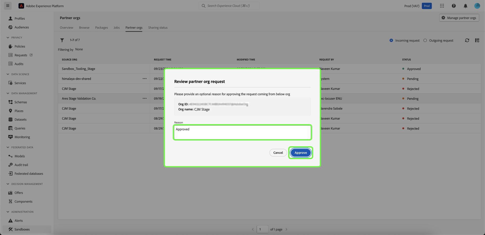
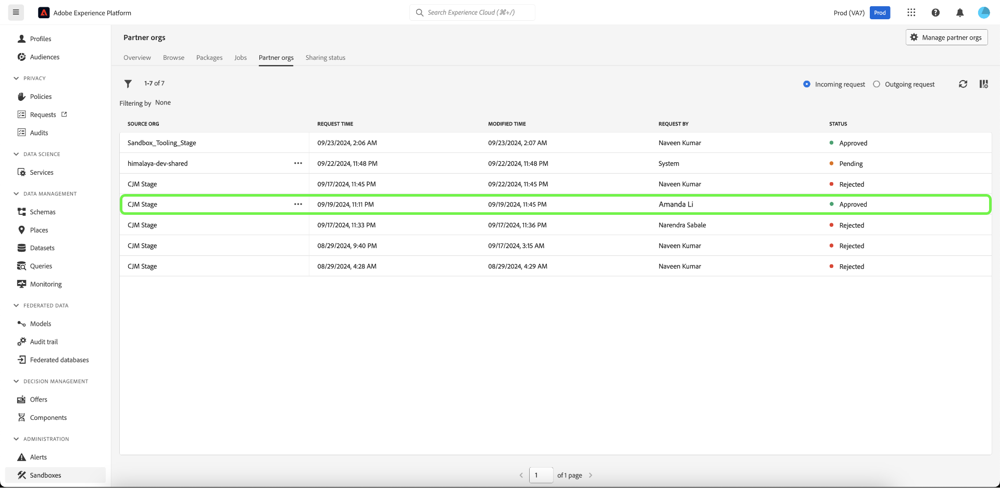

# 使用沙箱工具跨組織共用套件

提高沙箱之間的設定準確性，並利用沙箱工具功能順暢地匯出和匯入不同組織的沙箱之間的沙箱設定。 本文介紹如何在Adobe Experience Platform中使用沙箱工具，以在不同組織之間共用套件。 共用的套件有兩種型別：

- **私人套件**

[私人套件](#private-packages)只能與已核准來源組織之共用要求的組織共用。

- **公用套件**

[公用套件](#public-packages)不需額外核准即可匯入。 這些套件可在合作夥伴的網站、部落格或平台上共用。 封裝裝載可讓封裝從這些通道複製並貼到目標組織。

## 私人套件 {#private-packages}

>[!NOTE]
>
>若要啟動和核准共用要求，並在組織間共用封裝，您必須擁有&#x200B;**封裝共用**&#x200B;角色型存取控制許可權。

使用沙箱工具功能來建立合作關係、追蹤合作關係請求統計資料、管理現有合作關係，並與合作夥伴組織共用套件。

### 建立組織夥伴關係請求

若要建立組織合作關係請求，請瀏覽至&#x200B;**[!UICONTROL 沙箱]** **[!UICONTROL 合作夥伴組織]**&#x200B;標籤。 接著，選取&#x200B;**[!UICONTROL 管理夥伴組織]**。

在[!UICONTROL 封裝夥伴管理]對話方塊中，在&#x200B;**[!UICONTROL 輸入組織ID]**&#x200B;並按Enter (Windows)或傳回(Mac)。 組織ID顯示在下面的&#x200B;**[!UICONTROL 選取的組織ID]**&#x200B;區段中。 新增ID之後，請選取&#x200B;**[!UICONTROL 確認]**。

>[!TIP]
>
>您可以使用逗號分隔清單或輸入每個組織ID並接著輸入，一次輸入多個組織ID。

共用要求已成功傳送給夥伴組織，而您返回[!UICONTROL 沙箱] **[!UICONTROL 夥伴組織]**&#x200B;標籤，其中顯示&#x200B;**[!UICONTROL 傳出要求]**。

### 授權合作關係請求 {#authorize-request}

若要授權組織合作關係請求，請瀏覽至[!UICONTROL 沙箱] **[!UICONTROL 合作夥伴組織]**&#x200B;標籤。 接著，選取&#x200B;**[!UICONTROL 傳入要求]**。

![沙箱UI的[合作夥伴組織]索引標籤和[傳入要求]已反白顯示。](../images/ui/sandbox-tooling/private-authorise-partner-org.png)

此階段中要求的目前&#x200B;**[!UICONTROL 狀態]**&#x200B;為&#x200B;**擱置中**。 若要核准請求，請選取所選請求旁邊的省略符號(`...`)，然後從下拉式清單中選取&#x200B;**[!UICONTROL 核准]**。

![內送要求清單，顯示反白顯示[核准]的下拉式功能表。](../images/ui/sandbox-tooling/private-approve-partner-org.png)

**[!UICONTROL 檢閱合作夥伴組織要求]**&#x200B;對話方塊會顯示有關組織合作關係要求的詳細資料。 輸入[!UICONTROL 原因]進行核准，然後選取&#x200B;**[!UICONTROL 核准]**。

您返回[!UICONTROL 傳入要求]頁面，而且要求的狀態已更新為&#x200B;**[!UICONTROL 已核准]**。

使用此工作流程/程式可在您的組織與來源組織之間共用套件。

### 與合作夥伴組織共用套件 {#share-package}

>[!NOTE]
>
>只能共用狀態為&#x200B;**已發佈**&#x200B;的封裝。

若要與核准的合作夥伴組織共用封裝，請瀏覽至[!UICONTROL 沙箱] **[!UICONTROL 封裝]**&#x200B;標籤。 接著，選取封裝旁邊的省略符號(`...`)，然後從下拉式功能表中選取&#x200B;**[!UICONTROL 共用封裝]**。

![顯示下拉式功能表的套件清單，並反白顯示[共用]套件。](../images/ui/sandbox-tooling/private-share-package.png)

在&#x200B;**[!UICONTROL 共用封裝]**&#x200B;對話方塊中，從&#x200B;**[!UICONTROL 共用設定]**&#x200B;下拉式清單中選取要共用的封裝，然後選取&#x200B;**[!UICONTROL 確認]**。

>[!TIP]
>
>您可以選取多個組織。 選取的組織會顯示在[!UICONTROL 共用設定]下拉式清單下。

![共用套件對話方塊，其中的[共用]設定和[確認]已反白顯示。](../images/ui/sandbox-tooling/private-share-package-confirm.png)

## 公用套件 {#public-packages}

使用沙箱工具功能來建立不需要任何其他核准的可共用公用套件，並使用套件的裝載輕鬆匯入。

### 將套件可用性更新給公眾 {#update-package}

若要更新套件的可用性型別，請瀏覽至[!UICONTROL 沙箱] **[!UICONTROL 套件]**&#x200B;標籤。 接著，選取封裝旁邊的省略符號(`...`)，然後從下拉式功能表中選取&#x200B;**[!UICONTROL 更新至公用封裝]**。

在&#x200B;**[!UICONTROL 將封裝可用性變更為公用]**&#x200B;對話方塊中，確認封裝名稱正確並選取&#x200B;**[!UICONTROL 確認]**。

>[!IMPORTANT]
>
> 將套件設為公開後，即無法將其變更回私用。

![將封裝可用性變更為公開對話方塊，並反白顯示[確認]。](../images/ui/sandbox-tooling/change-package-availability.png)

### 使用封裝裝載共用封裝

若要共用公用封裝，請選取封裝旁邊的省略符號(`...`)，然後選取&#x200B;**[!UICONTROL 複製封裝裝載]**。

**[!UICONTROL 複製封裝承載]**&#x200B;對話方塊會顯示封裝名稱和承載。 選取&#x200B;**[!UICONTROL 複製封裝裝載]**&#x200B;以複製與封裝相關聯的裝載。

### 使用封裝裝載建立新封裝

若要使用封裝裝載建立封裝，請瀏覽至[!UICONTROL 沙箱] **[!UICONTROL 封裝]**&#x200B;標籤。 接著，選取&#x200B;**[!UICONTROL 建立封裝]**。

在&#x200B;**[!UICONTROL 建立封裝]**&#x200B;對話方塊中，選取&#x200B;**[!UICONTROL 貼上封裝承載]**&#x200B;的選項，然後選取&#x200B;**[!UICONTROL 選取]**。

![已選取貼上封裝裝載並選取反白顯示的[建立封裝]對話方塊。](../images/ui/sandbox-tooling/create-package-options.png)

將複製的封裝裝載貼到文字欄位中，並選取&#x200B;**[!UICONTROL 建立]**。

若要檢視共用要求的目前狀態，請瀏覽至&#x200B;**[!UICONTROL 共用狀態]**。 要求的目前狀態會顯示在&#x200B;**[!UICONTROL 共用狀態]**&#x200B;資料行中。

## 後續步驟 {#next-steps}

本檔案會示範如何使用沙箱工具功能來跨不同組織共用套件。 如需詳細資訊，請參閱[沙箱工具指南](../ui/sandbox-tooling.md)。

若要瞭解如何使用沙箱API執行不同的作業，請參閱[沙箱開發人員指南](../api/getting-started.md)。 如需Experience Platform中沙箱的整體概觀，請參閱[概觀檔案](../home.md)。
