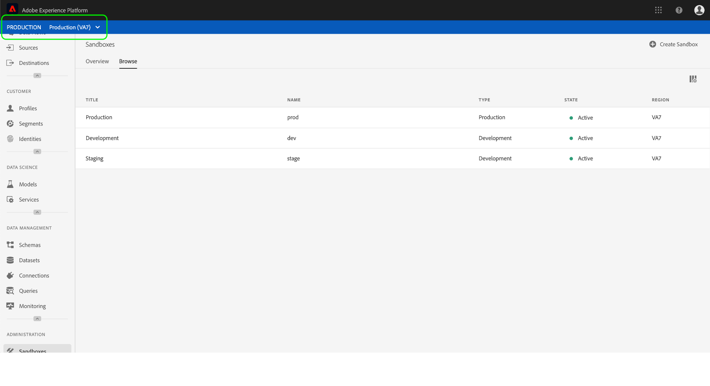
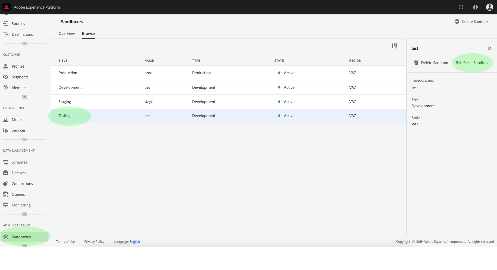

# 沙盒使用指南

本檔案提供如何在Adobe Experience Platform使用者介面中執行與沙盒相關之各種作業的步驟。

## 檢視沙盒

在Experience Platform UI中，按一下左側導 **覽中的** 「沙盒」，以開啟「 _沙盒_ 」控制面板。 控制面板會列出您組織的所有可用沙盒，包括沙盒類型（生產或開發）和狀態（作用中、建立、刪除或失敗）。

## 在沙盒之間切換

畫面 **左上角的沙盒切換器** ，會顯示目前作用中的沙盒。

若要在沙盒之間切換，請按一下沙盒切換器，然後從下拉式清單中選取所要的沙盒。

選取沙盒後，畫面會重新整理，而沙盒切換器現在包含選取的沙盒。

## 建立新的沙盒

若要在UI中建立新沙盒，請按一下左導覽中的「沙盒」 **，然後按一下「** 建立沙盒」 ****。

此時會 _出現「建立沙盒_ 」對話方塊，提示您提供沙盒的顯示標題和名稱。 顯 **示標題** (Display Title)應為人類可讀，且應具備足夠的描述性，以方便識別。 沙盒名 **稱** 是全小寫的識別碼，可用於API呼叫，因此應是唯一且簡明的。

完成後，按一下「 **建立**」。

>[!NOTE] 由於您僅限於建立非生產沙盒類型， **type** （類型）選項會鎖定在「非生產」，因此無法加以控制。

建立完沙盒後，請重新整理頁面，新沙盒就會出現在 _Sandbox_ （沙盒）控制面板中，狀態為「建立」。 新沙盒需要約15分鐘的時間才能由系統布建，之後其狀態會變更為「作用中」。

## 重設沙盒

>[!NOTE] 此功能僅適用於非生產沙盒。 無法重設生產沙盒。

重設非生產沙盒會刪除與該沙盒（結構、資料集等）相關的所有資源，同時仍會保留沙盒的名稱和相關權限。 對於具有存取權的使用者，這個「乾淨」的沙盒仍以相同名稱提供。

若要在UI中重設沙盒，請按一下左導覽中的「沙盒」 **** ，然後按一下您要重設的沙盒。 在顯示在畫面右側的對話方塊中，按一下「重設 **沙盒」**。

出現對話方塊提示您確認選擇。 按一 **下重設** ，繼續。

 

隨即出現確認訊息，沙盒的狀態會變更為「重設」。 一旦系統布建它，其狀態將更新為「活動」或「失敗」。

## 刪除沙盒

>[!NOTE] 此功能僅適用於非生產沙盒。 無法刪除生產沙盒。

刪除非生產沙盒會永久移除與該沙盒相關的所有資源，包括權限。

若要刪除UI中的沙盒，請按一下左導覽中的「沙盒」 **** ，然後按一下您要刪除的沙盒。 在顯示在畫面右側的對話方塊中，按一下「刪除沙 **盒」**。

出現對話方塊提示您確認選擇。 按一 **下「刪** 」繼續。

 

隨即出現確認訊息，沙盒會從「沙盒」工作區 _移除_ 。

## 後續步驟

本檔案示範如何在Experience Platform UI中管理沙盒。 如需如何使用沙盒API管理沙盒的詳細資訊，請參閱沙盒開 [發人員指南](../api/getting-started.md)。