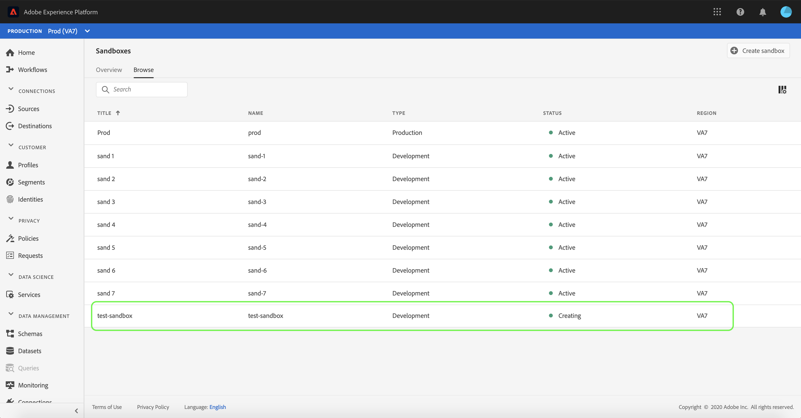

# 沙盒UI指南

本檔案提供如何在Adobe Experience Platform使用者介面中執行與沙盒相關之各種作業的步驟。

## 檢視沙盒

在Experience PlatformUI中，選擇左側導覽中的&#x200B;**[!UICONTROL Sandboxes]**&#x200B;以開啟&#x200B;**[!UICONTROL Sandboxes]**&#x200B;控制面板。 控制面板會列出您組織的所有可用沙盒，包括沙盒類型（生產或開發）和狀態（作用中、建立、刪除或失敗）。

## 在沙盒之間切換

畫面左上角的&#x200B;**沙盒切換器**&#x200B;控制項會顯示目前作用中的沙盒。

若要在沙盒之間切換，請選取沙盒切換器，並從下拉式清單中選取所要的沙盒。

選取沙盒後，畫面會重新整理，而沙盒切換器現在包含選取的沙盒。

## 沙盒作業

您可以使用沙盒切換器選單中的搜尋功能，在可用沙盒的清單中導覽。 輸入您要存取的沙盒名稱，以篩選組織可用的所有沙盒。

## 建立新的沙盒

使用下列影片快速概述如何在Experience Platform中使用沙盒。

>[!VIDEO](https://video.tv.adobe.com/v/29838/?quality=12&learn=on)

若要在UI中建立新沙盒，請選取畫面右上方的&#x200B;**[!UICONTROL Create Sandbox]**&#x200B;按鈕。

出現&#x200B;**[!UICONTROL Create Sandbox]**&#x200B;對話方塊，提示您提供沙盒的顯示標題和名稱。 **顯示標題**&#x200B;意為人類可讀，且描述性應足以易於識別。 沙盒&#x200B;**[!UICONTROL Name]**&#x200B;是全小寫的識別碼，可用於API呼叫，因此應是唯一且簡明的。 沙盒&#x200B;**[!UICONTROL Name]**&#x200B;只能由英數字元和連字型大小&#x200B;**(-)**&#x200B;組成，它必須以字母開頭，且最多包含256個字元。

完成後，選擇&#x200B;**[!UICONTROL Create]**。

>[!NOTE]
>
>由於您僅限於建立非生產沙盒類型，因此&#x200B;**[!UICONTROL type]**&#x200B;選項會鎖定在「非生產」，因此無法操控。

建立完沙盒後，請重新整理頁面，新沙盒就會出現在狀態為&quot;[!UICONTROL Creating]&quot;的&#x200B;**[!UICONTROL Sandboxes]**&#x200B;控制面板中。 新沙盒需要大約15分鐘的時間才能由系統布建，之後其狀態會變更為「[!UICONTROL Active]」。

## 重設沙盒

>[!NOTE]
>
>此功能僅適用於非生產沙盒。 無法重設生產沙盒。

重設非生產沙盒會刪除與該沙盒（結構、資料集等）相關的所有資源，同時仍會保留沙盒的名稱和相關權限。 對於具有存取權的使用者，這個「乾淨」的沙盒仍以相同名稱提供。

若要在UI中重設沙盒，請在左側導覽中選取&#x200B;**[!UICONTROL Sandboxes]**，然後選取您要重設的沙盒。 在顯示在螢幕右側的對話框中，選擇&#x200B;**[!UICONTROL Reset Sandbox]**。

出現對話方塊提示您確認選擇。 選擇&#x200B;**[!UICONTROL Reset]**&#x200B;繼續。

出現確認訊息，沙盒的狀態會變更為&quot;**[!UICONTROL Resetting]&quot;**。 系統布建後，其狀態將更新為&#x200B;**&quot;[!UICONTROL Active]&quot;**&#x200B;或&#x200B;**&quot;[!UICONTROL Failed]&quot;**。

## 刪除沙盒

>[!NOTE]
>
>此功能僅適用於非生產沙盒。 無法刪除生產沙盒。

刪除非生產沙盒會永久移除與該沙盒相關的所有資源，包括權限。

若要刪除UI中的沙盒，請在左側導覽中選取&#x200B;**[!UICONTROL Sandboxes]**，然後選取您要刪除的沙盒。 在顯示在螢幕右側的對話框中，選擇&#x200B;**[!UICONTROL Delete Sandbox]**。

出現對話方塊提示您確認選擇。 選擇&#x200B;**[!UICONTROL Delete]**&#x200B;繼續。

會出現確認訊息，並從&#x200B;**[!UICONTROL Sandboxes]**&#x200B;工作區移除沙盒。

## 後續步驟

本檔案示範如何在Experience PlatformUI中管理沙盒。 如需如何使用沙盒API管理沙盒的詳細資訊，請參閱[沙盒開發人員指南](../api/getting-started.md)。
