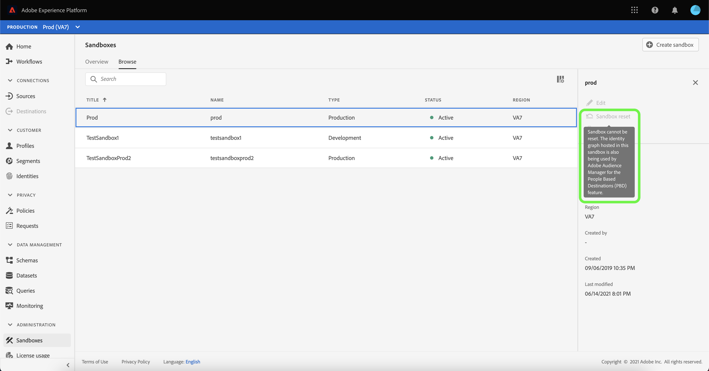

# 沙箱UI指南

本檔案提供如何在Adobe Experience Platform使用者介面中執行與沙箱相關之各種作業的步驟。

## 檢視沙箱

在Platform UI中，選取左側導覽中的&#x200B;**[!UICONTROL 沙箱]**&#x200B;以開啟[!UICONTROL 沙箱]控制面板。 控制面板會列出您組織的所有可用沙箱，包括沙箱類型（生產或開發）和狀態（作用中、建立、刪除或失敗）。

## 在沙箱之間切換

螢幕左上角的&#x200B;**沙箱切換器**&#x200B;控制項會顯示目前作用中的沙箱。

若要在沙箱之間切換，請選取沙箱切換器，然後從下拉式清單中選取所需的沙箱。

選取沙箱後，畫面會重新整理，沙箱切換器現在會顯示選取的沙箱。

## 搜尋沙箱

您可使用沙箱切換器功能表中的搜尋功能，導覽至可用沙箱清單。 輸入您要存取的沙箱名稱，以篩選組織可用的所有沙箱。

## 建立新沙箱

使用下列影片快速概述如何在Experience Platform中使用沙箱。

>[!VIDEO](https://video.tv.adobe.com/v/29838/?quality=12&learn=on)

若要建立新沙箱，請選取畫面右上角的&#x200B;**[!UICONTROL 建立沙箱]** 。

此時將顯示&#x200B;**[!UICONTROL 建立沙箱]**&#x200B;對話框。 如果您要建立開發沙箱，請在下拉式面板中選取&#x200B;**[!UICONTROL 開發]**。 若要建立新的生產沙箱，請選取&#x200B;**[!UICONTROL Production]**。

選取類型後，請為您的沙箱提供名稱和標題。 標題應是人類看得懂的，且描述性應足以輕鬆識別。 沙箱名稱是要用於API呼叫的全小寫識別碼，因此應是唯一且簡潔。 沙箱名稱必須以字母開頭，最多可包含256個字元，且僅包含英數字元和連字型大小(-)。

完成後，選擇&#x200B;**[!UICONTROL Create]**。

建立完沙箱後，請重新整理頁面，新沙箱會顯示在狀態為「[!UICONTROL 建立]」的&#x200B;**[!UICONTROL 沙箱]**&#x200B;控制面板中。 系統布建新沙箱需要約30秒，之後其狀態會變更為「[!UICONTROL Active]」。

## 重設沙箱

>[!IMPORTANT]
>
>如果Adobe Analytics也在[跨裝置分析(CDA)](https://experienceleague.adobe.com/docs/analytics/components/cda/overview.html)功能使用其中托管的身分圖表，或如果Adobe Audience Manager也在[以人物為基礎的目的地(PBD)](https://experienceleague.adobe.com/docs/audience-manager/user-guide/features/destinations/people-based/people-based-destinations-overview.html)功能使用其中托管的身分圖表，則無法重設預設的生產沙箱。 您也無法重設用於與Adobe Audience Manager或Audience Core Service雙向區段共用的生產沙箱。

重設生產或開發沙箱會刪除與該沙箱（結構、資料集等）相關的所有資源，同時維護沙箱的名稱和相關權限。 對於具有存取權的使用者，這個「乾淨」的沙箱會繼續以相同名稱提供。

從沙箱清單中選取您要重設的沙箱。 在顯示的右側導覽面板中，選取&#x200B;**[!UICONTROL 沙箱重設]**。

隨即出現對話方塊，提示您確認選擇。 選擇&#x200B;**[!UICONTROL 繼續]**&#x200B;以繼續。

在最終確認窗口中，在對話框中輸入沙箱的名稱，然後選擇&#x200B;**[!UICONTROL Reset]**

幾分鐘後，畫面底部會顯示確認方塊，以確認重設成功。

### 錯誤訊息

包含CDA資料的預設生產沙箱無法重設，並傳回下列錯誤。

包含PBD資料的預設生產沙箱也無法重設，並傳回下列錯誤。

包含CDA和PBD資料的預設生產沙箱也無法重設，並傳回下列錯誤。

與Adobe Audience Manager或Audience Core Service雙向區段共用的生產沙箱也無法重設，且會傳回下列錯誤。

## 刪除沙箱

>[!IMPORTANT]
>
>無法刪除預設的生產沙箱，且用於與Adobe Audience Manager或Audience Core Service雙向區段共用的生產沙箱也無法刪除。

刪除生產或開發沙箱會永久刪除與該沙箱相關聯的所有資源，包括權限。

從沙箱清單中選取您要刪除的沙箱。 在顯示的右導航面板中，選擇&#x200B;**[!UICONTROL Delete]**。

隨即出現對話方塊，提示您確認選擇。 選擇&#x200B;**[!UICONTROL 繼續]**&#x200B;以繼續。

在最終確認窗口中，在對話框中輸入沙箱的名稱，然後選擇&#x200B;**[!UICONTROL Continue]**

無法刪除與Adobe Audience Manager或Audience Core Service雙向區段共用的生產沙箱，並傳回下列錯誤。

## 後續步驟

本檔案示範如何在Experience PlatformUI中管理沙箱。 如需如何使用沙箱API管理沙箱的詳細資訊，請參閱[沙箱開發人員指南](../api/getting-started.md)。
