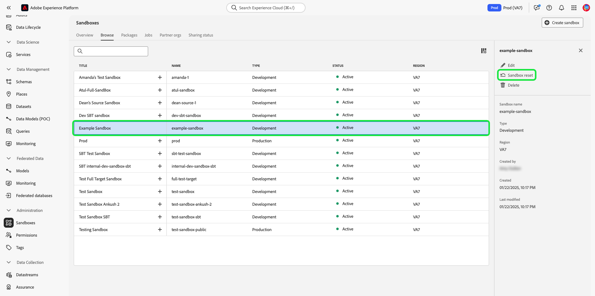

# 沙箱UI指南

本檔案提供如何在Adobe Experience Platform使用者介面中執行與沙箱相關的各種作業的步驟。

## 檢視沙箱

在Experience Platform UI中，選取左側導覽中的&#x200B;**[!UICONTROL 沙箱]**，然後選取&#x200B;**[!UICONTROL 瀏覽]**&#x200B;索引標籤以開啟[!UICONTROL 沙箱]儀表板。 儀表板會列出貴組織的所有可用沙箱，包括其個別型別（生產或開發）。

## 在沙箱之間切換

沙箱指標位於Experience Platform UI的頂端標題中，顯示您目前所在沙箱的標題、其區域和型別。

若要在沙箱之間切換，請選取沙箱指標，然後從下拉式清單中選取所需的沙箱。 或者，您可以使用下拉式選單中的搜尋功能來搜尋您想要的沙箱。

選取沙箱後，畫面會重新整理並更新至您選取的沙箱。

## 建立新沙箱 {#create}

>[!CONTEXTUALHELP]
>id="platform_sandboxes_sandboxname"
>title="沙箱名稱"
>abstract="沙箱名稱指在後端用於為此沙箱建立唯一 ID 的文字。"

>[!CONTEXTUALHELP]
>id="platform_sandboxes_sandboxtitle"
>title="沙箱標題"
>abstract="沙箱標題指在整個 Experience Platform UI 的選單和下拉選單中代表沙箱的顯示名稱。"

>[!WARNING]
>
>建立新沙箱需要您將它新增到[[!UICONTROL 許可權]](../../access-control/abac/ui/permissions.md)中的角色，然後才能開始使用。 若要瞭解如何布建角色的沙箱，請參閱角色的[管理沙箱](../../access-control/abac/ui/permissions.md#managing-sandboxes-for-role)檔案。

使用下列影片快速概略說明如何在Experience Platform中使用沙箱。

>[!VIDEO](https://video.tv.adobe.com/v/29838/?quality=12&learn=on)

若要建立新沙箱，請選取畫面右上角的&#x200B;**[!UICONTROL 建立沙箱]**。

**[!UICONTROL 建立沙箱]**&#x200B;對話方塊就會顯示。 選取&#x200B;**[!UICONTROL 型別]**&#x200B;下拉式清單，然後選擇[!UICONTROL 開發]或[!UICONTROL 生產]沙箱型別。

選取型別後，在&#x200B;**[!UICONTROL 名稱]**&#x200B;欄位中提供沙箱的名稱。 沙箱名稱是用於API呼叫的全小寫識別碼，因此應是唯一的且簡潔的。 沙箱名稱必須以字母開頭，最多可包含256個字元，且僅包含英數字元和連字型大小(-)。 接下來，在&#x200B;**[!UICONTROL 標題]**&#x200B;欄位中提供沙箱的標題。 標題的說明性應該要能讓人看得懂，並且要足以輕鬆識別。

完成後，選取&#x200B;**[!UICONTROL 建立]**。

當您完成建立沙箱後，請重新整理頁面，新的沙箱會顯示在&#x200B;**[!UICONTROL 沙箱]**&#x200B;儀表板中，狀態為&quot;[!UICONTROL 正在建立]&quot;。 系統布建新沙箱大約需要30秒，之後沙箱的狀態會變更為&quot;[!UICONTROL 作用中]&quot;。

## 重設沙箱

>[!WARNING]
>
>以下是可防止您重設預設生產沙箱或使用者建立的生產沙箱的例外清單：
>
>* 在警告訊息後，可以重設使用者建立的、用於與Adobe Audience Manager或Audience Core Service雙向區段共用的生產沙箱。
>* 在起始沙箱重設之前，您將需要手動刪除您的構圖，以確保適當的清理關聯的對象資料。
>* 重設完成後，沙箱ID將會變更。
>* 對於[Journey Optimizer B2B edition](https://experienceleague.adobe.com/zh-hant/docs/journey-optimizer-b2b/user/guide-overview)，目前不支援&#x200B;**沙箱重設**。 重設或刪除對應至Journey Optimizer B2B edition的沙箱可能會導致Journey Optimizer B2B edition中的資料永久遺失，並且可能須布建新的Journey Optimizer B2B edition執行個體。

### 刪除對象組合

對象構成目前未與沙箱重設功能整合，因此在執行沙箱重設之前，需要手動刪除對象。

從左側導覽的&#x200B;**[!UICONTROL 客戶]**&#x200B;區段中選取&#x200B;**[!UICONTROL 對象]**，然後選取&#x200B;**[!UICONTROL 組合]**&#x200B;索引標籤。

![選取並反白了[構成]索引標籤的[對象]儀表板。](../images/ui/audiences.png)

接著，選取第一個對象旁邊的省略符號(`...`)，然後選取&#x200B;**[!UICONTROL 刪除]**。

![標示[!UICONTROL 刪除]選項的對象功能表。](../images/ui/delete-composition.png)

顯示成功刪除的確認訊息，並返回&#x200B;**[!UICONTROL 構成]**&#x200B;索引標籤。

對您的所有構成重複上述步驟。 這將會從對象詳細目錄中刪除所有對象。 移除所有對象後，您就可以繼續重設沙箱。

### 重設沙箱

重設生產或開發沙箱會刪除與該沙箱關聯的所有資源（結構描述、資料集等），同時維護沙箱的名稱和關聯的許可權。 此「乾淨」沙箱可繼續以相同名稱供擁有存取權的使用者使用。

從沙箱清單中選取您要重設的沙箱。 在出現的右側導覽面板中，選取&#x200B;**[!UICONTROL 沙箱重設]**。

會出現一個對話方塊，提示您確認您的選擇。 選取&#x200B;**[!UICONTROL 繼續]**&#x200B;以繼續。

![顯示重設對話方塊，並反白顯示[繼續]選項。](../images/ui/reset-warning.png)

在最後的確認視窗中，在對話方塊中輸入沙箱的名稱，並選取&#x200B;**[!UICONTROL 重設]**。

## 刪除沙箱

>[!WARNING]
>
>您無法刪除預設的生產沙箱。 不過，在警告訊息之後，可以刪除任何使用者建立的、用於與[!DNL Audience Manager]或[!DNL Audience Core Service]雙向區段共用的生產沙箱。

刪除生產或開發沙箱會永久移除與該沙箱相關聯的所有資源，包括許可權。

從沙箱清單中選取您要刪除的沙箱。 在出現的右側導覽面板中，選取&#x200B;**[!UICONTROL 刪除]**。

![已選取所選沙箱的沙箱儀表板，並反白顯示[刪除]選項。](../images/ui/delete.png)

會出現一個對話方塊，提示您確認您的選擇。 選取&#x200B;**[!UICONTROL 繼續]**&#x200B;以繼續。

![顯示刪除對話方塊，並反白顯示[繼續]選項。](../images/ui/delete-warning.png)

在最後的確認視窗中，在對話方塊中輸入沙箱的名稱，並選取&#x200B;**[!UICONTROL 繼續]**。

## 後續步驟

本檔案會示範如何在Experience Platform UI中管理沙箱。 現在您知道如何管理沙箱，瞭解如何提高沙箱之間的設定準確性，並使用[沙箱工具功能](./sandbox-tooling.md)指南在沙箱之間順暢地匯出和匯入沙箱設定。

有關如何使用沙箱API管理沙箱的資訊，請參閱[沙箱開發人員指南](../api/getting-started.md)。
