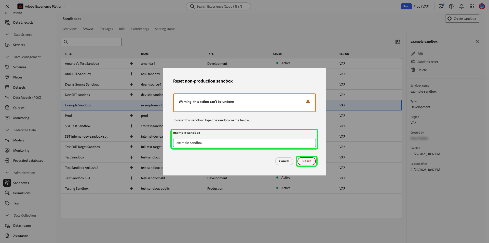

# 沙箱UI指南

本檔案提供如何在Adobe Experience Platform使用者介面中執行與沙箱相關之各種作業的步驟。

## 檢視沙箱

在平台UI中，選取 **[!UICONTROL 沙箱]** 在左側導覽器中，然後選取 **[!UICONTROL 瀏覽]** 開啟 [!UICONTROL 沙箱] 控制面板。 控制面板會列出您組織的所有可用沙箱，包括其各自的類型（生產或開發）。

## 在沙箱之間切換

沙箱指標位於Platform UI的頂端標題中，並顯示您目前所在沙箱的標題、其地區及其類型。

若要在沙箱之間切換，請選取沙箱指標，然後從下拉式清單中選取所需的沙箱。

選取沙箱後，畫面會重新整理並更新至您選取的沙箱。

## 建立新沙箱 {#create}

>[!CONTEXTUALHELP]
>id="platform_sandboxes_sandboxname"
>title="沙箱名稱"
>abstract="沙箱名稱是用於後端的文字，用於為此沙箱建立唯一ID。"

>[!CONTEXTUALHELP]
>id="platform_sandboxes_sandboxtitle"
>title="沙箱標題"
>abstract="沙箱標題是顯示名稱，代表功能表中的沙箱，以及整個Experience PlatformUI的下拉式清單。"

>[!NOTE]
>
>建立新沙箱時，您必須先將該新沙箱新增至產品設定檔，位於 [Adobe Admin Console](https://adminconsole.adobe.com/) 開始使用新沙箱之前。 請參閱 [管理產品設定檔的權限](../../access-control/ui/permissions.md) 以取得如何將沙箱布建至產品設定檔的資訊。

使用下列影片快速概述如何在Experience Platform中使用沙箱。

>[!VIDEO](https://video.tv.adobe.com/v/29838/?quality=12&learn=on)

若要建立新沙箱，請選取 **[!UICONTROL 建立沙箱]** 在螢幕的右上角。

此 **[!UICONTROL 建立沙箱]** 對話框。 如果您要建立開發沙箱，請選取 **[!UICONTROL 開發]** 中。 若要建立新的生產沙箱，請選取 **[!UICONTROL 生產]**.

選取類型後，請為您的沙箱提供名稱和標題。 標題應是人類看得懂的，且描述性應足以易於識別。 沙箱名稱是要用於API呼叫的全小寫識別碼，因此應是唯一且簡潔。 沙箱名稱必須以字母開頭，最多可包含256個字元，且僅包含英數字元和連字型大小(-)。

完成後，請選取 **[!UICONTROL 建立]**.

建立完沙箱後，請重新整理頁面，新沙箱就會顯示在 **[!UICONTROL 沙箱]** 狀態為「[!UICONTROL 建立]」。 系統布建新沙箱約需30秒，之後狀態會變更為「[!UICONTROL 作用中]」。

## 重設沙箱

>[!WARNING]
>
>以下是可防止您重設預設生產沙箱或使用者建立生產沙箱的例外清單： <ul><li>如果Adobe Analytics也在將沙箱中托管的身分圖表用於 [跨裝置分析(CDA)](https://experienceleague.adobe.com/docs/analytics/components/cda/overview.html) 功能。</li><li>如果Adobe Audience Manager也在將沙箱中托管的身分圖表用於 [以人物為基礎的目的地(PBD)](https://experienceleague.adobe.com/docs/audience-manager/user-guide/features/destinations/people-based/people-based-destinations-overview.html).</li><li>如果預設生產沙箱同時包含CDA和PBD功能的資料，則無法重設。</li><li>使用者建立的生產沙箱，用於與Adobe Audience Manager或Audience Core Service雙向區段共用，可在出現警告訊息後重設。</li></ul>

重設生產或開發沙箱會刪除與該沙箱（結構、資料集等）相關的所有資源，同時維護沙箱的名稱和相關權限。 對於具有存取權的使用者，這個「乾淨」的沙箱會繼續以相同名稱提供。

從沙箱清單中選取您要重設的沙箱。 在顯示的右導覽面板中，選取 **[!UICONTROL 沙箱重設]**.

隨即出現對話方塊，提示您確認選擇。 選擇 **[!UICONTROL 繼續]** 繼續。

在最終確認視窗中，在對話方塊中輸入沙箱名稱，然後選取 **[!UICONTROL 重設]**.

## 刪除沙箱

>[!WARNING]
>
>您無法刪除預設的生產沙箱。 不過，任何使用者建立的生產沙箱，都會用於與 [!DNL Audience Manager] 或 [!DNL Audience Core Service] 可在出現警告訊息後刪除。

刪除生產或開發沙箱會永久刪除與該沙箱相關聯的所有資源，包括權限。

從沙箱清單中選取您要刪除的沙箱。 在顯示的右導覽面板中，選取 **[!UICONTROL 刪除]**.

隨即出現對話方塊，提示您確認選擇。 選擇 **[!UICONTROL 繼續]** 繼續。

在最終確認視窗中，在對話方塊中輸入沙箱名稱，然後選取  **[!UICONTROL 繼續]**.

## 後續步驟

本檔案示範如何在Experience PlatformUI中管理沙箱。 如需如何使用沙箱API管理沙箱的詳細資訊，請參閱 [沙箱開發人員指南](../api/getting-started.md).
