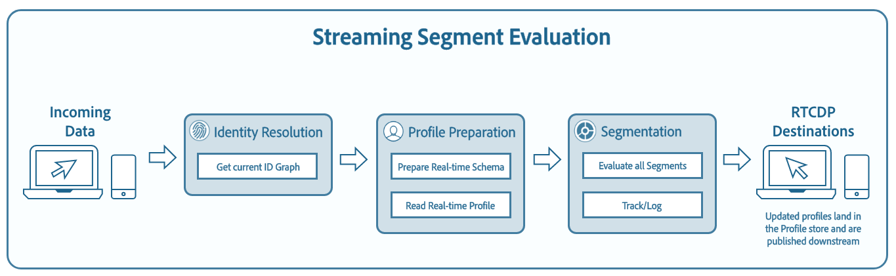

# 透過串流細分以近乎即時的方式評估事件

>[!NOTE]
>
>下列檔案說明如何使用API使用串流分段。 如需使用UI使用串流分段的詳細資訊，請參閱 [串流劃分UI指南](../ui/streaming-segmentation.md).

在 [!DNL Adobe Experience Platform] 可讓客戶以近乎即時的方式執行細分，同時專注於資料豐富性。 透過串流細分，區段資格現在會在串流資料進入 [!DNL Platform]，可緩解排程及執行分段作業的需求。 透過此功能，現在當資料傳入時，即可評估大部分的區段規則 [!DNL Platform]，這表示區段成員資格會保持最新，而不會執行已排程的分段工作。



>[!NOTE]
>
>串流分段適用於使用串流來源擷取的所有資料。 使用批次型來源擷取的區段，即使符合串流分段的資格，也會在每晚評估。
>
>此外，如果使用串流分段評估的區段是基於使用批次分段評估的另一個區段，則在理想成員和實際成員之間可能會漂移。 例如，如果區段A以區段B為基礎，且使用批次分段評估區段B，由於區段B僅每24小時更新一次，因此區段A會從實際資料進一步移動，直到與區段B更新重新同步為止。

## 快速入門

本開發人員指南需要妥善了解 [!DNL Adobe Experience Platform] 與串流細分相關的服務。 開始本教學課程之前，請先檢閱下列服務的檔案：

- [[!DNL Real-time Customer Profile]](../../profile/home.md):根據來自多個來源的匯總資料，即時提供統一的消費者設定檔。
- [[!DNL Segmentation]](../home.md):提供從 [!DNL Real-time Customer Profile] 資料。
- [[!DNL Experience Data Model (XDM)]](../../xdm/home.md):標準化框架 [!DNL Platform] 組織客戶體驗資料。

以下小節提供您需要知道的其他資訊，以便成功對 [!DNL Platform] API。

### 讀取範例API呼叫

本開發人員指南提供範例API呼叫，以示範如何格式化您的請求。 這些功能包括路徑、必要標題和格式正確的請求裝載。 也提供API回應中傳回的範例JSON。 如需範例API呼叫檔案中所使用慣例的相關資訊，請參閱 [如何閱讀API呼叫範例](../../landing/troubleshooting.md#how-do-i-format-an-api-request) 在 [!DNL Experience Platform] 疑難排解指南。

### 收集必要標題的值

若要對 [!DNL Platform] API，您必須先完成 [驗證教學課程](https://www.adobe.com/go/platform-api-authentication-en). 完成驗證教學課程會提供所有 [!DNL Experience Platform] API呼叫，如下所示：

- 授權：承載 `{ACCESS_TOKEN}`
- x-api-key: `{API_KEY}`
- x-gw-ims-org-id: `{ORG_ID}`

中的所有資源 [!DNL Experience Platform] 與特定虛擬沙箱隔離。 所有請求 [!DNL Platform] API需要標頭，以指定要在中執行操作的沙箱名稱：

- x-sandbox-name: `{SANDBOX_NAME}`

>[!NOTE]
>
>如需中沙箱的詳細資訊，請參閱 [!DNL Platform]，請參閱 [沙箱概述檔案](../../sandboxes/home.md).

所有包含裝載(POST、PUT、PATCH)的請求都需要額外的標題：

- 內容類型：application/json

完成特定請求可能需要其他標題。 本檔案的每個範例都會顯示正確的標題。 請特別注意範例要求，以確保納入所有必要的標題。

### 啟用串流分段的查詢類型 {#query-types}

>[!NOTE]
>
>您需要為組織啟用排程的分段，才能讓串流分段運作。 如需啟用排程分段的相關資訊，請參閱 [啟用排程分段區段](#enable-scheduled-segmentation)

為了使用串流分段來評估區段，查詢必須符合下列准則。

| 查詢類型 | 詳細資訊 |
| ---------- | ------- |
| 單一事件 | 任何區段定義，是指沒有時間限制的單一傳入事件。 |
| 相對時間範圍內的單一事件 | 任何指單一傳入事件的區段定義。 |
| 具有時間窗口的單個事件 | 任何區段定義，指的是具有時間視窗的單一傳入事件。 |
| 僅限設定檔 | 只參考設定檔屬性的任何區段定義。 |
| 具有設定檔屬性的單一事件 | 任何區段定義，是指沒有時間限制的單一傳入事件，以及一或多個設定檔屬性。 **注意：** 事件發生時會立即評估查詢。 但是，若是設定檔事件，則必須等待24小時才能納入。 |
| 相對時間窗口內具有配置檔案屬性的單個事件 | 任何區段定義，指的是單一傳入事件和一或多個設定檔屬性。 |
| 區段 | 包含一或多個批次或串流區段的任何區段定義。 **注意：** 如果使用區段，將會發生設定檔取消資格 **每24小時**. |
| 具有設定檔屬性的多個事件 | 任何參照多個事件的區段定義 **過去24小時內** 和（可選）有一或多個設定檔屬性。 |

區段定義將 **not** 可在下列情況下啟用串流分段：

- 區段定義包含Adobe Audience Manager(AAM)區段或特徵。
- 區段定義包括多個實體（多實體查詢）。
- 區段定義包含單一事件和 `inSegment` 事件。
   - 不過，若 `inSegment` 事件僅限設定檔，區段定義 **will** 啟用串流細分功能。

請注意，執行串流細分時，會套用下列准則：

| 查詢類型 | 指引 |
| ---------- | -------- |
| 單一事件查詢 | 回顧期間沒有限制。 |
| 具有事件歷史記錄的查詢 | <ul><li>回顧期間限制為 **一天**.</li><li>嚴格的時間排序條件 **必須** 存在於事件之間。</li><li>支援具有至少一個否定事件的查詢。 不過，整個事件 **不能** 是否定。</li></ul> |

如果修改區段定義，使其不再符合串流分段的條件，區段定義會自動從「串流」切換為「批次」。

此外，區段取消資格與區段資格類似，會即時發生。 因此，如果對象不再符合區段的資格，將會立即無資格。 例如，如果區段定義要求輸入「過去三小時內購買紅色鞋子的所有使用者」，三小時後，最初符合區段定義資格的所有設定檔都將不符合條件。

## 擷取為串流細分啟用的所有區段

您可以向 `/segment/definitions` 端點。

**API格式**

若要擷取啟用串流的區段，您必須包含查詢參數 `evaluationInfo.continuous.enabled=true` 在請求路徑中。

```http
GET /segment/definitions?evaluationInfo.continuous.enabled=true
```

**要求**

```shell
curl -X GET \
  'https://platform.adobe.io/data/core/ups/segment/definitions?evaluationInfo.continuous.enabled=true' \
  -H 'Authorization: Bearer {ACCESS_TOKEN}' \
  -H 'Content-Type: application/json' \
  -H 'x-api-key: {API_KEY}' \
  -H 'x-gw-ims-org-id: {ORG_ID}' \
  -H 'x-sandbox-name: {SANDBOX_NAME}'
```

**回應**

成功的回應會傳回IMS組織中已啟用串流細分的區段陣列。

```json
{
    "segments": [
        {
            "id": "15063cb-2da8-4851-a2e2-bf59ddd2f004",
            "schema": {
                "name": "_xdm.context.profile"
            },
            "ttlInDays": 30,
            "imsOrgId": "{ORG_ID}",
            "sandbox": {
                "sandboxId": "",
                "sandboxName": "",
                "type": "production",
                "default": true
            },
            "name": " People who are NOT on their homepage ",
            "expression": {
                "type": "PQL",
                "format": "pql/text",
                "value": "select var1 from xEvent where var1._experience.analytics.endUser.firstWeb.webPageDetails.isHomePage = false"
            },
            "evaluationInfo": {
                "batch": {
                    "enabled": false
                },
                "continuous": {
                    "enabled": true
                },
                "synchronous": {
                    "enabled": false
                }
            },
            "creationTime": 1572029711000,
            "updateEpoch": 1572029712000,
            "updateTime": 1572029712000
        },
        {
            "id": "f15063cb-2da8-4851-a2e2-bf59ddd2f004",
            "schema": {
                "name": "_xdm.context.profile"
            },
            "ttlInDays": 30,
            "imsOrgId": "{ORG_ID}",
            "sandbox": {
                "sandboxId": "",
                "sandboxName": "",
                "type": "production",
                "default": true
            },
            "name": "Homepage_continuous",
            "description": "People who are on their homepage - continuous",
            "expression": {
                "type": "PQL",
                "format": "pql/text",
                "value": "select var1 from xEvent where var1._experience.analytics.endUser.firstWeb.webPageDetails.isHomePage = true"
            },
            "evaluationInfo": {
                "batch": {
                    "enabled": true
                },
                "continuous": {
                    "enabled": true
                },
                "synchronous": {
                    "enabled": false
                }
            },
            "creationTime": 1572021085000,
            "updateEpoch": 1572021086000,
            "updateTime": 1572021086000
        }
    ],
    "page": {
        "totalCount": 2,
        "totalPages": 1,
        "sortField": "creationTime",
        "sort": "desc",
        "pageSize": 2,
        "limit": 100
    },
    "link": {}
}
```

## 建立啟用串流的區段

如果區段符合下列其中一個 [上列的串流區段類型](#query-types).

**API格式**

```http
POST /segment/definitions
```

**要求**

```shell
curl -X POST \
  https://platform.adobe.io/data/core/ups/segment/definitions \
  -H 'Authorization: Bearer {ACCESS_TOKEN}'  \
  -H 'Content-Type: application/json' \
  -H 'x-api-key: {API_KEY}' \
  -H 'x-gw-ims-org-id: {ORG_ID}' \
  -H 'x-sandbox-name: {SANDBOX_NAME}' \
  -d '{
    "schema": {
        "name": "_xdm.context.profile"
    },
    "ttlInDays": 30,
    "name": "Homepage_continuous",
    "description": "People who are on their homepage - continuous",
    "expression": {
        "type": "PQL",
        "format": "pql/text",
        "value": "select var1 from xEvent where var1._experience.analytics.endUser.firstWeb.webPageDetails.isHomePage = true"
    }
}'
```

>[!NOTE]
>
>這是標準的「建立區段」請求。 如需建立區段定義的詳細資訊，請參閱 [建立區段](../tutorials/create-a-segment.md).

**回應**

成功的回應會傳回新建立已啟用串流的區段定義的詳細資訊。

```json
{
    "id": "f15063cb-2da8-4851-a2e2-bf59ddd2f004",
    "schema": {
        "name": "_xdm.context.profile"
    },
    "ttlInDays": 30,
    "imsOrgId": "{ORG_ID}",
    "sandbox": {
        "sandboxId": "{SANDBOX_ID}",
        "sandboxName": "{SANDBOX_NAME}",
        "type": "production",
        "default": true
    },
    "name": "Homepage_continuous",
    "description": "People who are on their homepage - continuous",
    "expression": {
        "type": "PQL",
        "format": "pql/text",
        "value": "select var1 from xEvent where var1._experience.analytics.endUser.firstWeb.webPageDetails.isHomePage = true"
    },
    "evaluationInfo": {
        "batch": {
            "enabled": false
        },
        "continuous": {
            "enabled": true,
                   },
        "synchronous": {
            "enabled": false
        }
    },
    "creationTime": 1572021085000,
    "updateEpoch": 1572021086000,
    "updateTime": 1572021086000
}
```

## 啟用計畫評估 {#enable-scheduled-segmentation}

啟用串流評估後，必須建立基線（在基線後區段一律為最新狀態）。 必須先啟用計畫評估（也稱為計劃分段），系統才能自動執行基線設定。 透過已排程的細分，您的IMS組織可以遵循循環排程，自動執行匯出工作以評估區段。

>[!NOTE]
>
>可針對最多五(5)個合併原則的沙箱啟用排程評估 [!DNL XDM Individual Profile]. 如果貴組織有五個以上的合併政策 [!DNL XDM Individual Profile] 在單一沙箱環境中，您將無法使用排程的評估。

### 建立排程

向 `/config/schedules` 端點，您可以建立排程，並包含應觸發排程的特定時間。

**API格式**

```http
POST /config/schedules
```

**要求**

下列要求會根據裝載中提供的規格，建立新排程。

```shell
curl -X POST \
  https://platform.adobe.io/data/core/ups/config/schedules \
  -H 'Content-Type: application/json' \
  -H 'Authorization: Bearer {ACCESS_TOKEN}' \
  -H 'x-api-key: {API_KEY}' \
  -H 'x-gw-ims-org-id: {ORG_ID}' \
  -H 'x-sandbox-name: {SANDBOX_NAME}' \
  -d '{
        "name": "{SCHEDULE_NAME}",
        "type": "batch_segmentation",
        "properties": {
            "segments": ["*"]
        },
        "schedule": "0 0 1 * * ?",
        "state": "inactive"
        }'
```

| 屬性 | 說明 |
| -------- | ----------- |
| `name` | **（必要）** 排程的名稱。 必須是字串。 |
| `type` | **（必要）** 字串格式的作業類型。 支援的類型包括 `batch_segmentation` 和 `export`. |
| `properties` | **（必要）** 包含與排程相關的其他屬性的物件。 |
| `properties.segments` | **(必要時 `type` 等於 `batch_segmentation`)** 使用 `["*"]` 確保包含所有區段。 |
| `schedule` | **（必要）** 包含作業計畫的字串。 作業只能排程為每天執行一次，這表示您無法排程作業在24小時期間執行多次。 顯示的範例(`0 0 1 * * ?`)表示每天1時觸發工作:00:00 UTC。 欲知更多資訊，請查閱 [cron運算式格式](./schedules.md#appendix) 在檔案中的分段內排程。 |
| `state` | *（可選）* 包含排程狀態的字串。 可用值： `active` 和 `inactive`. 預設值為 `inactive`。IMS組織只能建立一個排程。 更新排程的步驟將在本教學課程的稍後部分提供。 |

**回應**

成功的回應會傳回新建立之排程的詳細資訊。

```json
{
    "id": "cd585edf-962d-420d-94ad-3be03e619ac2",
    "imsOrgId": "{ORG_ID}",
    "sandbox": {
        "sandboxId": "e7e17720-c5bb-11e9-aafb-87c71c35cac8",
        "sandboxName": "prod",
        "type": "production",
        "default": true
    },
    "name": "{SCHEDULE_NAME}",
    "state": "inactive",
    "type": "batch_segmentation",
    "schedule": "0 0 1 * * ?",
    "properties": {
        "segments": [
            "*"
        ]
    },
    "createEpoch": 1568267948,
    "updateEpoch": 1568267948
}
```

### 啟用排程

依預設，排程在建立時非作用中，除非 `state` 屬性設為 `active` 在建立(POST)請求內文中。 您可以啟用排程(設定 `state` to `active`)，向 `/config/schedules` 端點，並在路徑中納入排程的ID。

**API格式**

```http
POST /config/schedules/{SCHEDULE_ID}
```

**要求**

下列要求使用 [JSON修補程式格式](https://datatracker.ietf.org/doc/html/rfc6902) 以便更新 `state` 的 `active`.

```shell
curl -X POST \
  https://platform.adobe.io/data/core/ups/config/schedules/cd585edf-962d-420d-94ad-3be03e619ac2 \
  -H 'Content-Type: application/json' \
  -H 'Authorization: Bearer {ACCESS_TOKEN}' \
  -H 'x-api-key: {API_KEY}' \
  -H 'x-gw-ims-org-id: {ORG_ID}' \
  -H 'x-sandbox-name: {SANDBOX_NAME}' \
  -d '[
        {
          "op": "add",
          "path": "/state",
          "value": "active"
        }
      ]'
```

**回應**

成功更新會傳回空的回應內文和HTTP狀態204（無內容）。

同一個操作可用來停用排程，方法是將先前請求中的「值」取代為「非作用中」。

## 後續步驟

現在您已針對串流細分啟用新區段和現有區段，並啟用排程分段以建立基線並執行循環評估，您可以開始為組織建立已啟用串流的區段。

若要了解如何使用Adobe Experience Platform使用者介面執行類似動作及使用區段，請造訪 [區段產生器使用手冊](../ui/segment-builder.md).

## 附錄

下節列出關於串流細分的常見問題：

### 串流細分「取消資格」是否也會即時發生？

在大多數情況下，串流細分取消資格會即時發生。 不過，使用區段的串流區段確實如此 **not** 即時取消資格，而是在24小時後取消資格。

### 串流細分有哪些適用的資料？

串流分段適用於使用串流來源擷取的所有資料。 使用批次型來源擷取的區段，即使符合串流分段的資格，也會在每晚評估。 時間戳記早於24小時的串流到系統的事件，將在後續的批處理作業中處理。

### 區段如何定義為批次或串流區段？

區段的定義是根據查詢類型和事件歷史記錄持續時間的組合而進行批次或串流區段。 若需評估為串流區段的區段清單，請參閱 [流式細分查詢類型節](#query-types).

請注意，如果區段包含 **both** an `inSegment` 運算式和直接的單事件鏈，無法符合串流分段的資格。 如果您想要讓此區段符合串流分段的資格，請將直接單事件鏈設為自己的區段。

### 為何「總合格」區段的數量持續增加，而「最近X天」底下的數量在區段詳細資料區段內維持為零？

合格區段總數會從每日劃分工作中提取，包括同時符合批次和串流區段資格的對象。 批次和串流區段都會顯示此值。

「最近X天」下的數字 **僅限** 包括符合串流細分資格的對象，以及 **僅限** 如果您已將資料串流至系統，且計入該串流定義，則會增加。 此值為 **僅限** 顯示於串流區段。 因此，此值 **5月** 對於批次區段，顯示為0。

因此，如果您看到「最近X天」底下的數字為零，而折線圖也報告為零，則您有 **not** 將符合該區段資格的任何設定檔串流至系統。

### 區段可用需要多久時間？

最多需要1小時的時間，區段才可供使用。
