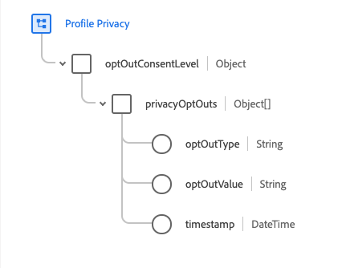

# 允許區段中的退出請求

Adobe Experience Platform允許您的客戶在[!DNL Real-time Customer Profile]內傳送有關其資料使用和儲存的退出要求。 這些選擇退出要求是[!DNL California Consumer Privacy Act](CCPA)的一部分，CCPA為加州居民提供存取和刪除個人資料的權利，以及他們的個人資料是否被出售或披露（以及向誰）。

當客戶選擇退出後，貴組織在產生行銷活動的觀眾時，請務必遵守這些選擇退出。 本檔案說明有關執行退出要求的重要詳細資訊。

## 快速入門

履行退出要求需要瞭解所涉及的各種[!DNL Adobe Experience Platform]服務。 在處理選擇退出請求之前，請先檢閱下列服務的檔案：

- [[!DNL Real-time Customer Profile]](../profile/home.md):根據來自多個來源的匯總資料即時提供統一的客戶個人檔案。
- [[!DNL Adobe Experience Platform Segmentation Service]](./home.md):可讓您從資料建立受眾 [!DNL Real-time Customer Profile] 細分。
- [[!DNL Experience Data Model (XDM)]](../xdm/home.md):平台組織客戶體驗資料的標準化架構。
- [[!DNL Adobe Experience Platform Privacy Service]](../privacy-service/home.md):協助組織自動遵守與客戶資料相關的資料隱私權法規 [!DNL Platform]。

## 退出結構欄位群組

為了滿足CCPA選擇退出請求，作為聯合模式一部分的方案之一必須包含必要的[!DNL Experience Data Model](XDM)選擇退出欄位。 有兩種架構欄位群組可用來將選擇退出欄位新增至架構，每個群組在下列各節中會有更詳細的說明：

- [設定檔隱私權](#profile-privacy):用於擷取不同的退出類型（一般或銷售／共用）。
- [描述檔偏好設定詳細資訊](#profile-preferences-details):用於擷取特定XDM頻道的退出要求。

有關如何將欄位組添加到架構的逐步說明，請參閱以下XDM文檔中的「添加欄位組」部分：
- [方案註冊表API教程](../xdm/api/getting-started.md)。:使用方案註冊表API構建方案。
- [架構編輯器教程](../xdm/tutorials/create-schema-ui.md):使用平台使用者介面建立架構。

以下是使用者介面中新增至架構的退出欄位群組範例影像：


以下各節將更詳細地介紹每個欄位組的結構，以及它們對模式所貢獻的欄位的說明。

### [!DNL Profile Privacy] {#profile-privacy}

[!DNL Profile Privacy]欄位群組可讓您擷取客戶的兩種CCPA退出要求：

1. 一般退出
2. 銷售／分享選擇退出



[!DNL Profile Privacy]欄位群組包含下列欄位：

- 隱私權退出(`privacyOptOuts`):包含退出對象清單的陣列。
- 退出類型(`optOutType`):選擇退出的類型。 此欄位是具有兩個可能值的列舉：
   - 一般退出(`general_opt_out`)
   - 銷售分享選擇退出(`sales_sharing_opt_out`)
- 退出值(`optOutValue`):根據指定的退出類型，退出的活動狀態也稱為退出信號的值。 此欄位是包含四個可能值的列舉：
   - 未提供(`not_provided`):未提供選擇退出要求。
   - 待定驗證(`pending`):選擇退出請求正在等待驗證。
   - 退出(`out`):客戶已選擇退出。
   - 選擇加入(`in`):客戶已選擇加入。
- 退出時間戳記(`timestamp`):接收的選擇退出信號的時間戳。

若要檢視[!DNL Profile Privacy]欄位群組的完整結構，請參閱[ XDM public GitHub存放庫](https://github.com/adobe/xdm/blob/master/schemas/context/profile-privacy.schema.json)或使用平台UI預覽欄位群組。

### [!DNL Profile Preferences Details] {#profile-preferences-details}

[!DNL Profile Preferences Details]欄位群組提供數個欄位，代表客戶個人檔案的偏好設定（例如電子郵件格式、偏好語言和時區）。 此欄位群組包含的其中一個欄位OptInOut(`optInOut`)可讓個別頻道設定選擇退出值。


[!DNL Profile Preferences Details]欄位群組包含下列與退出相關的欄位：

- OptInOut(`optInOut`):其中每個密鑰代表通信通道的有效和已知URI的對象，以及每個通道的退出的活動狀態。 每個渠道可能有四個可能值之一：
   - 未提供(`not_provided`):此渠道未提供選擇退出請求。
   - 待定驗證(`pending`):此頻道的退出要求正在待覈實。
   - 退出(`out`):客戶已選擇退出此渠道。
   - 選擇加入(`in`):客戶已選擇加入此通道。
- 全域退出(`globalOptout`):布爾值，當設定為true時，會為配置檔案設定全局退出覆蓋。 此欄位的預設值為false。

以下範例JSON反白顯示OptInOut物件如何針對不同的通訊管道擷取多個退出訊號：

```json
{
  "xdm:optInOut": {
    "https://ns.adobe.com/xdm/channels/email": "pending",
    "https://ns.adobe.com/xdm/channels/phone": "out",
    "https://ns.adobe.com/xdm/channels/sms": "in",
    "https://ns.adobe.com/xdm/channels/fax": "not_provided",
    "https://ns.adobe.com/xdm/channels/direct-mail": "not_provided",
    "https://ns.adobe.com/xdm/channels/apns": "not_provided",
    "xdm:globalOptout": false
  }
}
```

若要檢視「描述檔偏好設定詳細資料」欄位群組的完整結構，請造訪[ XDM public GitHub存放庫](https://github.com/adobe/xdm/blob/master/schemas/context/profile-preferences-details.schema.json)，或使用[!DNL Platform] UI預覽欄位群組。

## 處理區段中的退出選項

為了確保區段中不包含標示有CCPA選擇退出標幟的描述檔，必須將特殊欄位新增至現有區段，或在建立區段時加入。

以下各節說明如何為兩種選擇退出旗標新增適當欄位：
1. 一般退出
2. 銷售／分享選擇退出

### 一般退出

[!DNL Segmentation] 自動接受包含「[!UICONTROL General Opt-Out]」標幟的所有描述檔，這表示這些描述檔預設不會包含在觀眾或匯出中。但是，最佳做法是新增適當欄位，以確保觀眾和行銷活動不包含選擇退出的個人檔案。

這可以通過添加&#x200B;**[!UICONTROL Privacy Opt-Outs]**&#x200B;屬性來使用用戶介面完成。 在此例中，區段設為僅包含已選擇加入的群體（這表示他們的描述檔上沒有一般的選擇退出標幟）。 通過聲明&quot;[!UICONTROL Opt-Out Type]&quot;等於&quot;[!UICONTROL General Opt-Out]&quot;和&quot;[!UICONTROL Opt-Out Value]&quot;等於&quot;[!UICONTROL Opt-in]&quot;來完成此操作。


### 銷售／分享選擇退出

如果使用者的描述檔已設定銷售／分享選擇退出標幟，此描述檔不應再用於任何區段建立或行銷活動。 為確保遵守此標誌，&quot;[!UICONTROL Opt-Out Type]&quot;必須等於&quot;[!UICONTROL Sales Sharing Opt-Out]&quot;,&quot;[!UICONTROL Opt-Out Value]&quot;必須等於&quot;[!UICONTROL Opt-in]&quot;。


<!-- ### Overriding default exclusions

In some instances, such as building a segment of people who have opted out, it may be necessary to override the default exclusion of opted-out profiles. This override can be done via the API or in the Segment Builder user interface. -->

## 後續步驟

如需細分的詳細資訊，包括透過API和使用者介面使用細分定義和觀眾，請先閱讀[細分概述](./home.md)開始。

若要進一步瞭解[!DNL Platform]中的資料隱私權，包括[!DNL Privacy Service]如何協助您自動符合法律和組織的隱私權規定，請參閱[[!DNL Privacy Service]](../privacy-service/home.md)上的檔案。
