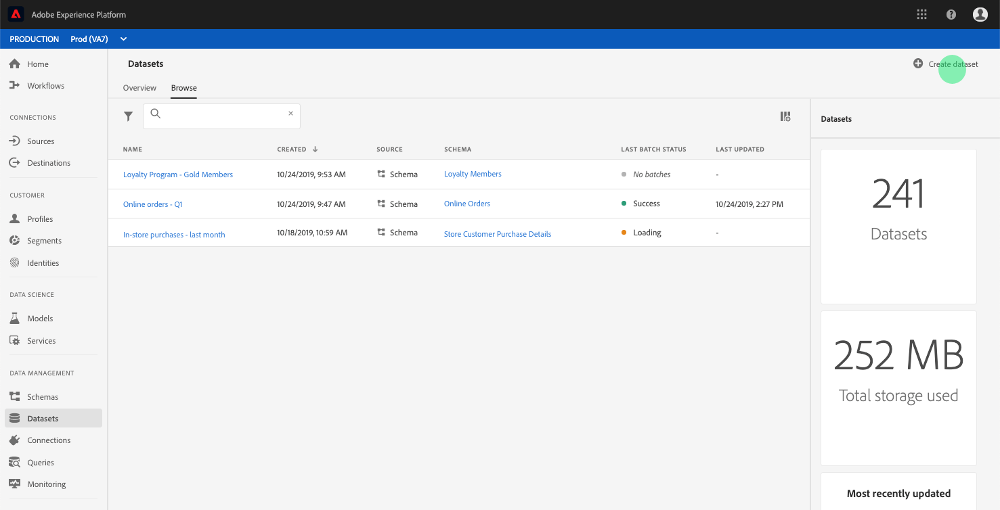

# 建立資料集以匯出觀眾區隔

[!DNL Adobe Experience Platform] 可讓您根據特定屬性，輕鬆將客戶個人檔案細分為受眾。建立區段後，您可以將該對象匯出至資料集，以便存取並執行操作。 要成功導出，必須正確配置資料集。

本教學課程將逐步說明建立資料集所需的步驟，以利使用[!DNL Experience Platform] UI匯出觀眾區段。

本教學課程直接與[評估和存取區段結果](./evaluate-a-segment.md)教學課程中概述的步驟相關。 評估區段教學課程提供使用[!DNL Catalog Service] API建立資料集的步驟，而本教學課程則概述使用[!DNL Experience Platform] UI建立資料集的步驟。

## 快速入門

若要匯出區段，資料集必須以[!DNL XDM Individual Profile Union Schema]為基礎。 聯合模式是系統生成的只讀模式，它聚合了共用相同類的所有模式的欄位（在本例中為[!DNL XDM Individual Profile]類）。 有關聯合視圖方案的詳細資訊，請參閱方案註冊表開發人員指南](../../xdm/schema/composition.md#union)的[即時客戶配置檔案部分。

若要在UI中檢視聯合結構，請按一下左側導覽中的&#x200B;**[!UICONTROL Profiles]**，然後按一下&#x200B;**[!UICONTROL Union schema]**&#x200B;標籤，如下所示。

## 資料集工作區

[!DNL Experience Platform] UI中的資料集工作區可讓您檢視和管理IMS組織建立的所有資料集，並建立新的資料集。

若要檢視資料集工作區，請按一下左側導覽中的&#x200B;**[!UICONTROL Datasets]**，然後按一下&#x200B;**[!UICONTROL Browse]**&#x200B;標籤。 資料集工作區包含資料集的清單，包括顯示名稱、建立（日期和時間）、來源、結構、上次批次狀態的欄，以及上次更新資料集的日期和時間。 視每欄的寬度而定，您可能需要向左或向右捲動，才能查看所有欄。

>[!NOTE]
>
>按一下搜尋列旁的篩選圖示，使用篩選功能僅檢視為[!DNL Real-time Customer Profile]啟用的資料集。

## 建立資料集

若要建立資料集，請按一下&#x200B;**[!UICONTROL Datasets]**&#x200B;工作區右上角的&#x200B;**[!UICONTROL Create Dataset]**。

在&#x200B;**[!UICONTROL Create Dataset]**&#x200B;畫面上，按一下&#x200B;**[!UICONTROL Create Dataset from Schema]**&#x200B;繼續。

## 選擇XDM單個配置式聯合模式

若要選擇[!DNL XDM Individual Profile Union Schema]以用於您的資料集，請在&#x200B;**[!UICONTROL Select Schema]**&#x200B;畫面上尋找類型為&quot;[!UICONTROL Union]&quot;的&quot;[!UICONTROL XDM Individual Profile]&quot;結構。

已選取&#x200B;**[!UICONTROL XDM Individual Profile]**&#x200B;旁的選項按鈕，然後按一下右上角的&#x200B;**[!UICONTROL Next]**。

## 設定資料集

在&#x200B;**[!UICONTROL Configure Dataset]**&#x200B;畫面上，您必須為資料集指定名稱，並且可能提供資料集的說明。

**資料集名稱的附註：**
- 資料集名稱應簡短且具說明性，以便稍後在資料庫中輕鬆找到資料集。
- 資料集名稱必須是唯一的，這表示資料集名稱也應足夠具體，以免日後重複使用。
- 最好使用說明欄位來提供資料集的其他相關資訊，因為這可協助其他使用者在未來區隔資料集。

資料集有名稱和說明後，按一下&#x200B;**[!UICONTROL Finish]**。

## 資料集活動

現在已建立空的資料集，您已返回至&#x200B;**[!UICONTROL Datasets]**&#x200B;工作區的&#x200B;**[!UICONTROL Dataset Activity]**&#x200B;標籤。 您應該會在工作區的左上角看到資料集名稱，以及「未新增任何批次」通知。 由於您尚未將任何批次新增至此資料集，因此預期會出現此情況。

在「資料集」工作區的右側，您會看到&#x200B;**[!UICONTROL Info]**&#x200B;標籤，其中包含與新資料集相關的資訊，例如資料集ID、名稱、說明、表格名稱、架構、串流和來源。 **[!UICONTROL Info]**&#x200B;標籤也包含建立資料集的時間及其上次修改日期的相關資訊。

請記下&#x200B;**[!UICONTROL Dataset ID]**，因為此值是完成觀眾區段匯出工作流程的必要值。

## 後續步驟

現在您已根據[!DNL XDM Individual Profile Union Schema]建立資料集，您可以使用資料集ID繼續[評估並存取區段結果](./evaluate-a-segment.md)教學課程。

目前，請返回評估區段結果教學課程，並從匯出區段工作流程的[產生觀眾成員的設定檔步驟中挑選。](./evaluate-a-segment.md#generate-profiles)
