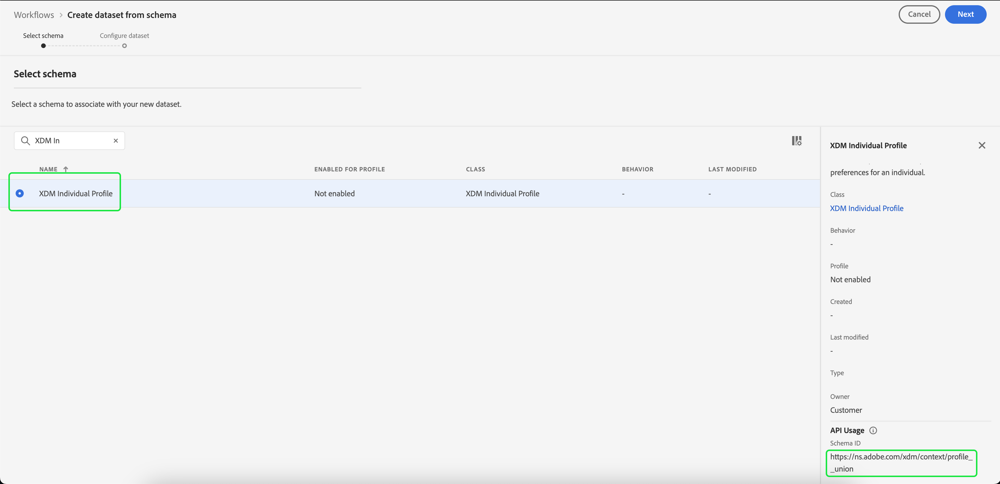

# 建立資料集以匯出對象

[!DNL Adobe Experience Platform] 可讓您根據特定屬性，將客戶設定檔細分至對象。 建立區段定義後，您可以將產生的受眾匯出至資料集，以供存取及據以採取行動。 為了成功匯出，資料集必須正確設定。

本教學課程將逐步解說建立資料集所需的步驟，此資料集可用來匯出對象，使用 [!DNL Experience Platform] UI。

本教學課程與的教學課程中概述的步驟直接相關 [評估及存取分段結果](./evaluate-a-segment.md). 區段定義評估教學課程提供步驟，說明如何使用建立資料集 [!DNL Catalog Service] API，而本教學課程概述使用建立資料集的步驟 [!DNL Experience Platform] UI。

## 快速入門

為了匯出對象，資料集必須以 [!DNL XDM Individual Profile Union Schema]. 聯合結構描述是系統產生的唯讀結構描述，可彙總共用相同類別的所有結構描述的欄位。 如需聯合結構的詳細資訊，請參閱以下指南： [結構描述組合的基本面](../../xdm/schema/composition.md#union).

若要在UI中檢視聯合結構描述，請選取 **[!UICONTROL 設定檔]** 在左側導覽列中，然後選取 **[!UICONTROL 聯合結構描述]** 如下所示。

## 資料集工作區

此 [!UICONTROL 資料集] 工作區可讓您檢視及管理組織的所有資料集。

選取 **[!UICONTROL 資料集]** 在左側導覽中存取工作區，然後選取 **[!UICONTROL 瀏覽]**. 此索引標籤會顯示資料集及其詳細資訊的清單。 根據每欄的寬度，您可能需要向左或向右捲動才能檢視所有欄。

>[!NOTE]
>
>選取搜尋列旁的篩選圖示，即可使用篩選功能，僅檢視針對以下專案啟用的資料集： [!DNL Real-Time Customer Profile].

## 建立資料集

若要建立資料集，請選取 **[!UICONTROL 建立資料集]**.

在下一個畫面，選取 **[!UICONTROL 從結構描述建立資料集]**.

## 選取XDM個別設定檔聯合結構描述

若要選取 [!DNL XDM Individual Profile Union Schema] 若要在您的資料集中使用，請找到&quot;[!UICONTROL XDM個別設定檔]「 」結構描述在 **[!UICONTROL 選取結構描述]** 畫面。 選取結構描述後，您可以確認它是否為下方的聯合結構描述 **[!UICONTROL API使用情況]** 在右側邊欄中。 如果 [!UICONTROL 結構描述] 路徑結尾為 `_union`，這是聯合結構描述。

>[!NOTE]
>
>雖然聯合結構依定義會參與即時客戶個人檔案，但由於未以與傳統結構相同的方式為個人檔案啟用，因此它們被列為「未啟用」。

選取「 」旁的單選按鈕 **[!UICONTROL XDM個別設定檔]**，然後選取 **[!UICONTROL 下一個]**.

## 設定資料集

在下一個畫面中，您必須為資料集命名。 您也可以新增說明（選擇性）。

**資料集名稱附註：**

* 資料集名稱應簡短且具有描述性，以便日後在程式庫中輕鬆找到資料集。
* 資料集名稱必須是唯一的，這表示它們也應該是足夠具體的，以便將來不會重複使用。
* 您應使用說明欄位提供有關資料集的其他資訊，因為這樣可協助其他使用者日後區分資料集。

資料集有了名稱和說明後，請選取 **[!UICONTROL 完成]**.

## 資料集活動

建立資料集後，系統就會顯示該資料集的活動頁面。 您應該會在工作區的左上角看到資料集的名稱，並附上「未新增任何批次」的通知。 這是正常情況，因為您尚未新增任何批次至此資料集。

右邊欄包含與新資料集相關的資訊，例如資料集ID、名稱、說明、結構描述等。 請記下 **[!UICONTROL 資料集ID]**，因為此值是完成受眾匯出工作流程的必要值。

## 後續步驟

現在您已根據以下專案建立資料集： [!DNL XDM Individual Profile Union Schema]，您可以使用資料集ID來繼續 [評估及存取區段定義結果](./evaluate-a-segment.md) 教學課程。

此時，請返回評估區段定義結果教學課程，並從 [為受眾成員產生設定檔](./evaluate-a-segment.md#generate-profiles) 匯出對象工作流程的步驟。
