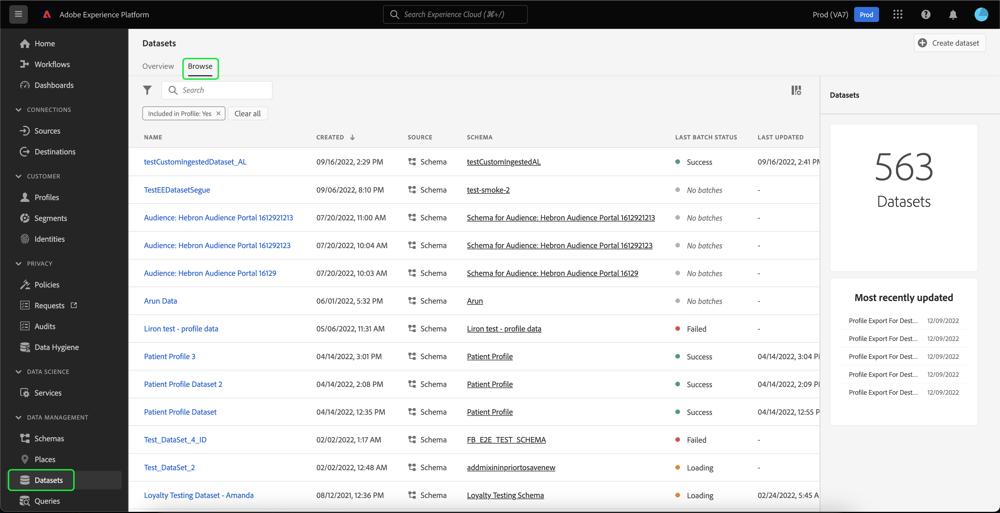

# 建立用於導出受眾段的資料集

[!DNL Adobe Experience Platform] 允許您根據特定屬性將客戶配置檔案分段到受眾。 建立段後，可以將該訪問群體導出到資料集，在該資料集中可以訪問和執行操作。 要使導出成功，必須正確配置資料集。

本教程將介紹建立資料集所需的步驟，該資料集可用於使用 [!DNL Experience Platform] UI。

本教程直接與本教程中介紹的步驟相關。 [評估和訪問段結果](./evaluate-a-segment.md)。 段評估教程提供了使用 [!DNL Catalog Service] API，而本教程則概括介紹使用 [!DNL Experience Platform] UI。

## 快速入門

要導出段，資料集必須基於 [!DNL XDM Individual Profile Union Schema]。 聯合架構是系統生成的只讀架構，它聚合共用同一類的所有架構的欄位。 有關聯合架構的詳細資訊，請參閱上的指南 [架構組合的基礎](../../xdm/schema/composition.md#union)。

要在UI中查看聯合架構，請選擇 **[!UICONTROL 配置檔案]** 在左導航中，選擇 **[!UICONTROL 聯合架構]** 如下所示。

## 資料集工作區

的 [!UICONTROL 資料集] workspace允許您查看和管理組織的所有資料集。

選擇 **[!UICONTROL 資料集]** 在左側導航中訪問工作區，然後選擇 **[!UICONTROL 瀏覽]**。 此頁籤顯示資料集及其詳細資訊的清單。 根據每列的寬度，可能需要向左或向右滾動才能查看所有列。

>[!NOTE]
>
>選擇搜索欄旁邊的篩選器表徵圖，以使用篩選功能僅查看為 [!DNL Real-Time Customer Profile]。

## 建立資料集

要建立資料集，請選擇 **[!UICONTROL 建立資料集]**。

在下一螢幕上，選擇 **[!UICONTROL 從架構建立資料集]**。

## 選擇XDM單個配置檔案聯合架構

選擇 [!DNL XDM Individual Profile Union Schema] 在資料集中使用，請查找「[!UICONTROL XDM個人配置檔案]&quot;架構 **[!UICONTROL 選擇方案]** 的上界。 選擇架構後，您可以確認它是否是 **[!UICONTROL API使用]** 右欄。 如果 [!UICONTROL 架構] 路徑結尾 `_union`是聯合模式。

>[!NOTE]
>
>儘管聯合架構按定義參與即時客戶配置檔案，但由於它們未以與傳統架構相同的方式為配置檔案啟用，因此它們被列為「未啟用」。

選擇旁邊的單選按鈕 **[!UICONTROL XDM個人配置檔案]**，然後選擇 **[!UICONTROL 下一個]**。

## 設定資料集

在下一個螢幕上，必須為資料集指定名稱。 您還可以添加可選說明。

**資料集名稱注釋：**

* 資料集名稱應簡短且描述性強，以便以後可以在庫中輕鬆找到資料集。
* 資料集名稱必須唯一，這意味著它們也應足夠具體，以便以後不會重用。
* 最好使用說明欄位提供有關資料集的其他資訊，因為它可能有助於其他用戶將來區分資料集。

資料集具有名稱和描述後，選擇 **[!UICONTROL 完成]**。

## 資料集活動

建立資料集後，將為該資料集帶來活動頁。 您應在工作區的左上角看到資料集的名稱，並看到通知「未添加批」。 由於您尚未向此資料集添加任何批處理，因此需要執行此操作。

右滑軌包含與新資料集相關的資訊，如資料集ID、名稱、說明、架構等。 請記下 **[!UICONTROL 資料集ID]**，因為完成受眾段導出工作流需要此值。

## 後續步驟

現在，您已基於 [!DNL XDM Individual Profile Union Schema]，可以使用資料集ID繼續 [評估和訪問段結果](./evaluate-a-segment.md) 教程。

此時，請返回到評估段結果教程並從 [為受眾成員生成配置檔案](./evaluate-a-segment.md#generate-profiles) 導出段工作流的步驟。
