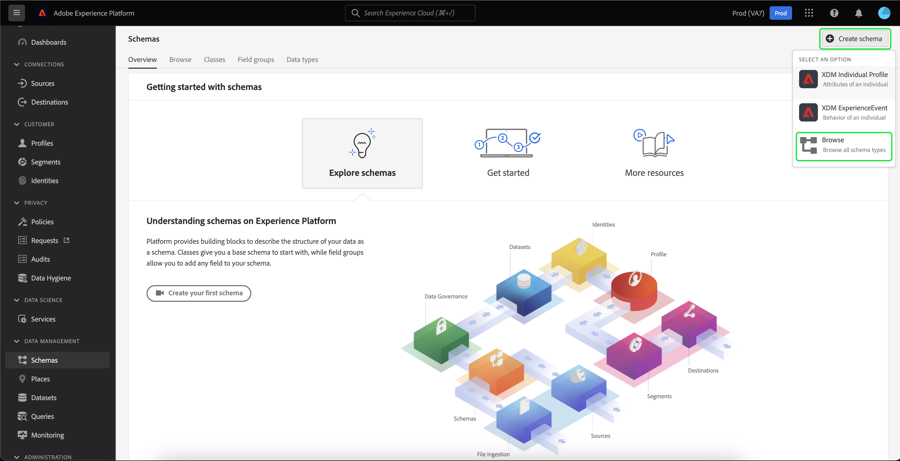

# 匯入和使用外部對象

Adobe Experience Platform支援匯入外部受眾的功能，後者可作為新區段定義的元件。 本檔案提供設定匯入和使用外部對象的Experience Platform的教學課程。

## 快速入門

本教學課程需要妥善了解 [!DNL Adobe Experience Platform] 與建立受眾區隔相關的服務。 開始本教學課程之前，請先檢閱下列服務的檔案：

- [區段服務](../home.md):可讓您從即時客戶設定檔資料建立受眾區段。
- [即時客戶個人檔案](../../profile/home.md):根據來自多個來源的匯總資料，提供統一的即時消費者設定檔。
- [Experience Data Model(XDM)](../../xdm/home.md):Platform用來組織客戶體驗資料的標準化架構。 為了最能善用區段，請確定您的資料已根據 [資料模型最佳實務](../../xdm/schema/best-practices.md).
- [資料集](../../catalog/datasets/overview.md):用於資料永續性的儲存和管理結構(在Experience Platform中)。
- [串流內嵌](../../ingestion/streaming-ingestion/overview.md):Experience Platform如何即時擷取和儲存來自用戶端和伺服器端裝置的資料。

### 區段資料與區段中繼資料

開始匯入和使用外部對象之前，請務必了解區段資料和區段中繼資料之間的差異。

區段資料是指符合區段資格標準的設定檔，因此屬於對象。

區段中繼資料是關於區段本身的資訊，包括名稱、說明、運算式（若適用）、建立日期、上次修改日期和ID。 ID會將區段中繼資料連結至符合區段資格且屬於產生對象的個別設定檔。

| 區段資料 | 區段中繼資料 |
| ------------ | ---------------- |
| 符合區段資格的設定檔 | 區段本身的相關資訊 |

## 為外部對象建立身分命名空間

使用外部對象的第一步是建立身分命名空間。 身分識別命名空間可讓Platform將區段的來源建立關聯。

若要建立身分命名空間，請遵循 [身分命名空間指南](../../identity-service/namespaces.md#manage-namespaces). 建立您的身分命名空間時，請新增來源詳細資料至身分命名空間，並加上標籤 [!UICONTROL 類型] as a **[!UICONTROL 非人員識別碼]**.


## 建立區段中繼資料的結構

建立身分命名空間後，您必須為要建立的區段建立新結構。

要開始合成架構，請首先選擇 **[!UICONTROL 結構]** 在左側導覽列上， **[!UICONTROL 建立結構]** 位於「結構描述」工作區的右上角。 從此處，選擇 **[!UICONTROL 瀏覽]** 以查看可用架構類型的完整選擇。



由於您要建立區段定義（即預先定義的類別），請選取 **[!UICONTROL 使用現有類]**. 現在，選取 **[!UICONTROL 區段定義]** 類，後面 **[!UICONTROL 分配類]**.


現在架構已建立完畢，您必須指定將包含區段ID的欄位。 此欄位應標示為主要身分，並指派給您先前建立的命名空間。


在將 `_id` 欄位作為主要身分，請選取架構的標題，接著是標示為的切換 **[!UICONTROL 設定檔]**. 選擇 **[!UICONTROL 啟用]** 為 [!DNL Real-time Customer Profile].


現在，此架構已針對「設定檔」啟用，並將主要身分識別指派給您建立的非人員身分識別命名空間。 因此，這表示使用此結構匯入至Platform的區段中繼資料將擷取至「設定檔」，而不會與其他人員相關的設定檔資料合併。

## 為結構建立資料集

設定結構後，您需要為區段中繼資料建立資料集。

若要建立資料集，請依照 [資料集使用手冊](../../catalog/datasets/user-guide.md#create). 您應遵循 **[!UICONTROL 從結構建立資料集]** 選項，使用您先前建立的架構。


建立資料集後，請繼續依照 [資料集使用手冊](../../catalog/datasets/user-guide.md#enable-profile) 啟用此資料集以供即時客戶設定檔使用。


## 設定和匯入受眾資料

啟用資料集後，您現在可以透過UI或使用Experience PlatformAPI，將資料傳送至Platform。 您可以透過批次或串流連線內嵌這些資料。

### 使用批次連線內嵌資料

要建立批次連接，可以按照通用 [本機檔案上傳UI指南](../../sources/tutorials/ui/create/local-system/local-file-upload.md). 如需可用來源的完整清單，請閱讀 [來源概觀](../../sources/home.md).

### 使用串流連線內嵌資料

若要建立串流連線，您可以遵循 [API教學課程](../../sources/tutorials/api/create/streaming/http.md) 或 [UI教學課程](../../sources/tutorials/ui/create/streaming/http.md).

建立串流連線後，您就可以存取唯一的串流端點，以便將資料傳送至該端點。 若要了解如何將資料傳送至這些端點，請閱讀 [串流記錄資料的教學課程](../../ingestion/tutorials/streaming-record-data.md#ingest-data).


## 對象中繼資料結構

建立連線後，您現在可以將資料內嵌至Platform。

您可以在下方查看外部對象裝載的中繼資料範例：

```json
{
    "header": {
        "schemaRef": {
            "id": "https://ns.adobe.com/{TENANT_ID}/schemas/{SCHEMA_ID}",
            "contentType": "application/vnd.adobe.xed-full+json;version=1"
        },
        "imsOrgId": "{ORG_ID}",
        "datasetId": "{DATASET_ID}",
        "source": {
            "name": "Sample External Audience"
        }
    },
    "body": {
        "xdmMeta": {
            "schemaRef": {
                "id": "https://ns.adobe.com/{TENANT_ID}/schemas/{SCHEMA_ID}",
                "contentType": "application/vnd.adobe.xed-full+json;version=1"
            }
        },
        "xdmEntity": {
            "_id": "{SEGMENT_ID}",
            "description": "Sample description",
            "identityMap": {
                "{IDENTITY_NAMESPACE}": [{
                    "id": "{}"
                }]
            },
            "segmentName" : "{SEGMENT_NAME}",
            "segmentStatus": "ACTIVE",
            "version": "1.0"
        }
    }
}
```

| 屬性 | 說明 |
| -------- | ----------- |
| `schemaRef` | 結構 **必須** 請參閱先前建立的區段中繼資料結構。 |
| `datasetId` | 資料集ID **必須** 請參閱先前針對您剛建立之結構所建立的資料集。 |
| `xdmEntity._id` | ID **必須** 請參閱與外部對象所使用的相同區段ID。 |
| `xdmEntity.identityMap` | 本節 **必須** 包含建立先前建立的命名空間時使用的身分標籤。 |
| `{IDENTITY_NAMESPACE}` | 這是先前建立之身分命名空間的標籤。 因此，舉例來說，如果您將身分命名空間稱為「externalAudience」，您就會將其作為陣列的索引鍵。 |
| `segmentName` | 您要讓外部對象依其分段的區段名稱。 |

## 使用匯入的對象建立區段

設定匯入的對象後，即可在區段程式中使用。 若要尋找外部對象，請前往區段產生器，然後選取 **[!UICONTROL 對象]** 標籤 **[!UICONTROL 欄位]** 區段。


## 後續步驟

現在您可以在區段中使用外部對象，您可以使用區段產生器來建立區段。 若要了解如何建立區段，請閱讀 [建立區段的教學課程](./create-a-segment.md).

## 附錄

除了使用匯入的外部對象中繼資料以及使用這些中繼資料來建立區段外，您也可以將外部區段成員資格匯入Platform。

### 設定外部區段成員資格目的地結構

要開始合成架構，請首先選擇 **[!UICONTROL 結構]** 在左側導覽列上， **[!UICONTROL 建立結構]** 位於「結構描述」工作區的右上角。 從此處，選擇 **[!UICONTROL XDM個別設定檔]**.


現在架構已建立完畢，您需要將區段成員資格欄位群組新增為架構的一部分。 要執行此操作，請選取 [!UICONTROL 區段成員資格詳細資料]，後跟 [!UICONTROL 新增欄位群組].


此外，請確定已將結構標示為 **[!UICONTROL 設定檔]**. 若要這麼做，您需要將欄位標示為主要身分。


### 設定資料集

建立結構後，您需要建立資料集。

若要建立資料集，請依照 [資料集使用手冊](../../catalog/datasets/user-guide.md#create). 您應遵循 **[!UICONTROL 從結構建立資料集]** 選項，使用您先前建立的架構。


建立資料集後，請繼續依照 [資料集使用手冊](../../catalog/datasets/user-guide.md#enable-profile) 啟用此資料集以供即時客戶設定檔使用。


## 設定和匯入外部受眾成員資格資料

啟用資料集後，您現在可以透過UI或使用Experience PlatformAPI，將資料傳送至Platform。 您可以透過批次或串流連線內嵌這些資料。

### 使用批次連線內嵌資料

要建立批次連接，可以按照通用 [本機檔案上傳UI指南](../../sources/tutorials/ui/create/local-system/local-file-upload.md). 如需可用來源的完整清單，請閱讀 [來源概觀](../../sources/home.md).

### 使用串流連線內嵌資料

若要建立串流連線，您可以遵循 [API教學課程](../../sources/tutorials/api/create/streaming/http.md) 或 [UI教學課程](../../sources/tutorials/ui/create/streaming/http.md).

建立串流連線後，您就可以存取唯一的串流端點，以便將資料傳送至該端點。 若要了解如何將資料傳送至這些端點，請閱讀 [串流記錄資料的教學課程](../../ingestion/tutorials/streaming-record-data.md#ingest-data).


## 區段成員資格結構

建立連線後，您現在可以將資料內嵌至Platform。

您可以在下方查看外部對象成員資格有效負載的範例：

```json
{
    "header": {
        "schemaRef": {
            "id": "https://ns.adobe.com/{TENANT_ID}/schemas/{SCHEMA_ID}",
            "contentType": "application/vnd.adobe.xed-full+json;version=1"
        },
        "imsOrgId": "{ORG_ID}",
        "datasetId": "{DATASET_ID}",
        "source": {
            "name": "Sample External Audience Membership"
        }
    },
    "body": {
        "xdmMeta": {
            "schemaRef": {
                "id": "https://ns.adobe.com/{TENANT_ID}/schemas/{SCHEMA_ID}",
                "contentType": "application/vnd.adobe.xed-full+json;version=1"
            }
        },
        "xdmEntity": {
            "_id": "{UNIQUE_ID}",
            "description": "Sample description",
            "{TENANT_NAME}": {
                "identities": {
                    "{SCHEMA_IDENTITY}": "sample-id"
                }
            },
            "personId" : "sample-name",
            "segmentMembership": {
                "{IDENTITY_NAMESPACE}": {
                    "{EXTERNAL_IDENTITY}": {
                        "status": "realized",
                        "lastQualificationTime": "2022-03-14T:00:00:00Z"
                    }
                }
            }
        }
    }
}
```

| 屬性 | 說明 |
| -------- | ----------- |
| `schemaRef` | 結構 **必須** 請參閱先前建立的區段成員資格資料結構。 |
| `datasetId` | 資料集ID **必須** 請參閱先前建立之資料集，以了解您剛剛建立的成員資格結構。 |
| `xdmEntity._id` | 用來唯一識別資料集內記錄的適當ID。 |
| `{TENANT_NAME}.identities` | 此區段可用來將自訂身分的欄位群組與您先前匯入的使用者連結。 |
| `segmentMembership.{IDENTITY_NAMESPACE}` | 這是先前建立之自訂身分命名空間的標籤。 因此，舉例來說，如果您將身分命名空間稱為「externalAudience」，您就會將其作為陣列的索引鍵。 |