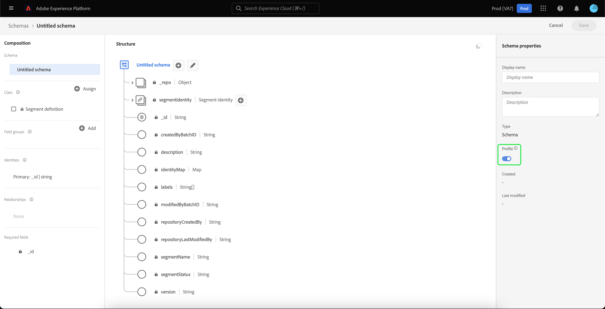

# 匯入和使用外部對象

>[!IMPORTANT]
>
>本檔案含有舊版Audiences檔案的資訊，因此已經過期。

Adobe Experience Platform支援匯入外部對象的功能，這些對象隨後可用作新對象的元件。 本檔案提供設定Experience Platform以匯入及使用外部對象的教學課程。

## 快速入門

此教學課程需要您實際瞭解建立對象所涉及的各種[!DNL Adobe Experience Platform]服務。 在開始本教學課程之前，請先檢閱下列服務的檔案：

- [分段服務](../home.md)：可讓您從即時客戶設定檔資料建立對象。
- [即時客戶個人檔案](../../profile/home.md)：根據來自多個來源的彙總資料，提供統一的即時客戶個人檔案。
- [體驗資料模型(XDM)](../../xdm/home.md)： Experience Platform用來組織客戶體驗資料的標準化架構。 若要充分利用「細分」，請確定您的資料已根據[資料模型最佳實務](../../xdm/schema/best-practices.md)被擷取為設定檔和事件。
- [資料集](../../catalog/datasets/overview.md)： Experience Platform中資料持續性的儲存和管理結構。
- [串流擷取](../../ingestion/streaming-ingestion/overview.md)： Experience Platform如何從使用者端和伺服器端裝置即時擷取及儲存資料。

### 受眾vs區段定義

開始匯入和使用外部對象之前，請務必瞭解對象和區段定義之間的差異。

對象是指您嘗試篩選的目標設定檔群組。 使用區段定義時，您可以建立區段定義，將您的設定檔篩選為符合區段資格標準的子集，以建立對象。

區段定義包含名稱、說明、運算式（如果適用）、建立日期、上次修改日期及ID等資訊。 ID會將區段中繼資料連結至符合區段資格的個別設定檔，並屬於產生的對象。

| 客群 | 區塊定義 |
| --------- | ---------------- |
| 您嘗試尋找的設定檔群組。 使用區段定義時，這表示這會是符合區段資格的設定檔群組。 | 用來區隔您所尋找對象的規則群組。 |

## 為外部對象建立身分名稱空間

使用外部對象的第一個步驟是建立身分名稱空間。 身分名稱空間可讓Experience Platform關聯受眾的來源。

若要建立身分名稱空間，請依照[身分名稱空間指南](../../identity-service/features/namespaces.md#manage-namespaces)中的指示操作。 建立您的身分名稱空間時，請將來源詳細資料新增至身分名稱空間，並將其[!UICONTROL 型別]標籤為&#x200B;**[!UICONTROL 非人員識別碼]**。


## 為區段中繼資料建立結構

建立身分名稱空間後，您需要為要建立的區段建立新的結構描述。

若要開始撰寫結構描述，請先在左側導覽列上選取「**[!UICONTROL 結構描述]**」，然後在「結構描述」工作區的右上角選取「**[!UICONTROL 建立結構描述]**」。 從這裡，選取&#x200B;**[!UICONTROL 瀏覽]**，檢視可用的結構描述型別的完整選擇。


由於您正在建立預先定義的類別區段定義，請選取&#x200B;**[!UICONTROL 使用現有類別]**。 現在選取&#x200B;**[!UICONTROL 區段定義]**&#x200B;類別，接著選取&#x200B;**[!UICONTROL 指派類別]**。


現在您的結構描述已建立，您將需要指定哪個欄位將包含區段ID。 此欄位應該標示為主要身分，並指派給您先前建立的名稱空間。


將`_id`欄位標示為主要身分後，請選取結構描述的標題，然後切換標示為&#x200B;**[!UICONTROL 設定檔]**。 選取&#x200B;**[!UICONTROL 啟用]**&#x200B;以啟用[!DNL Real-Time Customer Profile]的結構描述。



現在，此結構描述已針對設定檔啟用，主要身分識別已指派給您建立的非個人身分名稱空間。 因此，這表示使用此結構描述匯入至Experience Platform的區段中繼資料將內嵌至設定檔中，而不會與其他人員相關的設定檔資料合併。

## 為結構描述建立資料集

設定結構後，您需要為區段中繼資料建立資料集。

若要建立資料集，請依照[資料集使用手冊](../../catalog/datasets/user-guide.md#create)中的指示操作。 您應使用先前建立的結構描述，依循&#x200B;**[!UICONTROL 從結構描述建立資料集]**&#x200B;選項。


建立資料集後，請繼續遵循[資料集使用手冊](../../catalog/datasets/user-guide.md#enable-profile)中的指示，為即時客戶個人檔案啟用此資料集。


## 設定和匯入對象資料

在啟用資料集後，現在可以透過UI或使用Experience Platform API將資料傳送到Experience Platform中。 您可以透過批次或串流連線擷取此資料。

### 使用批次連線擷取資料

若要建立批次連線，您可以依照一般[本機檔案上傳UI指南](../../sources/tutorials/ui/create/local-system/local-file-upload.md)中的指示進行。 如需可搭配內嵌資料使用的可用來源完整清單，請閱讀[來源概觀](../../sources/home.md)。

### 使用串流連線擷取資料

若要建立串流連線，您可以依照[API教學課程](../../sources/tutorials/api/create/streaming/http.md)或[UI教學課程](../../sources/tutorials/ui/create/streaming/http.md)中的指示進行。

建立串流連線後，您就可以存取唯一的串流端點，將資料傳送至該端點。 若要瞭解如何將資料傳送至這些端點，請閱讀串流記錄資料的[教學課程](../../ingestion/tutorials/streaming-record-data.md#ingest-data)。


## 對象中繼資料結構

建立連線後，您現在可以將資料內嵌至Experience Platform。

您可在下方看到外部對象裝載中繼資料的範例：

```json
{
    "header": {
        "schemaRef": {
            "id": "https://ns.adobe.com/{TENANT_ID}/schemas/{SCHEMA_ID}",
            "contentType": "application/vnd.adobe.xed-full+json;version=1"
        },
        "imsOrgId": "{ORG_ID}",
        "datasetId": "{DATASET_ID}",
        "source": {
            "name": "Sample External Audience"
        }
    },
    "body": {
        "xdmMeta": {
            "schemaRef": {
                "id": "https://ns.adobe.com/{TENANT_ID}/schemas/{SCHEMA_ID}",
                "contentType": "application/vnd.adobe.xed-full+json;version=1"
            }
        },
        "xdmEntity": {
            "_id": "{SEGMENT_ID}",
            "description": "Sample description",
            "identityMap": {
                "{IDENTITY_NAMESPACE}": [{
                    "id": "{}"
                }]
            },
            "segmentName" : "{SEGMENT_NAME}",
            "segmentStatus": "ACTIVE",
            "version": "1.0"
        }
    }
}
```

| 屬性 | 說明 |
| -------- | ----------- |
| `schemaRef` | 結構描述&#x200B;**必須**&#x200B;參考先前為區段中繼資料建立的結構描述。 |
| `datasetId` | 資料集ID **必須**&#x200B;參考您剛才建立之結構描述先前建立的資料集。 |
| `xdmEntity._id` | ID **必須**&#x200B;參考您當作外部對象使用的相同區段ID。 |
| `xdmEntity.identityMap` | 此區段&#x200B;**必須**&#x200B;包含建立先前建立的名稱空間時使用的身分標籤。 |
| `{IDENTITY_NAMESPACE}` | 這是先前建立之身分名稱空間的標籤。 因此，舉例來說，如果您將身分名稱空間稱為「externalAudience」，系統會將其當作陣列的索引鍵。 |
| `segmentName` | 您希望外部對象分段依據的區段名稱。 |

## 使用匯入的對象建立區段

設定好匯入的對象後，就可以在細分程式中使用這些對象。 若要尋找外部對象，請前往「區段產生器」，並在「**[!UICONTROL 欄位]**」區段中選取「**[!UICONTROL 對象]**」標籤。


## 後續步驟

現在，您可以在區段中使用外部對象，您可以使用區段產生器來建立區段。 若要瞭解如何建立區段，請閱讀有關建立區段的[教學課程](./create-a-segment.md)。

## 附錄

除了使用匯入的外部受眾中繼資料並使用它們建立區段外，您也可以將外部區段會籍匯入至Experience Platform。

### 設定外部區段會籍目的地結構描述

若要開始撰寫結構描述，請先在左側導覽列上選取「**[!UICONTROL 結構描述]**」，然後在「結構描述」工作區的右上角選取「**[!UICONTROL 建立結構描述]**」。 從這裡，選取&#x200B;**[!UICONTROL XDM個別設定檔]**。


現在已建立結構描述，您將需要新增區段成員資格欄位群組作為結構描述的一部分。 若要這麼做，請選取[!UICONTROL 區段會籍詳細資料]，然後選取[!UICONTROL 新增欄位群組]。


此外，請確定結構描述已標示為&#x200B;**[!UICONTROL 設定檔]**。 為此，您需要將欄位標示為主要身分。


### 設定資料集

建立結構描述後，您需要建立資料集。

若要建立資料集，請依照[資料集使用手冊](../../catalog/datasets/user-guide.md#create)中的指示操作。 您應使用先前建立的結構描述，依循&#x200B;**[!UICONTROL 從結構描述建立資料集]**&#x200B;選項。


建立資料集後，請繼續遵循[資料集使用手冊](../../catalog/datasets/user-guide.md#enable-profile)中的指示，為即時客戶個人檔案啟用此資料集。


## 設定和匯入外部對象成員資格資料

在啟用資料集後，現在可以透過UI或使用Experience Platform API將資料傳送到Experience Platform中。 您可以透過批次或串流連線擷取此資料。

### 使用批次連線擷取資料

若要建立批次連線，您可以依照一般[本機檔案上傳UI指南](../../sources/tutorials/ui/create/local-system/local-file-upload.md)中的指示進行。 如需可搭配內嵌資料使用的可用來源完整清單，請閱讀[來源概觀](../../sources/home.md)。

### 使用串流連線擷取資料

若要建立串流連線，您可以依照[API教學課程](../../sources/tutorials/api/create/streaming/http.md)或[UI教學課程](../../sources/tutorials/ui/create/streaming/http.md)中的指示進行。

建立串流連線後，您就可以存取唯一的串流端點，將資料傳送至該端點。 若要瞭解如何將資料傳送至這些端點，請閱讀串流記錄資料的[教學課程](../../ingestion/tutorials/streaming-record-data.md#ingest-data)。


## 區段會籍結構

建立連線後，您現在可以將資料內嵌至Experience Platform。

您可在下方看到外部對象成員資格裝載的範例：

```json
{
    "header": {
        "schemaRef": {
            "id": "https://ns.adobe.com/{TENANT_ID}/schemas/{SCHEMA_ID}",
            "contentType": "application/vnd.adobe.xed-full+json;version=1"
        },
        "imsOrgId": "{ORG_ID}",
        "datasetId": "{DATASET_ID}",
        "source": {
            "name": "Sample External Audience Membership"
        }
    },
    "body": {
        "xdmMeta": {
            "schemaRef": {
                "id": "https://ns.adobe.com/{TENANT_ID}/schemas/{SCHEMA_ID}",
                "contentType": "application/vnd.adobe.xed-full+json;version=1"
            }
        },
        "xdmEntity": {
            "_id": "{UNIQUE_ID}",
            "description": "Sample description",
            "{TENANT_NAME}": {
                "identities": {
                    "{SCHEMA_IDENTITY}": "sample-id"
                }
            },
            "personId" : "sample-name",
            "segmentMembership": {
                "{IDENTITY_NAMESPACE}": {
                    "{EXTERNAL_IDENTITY}": {
                        "status": "realized",
                        "lastQualificationTime": "2022-03-14T:00:00:00Z"
                    }
                }
            }
        }
    }
}
```

| 屬性 | 說明 |
| -------- | ----------- |
| `schemaRef` | 結構描述&#x200B;**必須**&#x200B;參考先前為區段成員資格資料建立的結構描述。 |
| `datasetId` | 資料集識別碼&#x200B;**必須**&#x200B;參考您剛才建立的成員資格結構描述先前建立的資料集。 |
| `xdmEntity._id` | 適合的ID，用來唯一識別資料集中的記錄。 |
| `{TENANT_NAME}.identities` | 此區段用於連線自訂身分的欄位群組與您先前匯入的使用者。 |
| `segmentMembership.{IDENTITY_NAMESPACE}` | 這是先前建立之自訂身分名稱空間的標籤。 因此，舉例來說，如果您將身分名稱空間稱為「externalAudience」，系統會將其當作陣列的索引鍵。 |

>[!NOTE]
>
>依預設，外部對象成員資格會在30天後刪除。 若要防止刪除並保留超過30天，請在擷取您的對象資料時使用`validUntil`欄位。 如需此欄位的詳細資訊，請參閱[區段成員資格詳細資料結構描述欄位群組](../../xdm/field-groups/profile/segmentation.md)的指南。
