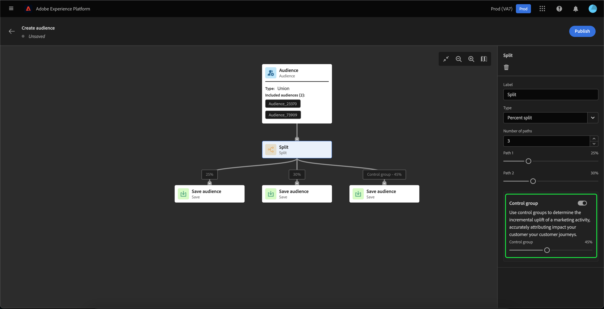
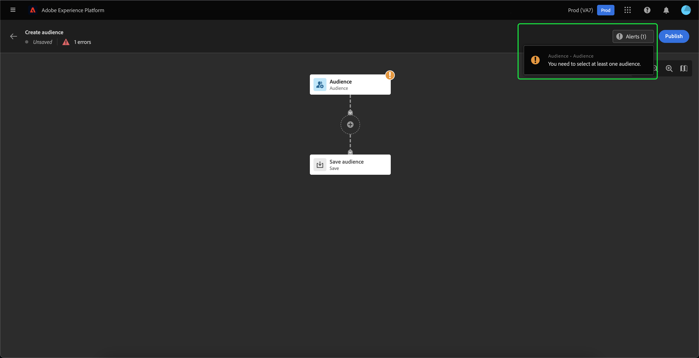

# Audience Builder UI指南

>[!IMPORTANT]
>
>Audience Builder目前為測試版，並未開放所有使用者使用。 文件和功能可能會有所變更。

Audience Builder使用用來代表不同動作的區塊，提供工作區以建立及編輯對象。

對象構成畫布由五種不同型別的區塊組成： **[[!UICONTROL 對象]](#audience-block)**， **[[!UICONTROL 排除]](#exclude-block)**， **[[!UICONTROL 加入]](#join-block)**， **[[!UICONTROL 排名]](#rank-block)**、和 **[[!UICONTROL Split]](#split-block)**.

## [!UICONTROL 對象] {#audience-block}

此 **[!UICONTROL 對象]** 區塊型別可讓您新增要組成新較大受眾的子受眾。 依預設， **[!UICONTROL 對象]** 區塊會包含在構成畫布的頂端。

當您選取 **[!UICONTROL 對象]** 區塊，右側邊欄會顯示用來標籤對象和將對象新增至區塊的控制項。

選取後 **[!UICONTROL 新增對象]**，則會顯示對象清單。 選取您要包含的對象，然後按一下「 」 **[!UICONTROL 新增]** 以將其附加至您的對象區塊。

現在，當您選取的對象出現在右側邊欄內時， **[!UICONTROL 對象]** 區塊已選取。 您可以從這裡變更合併對象的合併型別。

| 合併型別 | 說明 |
| ---------- | ----------- |
| [!UICONTROL Union] | 這些對象會合併為一個對象。 這相當於OR操作。 |
| [!UICONTROL 交集] | 對象會結合，而只有共用的對象 **全部** 新增的URL數目。 這相當於AND操作。 |
| [!UICONTROL 排除重疊] | 對象會結合，而只有共用的對象 **一個，但不是全部** 新增的URL數目。 這相當於XOR操作。 |

## [!UICONTROL 排除] {#exclude-block}

此 **[!UICONTROL 排除]** 區塊型別可讓您從新的較大對象中排除指定的子對象或屬性。

若要新增 **[!UICONTROL 排除]** 區塊，選取 **+** 圖示，後面接著 **[!UICONTROL 排除]**.

此 **[!UICONTROL 排除]** 區塊。 選取此區塊時，右側欄中會顯示排除專案的詳細資訊。 這包括區塊的標籤和排除型別。 您可以排除 [依對象](#exclude-audience) 或 [依屬性](#exclude-attribute).

### 依對象排除 {#exclude-audience}

如果您依對象排除，您可以選取「 」，以選取您要排除的對象 **[!UICONTROL 新增對象]**.

對象清單隨即顯示。 選取 **[!UICONTROL 新增]** 以將您想要排除的對象新增至排除區塊。

### 依屬性排除 {#exclude-attribute}

如果您依屬性排除，可以選取  圖示位於 **[!UICONTROL 排除規則]** 區段。

設定檔屬性清單隨即顯示。 選取要排除的屬性型別，然後按一下 **[!UICONTROL 選取]** 以將其新增至排除區塊。

## [!UICONTROL 加入] {#join-block}

此 **[!UICONTROL 加入]** 區塊型別可讓您從Adobe Experience Platform尚未處理的資料集新增外部對象。

若要新增 **[!UICONTROL 加入]** 區塊，選取 **+** 圖示，後面接著 **[!UICONTROL 加入]**.

當您選取區塊時，右側邊欄中會顯示關於加入的詳細資訊，包括區塊的標籤以及將對象新增至擴充資料集的選項。

選取後 **[!UICONTROL 新增對象]**，則會顯示對象清單。 選取您要包含的對象，然後按一下「 」 **[!UICONTROL 新增]** 以將它們新增至您的聯結區塊。

現在，當您選取的對象出現在右側邊欄內時， **[!UICONTROL 加入]** 區塊已選取。

## [!UICONTROL 排名] {#rank-block}

此 **[!UICONTROL 排名]** 區塊型別可讓您在發佈新對象之前先對對象進行排名和排序。

若要新增 **[!UICONTROL 排名]** 區塊，選取 **+** 圖示，後面接著 **[!UICONTROL 排名]**.

當您選取區塊時，排名的詳細資訊會顯示在右側邊欄中，包括區塊的標籤、排名依據的屬性、排名順序，以及用於限制排名之設定檔數目的切換按鈕。

若要選取依哪個屬性來排名對象，請選取  圖示。

設定檔屬性清單隨即顯示。 在此彈出視窗中，您可以選取要依其排名對象的屬性型別。 選取 **[!UICONTROL 選取]** 以將其新增至排名區塊。 請注意，選取的屬性可以 **僅限** 屬於型別 `int`.

選取屬性後，您可以選取排序依據。 這是以遞增（從最低到最高）或遞減（從最高到最低）順序排列。

此外，您可以透過啟用 **[!UICONTROL 新增設定檔限制]** 切換。 啟用此切換時，您可以設定在「 」中傳回的最大對象數 **[!UICONTROL 包含的設定檔]** 欄位。

## [!UICONTROL Split] {#split-block}

此 **[!UICONTROL Split]** 區塊型別可讓您將新對象分割成各種子對象。 您可以根據百分比或屬性分割此對象。

若要新增 **[!UICONTROL Split]** 區塊，選取 **+** 圖示，後面接著 **[!UICONTROL Split]**.

### 依百分比分割 {#split-percentage}

依百分比分割時，會根據提供的路徑數和百分比，隨機分割對象。

例如，您可能有三個路徑，每個路徑都具有設定檔的不同百分比。

此外，您可以將其中一個分割對象標示為控制群組。

### 依屬性分割 {#split-attribute}

依屬性分割時，會根據提供的屬性分割對象。 若要選取分割依據的屬性，請選取 **[!UICONTROL Split]** 區塊，後面接著  圖示。

設定檔屬性清單隨即顯示。 選取屬性型別，然後選取 **[!UICONTROL 選取]** 以將其新增至分割區塊。

選取屬性後，您可以在中新增值，選擇哪些設定檔將屬於哪個子對象。 **[!UICONTROL 值]** 欄位。

此外，您可以啟用 **[!UICONTROL 其他設定檔]** 切換即可建立包含所有未選取之設定檔的子對象。

## 發佈您的對象

構成對象後，您可以選取「 」，儲存並發佈對象 **[!UICONTROL 發佈]**.

如果在建立對象時發生錯誤，會出現警報，讓您知道如何解決問題。

## 後續步驟

對象產生器提供豐富的工作流程，可讓您從不同的區塊型別建立對象。 若要進一步瞭解Segmentation Service UI的其他部分，請閱讀 [Segmentation Service使用手冊](./overview.md).
