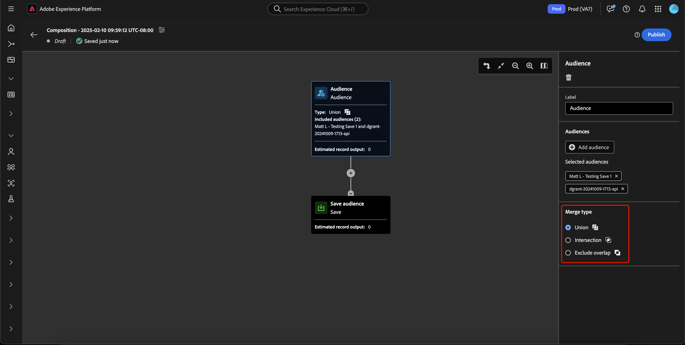
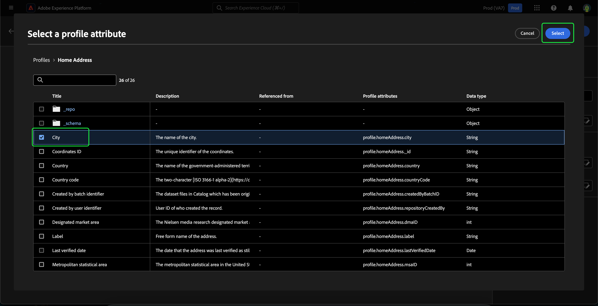
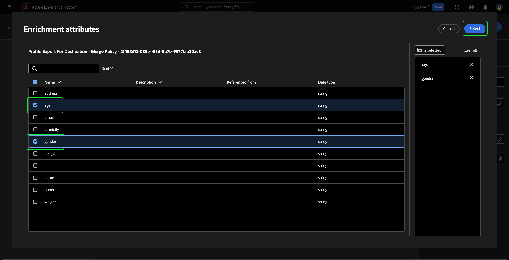
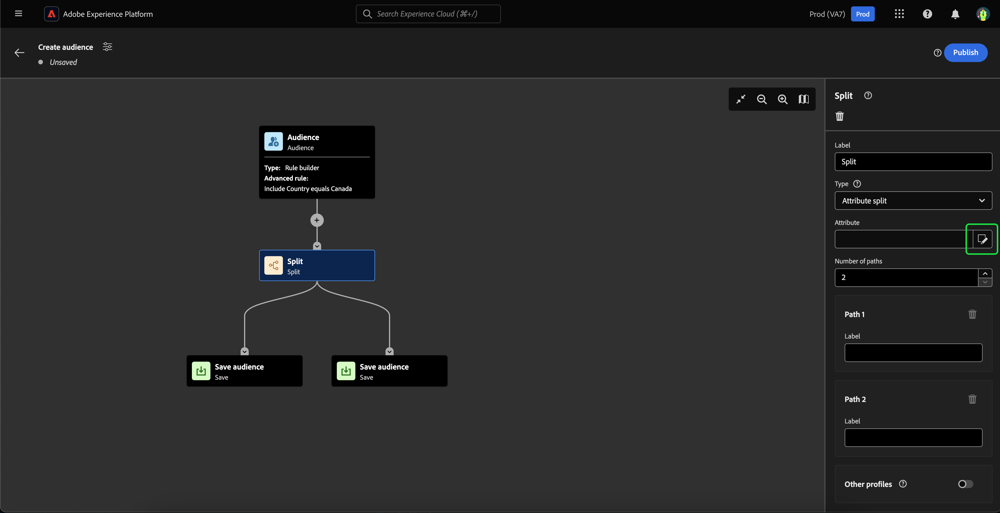
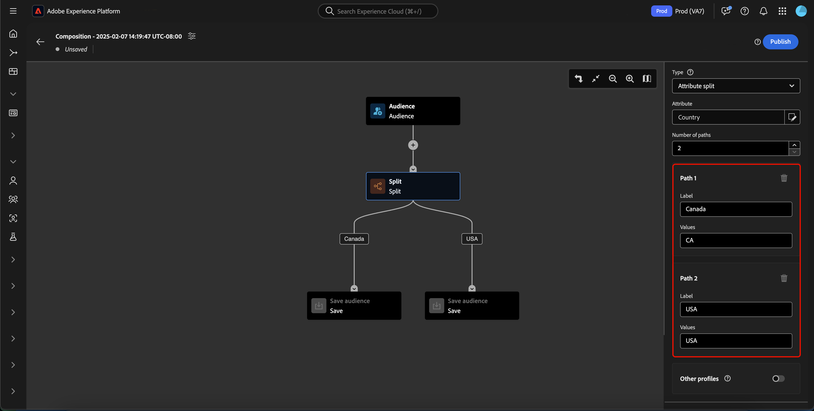

# 對象構成UI指南

>[!NOTE]
>
>本指南說明如何使用對象構成建立對象。 若要瞭解如何使用區段產生器透過區段定義建立對象，請參閱[區段產生器UI指南](./segment-builder.md)。

對象構成會使用用來代表不同動作的區塊，提供用於建立和編輯對象的工作區。

若要變更構成詳細資料，包括標題和說明，請選取按鈕。

**[!UICONTROL 組合屬性]**&#x200B;彈出視窗會出現。 您可以在此處插入組合的詳細資訊，包括標題和說明。

>[!NOTE]
>
>如果您&#x200B;**未**&#x200B;提供您的撰寫標題，依預設會有「撰寫」的標題，後面接著建立日期和時間。 此外，每個組合&#x200B;**都必須**&#x200B;有自己的唯一名稱。

更新您的組合詳細資料後，請選取&#x200B;**[!UICONTROL 儲存]**&#x200B;以確認這些更新。 對象構成畫布會重新出現。

對象構成畫布由四種不同型別的區塊組成： **[[!UICONTROL 對象]](#audience-block)**、**[[!UICONTROL 排除]](#exclude-block)**、**[[!UICONTROL 排名]](#rank-block)**&#x200B;和&#x200B;**[[!UICONTROL 分割]](#split-block)**。

## [!UICONTROL 客群] {#audience-block}

>[!CONTEXTUALHELP]
>id="platform_segmentation_ao_audience"
>title="對象區塊"
>abstract="「對象」區塊可讓您建立要用來組成新對象的子對象。"

>[!CONTEXTUALHELP]
>id="platform_segmentation_ao_merge_types"
>title="合併類型"
>abstract="合併型別會決定所選子對象的合併方式。 支援的值包括「聯集」、「交集」和「排除」重疊。"

**[!UICONTROL 對象]**&#x200B;區塊型別可讓您新增要用來組成新的較大對象的子對象。 依預設，**[!UICONTROL 對象]**&#x200B;區塊會包含在構成畫布的最上方。

當您選取&#x200B;**[!UICONTROL 對象]**&#x200B;區塊時，右側邊欄會顯示用來標示對象、將對象新增至區塊以及建置對象區塊的自訂規則的控制項。

>[!NOTE]
>
>您可以新增對象&#x200B;**或**&#x200B;建立自訂規則。 這兩個功能&#x200B;**無法**&#x200B;一起使用。

### [!UICONTROL 新增對象] {#add-audience}

將對象新增至「對象」區塊。 選取&#x200B;**[!UICONTROL 新增對象]**。

![已醒目顯示[新增對象]按鈕。](../images/ui/audience-composition/add-audience.png)

>[!IMPORTANT]
>
>請注意，只會顯示使用預設合併原則定義的&#x200B;**僅**&#x200B;個對象。
>
>此外，僅能使用使用「區段產生器」建立的&#x200B;**已發佈**&#x200B;對象。 使用對象構成和外部產生的對象建立的對象&#x200B;**無**&#x200B;可用。

對象清單隨即顯示。 選取您要包含的對象，然後選取&#x200B;**[!UICONTROL 新增]**&#x200B;以將它們附加至您的對象區塊。

現在選取&#x200B;**[!UICONTROL 對象]**&#x200B;區塊時，您選取的對象會顯示在右側邊欄中。 您可以從這裡變更合併對象的合併型別。

| 合併類型 | 說明 |
| ---------- | ----------- |
| [!UICONTROL 聯集] | 對象會合併為一個對象。 這相當於OR操作。 |
| [!UICONTROL 交集] | 對象會合併，且只會新增共用於&#x200B;**全部**&#x200B;個對象的對象。 這相當於AND操作。 |
| [!UICONTROL 排除重疊] | 對象已合併，只與在&#x200B;**一個中共用的對象合併，但並非全部**&#x200B;個對象都將被新增。 這相當於XOR操作。 |

### [!UICONTROL 建置規則] {#build-rule}

若要將自訂規則新增至對象區塊，請選取&#x200B;**[!UICONTROL 建置規則]**。

「區段產生器」隨即顯示。 您可以使用區段產生器建立自訂規則，供對象追蹤。 如需有關使用區段產生器的詳細資訊，請參閱[區段產生器指南](./segment-builder.md)。

新增自訂規則後，選取「**[!UICONTROL 儲存]**」以將規則新增至您的對象。

## [!UICONTROL 排除] {#exclude-block}

>[!CONTEXTUALHELP]
>id="platform_segmentation_ao_exclude"
>title="排除區塊"
>abstract="「排除」區塊可讓您從構成中排除指定的對象或屬性。"

>[!CONTEXTUALHELP]
>id="platform_segmentation_ao_exclude_type"
>title="排除類型"
>abstract="您可以排除屬於特定對象的設定檔（依對象排除）或根據特定屬性排除設定檔（依屬性排除）。"

**[!UICONTROL 排除]**&#x200B;區塊型別可讓您從新的較大對象中排除指定的子對象或屬性。

若要新增&#x200B;**[!UICONTROL 排除]**&#x200B;區塊，請選取&#x200B;**+**&#x200B;圖示，然後選取&#x200B;**[!UICONTROL 排除]**。

![已選取[排除]選項。](../images/ui/audience-composition/add-exclude-block.png)

已新增&#x200B;**[!UICONTROL 排除]**&#x200B;區塊。 選取此區塊時，右側欄中會顯示排除專案的詳細資料。 這包括區塊的標籤和排除型別。 您可以依對象](#exclude-audience)排除[，或依屬性](#exclude-attribute)排除[。

### 依對象排除 {#exclude-audience}

如果您依對象排除，可以選取&#x200B;**[!UICONTROL 新增對象]**，以選取要排除的對象。

![已選取[!UICONTROL 新增對象]按鈕，讓您選擇要排除的對象。](../images/ui/audience-composition/add-excluded-audience.png)

>[!IMPORTANT]
>
>僅能使用使用「區段產生器」建立的&#x200B;**已發佈**&#x200B;對象。 使用對象構成和外部產生的對象建立的對象&#x200B;**無**&#x200B;可用。

對象清單隨即顯示。 選取「新增&#x200B;****」，將您要排除的對象新增至排除區塊。

### 依屬性排除 {#exclude-attribute}

如果您依屬性排除，可以選取&#x200B;**[!UICONTROL 排除規則]**&#x200B;區段內的圖示，以選取您要排除的屬性。

設定檔屬性清單隨即顯示。 選取您要排除的屬性型別，然後選取&#x200B;**[!UICONTROL 選取]**&#x200B;以將它們新增至您的排除區塊。

>[!IMPORTANT]
>
>依屬性排除時，您只能指定要排除的&#x200B;**一個**&#x200B;值。 使用逗號或分號之類的任何分隔符號，都只會排除該確切值。 例如，將值設定為`red, blue`會導致從屬性中排除字詞`red, blue`，但&#x200B;**不會**&#x200B;導致排除字詞`red`或`blue`。

## [!UICONTROL 擴充] {#enrich-block}

>[!CONTEXTUALHELP]
>id="platform_segmentation_ao_enrich"
>title="豐富區塊"
>abstract="擴充區塊可讓您利用來自Adobe Experience Platform資料集的其他屬性擴充您的對象。"

>[!CONTEXTUALHELP]
>id="platform_segmentation_ao_dataset"
>title="擴充資料集"
>abstract="擴充資料集包含您要與構成建立關聯的資料。"

>[!CONTEXTUALHELP]
>id="platform_segmentation_ao_enrich_criteria"
>title="擴充條件"
>abstract="擴充條件包括Source聯結金鑰和擴充資料集聯結金鑰。 這兩個索引鍵可協調來源資料集和擴充資料集。"

>[!CONTEXTUALHELP]
>id="platform_segmentation_ao_enrich_attributes"
>title="擴充屬性"
>abstract="擴充屬性是您想要與構成相關聯的屬性。"

>[!IMPORTANT]
>
>此時，擴充屬性只能&#x200B;**在下游Adobe Journey Optimizer案例中使用**。

**[!UICONTROL 擴充]**&#x200B;區塊型別可讓您使用資料集中的其他屬性擴充您的對象。 您可以在個人化使用案例中使用這些屬性。

若要新增&#x200B;**[!UICONTROL 擴充]**&#x200B;區塊，請選取&#x200B;**+**&#x200B;圖示，然後選取&#x200B;**[!UICONTROL 擴充]**。

![已選取[!UICONTROL 擴充]選項。](../images/ui/audience-composition/add-enrich-block.png)

已新增&#x200B;**[!UICONTROL 擴充]**&#x200B;區塊。 選取此區塊時，擴充的詳細資訊會顯示在右側邊欄中。 這包括區塊的標籤和擴充資料集。

若要選取要擴充對象的資料集，請選取圖示。

![篩選按鈕會反白顯示。 選取此專案會帶您進入[!UICONTROL 選取資料集]彈出視窗。](../images/ui/audience-composition/enrich-select-dataset.png)

**[!UICONTROL 選取資料集]**&#x200B;彈出視窗會出現。 選取您要新增以擴充的資料集，接著選取&#x200B;**[!UICONTROL 選取]**&#x200B;以新增資料集以擴充。

>[!IMPORTANT]
>
>選取的資料集&#x200B;**必須**&#x200B;符合下列條件：
>
>- 資料集&#x200B;**必須**&#x200B;為記錄型別。
>   - 資料集&#x200B;**不能**&#x200B;為事件型別、由系統產生，或標示為設定檔。
>- 資料集&#x200B;**必須**&#x200B;為1 GB或更小。

**[!UICONTROL 擴充條件]**&#x200B;區段現在會顯示在右側邊欄中。 在此區段中，您可以選取&#x200B;**[!UICONTROL Source加入索引鍵]**&#x200B;和&#x200B;**[!UICONTROL 擴充資料集加入索引鍵]**，讓您連結擴充資料集與嘗試建立的對象。

![已反白顯示[!UICONTROL 擴充條件]區域。](../images/ui/audience-composition/enrichment-criteria.png)

若要選取&#x200B;**[!UICONTROL Source聯結索引鍵]**，請選取圖示。

![ [!UICONTROL Source聯結索引鍵]的篩選圖示會醒目提示。](../images/ui/audience-composition/enrich-select-source-join-key.png)

**[!UICONTROL 選取設定檔屬性]**&#x200B;彈出視窗即會出現。 選取要做為來源聯結金鑰的設定檔屬性，然後選取&#x200B;**[!UICONTROL 選取]**&#x200B;以選擇該屬性做為來源聯結金鑰。

若要選取&#x200B;**[!UICONTROL 擴充資料集聯結索引鍵]**，請選取圖示。

![ [!UICONTROL 擴充資料集加入索引鍵]的篩選圖示已醒目提示。](../images/ui/audience-composition/enrich-select-enrichment-dataset-join-key.png)

**[!UICONTROL 擴充屬性]**&#x200B;彈出視窗會出現。 選取要做為擴充資料集加入金鑰使用的屬性，然後選取&#x200B;**[!UICONTROL 選取]**，選擇該屬性做為擴充資料集加入金鑰。

現在您已新增兩個加入金鑰，**[!UICONTROL 擴充屬性]**&#x200B;區段隨即顯示。 您現在可以新增您想要用來增強對象的屬性。 若要新增這些屬性，請選取&#x200B;**[!UICONTROL 新增屬性]**。

![已反白顯示[!UICONTROL 新增屬性]按鈕。](../images/ui/audience-composition/enrich-select-add-attribute.png)

**[!UICONTROL 擴充屬性]**&#x200B;彈出視窗會出現。 您可以從資料集中選取屬性，以擴充您的對象，接著選取&#x200B;**[!UICONTROL 選取]**&#x200B;以新增屬性至對象。

<!-- ## [!UICONTROL Join] {#join-block}

The **[!UICONTROL Join]** block type allows you to add in external audiences from datasets that have not yet been processed by Adobe Experience Platform.

To add a **[!UICONTROL Join]** block, select the **+** icon, followed by **[!UICONTROL Join]**.

When you select the block, details about the join are shown in the right rail, including the block's label and the option to add audiences to the enrichment dataset.

After selecting **[!UICONTROL Add Audience]**, a list of audiences appears. Select the audiences you want to include, followed by **[!UICONTROL Add]** to add them to your join block.

Your selected audiences now appear within the right rail when the **[!UICONTROL Join]** block is selected. 

 -->

## [!UICONTROL 排名] {#rank-block}

>[!CONTEXTUALHELP]
>id="platform_segmentation_ao_ranking"
>title="排名區塊"
>abstract="Rank區塊可讓您根據特定屬性來排名設定檔，並將其納入您的構成中。"

>[!CONTEXTUALHELP]
>id="platform_segmentation_ao_rank_profilelimit_text"
>title="新增輪廓限制"
>abstract="「新增設定檔限制」切換可讓您指定排名程式中要包含的設定檔數目上限。"

**[!UICONTROL Rank]**&#x200B;區塊型別可讓您根據指定的屬性來排名和排序設定檔，並將這些排名設定檔納入您的組合。

若要新增&#x200B;**[!UICONTROL 排名]**&#x200B;區塊，請選取&#x200B;**+**&#x200B;圖示，然後選取&#x200B;**[!UICONTROL 排名]**。

當您選取區塊時，排名的詳細資訊會顯示在右側邊欄中，包括區塊的標籤、排名依據的屬性、排名順序，以及用於限制排名之設定檔數量的切換按鈕。

若要選取依哪個屬性來排名對象，請選取圖示。

設定檔屬性清單隨即顯示。 在此彈出視窗中，您可以選取要依其排名對象的屬性型別。 選取&#x200B;**[!UICONTROL 選取]**&#x200B;以將其新增至您的排名區塊。 請注意，選取的屬性只能&#x200B;**是**&#x200B;數字。

選取屬性後，您可以選取排序依據。 這是以遞增（從最低到最高）或遞減（從最高到最低）順序顯示。

此外，您可以啟用&#x200B;**[!UICONTROL 新增設定檔限制]**&#x200B;切換來限制傳回的設定檔數目。 啟用此切換時，您可以在&#x200B;**[!UICONTROL 包含的設定檔]**&#x200B;欄位中設定傳回的設定檔數目上限。

## [!UICONTROL 分割] {#split-block}

>[!CONTEXTUALHELP]
>id="platform_segmentation_ao_split"
>title="分割區塊"
>abstract="「分割」區塊可讓您將構成分割成多個路徑。"

>[!CONTEXTUALHELP]
>id="platform_segmentation_ao_split_type"
>title="分割類型"
>abstract="您可以依「百分比」分割或「屬性」分割來分割構成。 百分比分割會隨機將設定檔分割成多個路徑。 屬性分割可讓您根據指定的屬性分割設定檔。"

>[!CONTEXTUALHELP]
>id="platform_segmentation_ao_split_otherprofiles_text"
>title="其他輪廓"
>abstract="其他設定檔切換可讓您使用不符合其他路徑任何指定條件的剩餘設定檔建立其他路徑。"

**[!UICONTROL 分割]**&#x200B;區塊型別可讓您將新對象分割成各種子對象。 您可以根據百分比或屬性來分割此對象。 將您的對象分割成子對象時，此分割是&#x200B;**不**&#x200B;持續性的。 這表示每個評估的設定檔可能位於不同的子對象中。

若要新增&#x200B;**[!UICONTROL 分割]**&#x200B;區塊，請選取&#x200B;**+**&#x200B;圖示，然後選取&#x200B;**[!UICONTROL 分割]**。

![已選取[分割]選項。](../images/ui/audience-composition/add-split-block.png)

分割對象時，您可以依百分比分割對象或依屬性分割。

### 依百分比分割 {#split-percentage}

依百分比分割時，會根據提供的路徑數和百分比，隨機分割對象。

例如，您可以有三個路徑，每個路徑具有不同的設定檔百分比。

### 依屬性分割 {#split-attribute}

依屬性分割時，將會根據提供的屬性分割對象。 若要選取要分割的屬性，請選取&#x200B;**[!UICONTROL 分割]**&#x200B;區塊，接著選取圖示。

設定檔屬性清單隨即顯示。 選取屬性型別，然後選取&#x200B;**[!UICONTROL 選取]**&#x200B;以將其新增至您的分割區塊。

選取屬性後，您可以在&#x200B;**[!UICONTROL 值]**&#x200B;欄位中新增值，以選擇哪些設定檔將屬於哪個子對象。

此外，您可以啟用&#x200B;**[!UICONTROL 其他設定檔]**&#x200B;切換按鈕，以建立包含所有未選取設定檔的子對象。

## 發佈您的對象

>[!IMPORTANT]
>
>發佈您的對象構成時，請注意，評估並啟動該對象構成以用於下游服務(例如Real-Time CDP目的地或Adobe Journey Optimizer頻道)可能需要48小時。

建立構成後，您可以選取&#x200B;**[!UICONTROL 發佈]**&#x200B;來儲存並發佈。

如果在建立對象時發生錯誤，會出現警報，讓您知道如何解決問題。

## 後續步驟

對象構成提供豐富的工作流程，可讓您從不同的區塊型別建立構成。 若要深入瞭解Segmentation Service UI的其他部分，請參閱[Segmentation Service使用手冊](./overview.md)。
