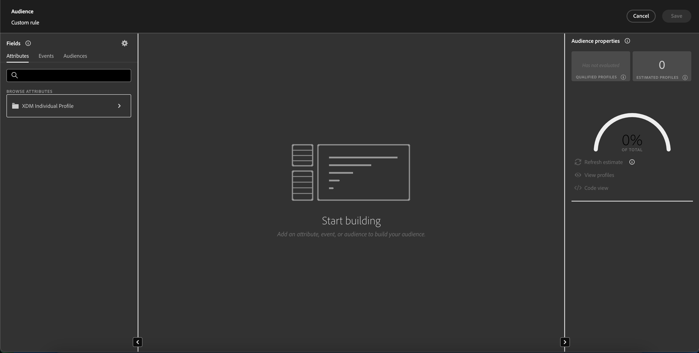

# 對象構成UI指南

>[!NOTE]
>
>本指南說明如何使用對象構成建立對象。 若要瞭解如何使用區段產生器，透過區段定義建立對象，請參閱 [區段產生器UI指南](./segment-builder.md).

對象構成會使用用來代表不同動作的區塊，提供用於建立和編輯對象的工作區。

若要變更構成詳細資訊，包括標題和說明，請選取  按鈕。

此 **[!UICONTROL 組合屬性]** 彈出視窗會出現。 您可以在此處插入組合的詳細資訊，包括標題和說明。

>[!NOTE]
>
>如果您有 **非** 為您的構成提供一個標題，依預設會有一個標題「構成」，後面接著建立日期和時間。 此外，每個構成 **必須** 有自己的唯一名稱。

更新構成詳細資訊後，選取 **[!UICONTROL 儲存]** 以確認這些更新。 對象構成畫布會重新出現。

對象構成畫布由四種不同型別的區塊組成： **[[!UICONTROL 對象]](#audience-block)**， **[[!UICONTROL 排除]](#exclude-block)**， **[[!UICONTROL 排名]](#rank-block)**、和 **[[!UICONTROL Split]](#split-block)**.

## [!UICONTROL 對象] {#audience-block}

此 **[!UICONTROL 對象]** 區塊型別可讓您新增要構成新的較大受眾的子受眾。 依預設， **[!UICONTROL 對象]** 區塊會包含在構成畫布的頂端。

當您選取 **[!UICONTROL 對象]** 區塊，右側欄會顯示用來標示對象、將對象新增至區塊，以及建立對象區塊的自訂規則的控制項。

>[!NOTE]
>
>您可以新增對象 **或** 建立自訂規則。 這兩項功能 **無法** 一起使用。

### [!UICONTROL 新增對象] {#add-audience}

將對象新增至「對象」區塊。 選取 **[!UICONTROL 新增對象]**.

>[!IMPORTANT]
>
>請注意 **僅限** 使用預設合併原則定義的對象將會出現。
>
>此外，僅 **已發佈** 您可以使用使用區段產生器建立的對象。 使用對象構成和外部產生的對象建立的對象為 **非** 可用。

對象清單隨即顯示。 選取您要包含的對象，接著 **[!UICONTROL 新增]** 以將它們附加至您的對象區塊。

現在，當您選取的對象出現在右側欄內時， **[!UICONTROL 對象]** 區塊已選取。 您可以從這裡變更合併對象的合併型別。

| 合併類型 | 說明 |
| ---------- | ----------- |
| [!UICONTROL 聯集] | 對象會合併為一個對象。 這相當於OR操作。 |
| [!UICONTROL 交集] | 對象會結合，而只有共用的對象 **全部** 正在新增的。 這相當於AND操作。 |
| [!UICONTROL 排除重疊] | 對象會結合，而只有共用的對象 **一個，但不是全部** 正在新增的。 這相當於XOR操作。 |

### [!UICONTROL 建置規則] {#build-rule}

若要將自訂規則新增至「對象」區塊，請選取「 」 **[!UICONTROL 建置規則]**.

「區段產生器」隨即顯示。 您可以使用區段產生器建立自訂規則，供對象追蹤。 有關使用區段產生器的詳細資訊，請參閱 [區段產生器指南](./segment-builder.md).

新增自訂規則後，選取 **[!UICONTROL 儲存]** 以將規則新增至對象。

## [!UICONTROL 排除] {#exclude-block}

此 **[!UICONTROL 排除]** 區塊型別可讓您從新的較大對象中排除指定的子對象或屬性。

若要新增 **[!UICONTROL 排除]** 區塊，選取 **+** 圖示，後面接著 **[!UICONTROL 排除]**.

此 **[!UICONTROL 排除]** 區塊。 選取此區塊時，右側欄中會顯示排除專案的詳細資料。 這包括區塊的標籤和排除型別。 您可以排除 [依對象](#exclude-audience) 或 [依屬性](#exclude-attribute).

### 依對象排除 {#exclude-audience}

如果您依對象排除，您可以選取「 」，以選取您要排除的對象 **[!UICONTROL 新增對象]**.

![此 [!UICONTROL 新增對象] 按鈕已選取，可讓您選擇要排除的對象。](../images/ui/audience-composition/add-excluded-audience.png)

>[!IMPORTANT]
>
>僅限 **已發佈** 您可以使用使用區段產生器建立的對象。 使用對象構成和外部產生的對象建立的對象為 **非** 可用。

對象清單隨即顯示。 選取 **[!UICONTROL 新增]** 以將您想要排除的對象新增至排除區塊。

### 依屬性排除 {#exclude-attribute}

如果您依屬性排除，您可以選取  圖示( **[!UICONTROL 排除規則]** 區段。

設定檔屬性清單隨即顯示。 選取要排除的屬性型別，然後按一下 **[!UICONTROL 選取]** 以將它們新增至您的排除區塊。

>[!IMPORTANT]
>
>依屬性排除時，您只能指定 **一** 要排除的值。 使用逗號或分號之類的任何分隔符號，都只會排除該確切值。 例如，將值設為 `red, blue` 將導致排除該詞語 `red, blue` 從屬性，但將 **非** 結果會排除任一字詞 `red` 或 `blue`.

## [!UICONTROL 擴充] {#enrich-block}

>[!IMPORTANT]
>
>此時，擴充屬性可以 **僅限** 用於下游Adobe Journey Optimizer情境。

此 **[!UICONTROL 擴充]** 區塊型別可讓您使用資料集中的其他屬性擴充您的對象。 您可以在個人化使用案例中使用這些屬性。

若要新增 **[!UICONTROL 擴充]** 區塊，選取 **+** 圖示，後面接著 **[!UICONTROL 擴充]**.

![此 [!UICONTROL 擴充] 已選取選項。](../images/ui/audience-composition/add-enrich-block.png)

此 **[!UICONTROL 擴充]** 區塊。 選取此區塊時，擴充的詳細資訊會顯示在右側邊欄中。 這包括區塊的標籤和擴充資料集。

若要選取要擴充對象的資料集，請選取  圖示。

![篩選按鈕會反白顯示。 選取此選項會帶您前往 [!UICONTROL 選取資料集] 彈出視窗。](../images/ui/audience-composition/enrich-select-dataset.png)

此 **[!UICONTROL 選取資料集]** 彈出視窗會出現。 選取您要新增以擴充的資料集，然後按一下 **[!UICONTROL 選取]** 以新增資料集以進行擴充。

>[!IMPORTANT]
>
>選取的資料集 **必須** 符合下列條件：
>
>- 資料集 **必須** 屬於記錄型別。
>   - 資料集 **無法** 屬於事件型別、由系統產生，或標示為設定檔。
>- 資料集 **必須** 為1 GB或更小。

此 **[!UICONTROL 擴充條件]** 區段現在顯示在右側邊欄上。 在此區段中，您可以選取 **[!UICONTROL 來源聯結金鑰]** 和 **[!UICONTROL 擴充資料集加入金鑰]**，可讓您將擴充資料集連結至您嘗試建立的對象。

![此 [!UICONTROL 擴充條件] 區域會反白顯示。](../images/ui/audience-composition/enrichment-criteria.png)

若要選取 **[!UICONTROL 來源聯結金鑰]**，選取  圖示。

![的篩選器圖示 [!UICONTROL 來源聯結金鑰] 會反白顯示。](../images/ui/audience-composition/enrich-select-source-join-key.png)

此 **[!UICONTROL 選取設定檔屬性]** 彈出視窗會出現。 選取要做為來源聯結索引鍵的設定檔屬性，然後按一下 **[!UICONTROL 選取]** 以選擇該屬性作為您的來源聯結金鑰。

若要選取 **[!UICONTROL 擴充資料集加入金鑰]**，選取  圖示。

![的篩選器圖示 [!UICONTROL 擴充資料集加入金鑰] 會反白顯示。](../images/ui/audience-composition/enrich-select-enrichment-dataset-join-key.png)

此 **[!UICONTROL 擴充屬性]** 彈出視窗會出現。 選取您要用作擴充資料集加入索引鍵的屬性，然後按一下 **[!UICONTROL 選取]** 以選擇該屬性作為擴充資料集加入金鑰。

現在您已新增兩個加入金鑰， **[!UICONTROL 擴充屬性]** 區段隨即顯示。 您現在可以新增您想要用來增強對象的屬性。 若要新增這些屬性，請選取 **[!UICONTROL 新增屬性]**.

![此 [!UICONTROL 新增屬性] 按鈕會醒目提示。](../images/ui/audience-composition/enrich-select-add-attribute.png)

此 **[!UICONTROL 擴充屬性]** 彈出視窗會出現。 您可以從資料集中選取屬性，以擴充您的對象，接著進行 **[!UICONTROL 選取]** 將屬性新增至對象。

<!-- ## [!UICONTROL Join] {#join-block}

The **[!UICONTROL Join]** block type allows you to add in external audiences from datasets that have not yet been processed by Adobe Experience Platform.

To add a **[!UICONTROL Join]** block, select the **+** icon, followed by **[!UICONTROL Join]**.

When you select the block, details about the join are shown in the right rail, including the block's label and the option to add audiences to the enrichment dataset.

After selecting **[!UICONTROL Add Audience]**, a list of audiences appears. Select the audiences you want to include, followed by **[!UICONTROL Add]** to add them to your join block.

Your selected audiences now appear within the right rail when the **[!UICONTROL Join]** block is selected. 

 -->

## [!UICONTROL 排名] {#rank-block}

此 **[!UICONTROL 排名]** 區塊型別可讓您根據指定的屬性來排名和排序設定檔，並將這些排名的設定檔納入您的構成。

若要新增 **[!UICONTROL 排名]** 區塊，選取 **+** 圖示，後面接著 **[!UICONTROL 排名]**.

當您選取區塊時，排名的詳細資訊會顯示在右側邊欄中，包括區塊的標籤、排名依據的屬性、排名順序，以及用於限制排名之設定檔數量的切換按鈕。

若要選取依哪個屬性來排名對象，請選取  圖示。

設定檔屬性清單隨即顯示。 在此彈出視窗中，您可以選取要依其排名對象的屬性型別。 選取 **[!UICONTROL 選取]** 以將其新增至排名區塊。 請注意，選取的屬性可以 **僅限** 是數字。

選取屬性後，您可以選取排序依據。 這是以遞增（從最低到最高）或遞減（從最高到最低）順序顯示。

此外，您可以啟用「 」以限制傳回的設定檔數 **[!UICONTROL 新增設定檔限制]** 切換。 當啟用此切換時，您可以設定在 **[!UICONTROL 包含的設定檔]** 欄位。

## [!UICONTROL Split] {#split-block}

此 **[!UICONTROL Split]** 區塊型別可讓您將新對象分割成各種子對象。 您可以根據百分比或屬性來分割此對象。 將您的對象分割為子對象時，此分割為 **持續**. 這表示在每次評估中，設定檔都會位於相同的子對象中。

若要新增 **[!UICONTROL Split]** 區塊，選取 **+** 圖示，後面接著 **[!UICONTROL Split]**.

分割對象時，您可以依百分比分割對象或依屬性分割。

### 依百分比分割 {#split-percentage}

依百分比分割時，會根據提供的路徑數和百分比，隨機分割對象。

例如，您可以有三個路徑，每個路徑具有不同的設定檔百分比。

### 依屬性分割 {#split-attribute}

依屬性分割時，將會根據提供的屬性分割對象。 若要選取分割依據的屬性，請選取 **[!UICONTROL Split]** 區塊，後面接著  圖示。

設定檔屬性清單隨即顯示。 選取屬性型別，然後選取 **[!UICONTROL 選取]** 以將其新增至您的分割區塊。

選取屬性後，您可以在中新增值，選擇哪些設定檔將屬於哪個子對象。 **[!UICONTROL 值]** 欄位。

此外，您可以啟用 **[!UICONTROL 其他設定檔]** 切換即可建立包含所有非選取之設定檔的子對象。

## 發佈您的對象

構成對象後，您可以選取「 」，儲存並發佈對象 **[!UICONTROL 發佈]**.

如果在建立對象時發生錯誤，會出現警報，讓您知道如何解決問題。

## 後續步驟

對象構成提供豐富的工作流程，可讓您從不同的區塊型別建立對象。 若要進一步瞭解Segmentation Service UI的其他部分，請參閱 [Segmentation Service使用手冊](./overview.md).
