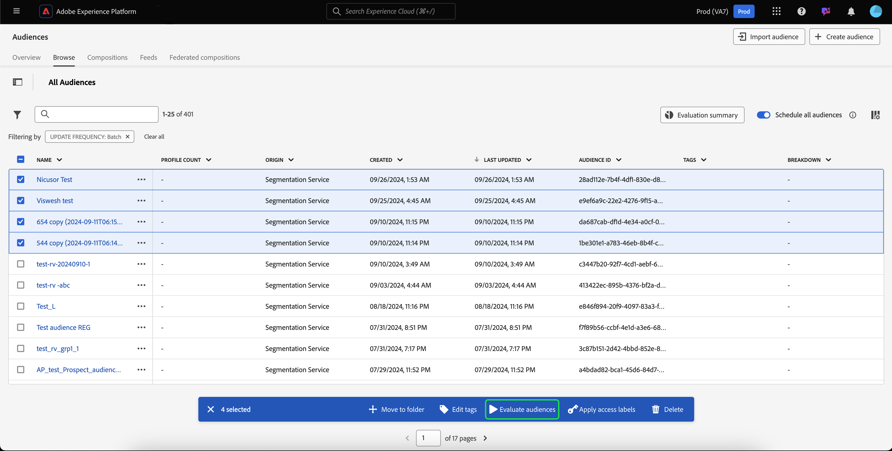

# Audience Portal概述

Audience Portal是Adobe Experience Platform的中央樞紐，可讓您檢視、管理和建立對象。

在Audience Portal中，您可以完成下列工作：

- [檢視對象清單](#audience-list)
   - [對您的對象使用快速動作](#quick-actions)
   - [自訂對象清單中顯示的屬性](#customize)
   - [使用篩選器、資料夾和標籤來組織您的對象](#manage-audiences)
- [檢視有關您對象的詳細資料](#audience-details)
   - [檢視對象的相關摘要](#audience-summary)
- [啟用您的對象以進行排程分段](#scheduled-segmentation)
- [建立客群](#create-audience)
   - [使用區段產生器建立受眾](#segment-builder)
   - [使用對象構成來建立對象](#audience-composition)
   - [使用同盟對象構成，使用您現有資料倉儲中的資料來建立對象](#fac)
- [匯入外部產生的客群](#import-audience)

若要開啟Audience Portal，請選取「細分」區段內的&#x200B;**[!UICONTROL 瀏覽]**&#x200B;標籤。

## 對象清單 {#list}

>[!CONTEXTUALHELP]
>id="platform_segments_browse_churncolumnname"
>title="流失"
>abstract="流失代表和上次執行區段作業時相比，對象內正在變更的設定檔的百分比。"

>[!CONTEXTUALHELP]
>id="platform_segments_browse_evaluationmethodcolumnname"
>title="評估方式"
>abstract="對象的評估方式包括批次、串流和邊緣。"

依預設，Audience Portal會顯示您的組織和沙箱中所有對象的清單，包括設定檔計數、來源、建立日期、上次修改日期、標籤和劃分。

### 快速動作 {#quick-actions}

每個對象旁都會顯示一個省略符號圖示。 選取此專案會顯示對象可用的快速動作清單。 此動作清單會因對象來源而異。

![針對來源為[!UICONTROL 對象構成].](../images/ui/audience-portal/browse-audience-composition-details.png)的對象顯示快速動作清單

| 動作 | 來源 | 說明 |
| ------ | ------- | ----------- |
| [!UICONTROL 編輯] | 分段服務 | 開啟區段產生器以編輯您的對象。 請注意，如果您的對象是透過API建立的，您將&#x200B;**無法**&#x200B;使用區段產生器編輯對象。 如需使用區段產生器的詳細資訊，請參閱[區段產生器UI指南](./segment-builder.md)。 |
| [!UICONTROL 開啟構成] | 客群構成 | 開啟「對象」構成來檢視對象。 如需對象構成的詳細資訊，請參閱[對象構成UI指南](./audience-composition.md)。 |
| [!UICONTROL 啟用到目的地] | 分段服務 | 將對象啟用至目的地。 如需將對象啟用至目的地的詳細資訊，請參閱[啟用概觀](../../destinations/ui/activation-overview.md)。 |
| [!UICONTROL 與合作夥伴共用] | 對象構成、自訂上傳、細分服務 | 與其他Platform使用者共用您的對象。 如需有關此功能的詳細資訊，請閱讀[區段比對總覽](./segment-match/overview.md)。 |
| [!UICONTROL 管理標籤] | 對象構成、自訂上傳、細分服務 | 管理屬於對象的使用者定義標籤。 如需有關此功能的詳細資訊，請閱讀[篩選和標籤](#manage-audiences)的章節。 |
| [!UICONTROL 移至資料夾] | 對象構成、自訂上傳、細分服務 | 管理對象所屬的資料夾。 如需有關此功能的詳細資訊，請閱讀[篩選和標籤](#manage-audiences)的章節。 |
| [!UICONTROL 副本] | 分段服務 | 複製選取的對象。 您可以在[區段常見問答集](../faq.md#copy)中找到有關此函式的詳細資訊。 |
| [!UICONTROL 套用存取權標籤] | 對象構成、自訂上傳、細分服務 | 管理屬於對象的存取標籤。 如需存取標籤的詳細資訊，請閱讀[管理標籤](../../access-control/abac/ui/labels.md)的檔案。 |
| [!UICONTROL 發佈] | 自訂上傳，分段服務 | 發佈選取的對象。 如需有關生命週期狀態管理的詳細資訊，請參閱分段常見問答集](../faq.md#lifecycle-states)的[生命週期狀態區段。 |
| [!UICONTROL 停用] | 自訂上傳，分段服務 | 停用選取的對象。 如需有關生命週期狀態管理的詳細資訊，請參閱分段常見問答集](../faq.md#lifecycle-states)的[生命週期狀態區段。 |
| [!UICONTROL 刪除] | 對象構成、自訂上傳、細分服務 | 刪除選取的對象。 不能刪除下游目的地中使用的對象或是其他對象&#x200B;**中的相依對象**。 如需有關刪除對象的詳細資訊，請參閱[區段常見問題集](../faq.md#lifecycle-states)。 |
| [!UICONTROL 新增到封裝] | 對象構成、自訂上傳、細分服務 | 在沙箱之間移動對象。 如需有關此功能的詳細資訊，請參閱[沙箱工具手冊](../../sandboxes/ui/sandbox-tooling.md)。 |

>[!IMPORTANT]
>
>在刪除您的對象之前，請確定對象&#x200B;**不是**&#x200B;用於以帳戶為基礎的對象中的元件，也不是Adobe Journey Optimizer中的元件。

頁面頂端有選項，可新增所有對象至排程、匯入對象、建立新對象和檢視對象評估的摘要。

切換&#x200B;**[!UICONTROL 排程所有對象]**&#x200B;將會啟用排程分段。 如需排程區段的詳細資訊，請參閱本使用手冊](#scheduled-segmentation)的[排程區段區段。

選取&#x200B;**[!UICONTROL 匯入對象]**&#x200B;將可讓您匯入外部產生的對象。 若要深入瞭解匯入對象，請閱讀使用手冊](#import-audience)中有關[匯入對象的章節。

選取&#x200B;**[!UICONTROL 建立對象]**&#x200B;可讓您建立對象。 若要深入瞭解如何建立對象，請參閱使用手冊](#create-audience)中有關[建立對象的章節。

您可以選取&#x200B;**[!UICONTROL 評估摘要]**&#x200B;以顯示圓形圖，顯示對象評估的摘要。

圓形圖會出現，依對象評估顯示對象劃分。 圖表在中間顯示對象總數，在底部顯示UTC格式的每日批次評估時間。 如果您將滑鼠游標停留在對象的不同部分，它會顯示屬於每個更新頻率型別的對象數量。

### 自訂 {#customize}

您可以選取，將其他欄位新增至對象入口網站。 這些額外的欄位包含生命週期狀態、更新頻率、上次更新者、說明、建立者和存取標籤。

| 欄位 | 說明 |
| ----- | ----------- |
| [!UICONTROL 名稱] | 對象名稱。 |
| [!UICONTROL 設定檔計數] | 符合對象資格的設定檔總數。 |
| [!UICONTROL Origin] | 對象的來源。 這會指出受眾的來源。 可能的值包括細分服務、自訂上傳、對象構成和Audience Manager。 |
| [!UICONTROL 生命週期狀態] | 對象的狀態。 此欄位可能的值包括`Draft`、`Inactive`和`Published`。 如需生命週期狀態的詳細資訊，包括不同狀態的意義，以及如何將對象移至不同生命週期狀態，請參閱分段常見問答集](../faq.md#lifecycle-status)的[生命週期狀態區段。 |
| [!UICONTROL 更新頻率] | 指出對象資料更新頻率的值。 此欄位可能的值包括[!UICONTROL 批次]、[!UICONTROL 串流]、[!UICONTROL Edge]和[!UICONTROL 未排程]。 |
| [!UICONTROL 上次更新者] | 上次更新對象的人員名稱。 |
| [!UICONTROL 已建立] | 建立對象的日期和時間(UTC)。 |
| [!UICONTROL 上次更新時間] | 上次更新對象的日期和時間(UTC)。 |
| [!UICONTROL 標記] | 屬於對象的使用者定義標籤。 有關這些標籤的詳細資訊可在標籤](#tags)的[區段中找到。 |
| [!UICONTROL 說明] | 對象的說明。 |
| [!UICONTROL 建立者：] | 建立對象的人員名稱。 |
| [!UICONTROL 存取標籤] | 對象的存取權標籤。 存取標籤可讓您根據套用至該資料的使用原則來分類資料集和欄位。 這些標籤可隨時套用，提供您選擇控管資料方式的靈活性。 如需存取標籤的詳細資訊，請閱讀[管理標籤](../../access-control/abac/ui/labels.md)的檔案。 |
| [!UICONTROL 劃分] | 對象的設定檔狀態劃分。 此設定檔狀態劃分的更詳細說明可在下方找到。 |

如果選取劃分，畫面會顯示長條圖，概述屬於下列每個已計算設定檔狀態的設定檔百分比： [!UICONTROL 已實現]、[!UICONTROL 現有]以及[!UICONTROL 正在退出]。 此外，[!UICONTROL 瀏覽]標籤上顯示的劃分是區段定義狀態最精確的劃分。 如果此數字與[!UICONTROL 總覽]標籤上所列的數字不同，您應該使用[!UICONTROL 瀏覽]標籤上的數字作為正確的資訊來源，因為[!UICONTROL 總覽]標籤編號每天只更新一次。

| 狀態 | 說明 |
| ------ | ----------- |
| [!UICONTROL 已實現] | 自上次批次區段作業執行以來，過去24小時內符合對象&#x200B;**資格**&#x200B;的設定檔計數。 |
| [!UICONTROL 現有] | 自上次批次區段作業執行以來，過去24小時內對象中仍有&#x200B;**保留**&#x200B;的設定檔計數。 此欄位是&#x200B;**已計算**，不會顯示在[`segmentMembership`物件](../../xdm/field-groups/profile/segmentation.md)中。 |
| [!UICONTROL 正在結束] | 自上次批次區段作業執行以來，在過去24小時內已&#x200B;**退出**&#x200B;對象的設定檔計數。 |

選取要顯示的欄位後，您也可以重新調整顯示欄的寬度。 您可以拖曳資料行之間的區域，或選取要重新調整大小之資料行的，接著選取&#x200B;**[!UICONTROL 調整資料行大小]**&#x200B;來執行此動作。

![[調整資料行大小]按鈕已反白顯示。](../images/ui/audience-portal/browse-audience-resize-column.png)

### 篩選、資料夾和標籤 {#manage-audiences}

若要改善您的工作效率，您可以搜尋現有對象、將使用者定義的標籤新增至對象、將對象放入資料夾，以及篩選顯示的對象。

#### 搜尋 {#search}

您可以使用[!DNL Unified Search]以最多9種不同的語言搜尋現有對象。

若要使用[!DNL Unified Search]，請在反白顯示的搜尋列中新增您要搜尋的字詞。

如需[!DNL Unified Search]的詳細資訊，包括支援的功能，請閱讀[整合式搜尋檔案](https://experienceleague.adobe.com/docs/core-services/interface/services/search-experience-cloud.html)。

#### 標記 {#tags}

您可以新增使用者定義的標籤，以更好地說明、尋找和管理您的對象。

若要新增標籤，請在您要標籤的對象上選取&#x200B;**[!UICONTROL 管理標籤]**。

![已針對指定的對象選取[!UICONTROL 管理標籤]按鈕。](../images/ui/audience-portal/browse-manage-tags.png)

**[!UICONTROL 管理標籤]**&#x200B;彈出視窗會出現。 在此彈出視窗中，您可以選取已分類標籤或未分類標籤。

| 標籤型別 | 說明 |
| -------- | ----------- |
| 已分類 | 由貴組織管理員建立及管理的標籤。 |
| 未分類 | 在[!UICONTROL 管理標籤]彈出視窗中建立的標籤。 任何人都能建立或管理這些型別的標籤。 |

![顯示[!UICONTROL 管理標籤]彈出視窗。 選擇已分類或未分類的選項會反白顯示。](../images/ui/audience-portal/create-tag.png)

新增您要附加至對象的所有標籤之後，請選取&#x200B;**[!UICONTROL 儲存]**。

![在[!UICONTROL 管理標籤]彈出視窗上，新增的標籤會反白顯示。](../images/ui/audience-portal/created-tags.png)

如需建立和管理標籤的詳細資訊，請參閱[管理標籤指南](../../administrative-tags/ui/managing-tags.md)。

#### 資料夾 {#folders}

您可以將對象放入資料夾中，以改善對象管理。

若要建立資料夾以保留您的對象，請選取&#x200B;**[!UICONTROL 建立資料夾]**。

![已反白顯示[建立資料夾]按鈕。](../images/ui/audience-portal/create-folder.png)

>[!NOTE]
>
>只有在您位於其他資料夾中時，才能建立資料夾。 這表示如果您在左側導覽列上選取&#x200B;**[!UICONTROL 所有對象]**，則您&#x200B;**無法**&#x200B;建立資料夾。

此時會出現彈出視窗，讓您為新建立的資料夾命名。 在命名資料夾後選取&#x200B;**[!UICONTROL 儲存]**&#x200B;以完成資料夾的建立。 請注意，父資料夾的名稱&#x200B;**必須**&#x200B;是唯一的。

![建立資料夾對話方塊上的[儲存]按鈕會反白顯示。](../images/ui/audience-portal/create-folder-dialog.png)

若要將對象移至資料夾，請在您要移動的對象上選取&#x200B;**[!UICONTROL 移至資料夾]**。

![已針對特定對象選取[!UICONTROL 移至資料夾]按鈕。](../images/ui/audience-portal/browse-move-to-folder.png)

出現&#x200B;**將對象移至資料夾**&#x200B;彈出視窗。 選取您要移動對象的資料夾，然後選取[儲存]。****

對象位於資料夾中後，您可以選擇僅顯示屬於特定資料夾的對象。

#### 篩選器 {#filter}

您也可以根據各種設定來篩選對象。

若要篩選可用的對象，請選取。

將顯示可用篩選器清單。

| 篩選器 | 說明 |
| ------ | ----------- |
| [!UICONTROL Origin] | 可讓您根據對象來源進行篩選。 可用選項包括細分服務、自訂上傳、對象構成和Audience Manager。 |
| [!UICONTROL 有任何標籤] | 可讓您依標籤篩選。 您可以在&#x200B;**[!UICONTROL 具有任何標籤]**&#x200B;和&#x200B;**[!UICONTROL 具有所有標籤]**&#x200B;之間選取。 選取&#x200B;**[!UICONTROL 具有任何標籤]**&#x200B;時，篩選的對象將包含您已新增的&#x200B;**任何**&#x200B;標籤。 選取&#x200B;**[!UICONTROL 具有所有標籤]**&#x200B;時，篩選的對象必須包含您已新增的&#x200B;**所有**&#x200B;標籤。 |
| [!UICONTROL 生命週期狀態] | 可讓您根據對象的生命週期狀態進行篩選。 可用的選項包括[!UICONTROL 已刪除]、[!UICONTROL 草稿]、[!UICONTROL 非使用中]和[!UICONTROL 已發佈]。 |
| [!UICONTROL 更新頻率] | 可讓您根據對象的更新頻率（評估方法）進行篩選。 可用的選項包括[!UICONTROL 批次]、[!UICONTROL 串流]和[!UICONTROL Edge] |
| [!UICONTROL 建立者：] | 可讓您根據建立受眾的人員進行篩選。 |
| [!UICONTROL 建立日期] | 可讓您根據對象的建立日期進行篩選。 您可以選取日期範圍，以篩選建立對象的時間。 |
| [!UICONTROL 修改日期] | 可讓您根據對象的上次修改日期進行篩選。 您可以選擇日期範圍，以篩選上次修改對象的時間。 |

### 大量動作 {#bulk-actions}

此外，您最多可以選取25個不同的對象，並對這些對象執行各種動作。 這些動作包括[移至資料夾](#folders)、[編輯或套用標籤](#tags)、[評估對象](#flexible-audience-evaluation)、[套用存取標籤](../../access-control/abac/ui/labels.md)以及[刪除](#browse)。

將大量動作套用至對象時，將會套用下列條件：

- 您&#x200B;**可以**&#x200B;從不同頁面選取對象。
- 您&#x200B;**無法**&#x200B;刪除目的地啟用中使用的對象。
- 如果您選取篩選器，選取的對象&#x200B;**將**&#x200B;重設。

#### [!BADGE 可用性有限]{type=Informative}彈性對象評估 {#flexible-audience-evaluation}

彈性的對象評估可讓您隨選執行細分工作。 選擇您要評估的對象並選取&#x200B;**[!UICONTROL 評估對象]**。

>[!IMPORTANT]
>
選取對象以進行彈性的對象評估時，適用下列條件：
>
- 您每天只能使用彈性對象評估&#x200B;**兩次**。 此限制會在午夜(UTC)重設。
- 您每年有&#x200B;**最多**&#x200B;次彈性對象評估，共50次。
- 所有對象&#x200B;**都必須**&#x200B;具有「分段服務」的來源。
- 所有對象&#x200B;**都必須**&#x200B;使用批次細分進行評估。
- 所有對象&#x200B;**都必須**&#x200B;是以人物為基礎的對象。
- 對象只能&#x200B;**對Platform中的目的地啟用**。
- 您最多只能選取20個對象。

**[!UICONTROL 依需求評估對象]**&#x200B;彈出視窗會出現，顯示將使用依需求區段工作評估的對象清單。 如果對象不符合依需求評估的資格，系統會自動將其從評估工作中移除。 確認列出的對象是您想要評估的對象。

確認列出正確的對象後，您可以繼續處理請求，並展開彈性的對象評估。 您可以在[評估工作監視檢視](../../dataflows/ui/monitor-audiences.md#evaluation-job-details)中檢視此對象評估的狀態。

>[!NOTE]
>
如果您執行彈性對象評估，您必須確保將頻率設定為&#x200B;**[!UICONTROL 區段評估後]**。 針對已設定在區段評估](../../destinations/ui/activate-batch-profile-destinations.md#export-full-files)後啟動[的受眾執行彈性受眾評估，將會在彈性受眾評估工作完成後立即啟動受眾，無論之前是否有任何每日啟動工作。

## 客群詳細資料 {#audience-details}

若要檢視特定對象的詳細資訊，請在&#x200B;**[!UICONTROL 瀏覽]**&#x200B;標籤中選取對象名稱。

對象詳細資訊頁面隨即顯示。 頂端則有對象摘要、合格對象人數的相關資訊，以及區段啟用的目的地。

### 客群摘要 {#audience-summary}

**[!UICONTROL 對象摘要]**&#x200B;區段提供諸如屬性的ID、名稱、說明、來源和詳細資訊等資訊。

此外，您可以選擇將對象啟用至目的地、套用存取權標籤或編輯/更新對象。

選取&#x200B;**[!UICONTROL 啟用至目的地]**&#x200B;可讓您啟用至目的地的對象。 如需將對象啟用至目的地的詳細資訊，請參閱[啟用概觀](../../destinations/ui/activation-overview.md)。

![[啟用至目的地]按鈕已反白顯示。](../images/ui/audience-portal/audience-details-activate.png)

選取&#x200B;**[!UICONTROL 套用存取標籤]**&#x200B;可讓您管理屬於對象的存取標籤。 如需存取標籤的詳細資訊，請閱讀[管理標籤](../../access-control/abac/ui/labels.md)的檔案。

>[!BEGINTABS]

>[!TAB 客群構成]

![會顯示對象詳細資訊頁面，並反白顯示[!UICONTROL 開啟構成]按鈕。](../images/ui/audience-portal/audience-details-open-composition.png)

選取&#x200B;**[!UICONTROL 開啟構成]**&#x200B;可讓您在對象構成中檢視您的對象。 如需對象構成的詳細資訊，請參閱[對象構成UI指南](./audience-composition.md)。

>[!TAB 自訂上傳]

![顯示對象詳細資訊頁面，並反白顯示[!UICONTROL 更新對象]按鈕。](../images/ui/audience-portal/audience-details-update-audience.png)

選取&#x200B;**[!UICONTROL 更新對象]**&#x200B;可讓您重新上傳外部產生的對象。 如需有關匯入外部產生的對象的詳細資訊，請參閱[匯入對象](#import-audience)的章節。

>[!TAB 劃分服務]

![顯示對象詳細資訊頁面，並反白顯示[!UICONTROL 編輯對象]按鈕。](../images/ui/audience-portal/audience-details-edit-audience.png)

選取「**[!UICONTROL 編輯對象]**」可讓您在「區段產生器」中編輯對象。 如需使用[!DNL Segment Builder]工作區的詳細資訊，請參閱[[!DNL Segment Builder] 使用手冊](./segment-builder.md)。

>[!ENDTABS]

選取&#x200B;**[!UICONTROL 編輯屬性]**&#x200B;可讓您編輯對象的基本詳細資料，例如名稱、說明和標籤。

### 客群總計 {#audience-total}

針對平台產生的對象和組合，**[!UICONTROL 對象總計]**&#x200B;區段會顯示符合對象資格的設定檔總數。

>[!NOTE]
>
匯出工作完成後，可能需要30分鐘才會更新對象總數。

預估值是透過使用當天樣本資料的樣本大小所產生。 如果您的設定檔存放區中有少於100萬個實體，則會使用完整的資料集；對於100萬到2,000萬個之間的實體，會使用100萬個實體；而對於2,000萬個以上的實體，則會使用全部實體的5%。 如需有關產生預估的詳細資訊，請參閱對象建立教學課程的[預估產生區段](../tutorials/create-a-segment.md#estimate-and-preview-an-audience)。

### 攝取詳細資料 {#ingestion-details}

對於來源為&#x200B;**[!UICONTROL 自訂上傳]**&#x200B;的對象，**[!UICONTROL 擷取詳細資料]**&#x200B;區段會同時顯示設定檔總計以及外部產生的對象所擷取到的資料集詳細資料。

>[!NOTE]
>
匯出工作後最多可能需要30分鐘，對象的設定檔計數才會完全更新。

| 屬性 | 說明 |
| -------- | ----------- |
| 設定檔計數 | 符合對象資格的設定檔總數。 |
| 資料集名稱 | 對象所擷取的資料集名稱。 您可以選取資料集名稱，以取得資料集的詳細資訊。 若要深入瞭解資料集，請閱讀[資料集UI指南](../../catalog/datasets/user-guide.md)。 |
| 資料集批次 | 對象所擷取的資料集ID。 您可以選取批次的ID以取得批次的詳細資訊。 若要深入瞭解批次，請閱讀[監控資料擷取指南](../../ingestion/quality/monitor-data-ingestion.md#viewing-batches)。 |
| 輪廓批次 | 在Platform上建立設定檔的批次識別碼。 您可以選取批次的ID以取得批次的詳細資訊。 若要深入瞭解批次，請閱讀[監控資料擷取指南](../../ingestion/quality/monitor-data-ingestion.md#viewing-batches)。 |
| 結構描述 | 對象所屬的結構描述名稱。 您可以選取結構描述的名稱，以檢視有關結構描述結構的資訊並套用資料使用標籤。 如需詳細資訊，請閱讀結構描述指南](../../xdm/tutorials/labels.md)的[管理資料使用標籤。 |
| 已擷取的記錄 | 擷取到資料集中的記錄數。 |
| 失敗的記錄 | 無法擷取到資料集中的記錄數。 |
| 新的輪廓片段 | 已建立的新設定檔數。 |
| 現有的輪廓片段 | 已更新的現有設定檔數。 |

>[!NOTE]
>
最佳實務是將資料使用標籤套用至結構描述。 您&#x200B;**無法**&#x200B;將資料使用標籤直接套用至對象。

### 已啟用的目的地 {#activated-destinations}

**[!UICONTROL 啟用的目的地]**&#x200B;區段會顯示此對象啟用的目的地。

>[!NOTE]
>
目的地是[!DNL Adobe Real-Time Customer Data Platform]提供的功能，可讓您將資料匯出至外部平台。 如需有關目的地的詳細資訊，請閱讀[目的地概觀](../../destinations/home.md)。 若要瞭解如何啟用區段至目的地，請參閱[啟用概觀](../../destinations/ui/activation-overview.md)。

### 設定檔範例 {#profile-samples}

底下是符合區段資格的設定檔樣本，詳述包括[!DNL Profile] ID、名字、姓氏和個人電子郵件在內的資訊。

資料取樣觸發的方式取決於擷取方法。

對於批次擷取，設定檔存放區每15分鐘自動掃描一次，以檢視自上次取樣工作執行以來，是否成功擷取新的批次。 如果是這種情況，隨後會掃描設定檔存放區，以檢視記錄數量是否有至少5%的變更。 如果符合這些條件，則會觸發新的取樣工作。

對於串流擷取，每小時會自動掃描設定檔存放區，以檢視記錄數量是否有至少5%的變更。 如果符合此條件，則會觸發新的取樣工作。

掃描的樣本大小取決於設定檔存放區中的實體總數。 下表顯示這些範例大小：

| 設定檔存放區中的實體 | 抽樣大小 |
| ------------------------- | ----------- |
| 少於100萬 | 完整資料集 |
| 100萬到2000萬 | 100萬 |
| 超過2000萬 | 總數的5% |

選取[!DNL Profile] ID即可檢視每個[!DNL Profile]的詳細資訊。 若要深入瞭解設定檔的詳細資料，請閱讀[[!DNL Real-Time Customer Profile] 使用手冊](../../profile/ui/user-guide.md#profile-detail)。

## 已排程分段 {#scheduled-segmentation}

[!CONTEXTUALHELP]
id="platform_segments_browse_addallsegmentstoschedule"
title="將所有對象新增到排程"
abstract="啟用以在每日排程更新中包含所有使用批次分段評估的對象。停用以從排程更新中移除所有對象。"

建立對象後，您就可以透過隨選或排程（持續）評估來評估對象。 評估表示將[!DNL Real-Time Customer Profile]資料移動至區段工作，以產生對應的對象。 建立對象後，會儲存並儲存對象，以便使用[!DNL Experience Platform] API匯出對象。

隨選評估包括使用API來執行評估並視需要建立對象，而排程評估（也稱為「排程分段」）可讓您建立循環排程，以便在特定時間（最多，每天一次）評估對象。

### 啟用排程分段 {#enable-scheduled-segmentation}

使用UI或API可啟用對象以進行排程評估。 在UI中，返回&#x200B;**[!UICONTROL 對象]**&#x200B;內的&#x200B;**[!UICONTROL 瀏覽]**&#x200B;索引標籤，並開啟&#x200B;**[!UICONTROL 排程所有對象]**。 這會導致根據您的組織設定的排程評估所有對象。

>[!NOTE]
>
針對[!DNL XDM Individual Profile]最多有五(5)個合併原則的沙箱，可啟用排定的評估。 如果您的組織在單一沙箱環境中有[!DNL XDM Individual Profile]的五個以上的合併原則，您將無法使用排程的評估。

目前只能使用API建立排程。 如需使用API建立、編輯及使用排程的詳細步驟，請參閱教學課程以評估和存取分段結果，尤其是[使用API排程評估](../tutorials/evaluate-a-segment.md#scheduled-evaluation)的區段。

## 建立對象 {#create-audience}

您可以選取&#x200B;**[!UICONTROL 建立對象]**&#x200B;來建立對象。

![在[對象]瀏覽頁面上，[建立對象]按鈕會反白顯示。](../images/ui/audience-portal/browse-create-audience.png)

此時畫面會顯示彈出視窗，讓您在構成對象或建立規則之間做出選擇。

### 客群構成 {#audience-composition}

選取&#x200B;**[!UICONTROL 撰寫對象]**&#x200B;會帶您前往對象構成。 此工作區提供直覺式控制項，可讓您建立和編輯對象，例如用來代表不同動作的拖放圖磚。 若要深入瞭解如何建立對象，請參閱[對象組合指南](./audience-composition.md)。

### 客戶細分工具 {#segment-builder}

選取&#x200B;**[!UICONTROL 建置規則]**&#x200B;即可前往區段產生器。 此工作區提供直覺式控制項來建置和編輯區段定義，例如用來表示資料屬性的拖放圖磚。 若要深入瞭解如何建立區段定義，請參閱[區段產生器指南](./segment-builder.md)

![已顯示[區段產生器]工作區。](../images/ui/audience-portal/segment-builder.png)

### 聯合客群構成 {#fac}

除了受眾構成和區段定義之外，您還可以使用Adobe同盟受眾構成從企業資料集建立新受眾，無需複製基礎資料即可將這些受眾儲存至Adobe Experience Platform受眾入口網站。 您也可以利用從企業資料倉儲已同盟的構成對象資料，讓Adobe Experience Platform中的現有對象更為豐富。 請閱讀[同盟對象構成](https://experienceleague.adobe.com/zh-hant/docs/federated-audience-composition/using/home)的指南。

## 匯入對象 {#import-audience}

>[!IMPORTANT]
>
為了匯入外部產生的對象，您&#x200B;**必須**&#x200B;擁有下列許可權： [!UICONTROL 檢視區段]、[!UICONTROL 管理區段]以及[!UICONTROL 匯入對象]。 如需這些許可權的詳細資訊，請閱讀[存取控制總覽](../../access-control/home.md#permissions)。

您可以選取&#x200B;**[!UICONTROL 匯入對象]**&#x200B;以匯入外部產生的對象。

![在[對象]瀏覽頁面上，[匯入對象]按鈕會反白顯示。](../images/ui/audience-portal/browse-import-audience.png)

**[!UICONTROL 匯入對象CSV]**&#x200B;工作流程隨即顯示。 您可以選取要匯入為外部產生對象的CSV檔案。

![在[!UICONTROL 匯入對象CSV]工作流程中，[!UICONTROL 拖放檔案]方塊會反白顯示，顯示您可以在何處上傳外部產生的對象。](../images/ui/audience-portal/import-audience-csv.png)

>[!NOTE]
>
外部產生的對象&#x200B;**必須**&#x200B;為CSV格式、最多&#x200B;**個**&#x200B;共25欄，且小於1GB。
>
此外，您&#x200B;**無法**&#x200B;在CSV的第一列或關聯的欄中使用空格或破折號。
>
例如，第一列的值可以是&quot;FirstName&quot;或&quot;First_Name&quot;，但不能是&quot;First Name&quot;或&quot;First-Name&quot;。

選取要匯入的CSV檔案後，將顯示此外部產生對象的範例資料清單。 確認範例資料正確後，選取&#x200B;**[!UICONTROL 下一步]**。

**[!UICONTROL 對象詳細資料]**&#x200B;頁面隨即顯示。 您可以新增對象的相關資訊，包括其名稱、說明、主要身分和身分名稱空間值。

匯入外部產生的對象時，您必須選取其中一個欄位作為主要身分欄位，並指定名稱空間值。 請注意，其餘所有欄位都將被視為&#x200B;**裝載屬性**。 這些屬性會視為&#x200B;**非耐用**，因為它們只會為了個人化的目的與此對象相關聯，而且&#x200B;**不會**&#x200B;連線到設定檔。

![顯示[!UICONTROL 對象詳細資料]頁面。](../images/ui/audience-portal/import-audience-audience-details.png)

您也可以選擇向外部產生的對象新增一些額外詳細資訊，包括提供ID、定義其合併原則或編輯其欄資料型別。

>[!NOTE]
>
如果您使用自訂外部對象ID，則必須遵循下列准則：
>
- **必須**&#x200B;以字母（a-z或A-Z）、底線(_)或美元符號($)開頭。
- 所有後續字元都可由英數字元(a-z、A-Z、0-9)、底線(_)或美元符號($)組成。

填寫您的對象詳細資料後，選取&#x200B;**[!UICONTROL 下一步]**。

![在[!UICONTROL 對象詳細資料]頁面上反白顯示[!UICONTROL 下一步]按鈕。](../images/ui/audience-portal/import-audience-filled-details.png)

顯示&#x200B;**[!UICONTROL 檢閱]**&#x200B;頁面。 您可以檢閱新匯入的外部產生對象的詳細資料。

![顯示[!UICONTROL 檢閱]頁面，顯示您新匯入的外部產生對象的詳細資料。](../images/ui/audience-portal/import-audience-review-details.png)

確認詳細資料正確之後，請選取&#x200B;**[!UICONTROL 完成]**，將外部產生的對象匯入Adobe Experience Platform。

>[!IMPORTANT]
>
依預設，外部產生的對象資料的有效期限為30天。 如果以任何方式更新或修改對象，則會重設資料有效期。
>
此外，如果您的外部產生的對象包含敏感和/或醫療保健相關資訊，則您&#x200B;**必須**&#x200B;在將其啟用至任何目的地之前，先套用必要的資料使用標籤。 由於來自外部產生對象的變數會儲存在資料湖中，而非即時客戶個人檔案中，因此&#x200B;**不應**&#x200B;在CSV檔案中包含同意資料。
>
如需套用資料使用標籤的詳細資訊，請參閱[管理標籤](../../access-control/abac/ui/labels.md)的檔案。 若要瞭解一般平台上的資料使用標籤，請閱讀[資料使用標籤概觀](../../data-governance/labels/overview.md)。 若要瞭解同意在外部產生的對象中如何運作，請閱讀[對象常見問題集](../faq.md#consent)。

## 後續步驟

閱讀本概述後，您應該能夠使用對象入口網站，有效管理、建立對象並將對象匯入Adobe Experience Platform。

如需使用Segmentation Service UI的詳細資訊，請參閱[Segmentation Service UI概觀](./overview.md)。

若要瞭解Audience Portal的常見問題，請閱讀[常見問題](../faq.md)。
